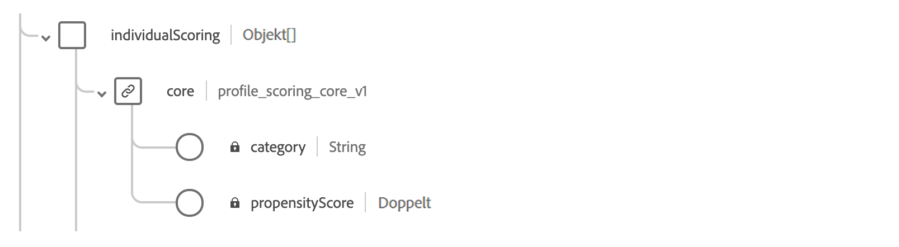
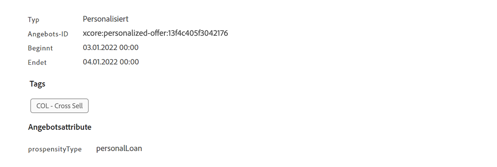

# Rangfolgeformeln erstellen {#create-ranking-formulas}

## Grundlagen zu Rangfolgeformeln {#about-ranking-formulas}

Mithilfe von **Rangfolgeformeln** können Sie festlegen, welches Angebot für eine bestimmte Platzierung zuerst angezeigt werden soll, anstatt die Prioritätswerte der Angebote zu berücksichtigen.

Rangfolgeformeln werden in der **PQL-Syntax** angegeben und können Profil-, Kontextdaten- und Angebotsattribute nutzen. Weiterführende Informationen zur Verwendung der PQL-Syntax finden Sie im [entsprechenden Handbuch](https://experienceleague.adobe.com/docs/experience-platform/segmentation/pql/overview.html?lang=de).

Nachdem eine Rangfolgenformel erstellt wurde, können Sie sie einer Platzierung in einer Entscheidung (früher als Angebotsaktivität bezeichnet) zuweisen. Weitere Informationen dazu finden Sie unter [Auswahl der Angebote in Entscheidungen konfigurieren](../offer-activities/configure-offer-selection.md).

## Erstellen einer Rangfolgeformel {#create-ranking-formula}

Gehen Sie wie folgt vor, um eine neue Rangfolgeformel zu erstellen:

1. Rufen Sie das Menü **[!UICONTROL Komponenten]** auf und wählen Sie dann die Registerkarte **[!UICONTROL Rangfolgen]**. Die Liste der zuvor erstellten Rangfolgen wird angezeigt.

   

1. Klicken Sie auf **[!UICONTROL Rangfolge erstellen]**, um eine neue Rangfolgeformel zu erstellen.

   

1. Geben Sie Namen und die Beschreibung der Rangfolgeformel sowie die Formel selbst an.

   In diesem Beispiel möchten wir die Priorität aller Angebote durch Hinzufügen des Attributs „heiß“ erhöhen, wenn das Wetter heiß ist. Zu diesem Zweck wurde **contextData.weather=hot** im Entscheidungsaufruf übergeben.

   

1. Klicken Sie auf **[!UICONTROL Speichern]**. Ihre Rangfolgeformel wird erstellt. Sie können sie aus der Liste auswählen, um Details abzurufen und sie zu bearbeiten oder zu löschen.

   Sie kann jetzt in einer Entscheidung verwendet werden, um die geeigneten Angebote für eine Platzierung zu reihen (siehe [Auswahl der Angebote in Entscheidungen konfigurieren](../offer-activities/configure-offer-selection.md)).

   

## Beispiele für Ranking-Formeln {#ranking-formula-examples}

Sie können je nach Bedarf viele verschiedene Ranking-Formeln erstellen. Im Folgenden finden Sie einige Beispiele.

<!--
Boost by offer ID

Boost the priority of an offer with the offer ID *xcore:personalized-offer:13d213cd4cb328ec* by 5.

**Ranking formula:**

```
if( offer._id = "xcore:personalized-offer:13d213cd4cb328ec", offer.rank.priority + 5, offer.rank.priority)
```

Change the offer priority based on a certain profile attribute

Set the offer priority to 30 for offer *xcore:personalized-offer:13d213cd4cb328ec* if the user lives in the city of Bondi.

**Ranking formula:**

```
if( offer._id = "xcore:personalized-offer:13d213cd4cb328ec" and homeAddress.city.equals("Bondi", false), 30, offer.rank.priority)
```

Boost multiple offers by offer ID based on the presence of a profile's segment membership

Boost the priority of offers based on whether the user is a member of a priority segment, which is configured as an attribute in the offer.

**Ranking formula:**

```
if( segmentMembership.get("ups").get(offer.characteristics.prioritySegmentId).status in (["realized","existing"]), offer.rank.priority + 10, offer.rank.priority)
```
-->

### Angebote mit einem bestimmten Angebotsattribut basierend auf dem Profilattribut aufstocken

Wenn das Profil in der Stadt lebt, die dem Angebot entspricht, verdoppeln Sie die Priorität für alle Angebote in dieser Stadt.

**Rangfolgenformel:**

```
if( offer.characteristics.city = homeAddress.city, offer.rank.priority * 2, offer.rank.priority)
```

### Steigern von Angeboten, deren Enddatum in weniger als 24 Stunden liegt

**Rangfolgenformel:**

```
if( offer.selectionConstraint.endDate occurs <= 24 hours after now, offer.rank.priority * 3, offer.rank.priority)
```

### Angebote mit einem bestimmten Angebotsattribut basierend auf Kontextdaten aufstocken

Steigern Sie bestimmte Angebote basierend auf den Kontextdaten, die im Entscheidungsaufruf übergeben werden. Wenn beispielsweise `contextData.weather=hot` im Entscheidungsaufruf übergeben wird, muss die Priorität aller Angebote mit `attribute=hot` erhöht werden.

**Rangfolgenformel:**

```
if (@{_xdm.context.additionalParameters;version=1}.weather.isNotNull()
and offer.characteristics.weather=@{_xdm.context.additionalParameters;version=1}.weather, offer.rank.priority + 5, offer.rank.priority)
```

Beachten Sie, dass bei Verwendung der Decisioning API die Kontextdaten zum Profilelement im Anfragetext hinzugefügt werden, wie im folgenden Beispiel.

**Snippet aus Anfrageinhalt:**

```
"xdm:profiles": [
{
    "xdm:identityMap": {
        "crmid": [
            {
            "xdm:id": "CRMID1"
            }
        ]
    },
    "xdm:contextData": [
        {
            "@type":"_xdm.context.additionalParameters;version=1",
            "xdm:data":{
                "xdm:weather":"hot"
            }
        }
    ]
 }],
```

### Angebotserhöhung, die auf der Kauftendenz der Kunden basiert

Wenn wir zwei Instanzen von *CustomerAI* haben, die die Neigung zum Kauf von *journeyInsurance* und *extraBaggage* für eine Fluggesellschaft berechnen, erhöht die folgende Rangliste die Priorität (um 50 Punkte) des Angebots, das entweder für Versicherungen oder für Gepäck gilt, wenn die Neigung des Kunden zu diesem Produkt höher ist zu 90.

Da jedoch jede *CustomerAI*-Instanz ein eigenes Objekt innerhalb des einheitlichen Profilschemas erstellt, ist es nicht möglich, die Punktzahl dynamisch basierend auf dem Angebotsintensitätstyp auszuwählen. Daher müssen Sie die `if`-Anweisungen ketten, um zunächst den Angebotsintensitätstyp zu überprüfen, und dann die Punktzahl aus dem entsprechenden Profilfeld extrahieren.

**Rangfolgenformel:**

```
if ( offer.characteristics.propensityType = "extraBaggagePropensity" and _salesvelocity.CustomerAI.extraBaggagePropensity.score > 90, offer.rank.priority + 50,
    (
        if ( offer.characteristics.propensityType = "travelInsurancePropensity" and _salesvelocity.CustomerAI.insurancePropensity.score > 90, offer.rank.priority + 50, offer.rank.priority )
    )
)
```

Eine bessere Lösung besteht darin, die Bewertungen in einem Array des Profils zu speichern. Das folgende Beispiel zeigt eine Vielzahl verschiedener Tendenzwerte, die nur mit einer einfachen Rangformel verwendet werden. Es wird erwartet, dass Sie über ein Profilschema mit einem Array von Werten verfügen. In diesem Beispiel ist der Instanzmandant *_salesgeschwindigkeit* und das Profilschema enthält Folgendes:



In diesem Fall für ein Profil wie:

```
{"_salesvelocity": {"individualScoring": [
                    {"core": {
                            "category":"insurance",
                            "propensityScore": 96.9
                        }},
                    {"core": {
                            "category":"personalLoan",
                            "propensityScore": 45.3
                        }},
                    {"core": {
                            "category":"creditCard",
                            "propensityScore": 78.1
                        }}
                    ]}
}
```

Die Angebote enthalten ein Attribut für *propensityType* , das mit der Kategorie aus den Bewertungen übereinstimmt:



Ihre Rangliste kann dann die Priorität jedes Angebots so einstellen, dass sie den Kunden *propensityScore* für diesen *propensityType* entspricht. Wenn kein Ergebnis gefunden wird, verwenden Sie die statische Priorität, die auf dem Angebot festgelegt wurde:

```
let score = (select _Individual_Scoring1 from _salesvelocity.individualScoring
             where _Individual_Scoring1.core.category.equals(offer.characteristics.propensityType, false)).head().core.propensityScore
in if(score.isNotNull(), score, offer.rank.priority)
```
