# KI-Rangfolgen {#ai-rankings}

## Erste Schritte mit KI-Rangfolgen

<!--If you are an [Adobe Experience Platform](https://experienceleague.adobe.com/docs/experience-platform/landing/home.html){target="_blank"} user leveraging the **Offer Decisioning** application service,-->You can use an trained model system that ranks offers to display for a given profile.

>[!CAUTION]
>
>Die Verwendung der KI-Rangfolge ist derzeit nur für ausgewählte Benutzer verfügbar.

Mit dieser Funktion können Sie basierend auf Ihren Geschäftszielen verschiedene **Rangfolgestrategien** erstellen. Wenn Sie diese verschiedenen zielbasierten Strategien in einer Entscheidung (früher als Angebotsaktivität bezeichnet) verwenden, hilft Ihnen das System mit trainierten Modellen zu verstehen, wie sich die verschiedenen Rangfolgestrategien auf Ihre Ziele auswirken.

Sie können beispielsweise eine Rangfolgestrategie für den E-Mail-Kanal und eine andere für den Push-Kanal auswählen. Für jeden Kanal nutzt das System mit trainierten Modellen mehrere Datenpunkte, um zu bestimmen, welches Angebot zuerst für eine bestimmte Platzierung angezeigt werden soll, anstatt die Prioritätswerte der Angebote oder eine [Rangfolgenformel](create-ranking-formulas.md) zu berücksichtigen.

<!--This feature is not enabled by default. To be able to use it, reach out to your Adobe contact.-->

Nachdem eine Rangfolgestrategie erstellt wurde, können Sie sie einer Platzierung in einer Entscheidung zuweisen. Weitere Informationen finden Sie unter [Angebotsauswahl in Entscheidungen konfigurieren](../offer-activities/configure-offer-selection.md).

## Erstellen einer Rangfolgestrategie {#create-ranking-strategy}

Gehen Sie wie folgt vor, um eine neue Rangfolgestrategie zu erstellen:

1. Rufen Sie das Menü **[!UICONTROL Komponenten]** auf und wählen Sie dann die Registerkarte **[!UICONTROL KI-Rangfolgen]** aus.

   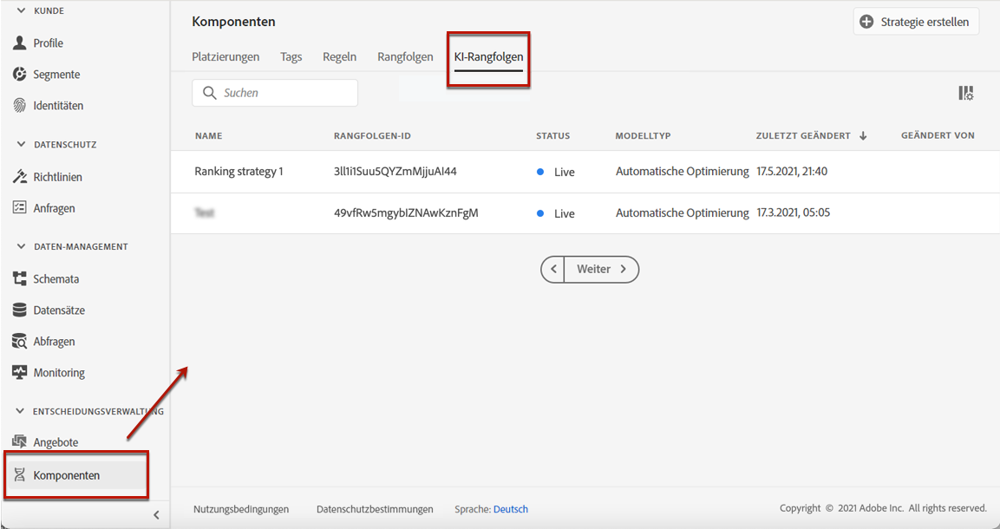

   Alle bisher erstellten Rangfolgestrategien werden aufgelistet.

1. Klicken Sie auf den Button **[!UICONTROL Strategie erstellen]**.

1. Füllen Sie die folgenden Felder aus:

   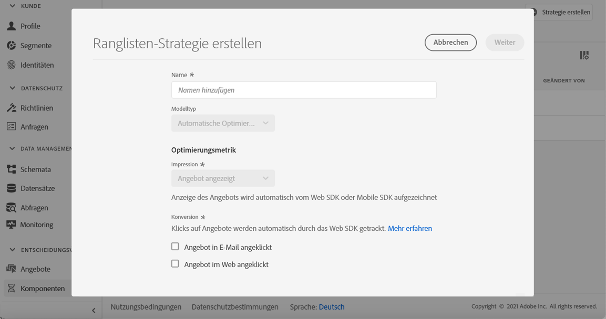

   * **[!UICONTROL Name]**: Eindeutiger Name, den Sie angeben müssen.

   * **[!UICONTROL Modelltyp]**: Derzeit ist der einzige unterstützte Modelltyp die **[!UICONTROL automatische Optimierung]**.<!--More will be supported in the future so the drop-down list will be enabled.-->

   * **[!UICONTROL Optimierungsmetrik]**:

      Mit dieser Option können Marketer auswählen, wie das Modell für maschinelles Lernen erstellt und trainiert werden soll: basierend auf den angezeigten Angeboten, auf in E-Mails angeklickten Angeboten und/oder auf im Internet angeklickten Angeboten.

      >[!NOTE]
      >
      >Sie können bei Bedarf alle Metriktypen auswählen.

      Es gibt zwei Arten von Optimierungsmetriken:
      * **[!UICONTROL Impression]**: Derzeit entsprechen Impressionsereignisse allen angezeigten Angeboten.
      * **[!UICONTROL Konversion]**: Konversionsereignisse entsprechen allen Angeboten, die zu Klicks per E-Mail oder Internet führen.

      Alle ausgewählten Impressionsereignisse und/oder Konversionsereignisse werden automatisch mit dem bereitgestellten Web SDK oder dem Mobile SDK erfasst. Weiterführende Informationen dazu finden Sie in der [Übersicht über das Adobe Experience Platform Web SDK](https://experienceleague.adobe.com/docs/experience-platform/edge/home.html?lang=de).

   * **[!UICONTROL Datensatz-ID]**: Für die Konversion müssen Sie einen Datensatz in der Dropdown-Liste auswählen, in dem Ereignisse gesammelt werden. In [diesem Abschnitt](#create-dataset) erfahren Sie, wie Sie einen solchen Datensatz erstellen.<!--This dataset needs to be associated with a schema that must have the **[!UICONTROL Proposition Interactions]** field group (previously known as mixin) associated with it.-->

   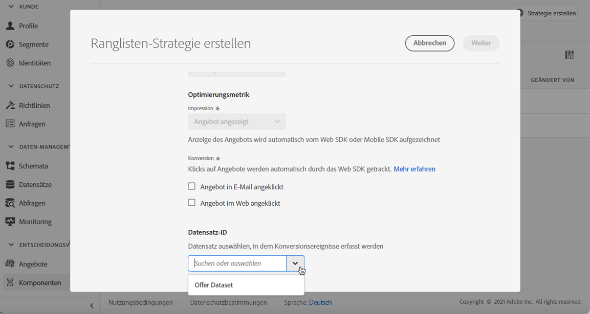

   >[!CAUTION]
   >
   >In der Dropdown-Liste werden nur Datensätze angezeigt, die aus Schemas erstellt wurden, die mit der Feldergruppe (früher als Mixin bezeichnet) **[!UICONTROL Erlebnisereignis – Vorschlagsinteraktionen]** verknüpft sind.

1. Speichern und aktivieren Sie die Rangfolgestrategie.

   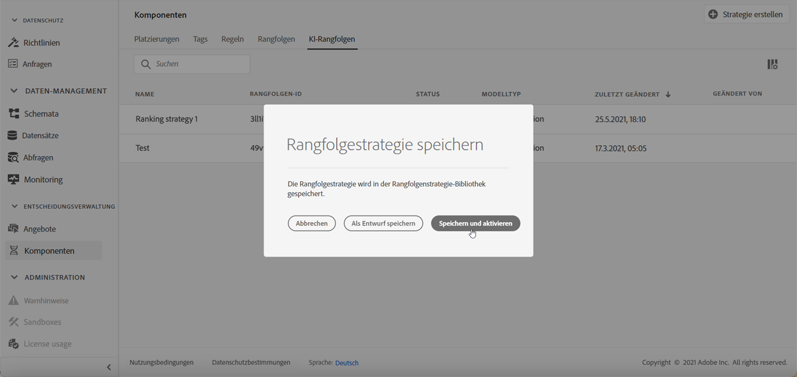

Sie kann nun bei der Entscheidung über die Rangfolge der für eine Platzierung geeigneten Angebote verwendet werden. Weiterführende Informationen finden Sie in diesem [Abschnitt](../offer-activities/configure-offer-selection.md#use-ranking-strategy).<!--TBC?-->.

## Datensatz zum Erfassen von Ereignissen erstellen {#create-dataset}

Sie müssen einen Datensatz erstellen, in dem Konversionsereignisse erfasst werden. Erstellen Sie zunächst das Schema, das in Ihrem Datensatz verwendet werden soll:

1. Wählen Sie im Menü **[!UICONTROL Daten-Management]** die Option **[!UICONTROL Schema]** aus, wechseln Sie zur Registerkarte **[!UICONTROL Durchsuchen]** und klicken Sie auf **[!UICONTROL Schema erstellen]**.

   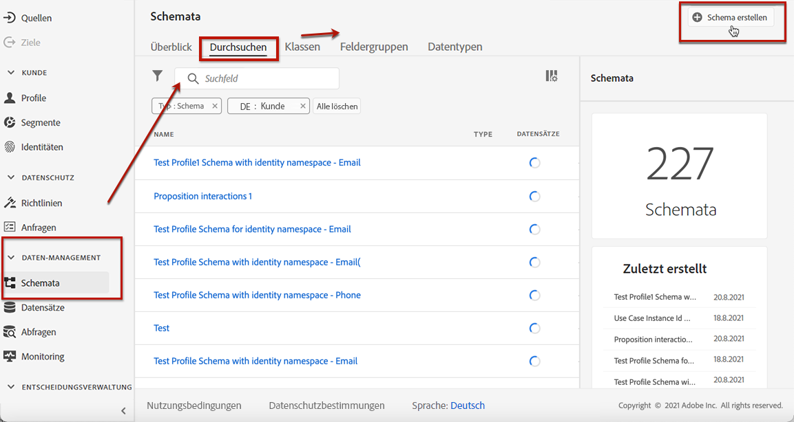

1. Wählen Sie **[!UICONTROL XDM ExperienceEvent]** aus.

   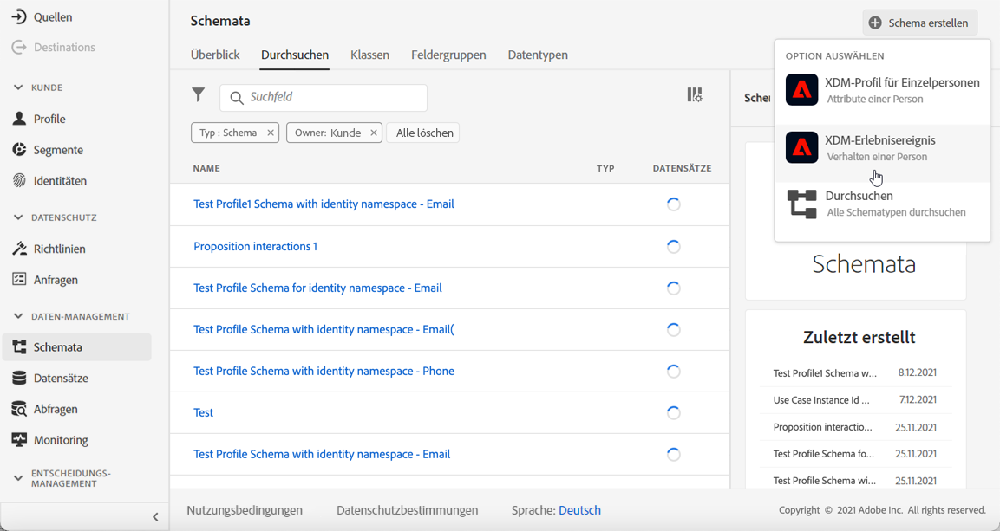

   >[!NOTE]
   >
   >    Weitere Informationen zu XDM-Schemas und Feldergruppen finden Sie in der [Dokumentation zur XDM-Systemübersicht](https://experienceleague.adobe.com/docs/experience-platform/xdm/home.html?lang=de).

1. Geben Sie im Feld **[!UICONTROL Suche]** „Interaktion mit Vorschlägen“ ein und wählen Sie die Feldergruppe **[!UICONTROL Erlebnisereignis – Vorschlagsinteraktionen]** aus.

   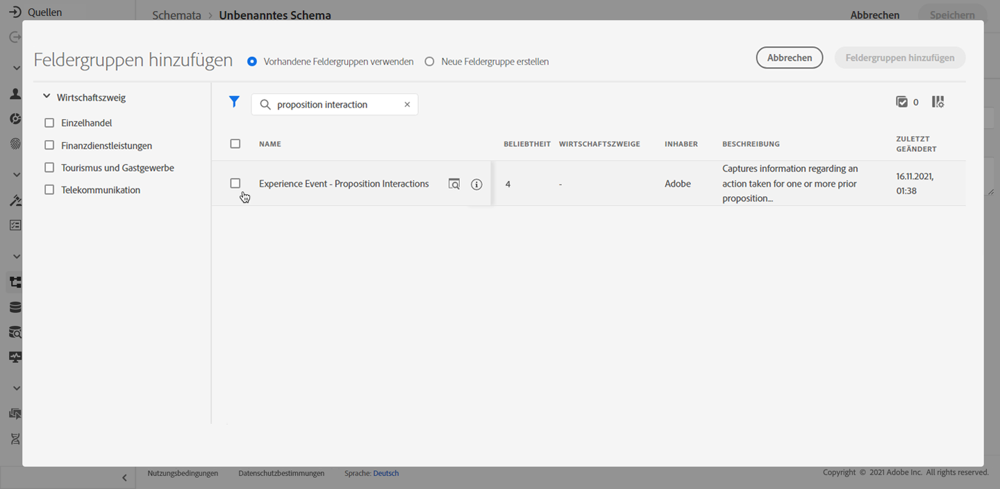

   >[!CAUTION]
   >
   >    Mit dem Schema, das in Ihrem Datensatz verwendet wird, muss die Feldergruppe **[!UICONTROL Erlebnisereignis – Vorschlagsinteraktionen]** verknüpft sein. Andernfalls können Sie es nicht in Ihrer Rangfolgestrategie verwenden.

1. Klicken Sie auf **[!UICONTROL Feldergruppen hinzufügen]**.

   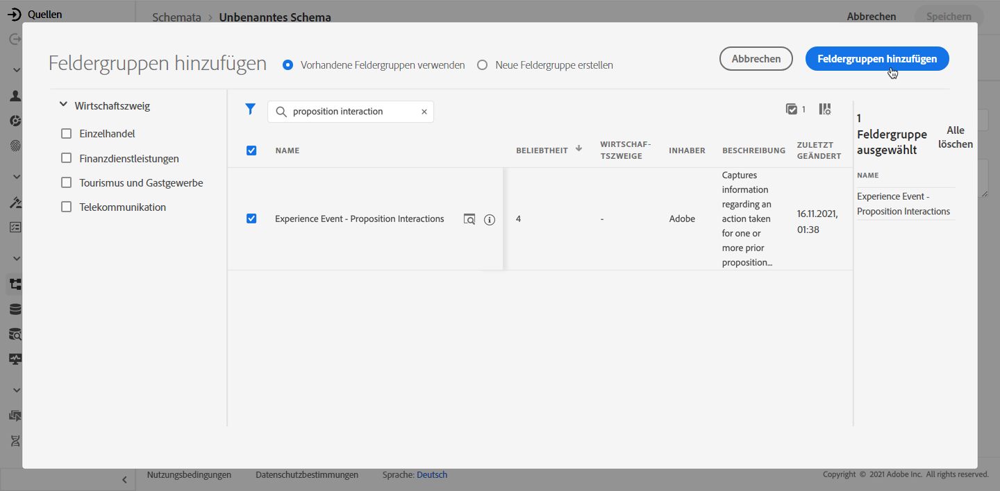

   >[!NOTE]
   >Die Feldergruppen wurden früher als Mixins bezeichnet.

1. Geben Sie einen Namen ein und speichern Sie das Schema.<!--How do you edit the fields in this new schema? Examples?-->

>[!NOTE]
>
>    Erfahren Sie mehr über das Erstellen von Schemas in [Grundlagen der Schemakomposition](https://experienceleague.adobe.com/docs/experience-platform/xdm/schema/composition.html?lang=de?lang=de#understanding-schemas).

Sie können jetzt einen Datensatz unter Verwendung dieses Schemas erstellen. Gehen Sie dazu wie folgt vor:

1. Wählen Sie im Menü **[!UICONTROL Daten-Management]** die Option **[!UICONTROL Datensätze]** aus, wechseln Sie zur Registerkarte **[!UICONTROL Durchsuchen]** und klicken Sie auf **[!UICONTROL Datensatz erstellen]**.

   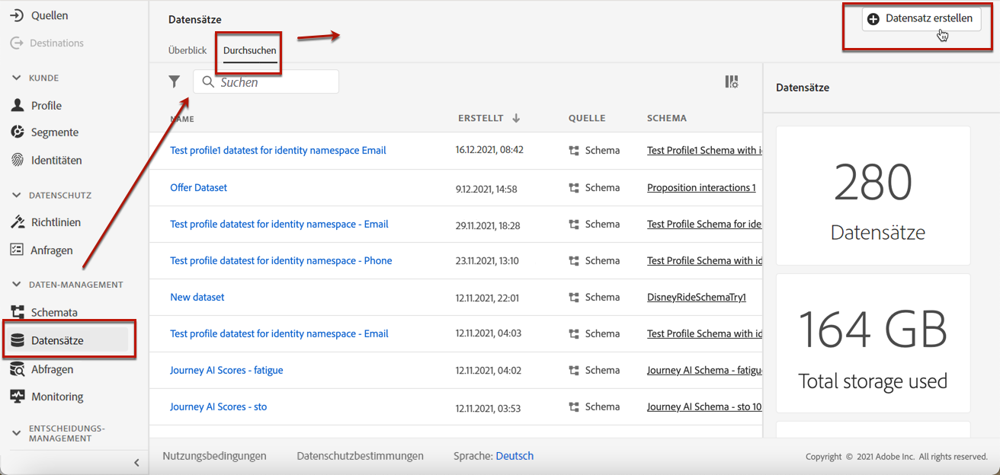

1. Wählen Sie **[!UICONTROL Datensatz aus Schema erstellen]** aus.

   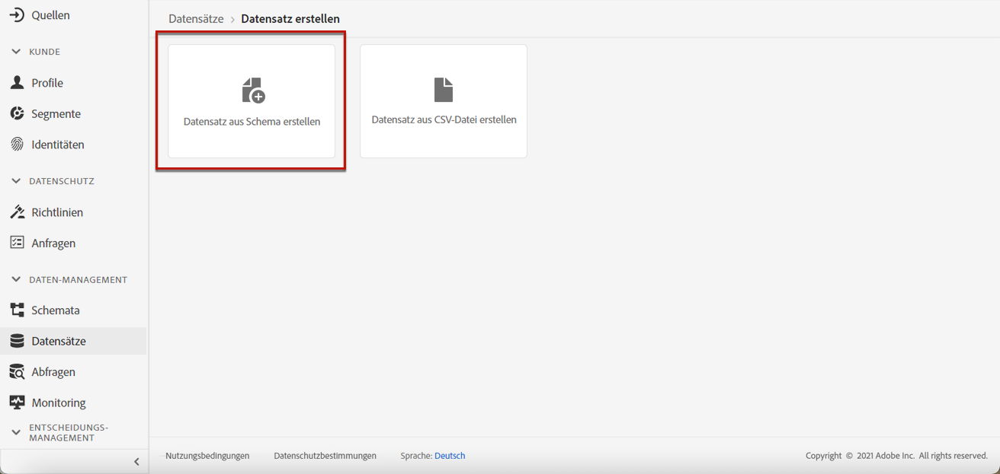

1. Wählen Sie das soeben erstellte Schema aus der Liste aus.

   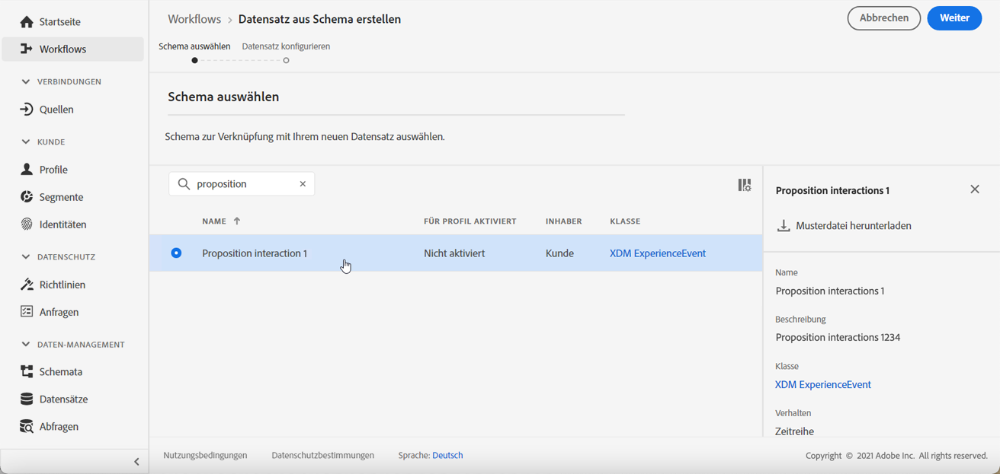

1. Klicken Sie auf **[!UICONTROL Weiter]**.

1. Geben Sie im Feld **[!UICONTROL Name]** einen eindeutigen Namen für den Datensatz ein und klicken Sie auf **[!UICONTROL Beenden]**.

   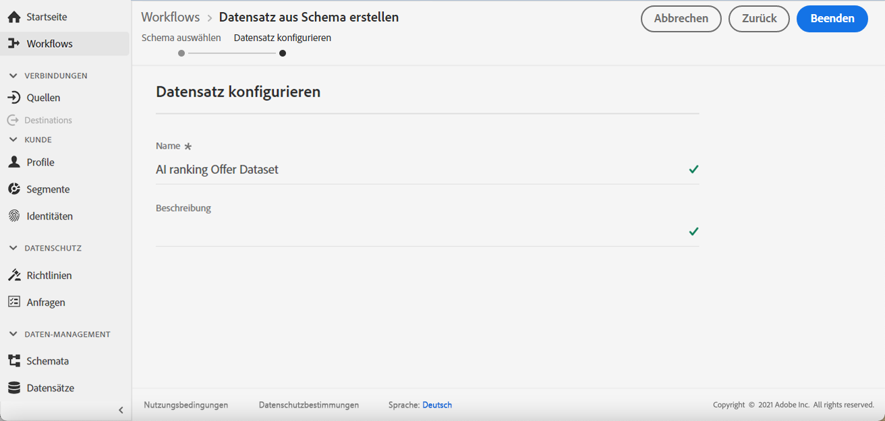

Der Datensatz kann jetzt ausgewählt werden, um Konversionsereignisse zu erfassen, wenn [eine Rangfolgestrategie](#create-ranking-strategy) erstellt wird.

<!--## Using a ranking strategy {#using-ranking}

To use the ranking strategy you created above, follow the steps below:

Once a ranking strategy has been created, you can assign it to a placement in a decision (previously known as offer activity). For more on this, see [Configure offers selection in decisions](../offer-activities/configure-offer-selection.md).

1. Create a decision.
1. Add a placement.
1. Add a collection.
1. Choose to rank offers by AI ranking (select it from the drop-down list).
1. Click Add ranking.
1. Select the ranking strategy that you created. All the details of the ranking strategy are displayed.
1. Click Next to confirm.
1. Save your decision.

It is now ready to be used in a decision to rank eligible offers for a placement (see [Configure offers selection in decisions](../offer-activities/configure-offer-selection.md)).-->

