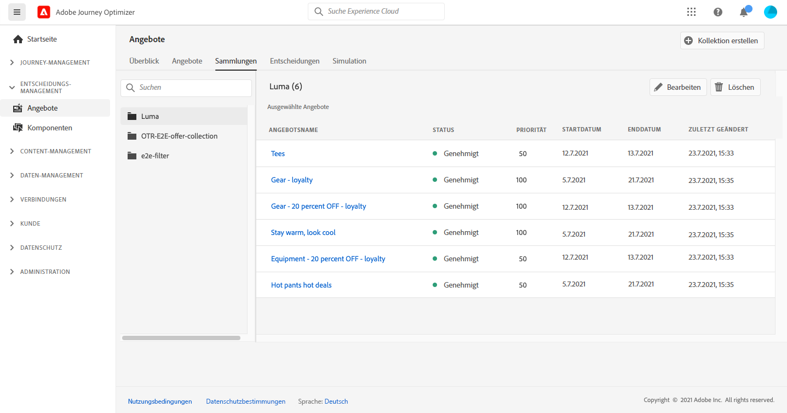
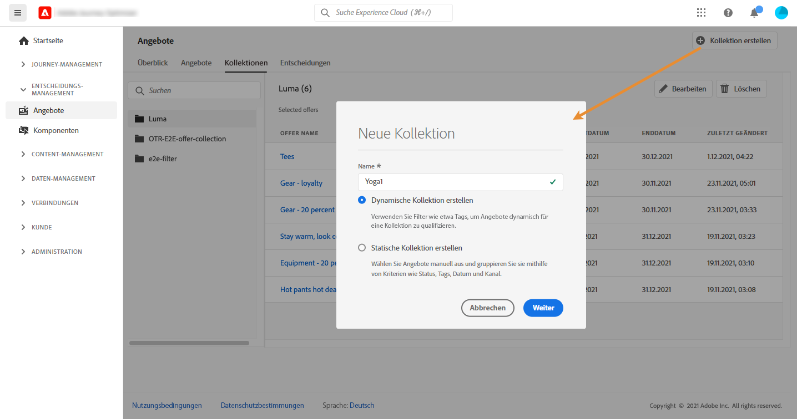
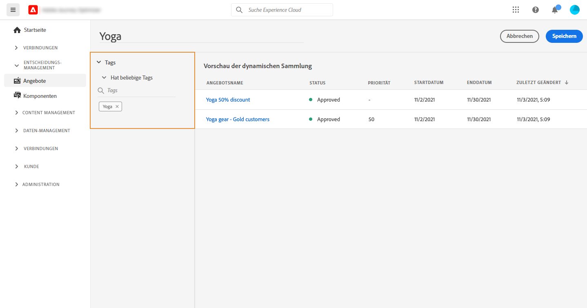
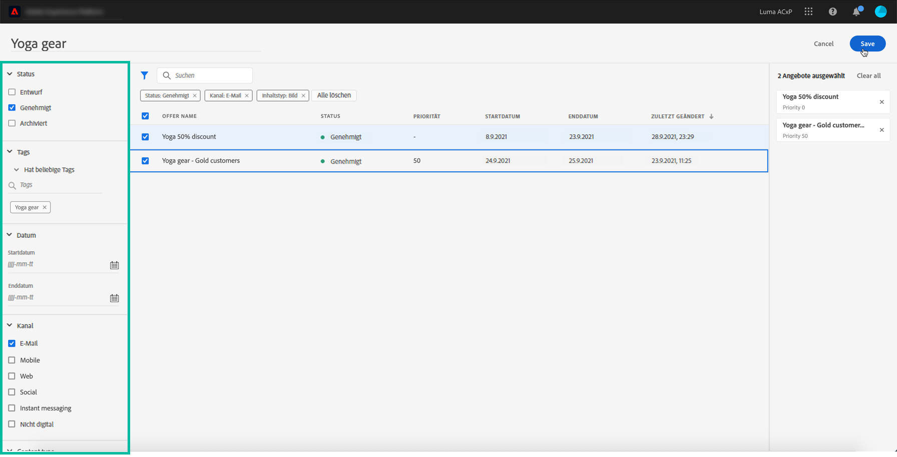
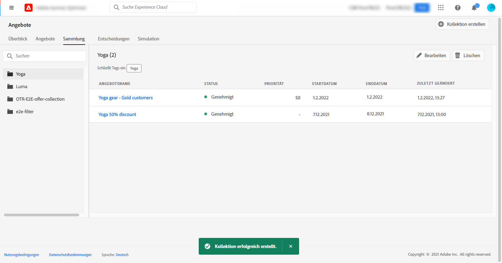

# Erstellen von Sammlungen {#create-collections}

>[!CONTEXTUALHELP]
>id="ajo_decisioning_decision_collection"
>title="Über Angebotssammlungen"
>abstract="Mit Angebotssammlungen können Sie Ihre Angebote organisieren, indem Sie sie in Kategorien Ihrer Wahl anordnen."

Mit Sammlungen können Sie Ihre Angebote organisieren, indem Sie sie in Kategorien Ihrer Wahl anordnen. Sie können beispielsweise eine „Sport“-Sammlung erstellen, die nur sportbezogene Angebote enthält.

➡️ [Entdecken Sie diese Funktion im Video](#video)

Die Liste der Angebotssammlungen ist im Menü **[!UICONTROL Angebote]** verfügbar.

Sie können zwei Arten von Sammlungen erstellen:

* **Dynamische Sammlungen** sind Sammlungen von Angeboten, die auf Sammlungsqualifizierern (ehemals als „Tags“ bezeichnet) basieren. Diese Sammlungen werden automatisch aktualisiert. Wenn beispielsweise ein neues Angebot mit dem ausgewählten Sammlungsqualifizierer erstellt wird, wird es automatisch der Sammlung hinzugefügt.

* **Statische Kollektionen** sind Sammlungen, die durch manuelles Auswählen einzelner Angebote erstellt werden, die in die Kollektion aufgenommen werden sollen. Eine solche Sammlung kann nur aktualisiert werden, indem ihr manuell weitere Angebote hinzufügt werden.

Gehen Sie wie folgt vor, um eine Sammlung zu erstellen:

1. Gehen Sie zur Registerkarte **[!UICONTROL Sammlungen]** und klicken Sie dann auf **[!UICONTROL Sammlung erstellen]**.

1. Geben Sie den Namen und den Typ der zu erstellenden Sammlung an.

   

1. Um eine dynamische Sammlung zu erstellen, wählen Sie im linken Bereich den Sammlungsqualifizierer der Angebote aus, die der Sammlung hinzugefügt werden sollen, und klicken Sie dann auf **[!UICONTROL Speichern]**. Alle Angebote mit dem ausgewählten Sammlungsqualifizierer werden in der Sammlung gespeichert.

   Weiterführende Informationen zur Erstellung von Sammlungsqualifizierern finden Sie unter [Erstellen von Sammlungsqualifizierern](../offer-library/creating-tags.md).

   

1. Um eine statische Sammlung zu erstellen, verwenden Sie den linken Bereich zum Filtern der Liste der Angebote (nach Status, Sammlungsqualifizierer, Datum, Kanal, Inhaltstyp) und wählen Sie dann die Angebote aus, die der Sammlung hinzugefügt werden sollen.

   

   >[!NOTE]
   >
   >Statische Sammlungen werden nicht automatisch aktualisiert. Um einer statischen Sammlung Angebote hinzuzufügen, müssen Sie sie bearbeiten und die Angebote manuell hinzufügen.

1. Um einer statischen Sammlung benutzerdefinierte oder Core-Datennutzungsbezeichnungen zuzuweisen, wählen Sie **[!UICONTROL Zugriff verwalten]**. [Weitere Informationen zur Zugriffskontrolle auf Objektebene (OLAC)](../../administration/object-based-access.md)

1. Nachdem die Sammlung erstellt wurde, wird sie in der Liste angezeigt. Sie können sie zum Bearbeiten oder Löschen auswählen.

   

## Anleitungsvideo {#video}

>[!VIDEO](https://video.tv.adobe.com/v/329376?quality=12)

