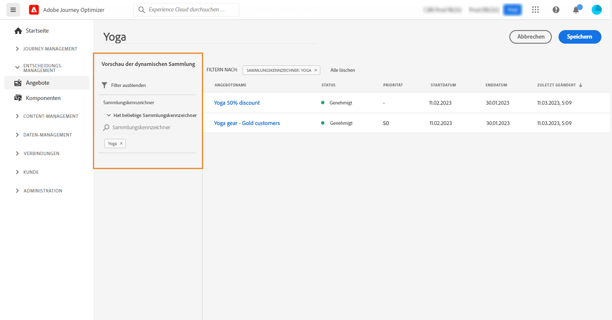
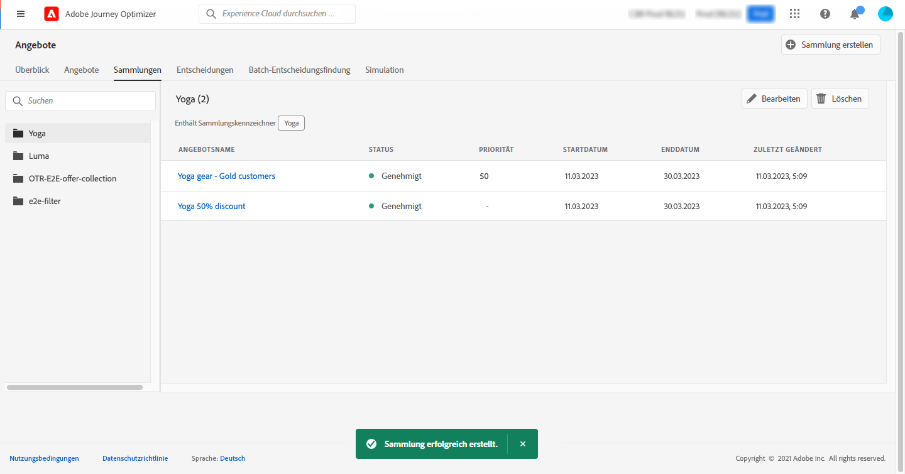

# Kollektionen erstellen {#create-collections}

Mit Kollektionen können Sie Ihre Angebote organisieren, indem Sie sie in Kategorien Ihrer Wahl anordnen. Sie können beispielsweise eine „Sport“-Kollektion erstellen, die nur sportbezogene Angebote enthält.

➡️ [Entdecken Sie diese Funktion im Video](#video).

Die Liste der Angebotskollektionen ist im Menü **[!UICONTROL Angebote]** verfügbar.

Sie können zwei Arten von Kollektionen erstellen:

* **Dynamische Kollektionen** sind Sammlungen von Angeboten, die auf Tags basieren. Diese Kollektionen werden automatisch aktualisiert. Wenn beispielsweise ein neues Angebot mit dem ausgewählten Tag erstellt wird, wird es automatisch der Kollektion hinzugefügt.

* **Statische Kollektionen** sind Sammlungen, die durch manuelles Auswählen einzelner Angebote erstellt werden, die in die Kollektion aufgenommen werden sollen. Eine solche Kollektion kann nur aktualisiert werden, indem ihr manuell weitere Angebote hinzufügt werden.

Gehen Sie wie folgt vor, um eine Kollektion zu erstellen:

1. Gehen Sie zur Registerkarte **[!UICONTROL Kollektionen]** und klicken Sie dann auf **[!UICONTROL Kollektion erstellen]**.

1. Geben Sie den Namen und den Typ der zu erstellenden Kollektion an.

   

1. Um eine dynamische Kollektion zu erstellen, wählen Sie im linken Bereich das Tag der Angebote aus, die der Kollektion hinzugefügt werden sollen, und klicken Sie dann auf **[!UICONTROL Speichern]**. Alle Angebote mit dem ausgewählten Tag werden in der Kollektion gespeichert.

   Weitere Informationen zum Erstellen von Tags finden Sie unter [Tags erstellen](../offer-library/creating-tags.md).

   

1. Um eine statische Kollektion zu erstellen, verwenden Sie den linken Bereich, um die Liste der Angebote (nach Status, Tag, Datum, Kanal, Inhaltstyp) zu filtern, und wählen Sie dann die Angebote aus, die der Kollektion hinzugefügt werden sollen.

   

   >[!NOTE]
   >
   >Statische Kollektionen werden nicht automatisch aktualisiert. Um einer statischen Kollektion Angebote hinzuzufügen, müssen Sie sie bearbeiten und die Angebote manuell hinzufügen.

1. Nachdem die Kollektion erstellt wurde, wird sie in der Liste angezeigt. Sie können sie zum Bearbeiten oder Löschen auswählen.

   

## Anleitungsvideo {#video}

>[!NOTE]
>
>Dieses Video bezieht sich auf den auf Adobe Experience Platform aufbauenden Anwendungsdienst Offer Decisioning. Es enthält allgemeine Leitlinien für die Verwendung von Angeboten im Kontext von Journey Optimizer.

>[!VIDEO](https://video.tv.adobe.com/v/329376?quality=12)
