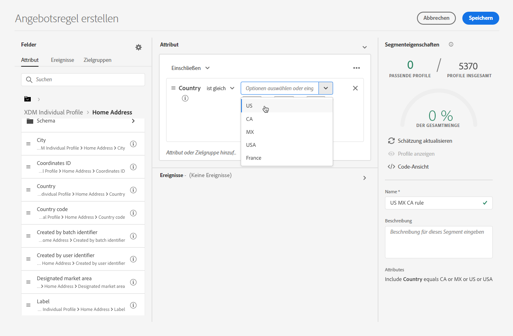

# Entscheidungsregeln erstellen {#create-decision-rules}

Sie können Entscheidungsregeln für Angebote basierend auf in Adobe Experience Platform verfügbaren Daten erstellen. Entscheidungsregeln bestimmen, wem ein Angebot angezeigt werden kann.

Sie können beispielsweise festlegen, dass nur dann ein Angebot &quot;Winterbekleidung für Frauen&quot;angezeigt werden soll, wenn (Geschlecht = &quot;Weiblich&quot;) und (Region = &quot;Nordosten&quot;).

➡️ [Funktion im Video kennenlernen](#video)

Die Liste der erstellten Entscheidungsregeln ist im Abschnitt **[!UICONTROL Components]** Menü.

Gehen Sie wie folgt vor, um eine Entscheidungsregel zu erstellen:

1. Navigieren Sie zu **[!UICONTROL Rules]** Registerkarte und klicken Sie dann auf **[!UICONTROL Create rule]**.

   

1. Benennen Sie Ihre Regel, geben Sie eine Beschreibung ein und konfigurieren Sie dann die Regel entsprechend Ihren Anforderungen.

   Dazu muss die Variable **Segment Builder** ist verfügbar, um Ihnen beim Erstellen der Regelbedingungen zu helfen. [Weitere Infos](../../segment/about-segments.md)

   <!--In this example, the rule will target customers that have the "Gold" loyalty level.-->

   

   >[!NOTE]
   >
   >Der zum Erstellen von Entscheidungsregeln bereitgestellte Segment Builder weist einige Besonderheiten im Vergleich zu dem mit der **[!UICONTROL Audience Destinations]** Dienst. Beispiel: die **[!UICONTROL Segments]** ist nicht verfügbar. Der globale Prozess, der im Abschnitt [Segment Builder](../../segment/about-segments.md) -Dokumentation ist weiterhin gültig, um Entscheidungsregeln für Angebote zu erstellen. Weitere Informationen finden Sie unter [Dokumentation zu Adobe Experience Platform Segmentation Service](https://experienceleague.adobe.com/docs/experience-platform/segmentation/ui/segment-builder.html).

1. Wenn Sie neue Felder im Arbeitsbereich hinzufügen und konfigurieren, wird die **[!UICONTROL Segment properties]** zeigt Informationen zu den geschätzten Profilen an, die zum Segment gehören. Klicken **[!UICONTROL Refresh estimate]** , um Daten zu aktualisieren.

   

   >[!NOTE]
   >
   >Profilschätzungen sind nicht verfügbar, wenn Regelparameter Daten enthalten, die nicht im Profil enthalten sind, z. B. Kontextdaten. Beispielsweise eine Eignungsregel, für die das aktuelle Wetter ≥ 80 Grad sein muss.

1. Klicken **[!UICONTROL Save]** zur Bestätigung.

1. Nachdem die Regel erstellt wurde, wird sie im **[!UICONTROL Rules]** Liste. Sie können es auswählen, um seine Eigenschaften anzuzeigen und zu bearbeiten oder zu löschen.

   

>[!CAUTION]
>
>Ereignisbasierte Angebote werden derzeit nicht unterstützt in [!DNL Journey Optimizer]. Wenn Sie eine Entscheidungsregel erstellen, die auf einer [event](https://experienceleague.adobe.com/docs/experience-platform/segmentation/ui/segment-builder.html?lang=en#events){target=&quot;_blank&quot;}, können Sie es in einem Angebot nicht nutzen.

## Tutorial-Video {#video}

>[!VIDEO](https://video.tv.adobe.com/v/329373?quality=12)
