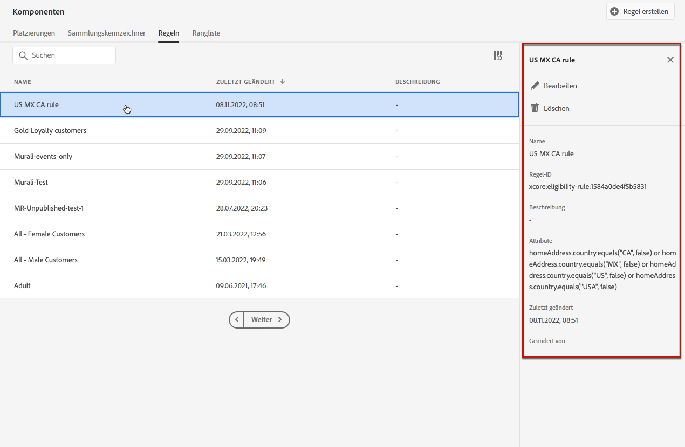

# Erstellen von Entscheidungsregeln {#create-decision-rules}

## Über Entscheidungsregeln {#about}

Auf Grundlage der in Adobe Experience Platform verfügbaren Daten können Sie Entscheidungsregeln für Angebote erstellen. Entscheidungsregeln bestimmen, wem ein Angebot unterbreitet werden kann.

Sie können beispielsweise angeben, dass ein „Angebot von Winterkleidung für Frauen“ nur dann angezeigt werden soll, wenn (Geschlecht = „Weiblich“) und (Region = „Nordost“) zutrifft.

➡️ [Entdecken Sie diese Funktion im Video](#video).

Im Folgenden finden Sie eine Liste der Einschränkungen, die bei der Arbeit mit Entscheidungsregeln zu beachten sind:

* Beim Erstellen einer Regel können Sie historische Ereignisse verwenden, es gibt jedoch Einschränkungen hinsichtlich der Verwendbarkeit dieser Regeln.
* Bei der Edge-Entscheidung wird das Edge-Profil verwendet, in dem keine Ereignisse gespeichert werden. Daher sind alle in einer Edge-Entscheidung verwendeten Regeln ungültig.
* Journey, die Angebotsentscheidungen verwenden, werden keine Verlaufsereignisse anzeigen. Daher sind diese Regeln ungültig.
* Entscheidungsanforderungen, die das Hub-Profil verwenden, betrachten die letzten 100 Erlebnisereignisse im Profil, um Regeln auszuwerten, die auf historische Erlebnisereignisse verweisen.

## Erstellen von Entscheidungsregeln {#create}

Die Liste der erstellten Entscheidungsregeln ist im Menü **[!UICONTROL Komponenten]** verfügbar.

Gehen Sie wie folgt vor, um eine Entscheidungsregel zu erstellen:

1. Gehen Sie zur Registerkarte **[!UICONTROL Regeln]** und klicken Sie auf **[!UICONTROL Regel erstellen]**.

   

1. Benennen Sie Ihre Regel, geben Sie eine Beschreibung ein und konfigurieren Sie dann die Regel entsprechend Ihren Anforderungen.

   Dazu steht Ihnen die **Segment Builder**-Umgebung von Adobe Experience Platform zur Verfügung, die Ihnen beim Erstellen der Regelbedingungen hilft. [Weitere Informationen zum Erstellen von Segmentdefinitionen](../../audience/creating-a-segment-definition.md)

   <!--In this example, the rule will target customers that have the "Gold" loyalty level.-->

   

   >[!NOTE]
   >
   >Der zum Erstellen von Entscheidungsregeln bereitgestellte Segment Builder weist einige Besonderheiten im Vergleich zum **[!UICONTROL Segmentierungs]**-Service auf. Das in der [Segment Builder](../../audience/creating-a-segment-definition.md)-Dokumentation beschriebene globale Verfahren gilt jedoch weiter, um Entscheidungsregeln für Angebote zu erstellen. Weitere Informationen zu Datensätzen finden Sie in der [Dokumentation zum Adobe Experience Platform-Segmentierungs-Service](https://experienceleague.adobe.com/docs/experience-platform/segmentation/ui/segment-builder.html?lang=de).

1. Während Sie neue Felder im Arbeitsbereich hinzufügen und konfigurieren, zeigt der Bereich **[!UICONTROL Zielgruppeneigenschaften]** Informationen zur geschätzten Anzahl der zur Zielgruppe gehörenden Profile an. Klicken Sie auf **[!UICONTROL Schätzung aktualisieren]**, um diese Daten zu aktualisieren.

   

   >[!NOTE]
   >
   >Profilschätzungen sind nicht verfügbar, wenn Regelparameter Daten enthalten, die nicht im Profil enthalten sind, z. B. Kontextdaten. Beispielsweise eine Eignungsregel, für die die aktuelle Temperatur höher als 25 °C sein muss.

1. Klicken Sie zur Bestätigung auf **[!UICONTROL Speichern]**.

1. Nachdem die Regel erstellt wurde, wird sie in der Liste **[!UICONTROL Regeln]** angezeigt. Sie können sie auswählen, um ihre Eigenschaften anzuzeigen oder um sie zu bearbeiten oder zu löschen.

   

>[!CAUTION]
>
>Ereignisbasierte Angebote werden derzeit in [!DNL Journey Optimizer] nicht unterstützt. Wenn Sie eine Entscheidungsregel basierend auf einem [Ereignis](https://experienceleague.adobe.com/docs/experience-platform/segmentation/ui/segment-builder.html?lang=de#events){target="_blank"} erstellen, können Sie sie nicht in einem Angebot nutzen.

## Anleitungsvideo {#video}

>[!VIDEO](https://video.tv.adobe.com/v/329373?quality=12)
