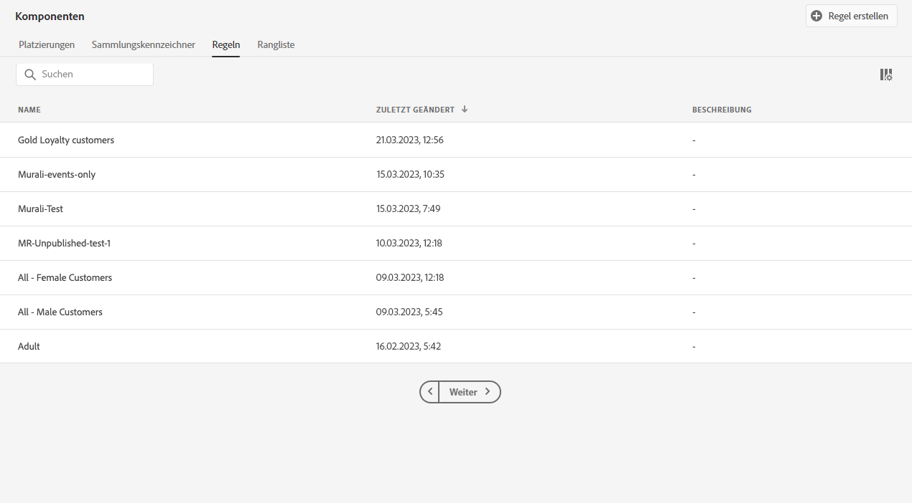
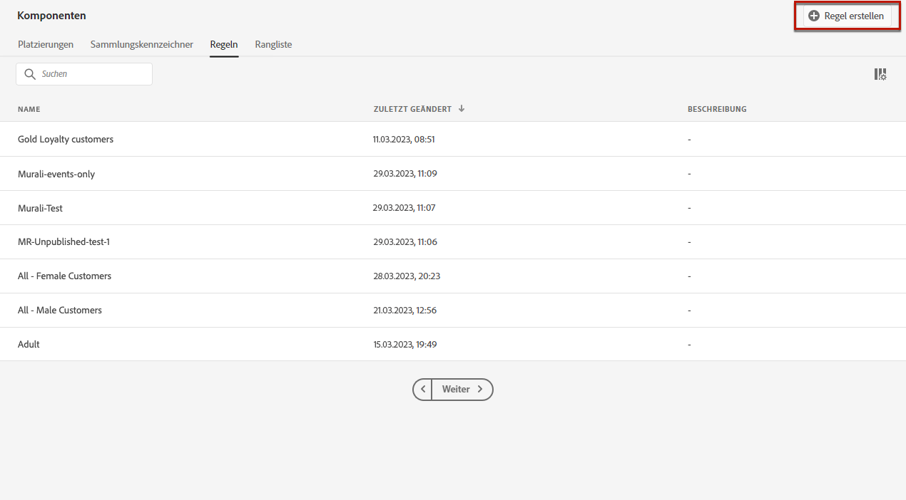

# Entscheidungsregeln erstellen {#creating-decision-rules}

Auf Grundlage der in Adobe Experience Platform verfügbaren Daten können Sie Entscheidungsregeln für Angebote erstellen. Entscheidungsregeln bestimmen, wem ein Angebot unterbreitet werden kann.

Sie können beispielsweise festlegen, dass das Angebot „Winterbekleidung für Frauen“ nur dann angezeigt werden soll, wenn Geschlecht = „weiblich“ und Region = „Nordosten“.

 [Funktion im Video kennenlernen](#video).

Die Liste der erstellten Entscheidungsregeln ist im Menü **[!UICONTROL Komponenten]** verfügbar.

Gehen Sie wie folgt vor, um eine Entscheidungsregel zu erstellen:

1. Gehen Sie zur Registerkarte **[!UICONTROL Regeln]** und klicken Sie auf **[!UICONTROL Regel erstellen]**.

   

1. Benennen Sie Ihre Regel, geben Sie eine Beschreibung ein und konfigurieren Sie dann die Regel entsprechend Ihren Anforderungen.

   Dazu steht Ihnen der **Segment Builder** in Adobe Experience Platform zur Verfügung, mit dem Sie die Regelbedingungen erstellen können. Weiterführende Informationen zu dessen Verwendung finden Sie im [entsprechenden Handbuch](https://docs.adobe.com/content/help/de-DE/experience-platform/segmentation/ui/segment-builder.html).

   In diesem Beispiel werden Kunden mit der Treuestufe „Gold“ als Zielgruppe ausgewählt.

   

   >[!NOTE]
   >
   >Der zum Erstellen von Entscheidungsregeln bereitgestellte Segment Builder weist einige Besonderheiten im Vergleich zum Dienst **[!UICONTROL Audience-Ziele]** auf. Beispielsweise ist die Registerkarte **[!UICONTROL Segmente]** nicht verfügbar. Das in der Segment Builder-Dokumentation beschriebene globale Verfahren gilt jedoch weiter, um Entscheidungsregeln für Angebote zu erstellen.

1. Klicken Sie zur Bestätigung auf **[!UICONTROL Speichern]**.

1. Nachdem die Regel erstellt wurde, wird sie in der Regelliste angezeigt. Sie können sie auswählen, um ihre Eigenschaften anzuzeigen und zu bearbeiten oder zu löschen.

   

## tutorial {#video}

>[!NOTE]
>
>Dieses Video bezieht sich auf den auf Adobe Experience Platform aufbauenden Offer decisioning-Anwendungsdienst. Sie enthält jedoch allgemeine Leitlinien für die Verwendung von Angebot im Kontext von Journey Optimizer.

>[!VIDEO](https://video.tv.adobe.com/v/329373?quality=12)
