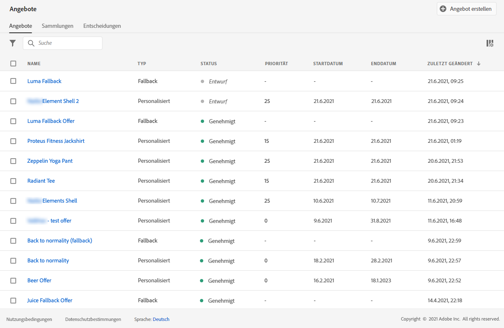
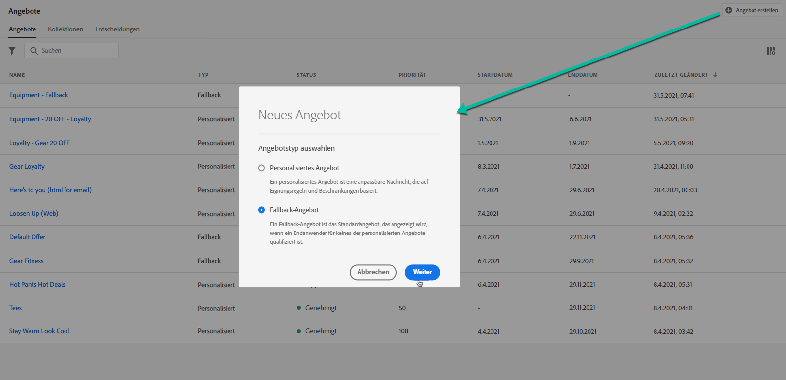
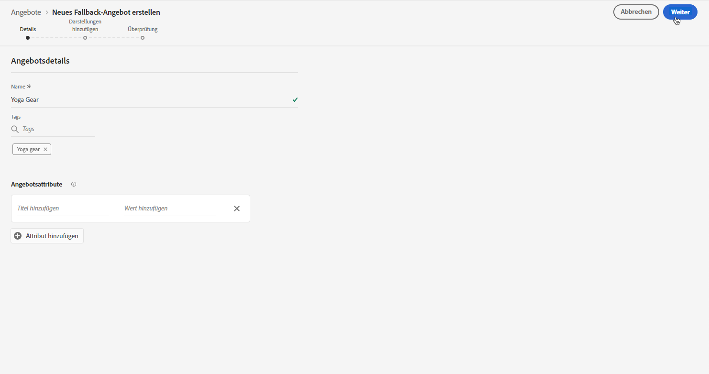
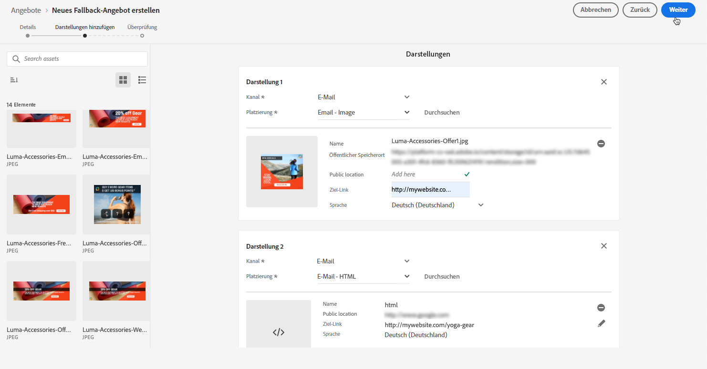
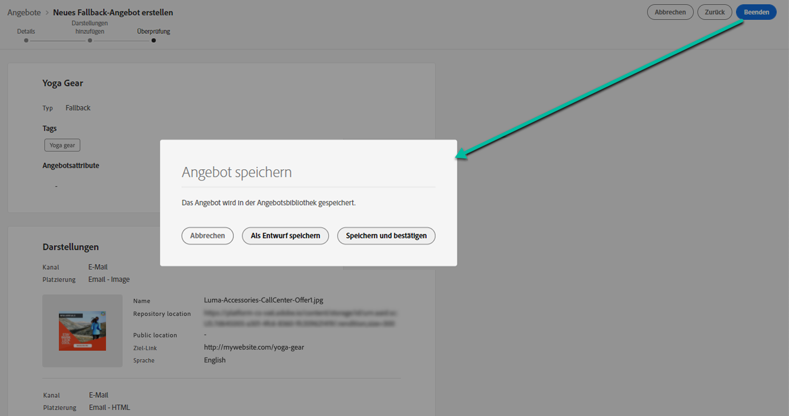
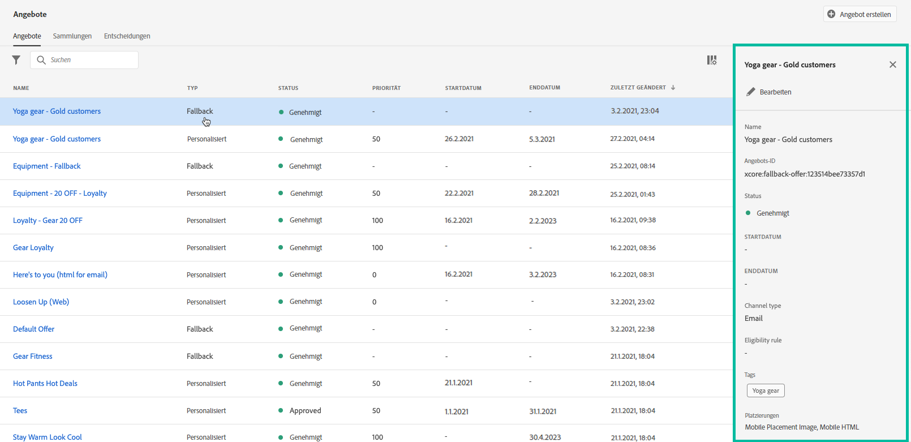

# Erstellen von Fallback-Angeboten {#create-fallback-offers}

>[!TIP]
>
>Die neue Entscheidungsfindungsfunktion in [!DNL Adobe Journey Optimizer] ist jetzt über den Code-basierten Erlebniskanal und den E-Mail-Kanal verfügbar. [Weitere Informationen](../../experience-decisioning/gs-experience-decisioning.md)

>[!CONTEXTUALHELP]
>id="ajo_decisioning_new_fallback"
>title="Fallback-Angebot"
>abstract="Ein Fallback-Angebot ist das Standardangebot, das angezeigt wird, wenn eine Endbenutzerin bzw. ein Endbenutzer für keines der personalisierten Angebote infrage kommt."

>[!CONTEXTUALHELP]
>id="ajo_decisioning_fallback_offer_details "
>title="Details des Fallback-Angebots"
>abstract="Geben Sie den Namen des Fallback-Angebots an. Sie können auch einen oder mehrere vorhandene Sammlungsqualifizier damit verknüpfen, um die Angebotsbibliothek einfacher durchsuchen und organisieren zu können."

Ein Fallback-Angebot wird an Kunden gesendet, wenn keine anderen Angebote für sie geeignet sind. Die Schritte zum Einrichten eines Fallback-Angebots bestehen darin, eine oder mehrere Darstellungen zu erstellen (ähnlich wie beim Erstellen eines Angebots).

➡️ [Funktion im Video kennenlernen](#video).

Die Liste der Fallback-Angebote ist im Menü **[!UICONTROL Angebote]** verfügbar.

Gehen Sie wie folgt vor, um ein Fallback-Angebot zu erstellen:

>[!NOTE]
>
>Beachten Sie, dass Fallback-Angebote im Gegensatz zu personalisierten Angeboten keine Eignungsregeln und Beschränkungsparameter aufweisen, da sie Kunden in letzter Instanz ohne Bedingung unterbreitet werden.

1. Klicken Sie auf **[!UICONTROL Angebot erstellen]** und wählen Sie dann **[!UICONTROL Fallback-Angebot]** aus.

   

1. Geben Sie den Namen des Fallback-Angebots an. Sie können auch ein oder mehrere vorhandene Sammlungsqualifizierer (ehemals als „Tags“ bezeichnet) damit verknüpfen, um die Angebotsbibliothek einfacher durchsuchen und organisieren zu können.

   

1. Um dem Angebot benutzerdefinierte oder zentrale Datennutzungs-Labels zuzuweisen, wählen Sie **[!UICONTROL Zugriff verwalten]**. [Weitere Informationen zur Zugriffssteuerung auf Objektebene (Object Level Access Control, OLAC)](../../administration/object-based-access.md)

1. Erstellen Sie eine oder mehrere Darstellungen für das Fallback-Angebot. Ziehen Sie dazu Platzierungen per Drag-and-Drop aus dem linken Bereich (ähnlich wie beim Erstellen eines personalisierten Angebots). Weitere Informationen finden Sie unter [Erstellen von personalisierten Angeboten](../offer-library/creating-personalized-offers.md).

   

   >[!CAUTION]
   >
   >Fallback-Angebote sollten alle Darstellungen enthalten, die in einer [Entscheidung](../offer-activities/create-offer-activities.md) verwendet werden. Wenn eine Entscheidung beispielsweise 5 Angebote umfasst und jedes davon eine andere Darstellung hat, sollten 5 Darstellungen in das Fallback-Angebot aufgenommen werden.

1. Nachdem die Darstellungen des Fallback-Angebots hinzugefügt wurden, wird eine Zusammenfassung angezeigt. Wenn alles ordnungsgemäß konfiguriert ist und Ihr Fallback-Angebot bereit für den Versand an Kunden ist, klicken Sie auf **[!UICONTROL Beenden]** und wählen Sie **[!UICONTROL Speichern und genehmigen]**.

   Sie können das Fallback-Angebot auch als Entwurf speichern, um es später zu bearbeiten und zu genehmigen.

   

1. Das Fallback-Angebot wird in der Liste mit dem Status **[!UICONTROL Live]** oder **[!UICONTROL Entwurf]** angezeigt, je nachdem, ob Sie es im vorherigen Schritt genehmigt haben oder nicht.

   Es ist nun bereit, Kunden unterbreitet zu werden. Sie können das Fallback-Angebot auswählen, um seine Eigenschaften anzuzeigen und zu bearbeiten. <!-- no suppression? -->

   

## Anleitungsvideo {#video}

>[!VIDEO](https://video.tv.adobe.com/v/329383?quality=12)

