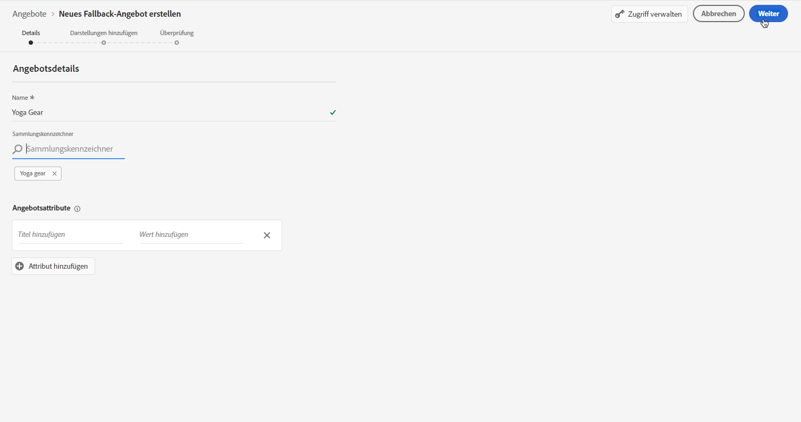
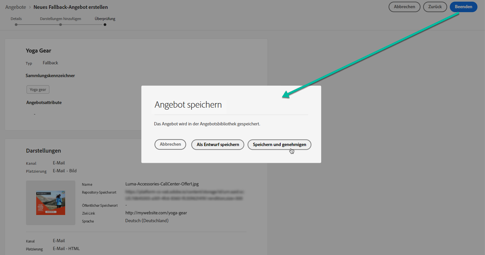

# Fallback-Angebote erstellen {#create-fallback-offers}

Das Fallback-Angebot wird an Kunden gesendet, wenn sie nicht für andere Angebote geeignet sind. Die Schritte zum Erstellen eines Fallback-Angebots bestehen darin, eine oder mehrere Darstellungen zu erstellen, beispielsweise beim Erstellen eines Angebots.

➡️ [Funktion im Video kennenlernen](#video)

Auf die Liste der Fallback-Angebote kann im Abschnitt **[!UICONTROL Offers]** Menü.

Gehen Sie wie folgt vor, um ein Fallback-Angebot zu erstellen:

>[!NOTE]
>
>Beachten Sie, dass Fallback-Angebote im Gegensatz zu personalisierten Angeboten keine Eignungsregeln und Beschränkungsparameter aufweisen, da sie Kunden als letzte Resorts ohne Bedingung unterbreitet werden.

1. Klicken **[!UICONTROL Create offer]**, wählen Sie **[!UICONTROL Fallback offer]**.

   

1. Geben Sie den Namen des Fallback-Angebots an. Sie können auch ein oder mehrere vorhandene Tags damit verknüpfen, sodass Sie die Angebotsbibliothek einfacher durchsuchen und organisieren können.

   

1. Um dem Angebot benutzerdefinierte oder zentrale Datennutzungsbezeichnungen zuzuweisen, wählen Sie **[!UICONTROL Manage access]**. [Weitere Informationen zur Zugriffskontrolle auf Objektebene (OLAC)](../../administration/object-based-access.md)

1. Erstellen Sie eine oder mehrere Darstellungen für das Fallback-Angebot. Ziehen Sie dazu Platzierungen aus dem linken Bereich, z. B. beim Erstellen eines personalisierten Angebots. Siehe [Personalisierte Angebote erstellen](../offer-library/creating-personalized-offers.md).

   

1. Nachdem die Darstellungen des Fallback-Angebots hinzugefügt wurden, wird eine Zusammenfassung angezeigt. Wenn alles ordnungsgemäß konfiguriert ist und Ihr Fallback-Angebot bereit zur Anzeige für Kunden ist, klicken Sie auf **[!UICONTROL Finish]**, wählen Sie **[!UICONTROL Save and approve]**.

   Sie können das Fallback-Angebot auch als Entwurf speichern, um es später zu bearbeiten und zu genehmigen.

   

1. Das Fallback-Angebot wird in der Liste mit dem **[!UICONTROL Live]** oder **[!UICONTROL Draft]** Status, je nachdem, ob Sie ihn im vorherigen Schritt genehmigt haben oder nicht.

   Es kann jetzt an Kunden geliefert werden. Sie können es auswählen, um seine Eigenschaften anzuzeigen und zu bearbeiten. <!-- no suppression? -->

   

## Anleitungsvideo {#video}

>[!VIDEO](https://video.tv.adobe.com/v/329383?quality=12)

