# Personalisierte Angebote erstellen {#creating-personalized-offers}

Vor der Erstellung eines Angebots sollten Sie Folgendes erstellt haben:

* Eine **Platzierung**, in der das Angebot angezeigt wird. Siehe [Platzierungen erstellen](../offer-library/creating-placements.md)
* Eine **Entscheidungsregel**, die die Bedingung für die Unterbreitung des Angebots definiert. Weitere Informationen finden Sie unter [Entscheidungsregeln erstellen](../offer-library/creating-decision-rules.md).
* Ein oder mehrere **Tags**, die Sie mit dem Angebot verknüpfen möchten. Weitere Informationen finden Sie unter [Tags erstellen](../offer-library/creating-tags.md).

➡️ [Entdecken Sie diese Funktion im Video](#video).

Die Liste der personalisierten Angebote ist im Menü **[!UICONTROL Angebote]** verfügbar.

## Angebot erstellen {#create-offer}

Gehen Sie wie folgt vor, um ein **Angebot** zu erstellen:

1. Klicken Sie auf **[!UICONTROL Angebot erstellen]** und wählen Sie dann **[!UICONTROL Personalisiertes Angebot]** aus.

   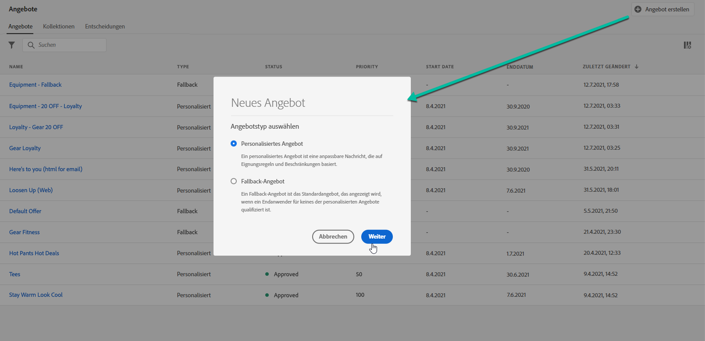

1. Geben Sie den Namen des Angebots sowie sein Anfangs- und Enddatum sowie die entsprechende Uhrzeit an. Sie können dem Angebot auch ein oder mehrere Tags zuordnen, damit Sie die Angebotsbibliothek leichter durchsuchen und organisieren können.

   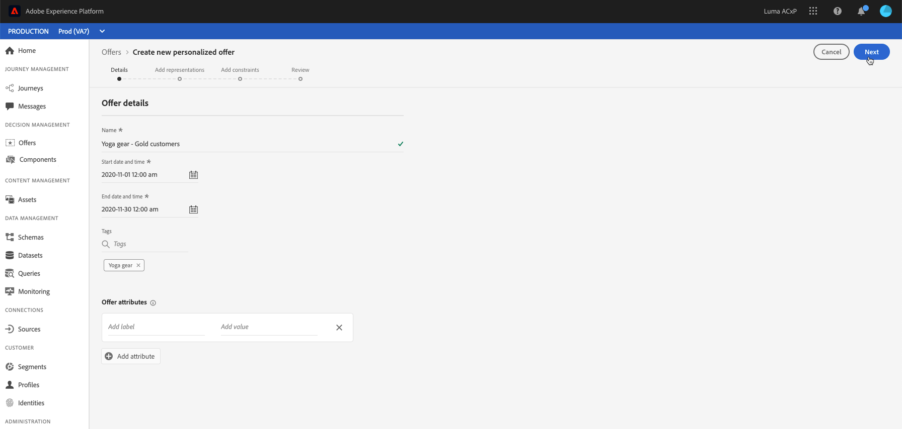

   >[!NOTE]
   >
   >Im Abschnitt **[!UICONTROL Angebotsattribute]** können Sie für Reporting- und Analysezwecke Schlüssel-Wert-Paare mit dem Angebot verknüpfen.

## Darstellungen des Angebots konfigurieren {#representations}

Ein Angebot kann an verschiedenen Stellen in einer Nachricht angezeigt werden: in einem oberen Banner mit einem Bild, als Text in einem Absatz, als HTML-Block usw. Je mehr Darstellungen ein Angebot hat, desto mehr Möglichkeiten gibt es, das Angebot in verschiedenen Platzierungskontexten zu verwenden.

Gehen Sie wie folgt vor, um eine oder mehrere Darstellungen zu Ihrem Angebot hinzuzufügen und sie zu konfigurieren.

1. Wählen Sie für die erste Darstellung zunächst den zu verwendenden Kanal **[!UICONTROL A1/> aus.]**

   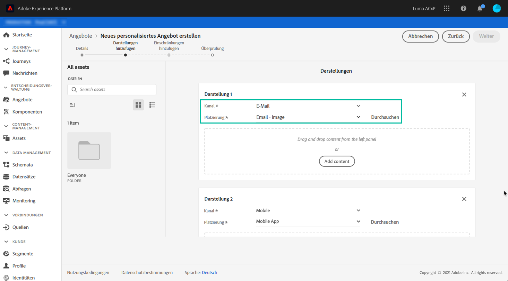

   Nur die verfügbaren Platzierungen für den ausgewählten Kanal werden in der Dropdownliste **[!UICONTROL Platzierung]** angezeigt.

1. Wählen Sie eine Platzierung aus der Liste aus oder verwenden Sie die Schaltfläche neben der Dropdownliste **[!UICONTROL Platzierung]** , um alle Platzierungen zu durchsuchen.

   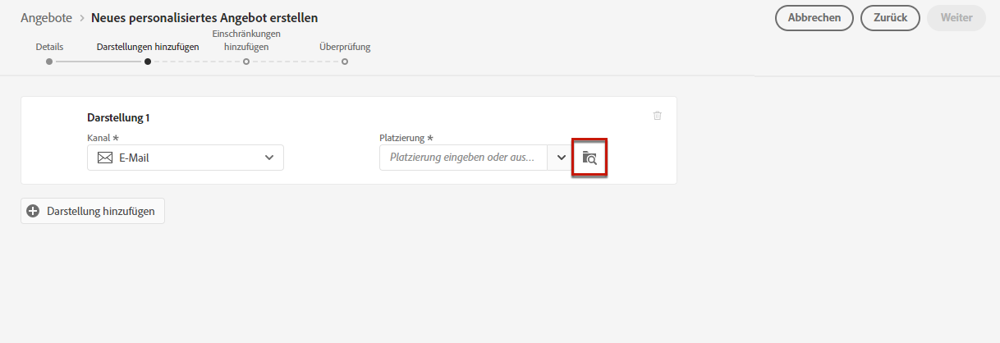

   Dort können Sie die Platzierungen nach Kanal und/oder Inhaltstyp filtern. Wählen Sie eine Platzierung aus und klicken Sie auf **[!UICONTROL Auswählen]**.

   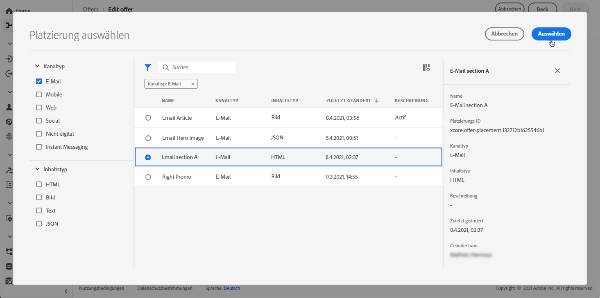

1. Fügen Sie Ihrer Darstellung Inhalt hinzu.

   >[!NOTE]
   >
   >Es sind nur Inhalte verfügbar, die dem Inhaltstyp der Platzierung entsprechen.

   * Wenn es sich bei der ausgewählten Platzierung um einen Bildtyp handelt, können Sie Inhalte aus der Adobe Experience Cloud Asset-Bibliothek hinzufügen, einem zentralen Repository mit Assets, das von [!DNL Adobe Experience Manager Assets Essentials] bereitgestellt wird.

      >[!NOTE]
      >
      > Um mit [Adobe Experience Manager Assets Essentials](https://experienceleague.adobe.com/docs/experience-manager-assets-essentials/help/introduction.html?lang=en){target=&quot;_blank&quot;} zu arbeiten, müssen Sie [!DNL Assets Essentials] für Ihr Unternehmen bereitstellen und sicherstellen, dass Benutzer Teil der Produktprofile **Assets Essentials Consumer Users** oder **Assets Essentials Users** sind. Weitere Informationen zu [dieser Seite](https://experienceleague.adobe.com/docs/experience-manager-assets-essentials/help/deploy-administer.html?lang=de){target=&quot;_blank&quot;}.

      Wählen Sie die Option **[!UICONTROL Asset-Bibliothek]** und wählen Sie **[!UICONTROL Durchsuchen]** aus.

      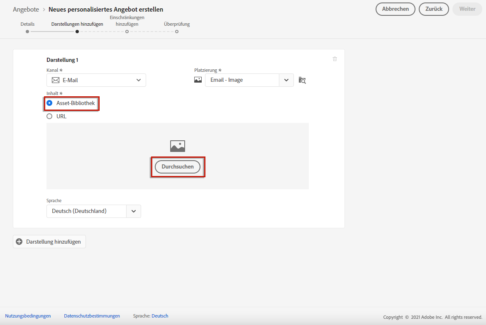

      Durchsuchen Sie die Assets, um das Bild Ihrer Wahl auszuwählen, und klicken Sie auf **[!UICONTROL Wählen Sie]**.

      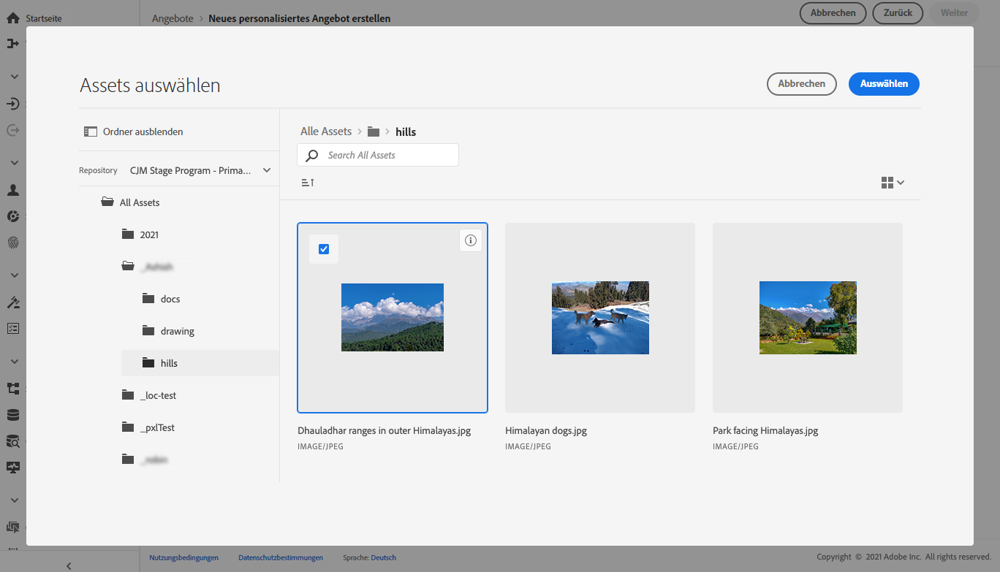

   * Um Inhalte von einem externen öffentlichen Speicherort hinzuzufügen, wählen Sie **[!UICONTROL URL]** und geben Sie dann die URL-Adresse des hinzuzufügenden Inhalts ein.

      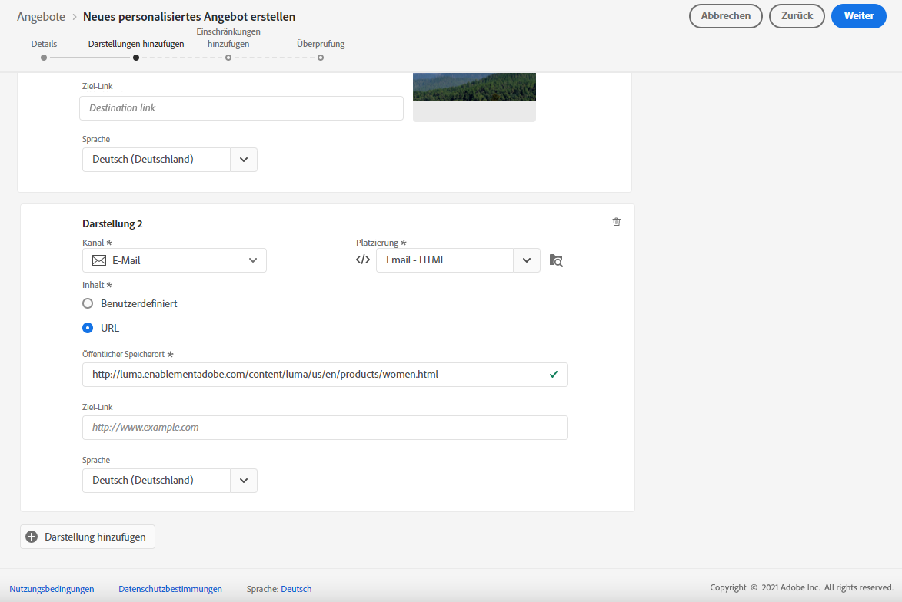

   * Sie können auch Textinhalte einfügen, wenn Sie eine kompatible Platzierung auswählen. Wählen Sie die Option **[!UICONTROL Benutzerdefiniert]** aus und geben Sie den Text ein, der im Angebot angezeigt werden soll.

      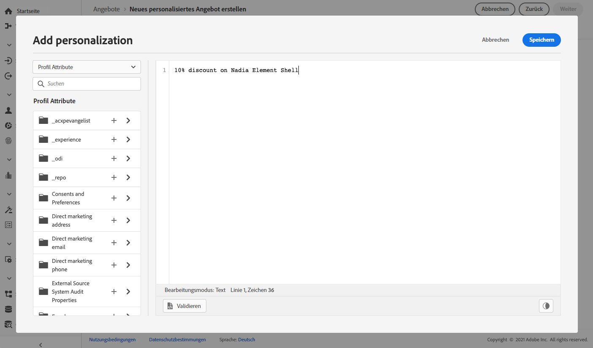

      >[!NOTE]
      >
      >Bei Platzierungen vom Typ „Bild“ ist diese Option nicht verfügbar.

1. Wenn Sie Inhalte wie ein Bild oder eine URL hinzufügen, können Sie einen **[!UICONTROL Ziel-Link]** angeben: die Benutzer, die auf das Angebot klicken, werden zur entsprechenden Seite weitergeleitet.

   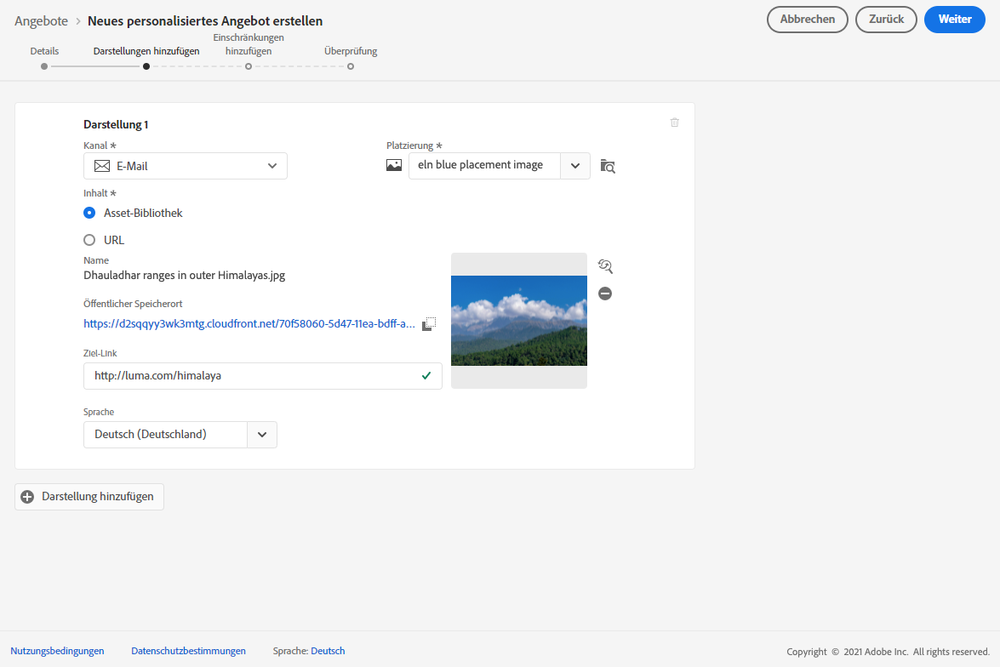

1. Wählen Sie abschließend die Sprache Ihrer Wahl aus, um zu ermitteln und zu verwalten, welche Inhalte den Benutzern angezeigt werden sollen.

1. Um eine weitere Darstellung hinzuzufügen, verwenden Sie die Schaltfläche **[!UICONTROL Darstellung]** hinzufügen und fügen Sie beliebig viele Darstellungen hinzu.

   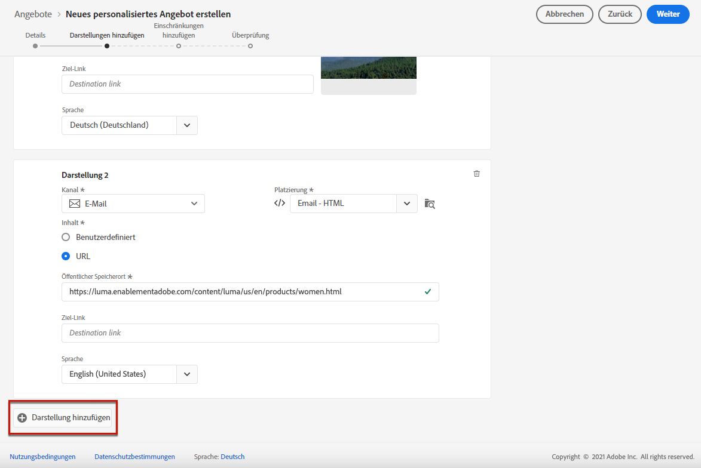

1. Nachdem Sie alle Ihre Darstellungen hinzugefügt haben, wählen Sie **[!UICONTROL Weiter]** aus.

## Eignungsregeln und Einschränkungen hinzufügen {#eligibility}

Mit Eignungsregeln und Einschränkungen können Sie festlegen, unter welchen Bedingungen ein Angebot angezeigt werden soll.

1. Konfigurieren Sie die **[!UICONTROL Angebotseignung]**. Standardmäßig ist die Entscheidungsregel **[!UICONTROL Alle Besucher]** aktiviert, d. h. jedes Profil ist dazu geeignet, das Angebot angezeigt zu bekommen.

   Sie können die Präsentation eines Angebots auf die Mitglieder eines oder mehrerer Adobe Experience Platform-Segmente einschränken. Aktivieren Sie dazu die Option **[!UICONTROL Besucher, die zu mindestens einem Segment passen]**, fügen Sie dann ein oder mehrere Segmente aus dem linken Bereich hinzu und kombinieren Sie sie mit den logischen Operatoren **[!UICONTROL Und]** / **[!UICONTROL Oder]**.

   Weitere Informationen zum Arbeiten mit Segmenten finden Sie auf [dieser Seite](../../segment/about-segments.md).

   

   Wenn Sie eine bestimmte Entscheidungsregel mit dem Angebot verknüpfen möchten, wählen Sie **[!UICONTROL Nach definierter Entscheidungsregel]** aus und ziehen Sie die gewünschte Regel dann aus dem linken Bereich in den Bereich **[!UICONTROL Entscheidungsregel]**. Weiterführende Informationen zum Erstellen einer Entscheidungsregel finden Sie in [diesem Abschnitt](../offer-library/creating-decision-rules.md).

   

   >[!CAUTION]
   >
   >Ereignisbasierte Angebote werden derzeit in [!DNL Journey Optimizer] nicht unterstützt. Wenn Sie eine Entscheidungsregel basierend auf einem [Ereignis](https://experienceleague.adobe.com/docs/experience-platform/segmentation/ui/segment-builder.html?lang=de#events){target=&quot;_blank&quot;} erstellen, können Sie sie in einem Angebot nicht nutzen.

1. Definieren Sie die **[!UICONTROL Priorität]** des Angebots gegenüber anderen, wenn der Benutzer für mehr als ein Angebot geeignet ist. Je höher die Priorität eines Angebots ist, desto höher ist seine Priorität gegenüber anderen Angeboten.

1. Geben Sie die **[!UICONTROL Begrenzung]** des Angebots an, d. h. wie oft das Angebot insgesamt für alle Benutzer angezeigt wird. Wenn das Angebot allen Benutzern so oft bereitgestellt wurde, wie Sie es in diesem Feld angegeben haben, wird der Versand beendet.

   >[!NOTE]
   >
   >Die Häufigkeit, mit der ein Angebot vorgeschlagen wird, wird zum Zeitpunkt der E-Mail-Vorbereitung berechnet. Wenn Sie z. B. eine E-Mail mit mehreren Angeboten vorbereiten, wird diese Anzahl dem Begrenzungswert angerechnet, unabhängig davon, ob die E-Mail gesendet wird oder nicht.
   >
   >Wenn ein E-Mail-Versand gelöscht oder die Vorbereitung vor dem Senden erneut vorgenommen wird, wird der Begrenzungswert für das Angebot automatisch aktualisiert.

   

   Im obigen Beispiel:

   * Die Priorität des Angebots ist mit „50“ festgelegt, d. h. das Angebot wird vor Angeboten mit einer Priorität zwischen 1 und 49 und nach Angeboten mit einer Priorität von mindestens 51 unterbreitet.
   * Das Angebot wird nur bei Benutzern berücksichtigt, die die Entscheidungsregel „Gold-Treuekunden“ erfüllen.
   * Das Angebot wird nur einmal pro Benutzer unterbreitet.

## Angebot überprüfen {#review}

Sobald Eignungsregeln und Begrenzungen definiert wurden, wird eine Zusammenfassung der Angebotseigenschaften angezeigt.

1. Stellen Sie sicher, dass alles ordnungsgemäß konfiguriert ist.

1. Wenn Ihr Angebot bereit ist, den Benutzern präsentiert zu werden, klicken Sie auf **[!UICONTROL Beenden]**.

1. Wählen Sie **[!UICONTROL Speichern und genehmigen]** aus.

   

   Sie können das Angebot auch als Entwurf speichern, um es später zu bearbeiten und zu genehmigen.

Das Angebot wird in der Liste mit dem Status **[!UICONTROL Genehmigt]** oder **[!UICONTROL Entwurf]** angezeigt, je nachdem, ob Sie es im vorherigen Schritt genehmigt haben oder nicht.

Es kann jetzt Benutzern unterbreitet werden.

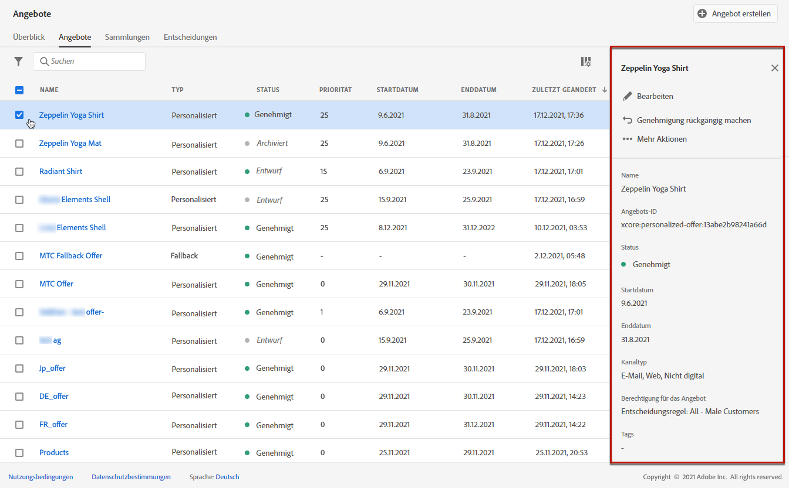

## Angebotsliste {#offer-list}

Sie können aus der Angebotsliste das Angebot auswählen, dessen Eigenschaften angezeigt werden sollen. Sie können das Angebot auch bearbeiten, seinen Status (**Entwurf**, **Genehmigt**, **Archiviert**) ändern, es duplizieren oder löschen.

Wählen Sie die Schaltfläche **[!UICONTROL Bearbeiten]** aus, um zum Bearbeitungsmodus für Angebote zurückzukehren. Dort können Sie die [Details](#create-offer) und [Darstellungen](#representations) des Angebots ändern und die [Eignungsregeln und Begrenzungen](#eligibility) bearbeiten.

Wählen Sie ein genehmigtes Angebot aus und klicken Sie auf **[!UICONTROL Genehmigung rückgängig machen]**, um den Angebotsstatus wieder auf **[!UICONTROL Entwurf]** zu setzen.

Um den Status erneut auf **[!UICONTROL Genehmigt]** zu setzen, wählen Sie die entsprechende Schaltfläche aus, die jetzt angezeigt wird.

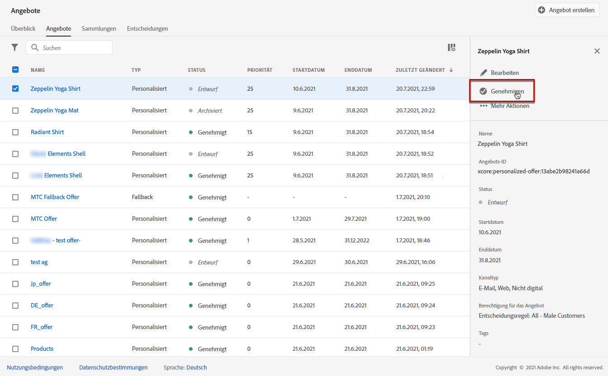

Die Schaltfläche **[!UICONTROL Weitere Aktionen]** aktiviert die unten beschriebenen Aktionen.

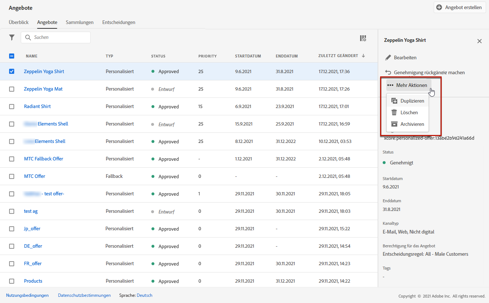

* **[!UICONTROL Duplizieren]**: erstellt ein Angebot mit denselben Eigenschaften, Darstellungen, Eignungsregeln und Begrenzungen. Standardmäßig weist das neue Angebot den Status **[!UICONTROL Entwurf]** auf.
* **[!UICONTROL Löschen]**: entfernt das Angebot aus der Liste.

   >[!CAUTION]
   >
   >Auf das Angebot und seinen Inhalt kann nicht mehr zugegriffen werden. Diese Aktion kann nicht rückgängig gemacht werden.
   >
   >Wenn das Angebot in einer Kollektion oder Entscheidung verwendet wird, kann es nicht gelöscht werden. Sie müssen das Angebot zuerst aus allen Objekten entfernen.

* **[!UICONTROL Archivieren]**: setzt den Angebotsstatus auf **[!UICONTROL Archiviert]**. Das Angebot ist weiterhin in der Liste verfügbar, Sie können seinen Status jedoch nicht auf **[!UICONTROL Entwurf]** oder **[!UICONTROL Genehmigt]** zurücksetzen. Sie können es nur duplizieren oder löschen.

Sie können auch den Status mehrerer Angebote gleichzeitig löschen oder ändern, indem Sie die entsprechenden Checkboxen auswählen.

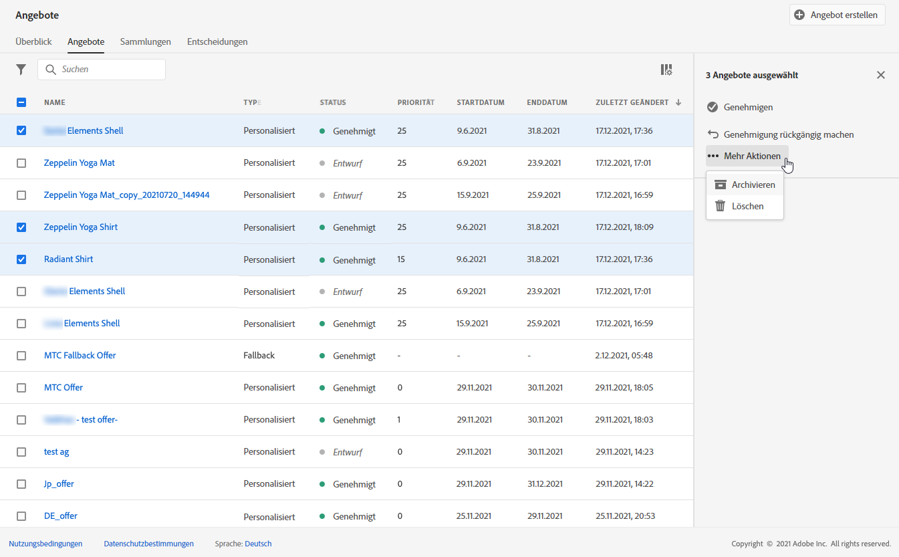

Wenn Sie den Status mehrerer Angebote mit unterschiedlichen Status ändern möchten, werden nur die relevanten Status geändert.

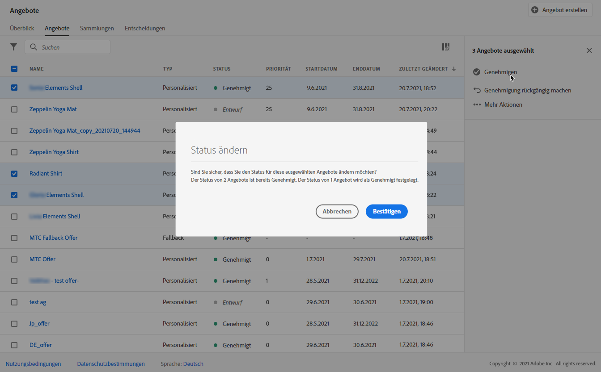

Nachdem ein Angebot erstellt wurde, können Sie in der Liste auf seinen Namen klicken.

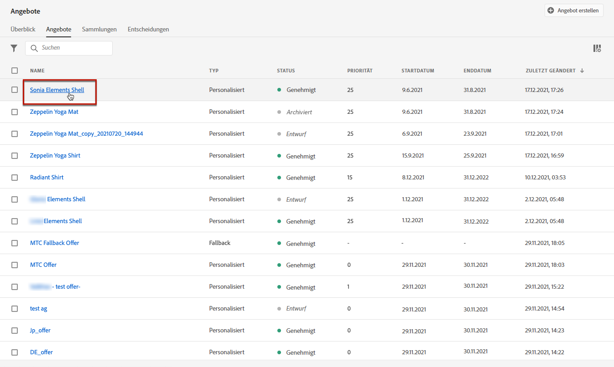

Auf diese Weise können Sie auf detaillierte Informationen zu diesem Angebot zugreifen. Wählen Sie die Registerkarte **[!UICONTROL Protokoll ändern]** aus, um [alle Änderungen zu überwachen](../get-started/user-interface.md#monitoring-changes), die am Angebot vorgenommen wurden.

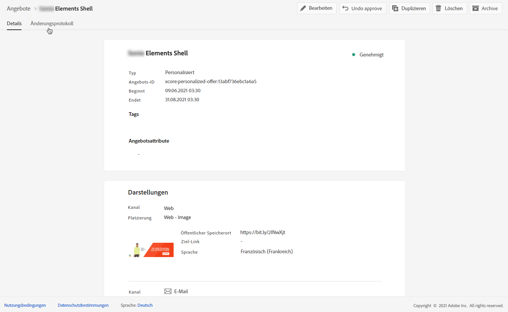

## Anleitungsvideo {#video}

>[!NOTE]
>
>Dieses Video bezieht sich auf den auf Adobe Experience Platform aufbauenden Anwendungsdienst Offer Decisioning. Es enthält allgemeine Leitlinien für die Verwendung von Angeboten im Kontext von Journey Optimizer.

>[!VIDEO](https://video.tv.adobe.com/v/329375?quality=12)
