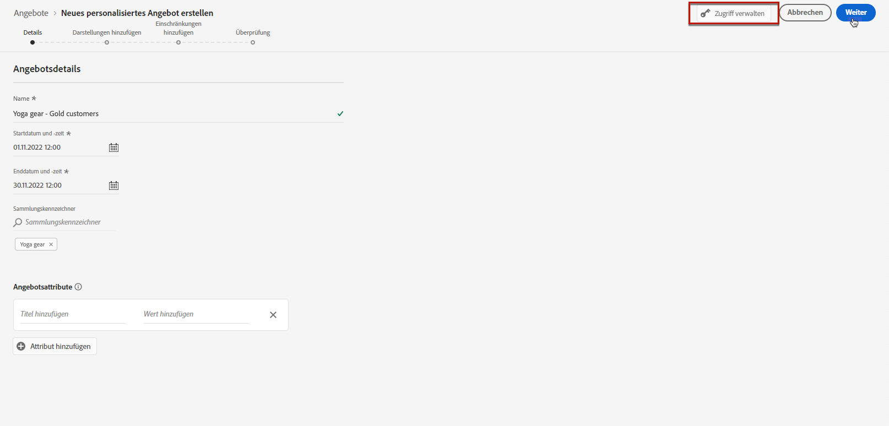
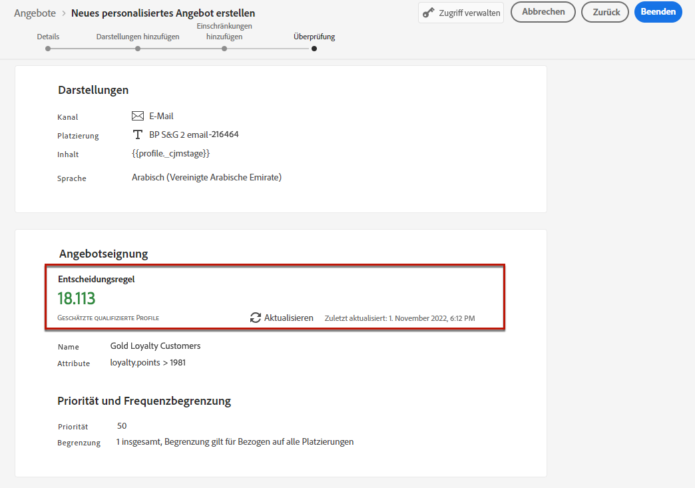
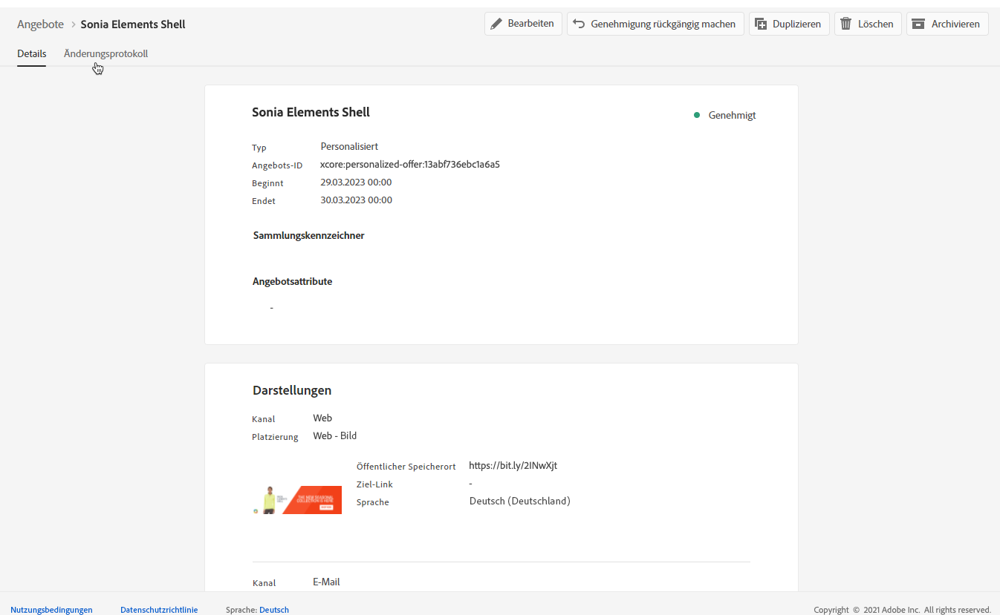

# Personalisierte Angebote erstellen {#create-personalized-offers}

Stellen Sie vor der Erstellung eines Angebots sicher, dass Sie Folgendes erstellt haben:

* A **placement** in der das Angebot angezeigt wird. Siehe [Platzierungen erstellen](../offer-library/creating-placements.md)
* Wenn Sie eine Eignungsbedingung hinzufügen möchten: a **Entscheidungsregel** definiert die Bedingung, unter der das Angebot unterbreitet wird. Siehe [Entscheidungsregeln erstellen](../offer-library/creating-decision-rules.md).
* Eins oder mehrere **tags** die Sie mit dem Angebot verknüpfen möchten. Siehe [Tags erstellen](../offer-library/creating-tags.md).

➡️ [Funktion im Video kennenlernen](#video)

Auf die Liste personalisierter Angebote kann im Abschnitt **[!UICONTROL Offers]** Menü.

## Erstellen eines Angebots {#create-offer}

>[!CONTEXTUALHELP]
>id="od_offer_attributes"
>title="Über Angebotsattribute"
>abstract="Mit Angebotsattributen können Sie Schlüsselwertpaare zu Berichts- und Analysezwecken mit dem Angebot verknüpfen."

>[!CONTEXTUALHELP]
>id="ajo_decisioning_offer_attributes"
>title="Angebotsattribute"
>abstract="Mit Angebotsattributen können Sie Schlüsselwertpaare zu Berichts- und Analysezwecken mit dem Angebot verknüpfen."

So erstellen Sie eine **Angebot** führen Sie die folgenden Schritte aus:

1. Klicken **[!UICONTROL Create offer]**, wählen Sie **[!UICONTROL Personalized offer]**.

   

1. Geben Sie den Namen des Angebots sowie das Anfangs- und Enddatum und die entsprechende Uhrzeit an. Außerhalb dieser Daten wird das Angebot nicht von der Decisioning-Engine ausgewählt.

   

   >[!CAUTION]
   >
   >Das Aktualisieren der Start-/Enddaten kann sich auf die Begrenzung auswirken. [Weitere Infos](add-constraints.md#capping-change-date)

1. Sie können auch eine oder mehrere vorhandene **[!UICONTROL tags]** dem Angebot hinzufügen, sodass Sie die Angebotsbibliothek einfacher durchsuchen und organisieren können. [Weitere Infos](creating-tags.md).

1. Die **[!UICONTROL Offer attributes]** -Bereich können Sie Schlüssel-Wert-Paare zu Berichts- und Analysezwecken mit dem Angebot verknüpfen.

1. Um dem Angebot benutzerdefinierte oder zentrale Datennutzungsbezeichnungen zuzuweisen, wählen Sie **[!UICONTROL Manage access]**. [Weitere Informationen zur Zugriffskontrolle auf Objektebene (OLAC)](../../administration/object-based-access.md)

   

1. Fügen Sie Darstellungen hinzu, um festzulegen, wo Ihr Angebot in der Nachricht angezeigt werden soll. [Weitere Infos](add-representations.md)

   

1. Fügen Sie Einschränkungen hinzu, um die Bedingungen für die Anzeige des Angebots festzulegen. [Weitere Infos](add-constraints.md)

   >[!NOTE]
   >
   >Wenn Sie Segmente oder Entscheidungsregeln auswählen, können Sie Informationen zu den geschätzten qualifizierten Profilen anzeigen. Klicken **[!UICONTROL Refresh]** , um Daten zu aktualisieren.
   >
   >Beachten Sie, dass Profilschätzungen nicht verfügbar sind, wenn Regelparameter Daten enthalten, die nicht im Profil enthalten sind, z. B. Kontextdaten. Beispielsweise eine Eignungsregel, für die das aktuelle Wetter ≥ 80 Grad sein muss.

   

1. Überprüfen und speichern Sie das Angebot. [Weitere Infos](#review)

## Angebot überprüfen {#review}

Sobald Eignungsregeln und Einschränkungen definiert wurden, wird eine Zusammenfassung der Angebotseigenschaften angezeigt.

1. Stellen Sie sicher, dass alles ordnungsgemäß konfiguriert ist.

1. Sie können Informationen zu den geschätzten qualifizierten Profilen anzeigen. Klicken **[!UICONTROL Refresh]** , um Daten zu aktualisieren.

   

1. Wenn Ihr Angebot für Benutzer bereit ist, klicken Sie auf **[!UICONTROL Finish]**.

1. Auswählen **[!UICONTROL Save and approve]**.

   

   Sie können das Angebot auch als Entwurf speichern, um es später zu bearbeiten und zu genehmigen.

Das Angebot wird in der Liste mit der **[!UICONTROL Approved]** oder **[!UICONTROL Draft]** Status, je nachdem, ob Sie ihn im vorherigen Schritt genehmigt haben oder nicht.

Es kann jetzt für Benutzer bereitgestellt werden.

## Angebote verwalten {#offer-list}

Sie können aus der Angebotsliste das Angebot auswählen, dessen Eigenschaften angezeigt werden sollen. Sie können sie auch bearbeiten und ihren Status ändern (**Entwurf**, **Genehmigt**, **Archiviert**), duplizieren Sie das Angebot oder löschen Sie es.

Wählen Sie die **[!UICONTROL Edit]** -Schaltfläche, um in den Modus zur Bearbeitung von Angeboten zurückzukehren und dort die [details](#create-offer), [Darstellungen](#representations)und bearbeiten Sie die [Eignungsregeln und Einschränkungen](#eligibility).

Wählen Sie ein genehmigtes Angebot aus und klicken Sie auf **[!UICONTROL Undo approve]** , um den Angebotsstatus auf **[!UICONTROL Draft]**.

So legen Sie den Status erneut auf **[!UICONTROL Approved]**, wählen Sie die entsprechende Schaltfläche aus, die jetzt angezeigt wird.

Die **[!UICONTROL More actions]** -Schaltfläche aktiviert die unten beschriebenen Aktionen.

* **[!UICONTROL Duplicate]**: erstellt ein Angebot mit denselben Eigenschaften, Darstellungen, Eignungsregeln und Einschränkungen. Standardmäßig verfügt das neue Angebot über die **[!UICONTROL Draft]** Status.
* **[!UICONTROL Delete]**: entfernt das Angebot aus der Liste.

   >[!CAUTION]
   >
   >Auf das Angebot und seinen Inhalt kann nicht mehr zugegriffen werden. Diese Aktion kann nicht rückgängig gemacht werden.
   >
   >Wenn das Angebot in einer Sammlung oder Entscheidung verwendet wird, kann es nicht gelöscht werden. Sie müssen das Angebot zuerst aus allen Objekten entfernen.

* **[!UICONTROL Archive]**: setzt den Angebotsstatus auf **[!UICONTROL Archived]**. Das Angebot ist weiterhin in der Liste verfügbar, Sie können seinen Status jedoch nicht auf **[!UICONTROL Draft]** oder **[!UICONTROL Approved]**. Sie können sie nur duplizieren oder löschen.

Sie können auch den Status mehrerer Angebote gleichzeitig löschen oder ändern, indem Sie die entsprechenden Kontrollkästchen aktivieren.

Wenn Sie den Status mehrerer Angebote mit unterschiedlichen Status ändern möchten, werden nur die entsprechenden Status geändert.

Nachdem ein Angebot erstellt wurde, können Sie in der Liste auf seinen Namen klicken.

Auf diese Weise können Sie auf detaillierte Informationen zu diesem Angebot zugreifen. Wählen Sie die **[!UICONTROL Change log]** Registerkarte zu [alle Änderungen überwachen](../get-started/user-interface.md#monitoring-changes) , die dem Angebot unterbreitet wurden.

## Tutorial-Video {#video}

>[!VIDEO](https://video.tv.adobe.com/v/329375?quality=12)
