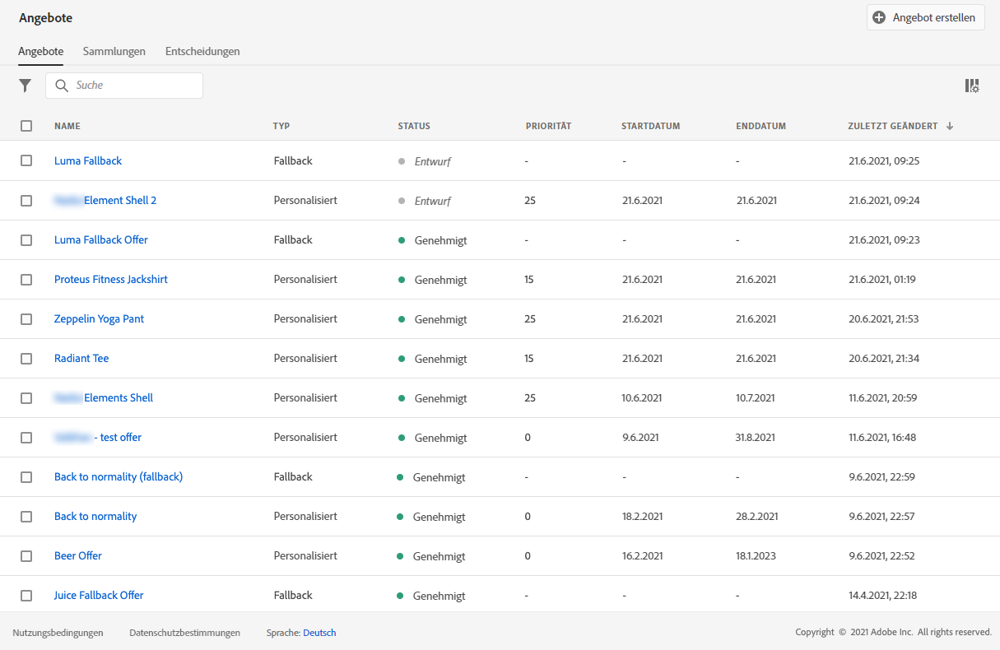
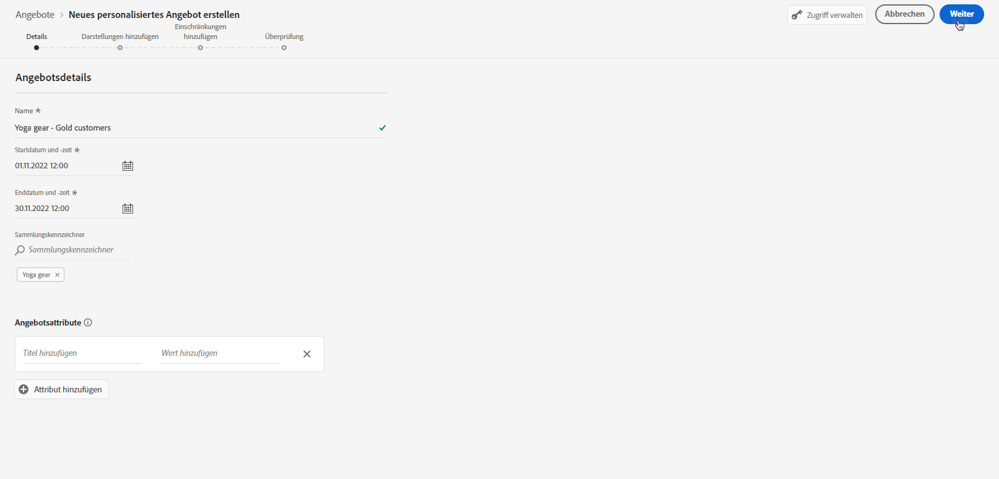
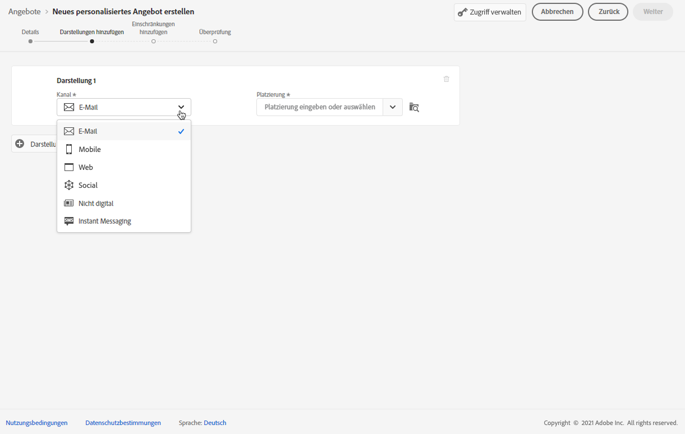
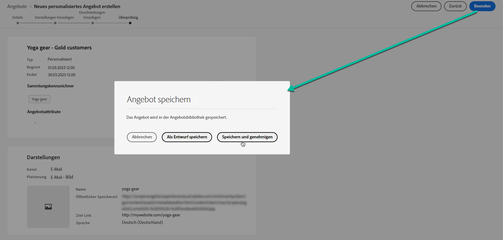

# Erstellen von personalisierten Angeboten {#create-personalized-offers}

Vor der Erstellung eines Angebots sollten Sie Folgendes erstellt haben:

* Eine **Platzierung**, in der das Angebot angezeigt wird. Siehe [Platzierungen erstellen](../offer-library/creating-placements.md)
* Wenn Sie eine Eignungsbedingung hinzufügen möchten: eine **Entscheidungsregel** definiert die Bedingung, unter der das Angebot unterbreitet wird. Weitere Informationen finden Sie unter [Erstellen von Entscheidungsregeln](../offer-library/creating-decision-rules.md).
* Ein oder mehrere **Sammlungsqualifizierer** (ehemals als „Tags“ bezeichnet), die Sie möglicherweise mit dem Angebot verknüpfen möchten. Siehe [Erstellen von Sammlungsqualifizierern](../offer-library/creating-tags.md).

➡️ [Funktion im Video kennenlernen](#video)

Die Liste der personalisierten Angebote ist im Menü **[!UICONTROL Angebote]** verfügbar.

## Erstellen eines Angebots {#create-offer}

>[!CONTEXTUALHELP]
>id="ajo_decisioning_offer_details"
>title="Angebotsdetails"
>abstract="Geben Sie den Namen des Angebots sowie sein Start- und Enddatum ein. Ein Angebot außerhalb dieses Datumsbereichs wird nicht von der Entscheidungs-Engine ausgewählt."

>[!CONTEXTUALHELP]
>id="od_offer_attributes"
>title="Info zu Angebotsattributen"
>abstract="Mit Angebotsattributen können Sie für Reporting- und Analysezwecke Schlüssel-Wert-Paare mit dem Angebot verknüpfen."

>[!CONTEXTUALHELP]
>id="ajo_decisioning_offer_attributes"
>title="Angebotsattribute"
>abstract="Mit Angebotsattributen können Sie für Reporting- und Analysezwecke Schlüssel-Wert-Paare mit dem Angebot verknüpfen."

>[!CONTEXTUALHELP]
>id="ajo_decisioning_new_personalized"
>title="Personalisiertes Angebot"
>abstract="Ein personalisiertes Angebot ist eine anpassbare Nachricht, die auf Eignungsregeln und Beschränkungen basiert."

Gehen Sie wie folgt vor, um ein **Angebot** zu erstellen:

1. Klicken Sie auf **[!UICONTROL Angebot erstellen]** und wählen Sie dann **[!UICONTROL Personalisiertes Angebot]** aus.

   

1. Geben Sie den Namen des Angebots sowie sein Anfangs- und Enddatum sowie die entsprechende Uhrzeit an. Ein Angebot außerhalb dieses Datumsbereichs wird nicht von der Entscheidungs-Engine ausgewählt.

   >[!NOTE]
   >
   >Bei der Zeitauswahl wird Ihre aktuelle Zeitzone berücksichtigt.

   

   >[!CAUTION]
   >
   >Das Aktualisieren des Start-/Enddatums kann sich auf die Begrenzung auswirken. [Weitere Informationen](add-constraints.md#capping-change-date)

1. Sie können dem Angebot auch ein oder mehrere **[!UICONTROL Sammlungsqualifizierer]** zuordnen, damit Sie die Angebotsbibliothek leichter durchsuchen und organisieren können. [Weitere Informationen](creating-tags.md).

1. Im Abschnitt **[!UICONTROL Angebotsattribute]** können Sie für Reporting- und Analysezwecke Schlüssel-Wert-Paare mit dem Angebot verknüpfen.

1. Um dem Angebot benutzerdefinierte oder zentrale Datennutzungs-Labels zuzuweisen, wählen Sie **[!UICONTROL Zugriff verwalten]**. [Weitere Informationen zur Zugriffssteuerung auf Objektebene (Object Level Access Control, OLAC)](../../administration/object-based-access.md)

   

1. Fügen Sie Darstellungen hinzu, um festzulegen, wo in einer Nachricht Ihr Angebot angezeigt werden soll. [Weitere Informationen](add-representations.md)

   

   >[!CAUTION]
   >
   >Die Größe eines Angebots einschließlich aller seiner Darstellungen darf 300 KB nicht überschreiten.

1. Fügen Sie Einschränkungen hinzu, um die Bedingungen für das anzuzeigende Angebot festzulegen. [Weitere Informationen](add-constraints.md)

   >[!NOTE]
   >
   >Wenn Sie Zielgruppen oder Entscheidungsregeln auswählen, können Sie Informationen zur geschätzten Anzahl der qualifizierten Profile sehen. Klicken Sie auf **[!UICONTROL Aktualisieren]**, um diese Daten zu aktualisieren.
   >
   >Beachten Sie, dass Profilschätzungen nicht verfügbar sind, wenn Regelparameter Daten enthalten, die nicht im Profil enthalten sind, z. B. Kontextdaten. Beispielsweise eine Eignungsregel, für die die aktuelle Temperatur höher als 25 °C sein muss.

   

1. Überprüfen und speichern Sie das Angebot. [Weitere Informationen](#review)

## Überprüfen von Angeboten {#review}

Sobald Eignungsregeln und Begrenzungen definiert wurden, wird eine Zusammenfassung der Angebotseigenschaften angezeigt.

1. Stellen Sie sicher, dass alles ordnungsgemäß konfiguriert ist.

1. Sie können Informationen zu den geschätzten qualifizierten Profilen anzeigen. Klicken Sie auf **[!UICONTROL Aktualisieren]**, um diese Daten zu aktualisieren.

   

1. Wenn Ihr Angebot bereit ist, den Benutzern präsentiert zu werden, klicken Sie auf **[!UICONTROL Beenden]**.

1. Wählen Sie **[!UICONTROL Speichern und genehmigen]** aus.

   

   Sie können das Angebot auch als Entwurf speichern, um es später zu bearbeiten und zu genehmigen.

Das Angebot wird in der Liste mit dem Status **[!UICONTROL Genehmigt]** oder **[!UICONTROL Entwurf]** angezeigt, je nachdem, ob Sie es im vorherigen Schritt genehmigt haben oder nicht.

Es kann jetzt Benutzern unterbreitet werden.

## Verwalten von Angeboten {#offer-list}

Sie können aus der Angebotsliste das Angebot auswählen, dessen Eigenschaften angezeigt werden sollen. Sie können das Angebot auch bearbeiten, seinen Status (**Entwurf**, **Genehmigt**, **Archiviert**) ändern, es duplizieren oder löschen.

Wählen Sie die Schaltfläche **[!UICONTROL Bearbeiten]** aus, um zum Bearbeitungsmodus für Angebote zurückzukehren. Dort können Sie die [Details](#create-offer) und [Darstellungen](add-representations.md#representations) des Angebots ändern und die [Eignungsregeln und Begrenzungen](add-constraints.md#eligibility) bearbeiten.

Wählen Sie ein genehmigtes Angebot aus und klicken Sie auf **[!UICONTROL Genehmigung rückgängig machen]**, um den Angebotsstatus wieder auf **[!UICONTROL Entwurf]** zu setzen.

Um den Status erneut auf **[!UICONTROL Genehmigt]** zu setzen, wählen Sie die entsprechende Schaltfläche aus, die jetzt angezeigt wird.

Die Schaltfläche **[!UICONTROL Weitere Aktionen]** aktiviert die unten beschriebenen Aktionen.

* **[!UICONTROL Duplizieren]**: erstellt ein Angebot mit denselben Eigenschaften, Darstellungen, Eignungsregeln und Begrenzungen. Standardmäßig weist das neue Angebot den Status **[!UICONTROL Entwurf]** auf.
* **[!UICONTROL Löschen]**: entfernt das Angebot aus der Liste.

  >[!CAUTION]
  >
  >Auf das Angebot und seinen Inhalt kann nicht mehr zugegriffen werden. Diese Aktion kann nicht rückgängig gemacht werden.
  >
  >Wenn das Angebot in einer Sammlung oder Entscheidung verwendet wird, kann es nicht gelöscht werden. Sie müssen das Angebot zuerst aus allen Objekten entfernen.

* **[!UICONTROL Archivieren]**: setzt den Angebotsstatus auf **[!UICONTROL Archiviert]**. Das Angebot ist weiterhin in der Liste verfügbar, Sie können seinen Status jedoch nicht auf **[!UICONTROL Entwurf]** oder **[!UICONTROL Genehmigt]** zurücksetzen. Sie können es nur duplizieren oder löschen.

Sie können auch den Status mehrerer Angebote gleichzeitig löschen oder ändern, indem Sie die entsprechenden Checkboxen auswählen.

Wenn Sie den Status mehrerer Angebote mit unterschiedlichen Status ändern möchten, werden nur die relevanten Status geändert.

Nachdem ein Angebot erstellt wurde, können Sie in der Liste auf seinen Namen klicken.

Auf diese Weise können Sie auf detaillierte Informationen zu diesem Angebot zugreifen. Wählen Sie die Registerkarte **[!UICONTROL Protokoll ändern]** aus, um [alle Änderungen zu überwachen](../get-started/user-interface.md#changes-logs), die am Angebot vorgenommen wurden.

## Tutorial-Video {#video}

>[!VIDEO](https://video.tv.adobe.com/v/341349?captions=ger&quality=12)
