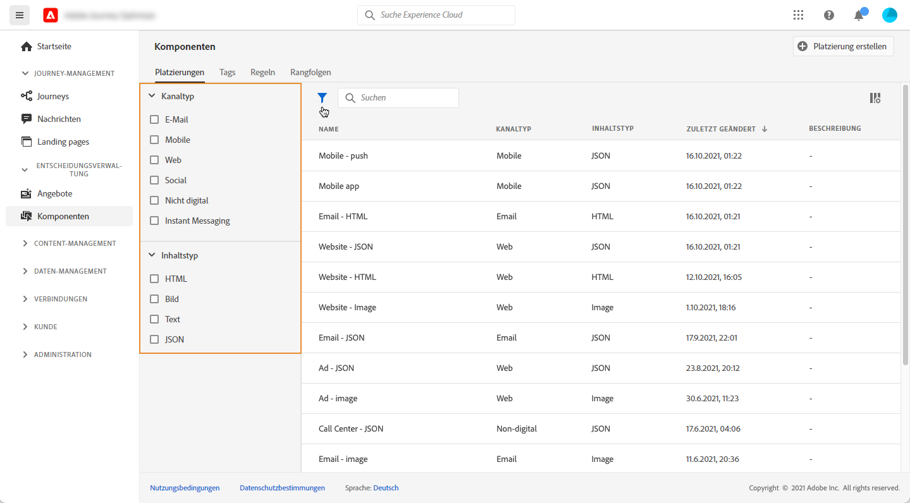
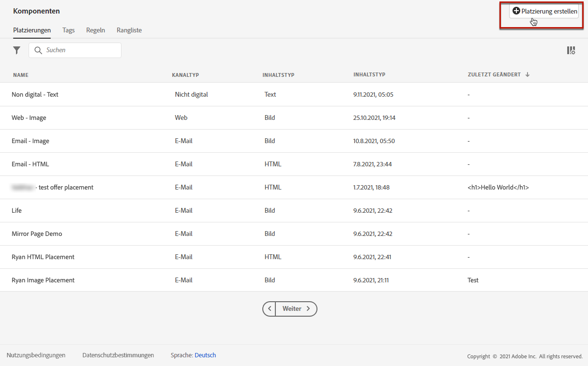
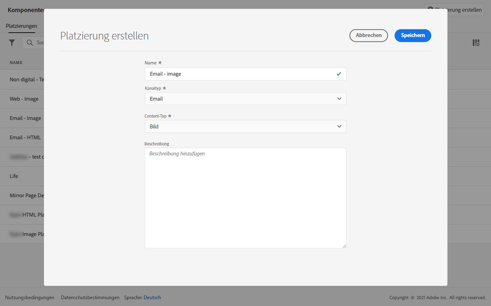
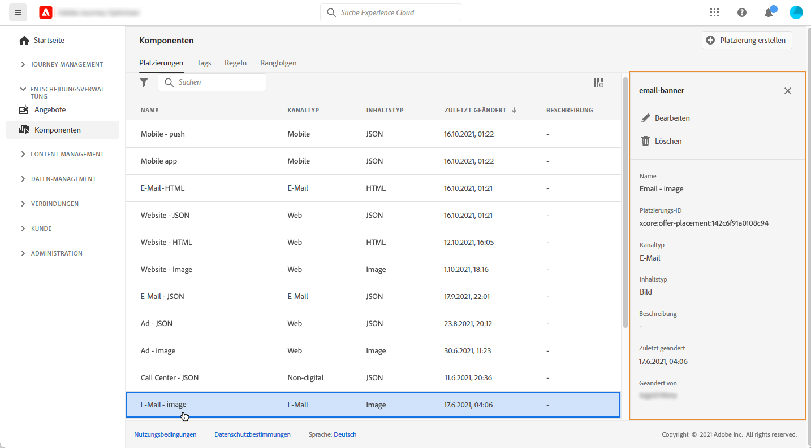

# Platzierungen erstellen {#create-placements}

>[!CONTEXTUALHELP]
>id="ajo_decisioning_placement"
>title="Platzierung"
>abstract="Eine Platzierung ist ein Container, der zur Präsentation von Angeboten verwendet wird. Dadurch wird sichergestellt, dass der richtige Angebotsinhalt an der richtigen Stelle in Ihrer Nachricht angezeigt wird. Platzierungen werden im Menü &quot;Komponenten&quot;erstellt."

Eine Platzierung hilft sicherzustellen, dass der richtige Angebotsinhalt an der richtigen Stelle in Ihrer Nachricht angezeigt wird. Wenn Sie einem Angebot Inhalte hinzufügen, werden Sie aufgefordert, eine Platzierung auszuwählen, in der der Inhalt angezeigt werden kann.

➡️ [In diesem Video erfahren Sie, wie Sie Platzierungen erstellen.](#video)

Im folgenden Beispiel gibt es drei Platzierungen, die verschiedenen Inhaltstypen (Bild, Text, HTML) entsprechen.

Die Liste der Platzierungen ist im **[!UICONTROL Components]** Menü. Es stehen Filter zur Verfügung, mit denen Sie Platzierungen anhand eines bestimmten Kanals oder Inhalts abrufen können.

Gehen Sie wie folgt vor, um eine Platzierung zu erstellen:

1. Klicken **[!UICONTROL Create placement]**.

   

1. Definieren Sie die Eigenschaften der Platzierung:

   * **[!UICONTROL Name]**: Der Name der Platzierung. Stellen Sie sicher, dass Sie einen aussagekräftigen Namen definieren, um ihn leichter abrufen zu können.
   * **[!UICONTROL Channel type]**: Der Kanal, für den die Platzierung verwendet wird.
   * **[!UICONTROL Content type]**: Der Inhaltstyp, den die Platzierung anzeigen darf: Text, HTML, Bild-Link oder JSON.
   * **[!UICONTROL Description]**: Eine Beschreibung der Platzierung (optional).

   

1. Klicken **[!UICONTROL Save]** zur Bestätigung.

1. Nachdem die Platzierung erstellt wurde, wird sie in der Platzierungsliste angezeigt. Sie können es auswählen, um seine Eigenschaften anzuzeigen und zu bearbeiten.

   

## Anleitungsvideo{#video}

Erfahren Sie, wie Sie Platzierungen in der Entscheidungsverwaltung erstellen.

>[!VIDEO](https://video.tv.adobe.com/v/329372?quality=12)

