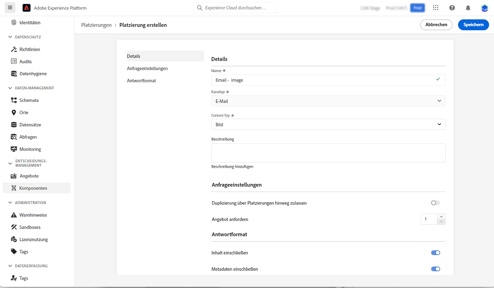
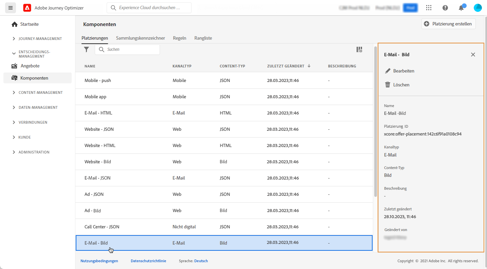

# Erstellen von Platzierungen {#create-placements}

>[!CONTEXTUALHELP]
>id="ajo_decisioning_placement"
>title="Platzierung"
>abstract="Eine Platzierung ist ein Container, der zur Präsentation von Angeboten verwendet wird. Sie hilft sicherzustellen, dass der richtige Angebotsinhalt an der richtigen Stelle Ihrer Nachricht angezeigt wird. Platzierungen werden im Menü „Komponenten“ definiert."

Eine Platzierung hilft sicherzustellen, dass der richtige Angebotsinhalt an der richtigen Stelle Ihrer Nachricht angezeigt wird. Wenn Sie Inhalte zu einem Angebot hinzufügen, werden Sie aufgefordert, eine Platzierung auszuwählen, an der diese Inhalte angezeigt werden können.

➡️ [In diesem Video erfahren Sie, wie Sie Platzierungen erstellen](#video)

Im folgenden Beispiel gibt es drei Platzierungen, die verschiedenen Inhaltstypen entsprechen (Bild, Text, HTML).

Die Liste der Platzierungen ist im Menü **[!UICONTROL Komponenten]** verfügbar. Es gibt Filter, mit denen Sie Platzierungen nach einem bestimmten Kanal oder Inhalt abrufen können.

Gehen Sie wie folgt vor, um eine Platzierung zu erstellen:

1. Klicken Sie auf **[!UICONTROL Platzierung erstellen]**.

   !

1. Definieren Sie die Eigenschaften der Platzierung:

   * **[!UICONTROL Name]**: der Name der Platzierung. Achten Sie darauf, einen aussagekräftigen Namen zu wählen, um die Platzierung leichter abrufen zu können.
   * **[!UICONTROL Kanaltyp]**: Der Kanal, für den die Platzierung verwendet wird.
   * **[!UICONTROL Inhaltstyp]**: Der Inhaltstyp, den die Platzierung anzeigen darf: Text, HTML, Bild-Link oder JSON.
   * **[!UICONTROL Beschreibung]**: eine Beschreibung der Platzierung (optional).

   

1. Klicken Sie zur Bestätigung auf **[!UICONTROL Speichern]**.

1. Nachdem die Platzierung erstellt wurde, wird sie in der Liste der Platzierungen angezeigt. Sie können das Fallback-Angebot auswählen, um seine Eigenschaften anzuzeigen und zu bearbeiten.

   

## Anleitungsvideo{#video}

Erfahren Sie, wie Sie in Offer Decisioning Platzierungen erstellen.

>[!VIDEO](https://video.tv.adobe.com/v/329372?quality=12)

