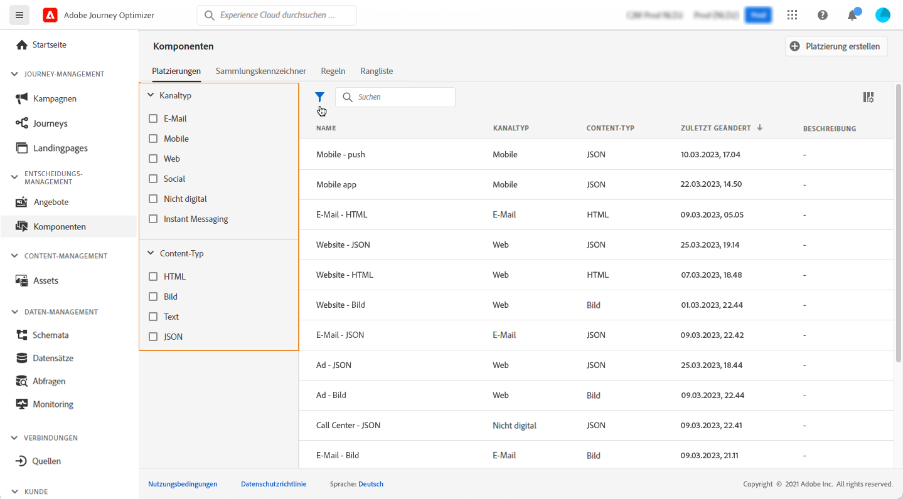
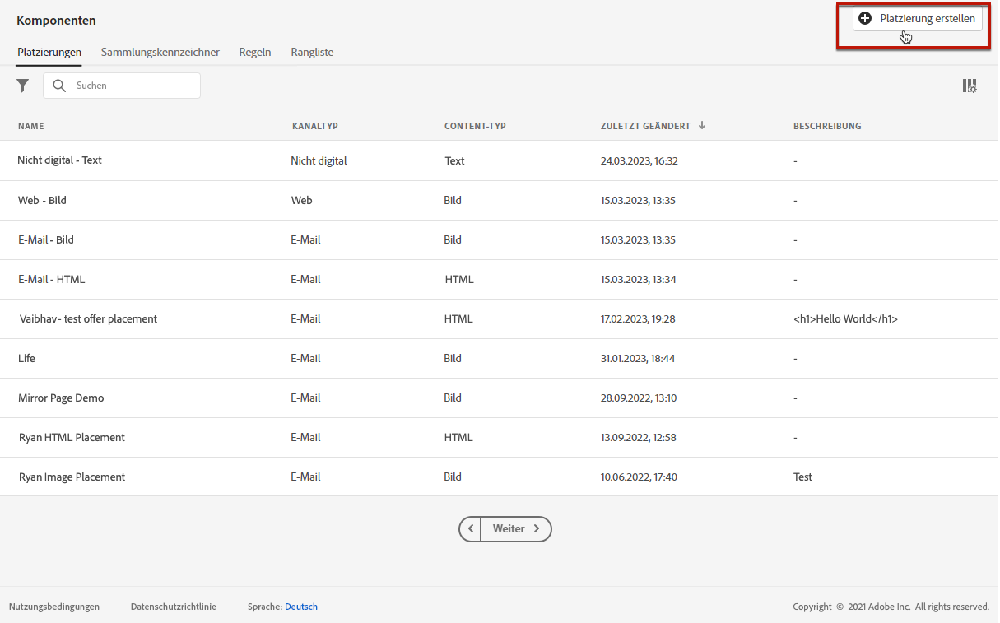

# Erstellen von Platzierungen {#creating-placements}

Eine Platzierung hilft sicherzustellen, dass der richtige Angebot-Inhalt an der richtigen Stelle in Ihrer Nachricht angezeigt wird. Wenn Sie einem Angebot Inhalte hinzufügen, werden Sie aufgefordert, eine Platzierung auszuwählen, an der der Inhalt angezeigt werden kann.

 [Diese Funktion im Video entdecken](#video)

Im unten stehenden Beispiel gibt es drei Platzierungen, die verschiedenen Inhaltstypen entsprechen (Bild, Text, HTML).

Die Liste der Platzierungen ist im Menü **[!UICONTROL Komponenten]** verfügbar. Es stehen Filter zur Verfügung, mit denen Sie Platzierungen gemäß einem bestimmten Kanal oder Inhalt abrufen können.

Gehen Sie wie folgt vor, um eine Platzierung zu erstellen:

1. Klicken Sie auf **[!UICONTROL Platzierung erstellen]**.

   

1. Definieren Sie die Eigenschaften der Platzierung:

   * **[!UICONTROL Name]**: Der Name der Platzierung. Achten Sie darauf, einen aussagekräftigen Namen zu definieren, um ihn einfacher abzurufen.
   * **[!UICONTROL Kanal]**: Der Kanal, für den die Platzierung verwendet wird.
   * **[!UICONTROL Content type]**: Der Inhaltstyp, der für die Platzierung angezeigt werden darf: Text-, HTML- oder Bildlink.
   * **[!UICONTROL Beschreibung]**: Eine Beschreibung der Platzierung (optional).

   

1. Klicken Sie zur Bestätigung auf **[!UICONTROL Speichern]**.

1. Nachdem die Platzierung erstellt wurde, wird sie in der Liste Platzierungen angezeigt. Sie können ihn auswählen, um seine Eigenschaften anzuzeigen und zu bearbeiten.

   

## Lernvideo {#video}

>[!NOTE]
>
>Dieses Video bezieht sich auf den auf Adobe Experience Platform aufbauenden Offer decisioning-Anwendungsdienst. Sie enthält jedoch allgemeine Leitlinien für die Verwendung von Angebot im Kontext von Journey Optimizer.

>[!VIDEO](https://video.tv.adobe.com/v/329372?quality=12)
