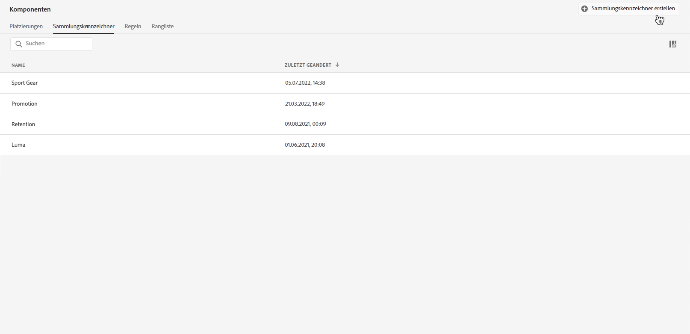
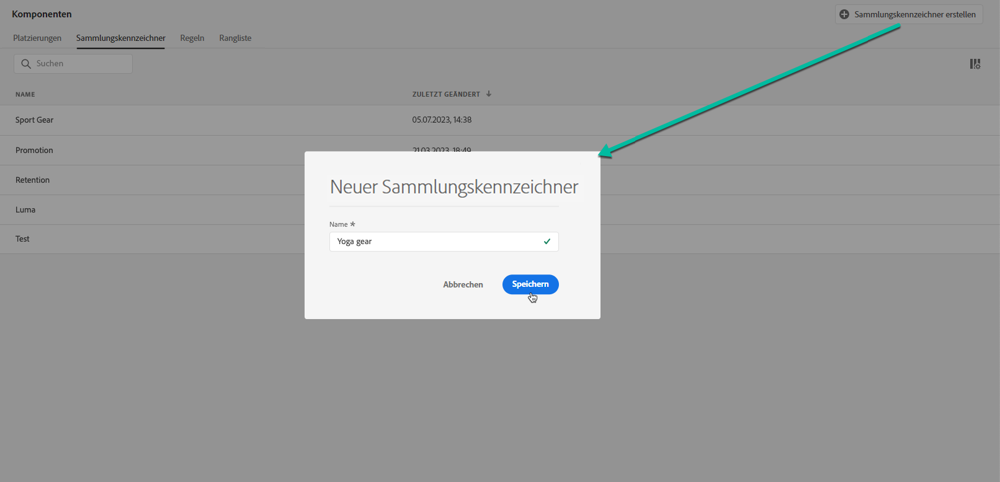
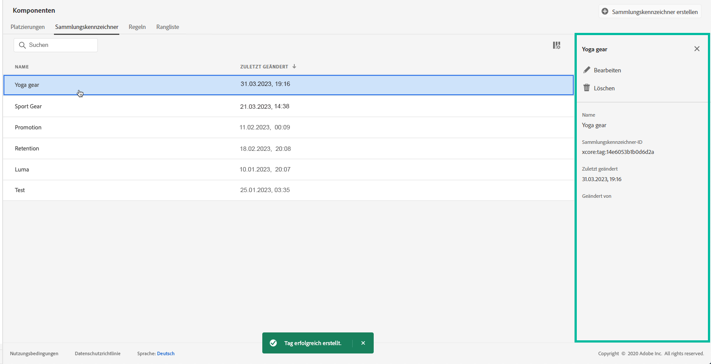

# Erstellen von Sammlungsqualifizierern {#create-tags}

>[!CONTEXTUALHELP]
>id="ajo_decisioning_offer_tags"
>title="Sammlungsqualifizierer"
>abstract="Verknüpfen Sie einen oder mehrere Sammlungsqualifizierer mit dem Angebot, um die Angebotsbibliothek besser zu organisieren und Angebote leichter zu finden. Sammlungsqualifizierer werden im Menü „Komponente“ erstellt."

Die Zuordnung von Sammlungsqualifizierern (ehemals als „Tags“ bezeichnet) zu Ihren Angeboten erleichtert deren Organisation. Beispielsweise könnten Sie Ihre Black Friday-Angebote mit dem Sammlungsqualifizierer „Black Friday“ kennzeichnen. Anschließend können Sie die Suchfunktion in der Angebotsbibliothek nutzen, um alle Angebote mit diesem Sammlungsqualifizierer einfach zu finden.

Sammlungsqualifizierer können auch dazu dienen, Angebote in Angebotssammlungen zu gruppieren. Siehe [Erstellen von Sammlungen](../offer-library/creating-collections.md).

➡️ [Entdecken Sie diese Funktion im Video](#video)

Die Liste der erstellten Sammlungsqualifizierer ist im Menü **[!UICONTROL Komponenten]** verfügbar.

Gehen Sie wie folgt vor, um einen Sammlungsqualifizierer zu erstellen:

1. Navigieren Sie zur Registerkarte **[!UICONTROL Sammlungsqualifizierer]** und klicken Sie auf **[!UICONTROL Sammlungsqualifizierer erstellen]**.

1. Geben Sie den Namen des Sammlungsqualifizierers ein und klicken Sie anschließend auf **[!UICONTROL Speichern]**.

   

1. Nachdem der Sammlungsqualifizierer erstellt wurde, wird er in der Liste angezeigt. Sie können das Angebot auswählen, um seine Eigenschaften anzuzeigen und es zu bearbeiten oder um es zu unterdrücken.

   

## Anleitungsvideo {#video}

>[!VIDEO](https://video.tv.adobe.com/v/329374?quality=12)
