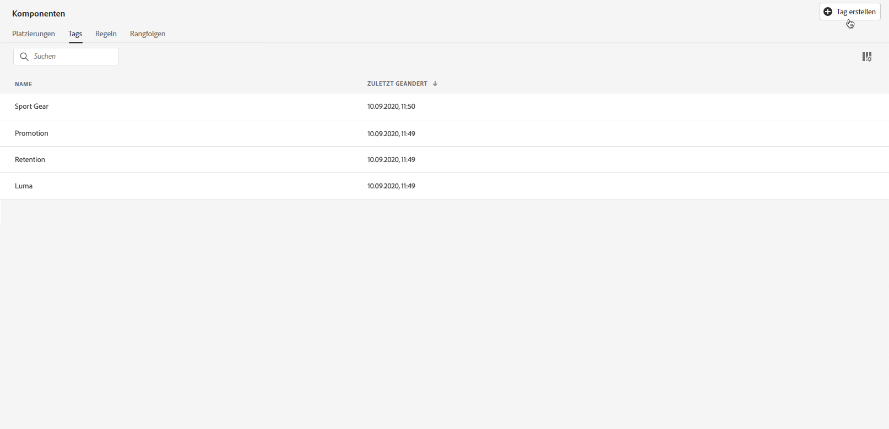
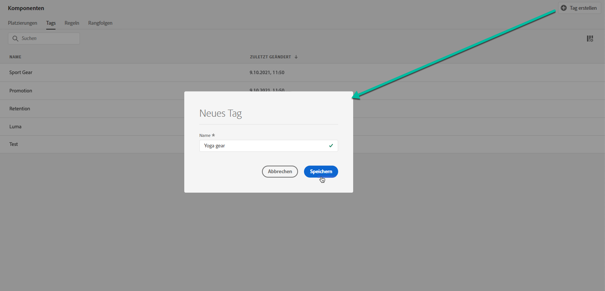
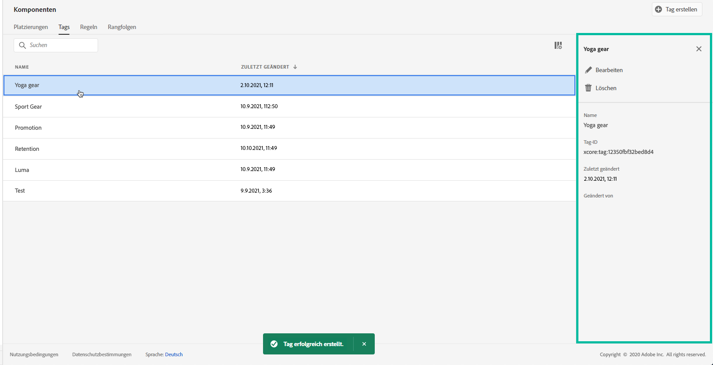

# Tags erstellen {#create-tags}

Das Zuweisen von Tags zu Ihren Angeboten erleichtert deren Organisation. Beispielsweise könnten Sie Ihre Black Friday-Angebote mit dem Tag „Black Friday“ kennzeichnen. Anschließend können Sie die Suchfunktion in der Angebotsbibliothek verwenden, um alle Angebote mit diesem Tag bequem zu finden.

Tags können auch dazu dienen, Angebote in Angebotskollektionen zu gruppieren. Siehe [Erstellen von Sammlungen](../offer-library/creating-collections.md).

➡️ [Entdecken Sie diese Funktion im Video](#video).

Die Liste der erstellten Tags ist im Menü **[!UICONTROL Komponenten]** verfügbar.

Gehen Sie wie folgt vor, um ein Tag zu erstellen:

1. Gehen Sie zur Registerkarte **[!UICONTROL Tags]** und klicken Sie auf **[!UICONTROL Tag erstellen]**.

1. Geben Sie den Namen des Tags ein und klicken Sie dann auf **[!UICONTROL Speichern]**.

   

1. Nachdem das Tag erstellt wurde, wird es in der Liste angezeigt. Sie können das Angebot auswählen, um seine Eigenschaften anzuzeigen und um es zu bearbeiten oder zu unterdrücken.

   

## Anleitungsvideo {#video}

>[!NOTE]
>
>Dieses Video bezieht sich auf den auf Adobe Experience Platform aufbauenden Anwendungsdienst Offer Decisioning. Es enthält allgemeine Leitlinien für die Verwendung von Angeboten im Kontext von Journey Optimizer.

>[!VIDEO](https://video.tv.adobe.com/v/329374?quality=12)
