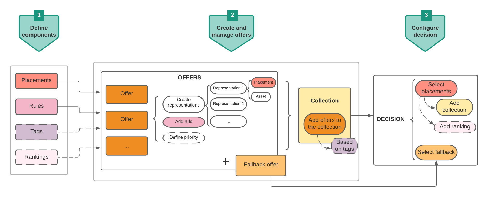

# Wichtigste Schritte bei der Angebotserstellung und -verwaltung {#key-steps-to-manage-offers}

>[!TIP]
>
>Die neue Entscheidungsfindungsfunktion in [!DNL Adobe Journey Optimizer] ist jetzt über den Code-basierten Erlebniskanal und den E-Mail-Kanal verfügbar. [Weitere Informationen](../../experience-decisioning/gs-experience-decisioning.md)

Nachfolgend werden die wichtigsten Schritte zum Erstellen, Konfigurieren und Verwalten von Angeboten sowie deren Verwendung in einer Entscheidung beschrieben.

Ein vollständiges Beispiel zur Konfiguration von Angeboten, zur Verwendung in einer Entscheidung und zur Nutzung dieser Entscheidung in einer E-Mail finden Sie auf [dieser Seite](../offers-e2e.md).

## Erstellen von Komponenten {#create-components}

Bevor Sie mit dem Erstellen von Angeboten beginnen, müssen Sie mehrere Komponenten definieren, die Sie in Ihren Angeboten verwenden wollen.

1. [Erstellen Sie Platzierungen](creating-placements.md), die Container sind, mit denen Ihre Angebote präsentiert werden. Sie können z. B. eine Platzierung erstellen, die ausschließlich Angeboten im Bildformat gewidmet ist und sich oben in Ihren Nachrichten befindet.

1. [Erstellen Sie Entscheidungsregeln](creating-decision-rules.md), die die Bedingungen für die Präsentation der Angebote festlegen.

1. [Erstellen Sie Sammlungsqualifizierer](creating-tags.md) (ehemals als „Tags“ bezeichnet), die Sie mit den Angeboten verknüpfen, damit Sie Angebote einfach organisieren und in der Bibliothek suchen können.

1. Wenn Sie Regeln definieren möchten, die bestimmen, welches Angebot für eine bestimmte Platzierung zuerst unterbreitet werden soll (anstatt die Prioritätswerte der Angebote zu berücksichtigen), können Sie [eine Ranglisteformel erstellen](../ranking/create-ranking-formulas.md).

<!--
<table style="table-layout:fixed">
<tr style="border: 0;">
<td>

<a href="../offer-library/creating-placements.md">Create placements</a>

</td>
<td>

<a href="../offer-library/creating-decision-rules.md">Create decision rules</a>

<td>

<a href="../offer-library/creating-tags.md">Create collection qualifiers</a>

</td>
<td>

<a href="../ranking/create-ranking-formulas.md">Create ranking formulas</a>

</td>
</tr>
</table>
-->

## Angebote erstellen und verwalten {#create-and-manage-offers}

1. [Erstellen Sie Angebote](creating-personalized-offers.md) und konfigurieren Sie deren Inhalt und Eigenschaften. Beim Personalisieren von Angebotsinhalten (Darstellungen) werden nur bestimmte Funktionen unterstützt - siehe [Unterstützte Funktionen im Personalisierungseditor](personalization-editor-supported-functions.md).

1. [Erstellen Sie Fallback-Angebote](creating-fallback-offers.md), die angezeigt werden, wenn Kunden für keines der ausgewählten Angebote geeignet sind.

1. [Erstellen Sie eine Sammlung](creating-collections.md), um die von Ihnen erstellten personalisierten Angebote zusammenzufassen und in einer Entscheidung zu verwenden.

<!--
<table style="table-layout:fixed">
<tr style="border: 0;">
<td>

<a href="../offer-library/creating-personalized-offers.md">Create offers</a>

</td>
<td>

<a href="../offer-library/creating-fallback-offers.md">Create fallback offers</a>

</td>
<td>

<a href="../offer-library/creating-collections.md">Create collections</a>

</td>
</tr>
</table>
-->

## Entscheidungen erstellen und konfigurieren {#create-and-configure-decisions}

1. [Erstellen Sie eine Entscheidung](../offer-activities/create-offer-activities.md), die Platzierungen mit den personalisierten Angeboten und den Fallback-Angeboten kombiniert. Diese Kombination wird von der Offer Decisioning-Engine verwendet, um das beste Angebot für ein bestimmtes Profil zu finden.

1. [Konfigurieren Sie die Entscheidung](../offer-activities/create-offer-activities.md#add-decision-scopes). Wählen Sie dazu die Platzierungen aus und wählen Sie für jede Platzierung eine Sammlung und ein Fallback-Angebot aus.

1. Bei Bedarf können Sie einer Platzierung eine [Rangfolgenformel](../offer-activities/configure-offer-selection.md#assign-ranking-formula) oder eine [KI-Rangfolge](../offer-activities/configure-offer-selection.md#use-ranking-strategy) zuweisen, wenn Sie eine Entscheidung konfigurieren.

<!--
<table style="table-layout:fixed">
<tr style="border: 0;">
<td>

<a href="../offer-activities/create-offer-activities.md">Create decisions</a>

</td>
<td>

<a href="../offer-activities/create-offer-activities.md#add-offers">Configure decisions</a>

</td>
<td>

<a href="../offer-activities/configure-offer-selection.md#assign-ranking-formula">Assign ranking</a>

</td>
</tr>
</table>
-->