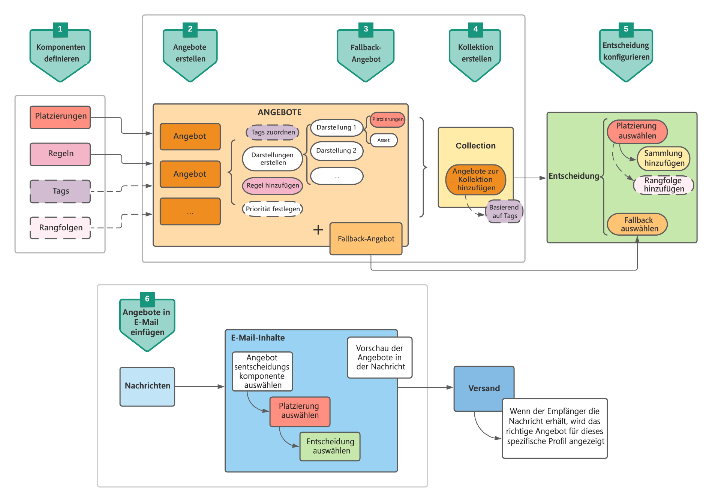
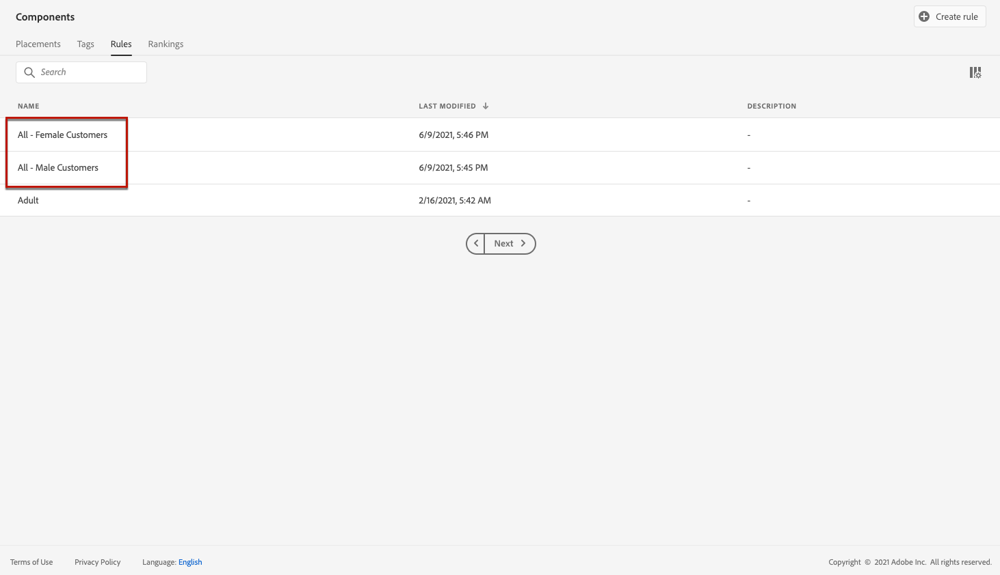
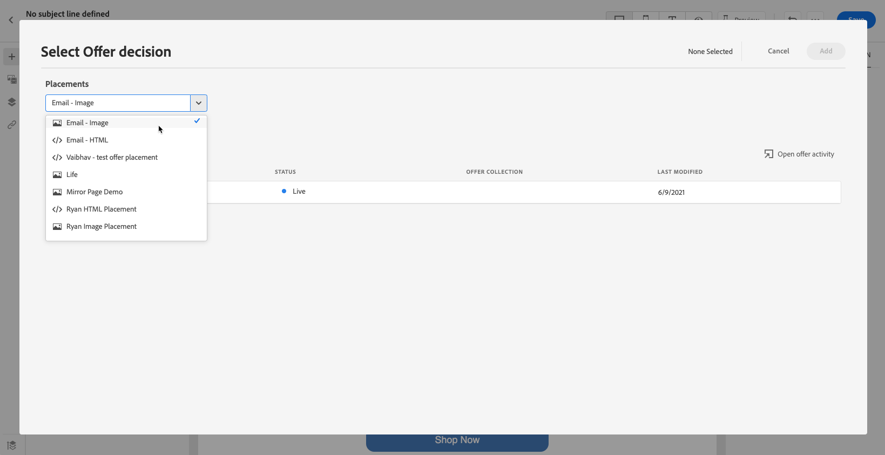

# Anwendungsfall: Personalisierte Angebote für deren Verwendung in einer E-Mail konfigurieren {#configure-add-personalized-offers-email}

In diesem Abschnitt wird ein durchgehendes Beispiel vorgestellt, in dem anhand einer zuvor erstellten Entscheidung beschrieben wird, wie Angebote konfiguriert und in einer E-Mail verwendet werden können.

## Wichtigste Schritte

Die wichtigsten Schritte zum Konfigurieren von Angeboten, zum Einbeziehen in eine Entscheidung und zur Nutzung dieser Entscheidung in einer E-Mail sind unten aufgeführt:

1. Bevor Sie Angebote erstellen, definieren Sie [Ihre Komponenten](#define-components)

   * Platzierungen erstellen
   * Entscheidungsregeln erstellen
   * Tags erstellen
   * Rang erstellen (optional)

1. [Angebote konfigurieren](#configure-offers)

   * Angebote erstellen
   * Für jedes Angebot:

      * Erstellen Sie Darstellungen und wählen Sie eine Platzierung und ein Asset für jede Darstellung aus.
      * Regel für jedes Angebot hinzufügen
      * Definieren einer Priorität für jedes Angebot

1. [Fallback-Angebot erstellen](#create-fallback)

1. [Erstellen Sie eine ](#create-collection) Kollektion, um die von Ihnen erstellten personalisierten Angebote einzubeziehen.

1. [Entscheidung konfigurieren](#configure-decision)

   * Entscheidung erstellen
   * Auswählen der von Ihnen erstellten Platzierungen
   * Wählen Sie für jede Platzierung die Sammlung aus.
   * Wählen Sie für jede Platzierung einen Rang aus (optional).
   * Fallback auswählen

1. [Entscheidung in eine E-Mail einfügen](#insert-decision-in-email)

   * Wählen Sie eine Platzierung aus, die den anzuzeigenden Angeboten entspricht
   * Wählen Sie die Entscheidung aus den Elementen aus, die mit der ausgewählten Platzierung kompatibel sind
   * Angebotsvorschau

Der gesamte Entscheidungsprozess zur Verwendung von Angeboten in einer E-Mail kann wie folgt beschrieben werden:

## Definieren der Komponenten {#define-components}

Bevor Sie mit der Erstellung von Angeboten beginnen, müssen Sie mehrere Komponenten definieren, die Sie in Ihren Angeboten verwenden werden.

Sie finden sie im Menü **[!UICONTROL Decision Management]** > **[!UICONTROL Komponenten]**.

1. Erstellen Sie zunächst **Platzierungen** für Ihre Angebote.

   Mithilfe dieser Platzierungen legen Sie fest, wo das resultierende Angebot bei der Definition Ihrer Angebotsentscheidung erscheinen soll.

   Erstellen Sie in diesem Beispiel drei Platzierungen mit den folgenden Kanälen und Inhaltstypen:

   * *Web - Image*
   * *E-Mail - Bild*
   * *Nicht digital - Text*

   

   Die detaillierten Schritte zum Erstellen von Platzierungen werden in [diesem Abschnitt](../../using/offers/offer-library/creating-placements.md) beschrieben.

1. Erstellen Sie **Entscheidungsregeln**.

   Entscheidungsregeln bieten einem Profil in der Adobe Experience Platform das beste Angebot.

   Konfigurieren Sie zwei einfache Regeln mithilfe des Attributs **[!UICONTROL XDM Individual Profile > Person > Geschlecht]** :

   * *Weibliche Kunden*
   * *Männliche Kunden*

   

   Die detaillierten Schritte zum Erstellen von Regeln werden in [diesem Abschnitt](../../using/offers/offer-library/creating-decision-rules.md) beschrieben.

1. Sie können auch ein **Tag** erstellen.

   Anschließend können Sie es mit Ihren Angeboten verknüpfen und dieses Tag verwenden, um Ihre Angebote in einer Kollektion zu gruppieren.

   Erstellen Sie in diesem Beispiel das Tag *Yoga* .

   

   Die detaillierten Schritte zum Erstellen von Tags werden in [diesem Abschnitt](../../using/offers/offer-library/creating-tags.md) beschrieben.

1. Wenn Sie Regeln definieren möchten, die bestimmen, welches Angebot für eine bestimmte Platzierung zuerst unterbreitet werden soll (anstatt die Prioritätswerte der Angebote zu berücksichtigen), können Sie eine **Rangformel** erstellen.

   Die detaillierten Schritte zum Erstellen von Ranking-Formeln werden in [diesem Abschnitt](../../using/offers/offer-library/create-ranking-formulas.md#create-ranking-formula) beschrieben.

   >[!NOTE]
   >
   >In diesem Beispiel verwenden wir nur die Prioritätswerte. Erfahren Sie mehr über [Eignungsregeln und Einschränkungen](../../using/offers/offer-library/creating-personalized-offers.md#eligibility).

## Angebote konfigurieren {#configure-offers}

Jetzt können Sie Ihre Angebote erstellen und konfigurieren. In diesem Beispiel erstellen Sie vier Angebote, die Sie je nach Profil anzeigen möchten.

1. Erstellen eines Angebots. Weiterführende Informationen finden Sie in diesem [Abschnitt](../../using/offers/offer-library/creating-personalized-offers.md#create-offer).

1. Erstellen Sie in diesem Angebot drei Darstellungen. Jede Darstellung muss eine Kombination aus einer zuvor erstellten Platzierung und einem Asset sein:

   * Eins, das der Platzierung *Web - Image* entspricht
   * Eins, das der Platzierung *E-Mail - Bild* entspricht
   * Eins, das der Platzierung *Nicht digital - Text* entspricht

   >[!NOTE]
   >
   >Ein Angebot kann an verschiedenen Stellen in einer Nachricht angezeigt werden, um mehr Möglichkeiten zur Nutzung des Angebots in verschiedenen Platzierungskontexten zu schaffen.

   Weitere Informationen zu Darstellungen finden Sie in [diesem Abschnitt](../../using/offers/offer-library/creating-personalized-offers.md#representations).

1. Wählen Sie ein passendes Bild für die ersten beiden Platzierungen aus. Geben Sie benutzerdefinierten Text für die Platzierung *Nicht digital - Text* ein.

   

1. Wählen Sie im Abschnitt **[!UICONTROL Angebotsberechtigungen]** die Option **[!UICONTROL Nach definierter Entscheidungsregel]** aus und ziehen Sie die Regel Ihrer Wahl in den Arbeitsbereich.

   

1. Füllen Sie die Felder **[!UICONTROL Priorität]** aus. Fügen Sie in diesem Beispiel *25* hinzu.

1. Überprüfen Sie Ihr Angebot und klicken Sie dann auf **[!UICONTROL Speichern und genehmigen]**.

   

1. Erstellen Sie in diesem Beispiel drei weitere Angebote mit denselben Darstellungen, aber unterschiedlichen Assets. Weisen Sie ihnen unterschiedliche Regeln und Prioritäten zu, z. B.:

   * Erstes Angebot - Entscheidungsregel: *Weibliche Kunden*, Priorität: *25*
   * Zweites Angebot - Entscheidungsregel: *Weibliche Kunden*, Priorität: *15*
   * Drittes Angebot - Entscheidungsregel: *Männliche Kunden*, Priorität: *25*
   * Viertes Angebot - Entscheidungsregel: *Männliche Kunden*, Priorität: *15*

   

Die detaillierten Schritte zum Erstellen und Konfigurieren von Angeboten werden in [diesem Abschnitt](../../using/offers/offer-library/creating-personalized-offers.md) beschrieben.

## Fallback-Angebot erstellen {#create-fallback}

1. Fallback-Angebot erstellen.

1. Definieren Sie dieselben Darstellungen wie für die Angebote mit den entsprechenden Assets (diese sollten sich von den in Ihren Angeboten verwendeten unterscheiden).

   Jede Darstellung muss eine Kombination aus einer zuvor erstellten Platzierung und einem Asset sein:

   * Eins, das der Platzierung *Web - Image* entspricht
   * Eins, das der Platzierung *E-Mail - Bild* entspricht
   * Eins, das der Platzierung *Nicht digital - Text* entspricht

   

1. Überprüfen Sie Ihr Fallback-Angebot und klicken Sie dann auf **[!UICONTROL Speichern und genehmigen]**.

Ihr Fallback-Angebot kann jetzt in einer Entscheidung verwendet werden.

Die detaillierten Schritte zum Erstellen und Konfigurieren eines Fallback-Angebots werden in [diesem Abschnitt](../../using/offers/offer-library/creating-fallback-offers.md) beschrieben.

## Kollektion erstellen {#create-collection}

Bei der Konfiguration der Entscheidung müssen Sie Ihre personalisierten Angebote als Teil einer Kollektion hinzufügen.

1. Um den Entscheidungsprozess zu beschleunigen, erstellen Sie eine dynamische Sammlung.

1. Verwenden Sie das Tag *Yoga* , um die vier zuvor erstellten personalisierten Angebote auszuwählen.

   

Die detaillierten Schritte zum Erstellen einer Sammlung werden in [diesem Abschnitt](../../using/offers/offer-library/creating-collections.md) beschrieben.

## Entscheidung {#configure-decision} konfigurieren

Jetzt müssen Sie eine Entscheidung erstellen, die Platzierungen mit den personalisierten Angeboten und dem soeben erstellten Fallback-Angebot kombiniert.

Diese Kombination wird vom Offer decisioning-Modul verwendet, um das beste Angebot für ein bestimmtes Profil zu finden: In diesem Beispiel basiert sie auf der Priorität und Entscheidungsregel, die Sie jedem Angebot zugewiesen haben.

Gehen Sie wie folgt vor, um eine Angebotsentscheidung zu erstellen und zu konfigurieren:

1. Entscheidung erstellen. Weiterführende Informationen finden Sie in diesem [Abschnitt](../../using/offers/offer-activities/create-offer-activities.md#create-activity).

1. Wählen Sie die Platzierungen *Web - Image*, *E-Mail - Bild* und *Nicht digital - Text* aus.

   

1. Fügen Sie für jede Platzierung die von Ihnen erstellte Sammlung hinzu.

   

1. Wenn Sie beim [Erstellen Ihrer Komponenten](#define-components) einen Rang definiert haben, können Sie ihn einer Platzierung in der Entscheidung zuweisen. Wenn mehrere Angebote für diese Platzierung geeignet sind, wird in der Entscheidung anhand dieser Formel berechnet, welches Angebot zuerst bereitgestellt werden soll.

   Die detaillierten Schritte zum Zuweisen einer Rangformel zu einer Platzierung werden in [diesem Abschnitt](../../using/offers/offer-activities/configure-offer-selection.md#assign-ranking-formula) beschrieben.

1. Wählen Sie das von Ihnen erstellte Fallback-Angebot aus. Es wird als verfügbares Fallback-Angebot für die drei ausgewählten Platzierungen angezeigt.

   

1. Überprüfen Sie Ihre Entscheidung und klicken Sie dann auf **[!UICONTROL Speichern und genehmigen]**.

   

Ihre Entscheidung kann jetzt für optimierte und personalisierte Angebote verwendet werden.

Die detaillierten Schritte zum Erstellen und Konfigurieren einer Entscheidung werden in [diesem Abschnitt](../../using/offers/offer-activities/create-offer-activities.md) beschrieben.

## Einfügen der Entscheidung in eine E-Mail {#insert-decision-in-email}

Nachdem Ihre Entscheidung live ist, können Sie sie in eine E-Mail einfügen. Gehen Sie dazu wie folgt vor:

1. Erstellen Sie Ihre E-Mail und öffnen Sie dann den [Email Designer](../../using/design-emails.md) , um den Inhalt zu konfigurieren.

1. Fügen Sie in der linken Palette eine Strukturkomponente hinzu.

1. Fügen Sie eine Inhaltskomponente **[!UICONTROL Angebotsentscheidung]** hinzu. Erfahren Sie, wie Sie Inhaltskomponenten in [diesem Abschnitt](../../using/content-components.md) verwenden.

   

1. Wählen Sie es aus. Klicken Sie in der rechten Palette auf **[!UICONTROL Angebotsentscheidung auswählen]** , um eine Entscheidung hinzuzufügen.

   

1. Wählen Sie die Platzierung aus, die den Angeboten entspricht, die Sie anzeigen möchten, aus der Dropdownliste **[!UICONTROL Platzierungen]** .

   In diesem Fall ist von den Platzierungen, die Sie im Rahmen dieses Beispiels zuvor erstellt haben, nur die Platzierung **E-Mail - Bild** verfügbar, da Sie die Entscheidung in einer E-Mail verwenden möchten. Erfahren Sie mehr über [Erstellen von Platzierungen](../../using/offers/offer-library/creating-placements.md).

   

1. Entscheidungen, die mit der Platzierung **E-Mail - Bild** übereinstimmen, werden angezeigt. Wählen Sie die Entscheidung aus, die in der Inhaltskomponente verwendet werden soll, und klicken Sie dann auf **[!UICONTROL Hinzufügen]**.

   

   >[!NOTE]
   >
   >In der Liste werden nur Entscheidungen angezeigt, die mit der ausgewählten Platzierung kompatibel sind.

Jetzt werden alle personalisierten Angebote und das Fallback-Angebot in Email Designer visualisiert.

Verwenden Sie den Abschnitt **[!UICONTROL Angebote]** oder die Pfeile der Inhaltskomponenten (Rechts- und Linkspfeile), um Daten zu durchsuchen. Sie können die verschiedenen Angebote, die Teil der Entscheidung sind, auch mit einem Kundenprofil anzeigen. Weiterführende Informationen finden Sie in diesem [Abschnitt](../../using/deliver-personalized-offers.md#preview-offers-in-email).

Nachdem Sie Ihre Änderungen gespeichert und die Nachricht veröffentlicht haben, können Ihre Angebote beim Versand der Nachricht im Rahmen einer Journey den entsprechenden Profilen angezeigt werden.

**Verwandte Themen:**

* Erfahren Sie, wie Sie die Nachrichtenvorschau in [diesem Abschnitt](../../using/preview.md#preview-your-messages) überprüfen.

* Erfahren Sie, wie Sie Nachrichten in [diesem Abschnitt](../../using/publish-manage-message.md) veröffentlichen.

* In [diesem Abschnitt](../building-journeys/journey.md) erfahren Sie, wie Nachrichten von einem oder mehreren Journey ausgelöst werden.

