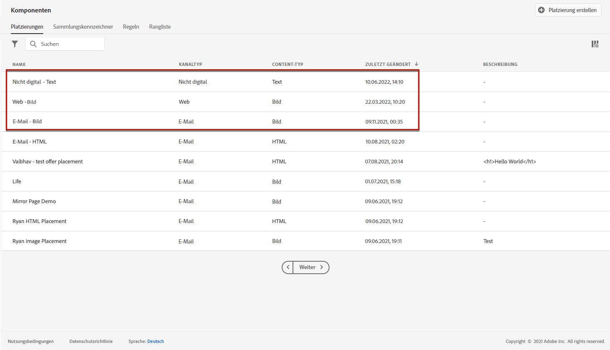
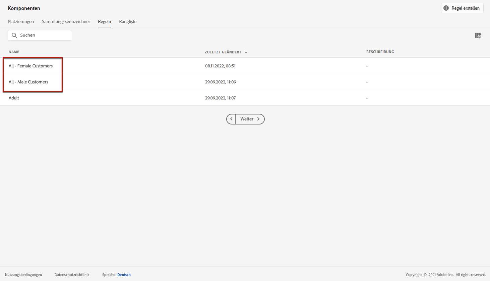
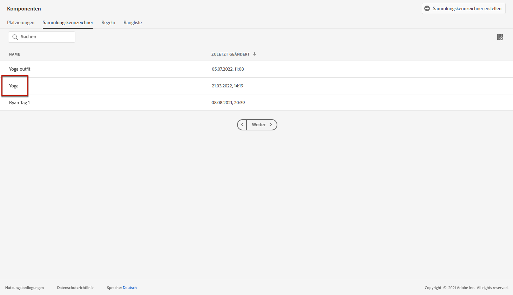
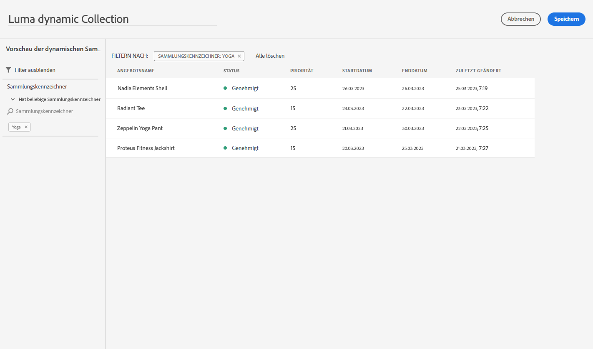

# Anwendungsfall: Personalisierte Angebote für deren Verwendung in einer E-Mail konfigurieren {#configure-add-personalized-offers-email}

In diesem Abschnitt wird ein durchgehendes Beispiel vorgestellt, in dem anhand einer zuvor erstellten Entscheidung beschrieben wird, wie Angebote konfiguriert und in einer E-Mail verwendet werden können.

## Wichtigste Schritte {#main-steps}

Die wichtigsten Schritte zum Konfigurieren von Angeboten, zum Einbeziehen in eine Entscheidung und zur Nutzung dieser Entscheidung in einer E-Mail sind unten aufgeführt:

1. Vor der Erstellung von Angeboten [Komponenten definieren](#define-components)

   * Platzierungen erstellen
   * Entscheidungsregeln erstellen
   * Tags erstellen
   * Rang erstellen (optional)

1. [Angebote konfigurieren](#configure-offers)

   * Angebote erstellen
   * Für jedes Angebot:

      * Erstellen Sie Darstellungen und wählen Sie eine Platzierung und ein Asset für jede Darstellung aus.
      * Regel für jedes Angebot hinzufügen
      * Definieren einer Priorität für jedes Angebot

1. [Fallback-Angebot erstellen](#create-fallback)

1. [Kollektion erstellen](#create-collection) , um die von Ihnen erstellten personalisierten Angebote einzubeziehen

1. [Entscheidung konfigurieren](#configure-decision)

   * Entscheidung erstellen
   * Auswählen der von Ihnen erstellten Platzierungen
   * Wählen Sie für jede Platzierung die Sammlung aus.
   * Wählen Sie für jede Platzierung einen Rang aus (optional).
   * Fallback auswählen

1. [Entscheidung in eine E-Mail einfügen](#insert-decision-in-email)

   * Wählen Sie eine Platzierung aus, die den anzuzeigenden Angeboten entspricht
   * Wählen Sie die Entscheidung aus den Elementen aus, die mit der ausgewählten Platzierung kompatibel sind
   * Angebotsvorschau

Der gesamte Entscheidungsprozess zur Verwendung von Angeboten in einer E-Mail kann wie folgt beschrieben werden:

## Definieren der Komponenten {#define-components}

Bevor Sie mit der Erstellung von Angeboten beginnen, müssen Sie mehrere Komponenten definieren, die Sie in Ihren Angeboten verwenden werden.

Sie finden sie unter dem **[!UICONTROL Decision Management]** > **[!UICONTROL Components menu]**.

1. Erstellen Sie zunächst **Platzierungen** für Ihre Angebote.

   Mithilfe dieser Platzierungen legen Sie fest, wo das resultierende Angebot bei der Definition Ihrer Angebotsentscheidung erscheinen soll.

   Erstellen Sie in diesem Beispiel drei Platzierungen mit den folgenden Kanälen und Inhaltstypen:

   * *Web - Image*
   * *E-Mail - Bild*
   * *Nicht digital - Text*

   

   Die detaillierten Schritte zum Erstellen von Platzierungen werden unter [diesem Abschnitt](../../using/offers/offer-library/creating-placements.md).

1. Erstellen **Entscheidungsregeln**.

   Entscheidungsregeln bieten einem Profil in Adobe Experience Platform das beste Angebot.

   Konfigurieren Sie zwei einfache Regeln mithilfe des **[!UICONTROL XDM Individual Profile > Person > Gender]** Attribut:

   * *Weibliche Kunden*
   * *Männliche Kunden*

   

   Die detaillierten Schritte zum Erstellen von Regeln werden unter [diesem Abschnitt](../../using/offers/offer-library/creating-decision-rules.md).

1. Sie können auch eine **Tag**.

   Anschließend können Sie es mit Ihren Angeboten verknüpfen und dieses Tag verwenden, um Ihre Angebote in einer Kollektion zu gruppieren.

   Erstellen Sie in diesem Beispiel die *Yoga* -Tag.

   

   Die detaillierten Schritte zum Erstellen von Tags werden unter [diesem Abschnitt](../../using/offers/offer-library/creating-tags.md).

1. Wenn Sie Regeln definieren möchten, die bestimmen, welches Angebot für eine bestimmte Platzierung zuerst unterbreitet werden soll (anstatt die Prioritätswerte der Angebote zu berücksichtigen), können Sie eine **Rangformel**.

   Die detaillierten Schritte zum Erstellen von Ranking-Formeln werden unter [diesem Abschnitt](../../using/offers/ranking/create-ranking-formulas.md#create-ranking-formula).

   >[!NOTE]
   >
   >In diesem Beispiel verwenden wir nur die Prioritätswerte. Weitere Informationen finden Sie unter [Eignungsregeln und Einschränkungen](../../using/offers/offer-library/creating-personalized-offers.md#eligibility).

## Angebote konfigurieren {#configure-offers}

Jetzt können Sie Ihre Angebote erstellen und konfigurieren. In diesem Beispiel erstellen Sie vier Angebote, die Sie je nach Profil anzeigen möchten.

1. Erstellen Sie ein Angebot. Weitere Informationen finden Sie unter [diesem Abschnitt](../../using/offers/offer-library/creating-personalized-offers.md#create-offer).

1. Erstellen Sie in diesem Angebot drei Darstellungen. Jede Darstellung muss eine Kombination aus einer zuvor erstellten Platzierung und einem Asset sein:

   * Eine entspricht dem *Web - Image* placement
   * Eine entspricht dem *E-Mail - Bild* placement
   * Eine entspricht dem *Nicht digital - Text* placement

   >[!NOTE]
   >
   >Ein Angebot kann an verschiedenen Stellen in einer Nachricht angezeigt werden, um mehr Möglichkeiten zur Nutzung des Angebots in verschiedenen Platzierungskontexten zu schaffen.

   Weitere Informationen zu Darstellungen finden Sie in [diesem Abschnitt](../../using/offers/offer-library/creating-personalized-offers.md#representations).

1. Wählen Sie ein passendes Bild für die ersten beiden Platzierungen aus. Geben Sie benutzerdefinierten Text für die *Nicht digital - Text* Platzierung.

   

1. Im **[!UICONTROL Offer eligibility]** Bereich, wählen Sie **[!UICONTROL By defined decision rule]** und ziehen Sie die Regel Ihrer Wahl per Drag-and-Drop.

   

1. Füllen Sie die **[!UICONTROL Priority]**. Fügen Sie in diesem Beispiel *25*.

1. Überprüfen Sie Ihr Angebot und klicken Sie auf **[!UICONTROL Save and approve]**.

   

1. Erstellen Sie in diesem Beispiel drei weitere Angebote mit denselben Darstellungen, aber unterschiedlichen Assets. Weisen Sie ihnen unterschiedliche Regeln und Prioritäten zu, z. B.:

   * Erstes Angebot - Entscheidungsregel: *Weibliche Kunden*, Priorität: *25*
   * Zweites Angebot - Entscheidungsregel: *Weibliche Kunden*, Priorität: *15*
   * Drittes Angebot - Entscheidungsregel: *Männliche Kunden*, Priorität: *25*
   * Viertes Angebot - Entscheidungsregel: *Männliche Kunden*, Priorität: *15*

   

Die detaillierten Schritte zum Erstellen und Konfigurieren von Angeboten werden im Abschnitt [diesem Abschnitt](../../using/offers/offer-library/creating-personalized-offers.md).

## Fallback-Angebot erstellen {#create-fallback}

1. Erstellen Sie ein Fallback-Angebot.

1. Definieren Sie dieselben Darstellungen wie für die Angebote mit den entsprechenden Assets (diese sollten sich von den in Ihren Angeboten verwendeten unterscheiden).

   Jede Darstellung muss eine Kombination aus einer zuvor erstellten Platzierung und einem Asset sein:

   * Eine entspricht dem *Web - Image* placement
   * Eine entspricht dem *E-Mail - Bild* placement
   * Eine entspricht dem *Nicht digital - Text* placement

   

1. Überprüfen Sie Ihr Fallback-Angebot und klicken Sie auf **[!UICONTROL Save and approve]**.

Ihr Fallback-Angebot kann jetzt in einer Entscheidung verwendet werden.

Die detaillierten Schritte zum Erstellen und Konfigurieren eines Fallback-Angebots werden im Abschnitt [diesem Abschnitt](../../using/offers/offer-library/creating-fallback-offers.md).

## Kollektion erstellen {#create-collection}

Bei der Konfiguration der Entscheidung müssen Sie Ihre personalisierten Angebote als Teil einer Kollektion hinzufügen.

1. Um den Entscheidungsprozess zu beschleunigen, erstellen Sie eine dynamische Sammlung.

1. Verwenden Sie die *Yoga* -Tag, um die vier personalisierten Angebote auszuwählen, die Sie zuvor erstellt haben.

   

Die detaillierten Schritte zum Erstellen einer Sammlung werden unter [diesem Abschnitt](../../using/offers/offer-library/creating-collections.md).

## Entscheidung konfigurieren {#configure-decision}

Jetzt müssen Sie eine Entscheidung erstellen, die Platzierungen mit den personalisierten Angeboten und dem soeben erstellten Fallback-Angebot kombiniert.

Diese Kombination wird von der Decisioning-Engine verwendet, um das beste Angebot für ein bestimmtes Profil zu finden: In diesem Beispiel basiert sie auf der Priorität und Entscheidungsregel, die Sie jedem Angebot zugewiesen haben.

Gehen Sie wie folgt vor, um eine Angebotsentscheidung zu erstellen und zu konfigurieren:

1. Erstellen Sie eine Entscheidung. Weitere Informationen finden Sie unter [diesem Abschnitt](../../using/offers/offer-activities/create-offer-activities.md#create-activity).

1. Wählen Sie die *Web - Image*, *E-Mail - Bild* und *Nicht digital - Text* Platzierungen.

   

1. Fügen Sie für jede Platzierung die von Ihnen erstellte Sammlung hinzu.

   

1. Wenn Sie eine Rangfolge definiert haben, wenn Sie [Erstellen von Komponenten](#define-components), können Sie sie einer Platzierung in der Entscheidung zuweisen. Wenn mehrere Angebote berechtigt sind, in dieser Platzierung unterbreitet zu werden, berechnet die Entscheidung anhand dieser Formel, welches Angebot zuerst bereitgestellt werden soll.

   Die detaillierten Schritte zum Zuweisen einer Rangformel zu einer Platzierung werden im Abschnitt [diesem Abschnitt](../../using/offers/offer-activities/configure-offer-selection.md#assign-ranking-formula).

1. Wählen Sie das von Ihnen erstellte Fallback-Angebot aus. Es wird als verfügbares Fallback-Angebot für die drei ausgewählten Platzierungen angezeigt.

   

1. Überprüfen Sie Ihre Entscheidung und klicken Sie auf **[!UICONTROL Save and approve]**.

   

Ihre Entscheidung kann jetzt für optimierte und personalisierte Angebote verwendet werden.

Die detaillierten Schritte zum Erstellen und Konfigurieren einer Entscheidung werden unter [diesem Abschnitt](../../using/offers/offer-activities/create-offer-activities.md).

## Entscheidung in eine E-Mail einfügen {#insert-decision-in-email}

Nachdem Ihre Entscheidung live ist, können Sie sie in eine E-Mail einfügen. Gehen Sie dazu wie im Abschnitt [diese Seite](../../using/email/add-offers-email.md).

