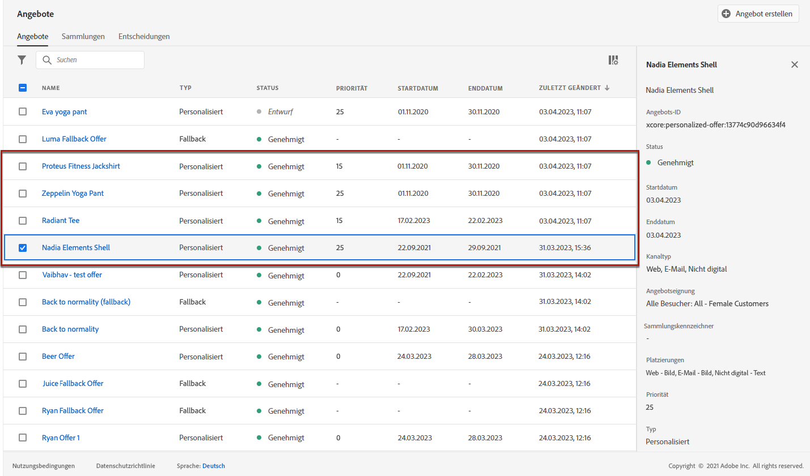
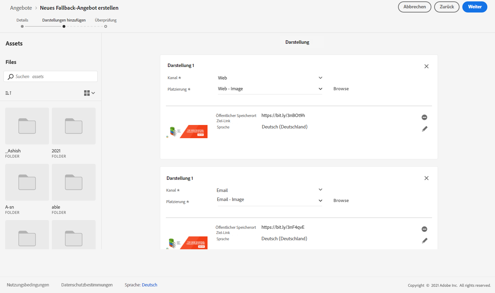
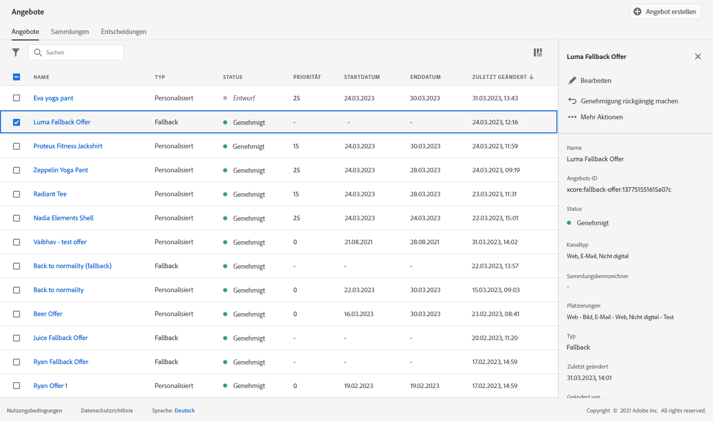
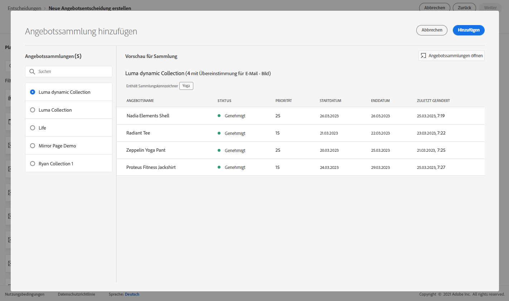

# Anwendungsfall: Personalisierte Angebote für deren Verwendung in einer E-Mail konfigurieren {#configure-add-personalized-offers-email}

In diesem Abschnitt wird ein Beispiel vorgestellt, das Ihnen zeigt, wie Sie, basierend auf einer zuvor erstellten Entscheidung, Angebote konfigurieren und in einer E-Mail verwenden können.

## Wichtigste Schritte {#main-steps}

Die wichtigsten Schritte zum Konfigurieren von Angeboten, zum Einbeziehen in eine Entscheidung und zur Nutzung dieser Entscheidung in einer E-Mail sind unten aufgeführt:

1. Bevor Sie Angebote erstellen, [definieren Sie Ihre Komponenten](#define-components).

   * Erstellen von Platzierungen
   * Erstellen von Entscheidungsregeln
   * Erstellen von Sammlungsqualifizierern (ehemals als „Tags“ bezeichnet)
   * Ranking erstellen (optional)

1. [Angebote konfigurieren](#configure-offers)

   * Angebote erstellen
   * Für jedes Angebot:

      * Erstellen Sie Darstellungen und wählen Sie eine Platzierung und ein Asset für jede Darstellung aus.
      * Fügen Sie für jedes Angebot eine Regel hinzu.
      * Definieren Sie für jedes Angebot eine Priorität.

1. [Erstellen eines Fallback-Angebotes](#create-fallback)

1. [Erstellen Sie eine Sammlung](#create-collection), in der die von Ihnen erstellten personalisierten Angebote zusammengefasst werden.

1. [Konfigurieren der Entscheidung](#configure-decision)

   * Erstellen einer Entscheidung
   * Wählen sie die von Ihnen erstellten Platzierungen aus.
   * Wählen Sie für jede Platzierung die Sammlung aus.
   * Wählen Sie für jede Platzierung ein Ranking aus (optional).

   * Wählen Sie das Fallback-Angebot aus.

1. [Fügen Sie die Entscheidung in eine E-Mail ein.](#insert-decision-in-email)

   * Wählen Sie eine Platzierung aus, die den anzuzeigenden Angeboten entspricht.
   * Wählen Sie die Entscheidung aus den Elementen aus, die mit der ausgewählten Platzierung kompatibel sind.
   * Zeigen Sie Ihre Angebote in der Vorschau an.

Der gesamte Entscheidungs-Management-Prozess zur Verwendung von Angeboten in einer E-Mail kann wie folgt beschrieben werden:

## Definieren der Komponenten {#define-components}

Bevor Sie mit dem Erstellen von Angeboten beginnen, müssen Sie mehrere Komponenten definieren, die Sie in Ihren Angeboten verwenden wollen.

Sie finden sie im Menü **[!UICONTROL Entscheidungs-Management]** > **[!UICONTROL Komponenten]**.

1. Erstellen Sie zunächst **Platzierungen** für Ihre Angebote.

   Mithilfe dieser Platzierungen legen Sie bei der Definition Ihrer Angebotsentscheidung fest, wo das resultierende Angebot erscheinen soll.

   Erstellen Sie in diesem Beispiel drei Platzierungen mit den folgenden Kanal- und Inhaltstypen:

   * *Web – Bild*
   * *E-Mail – Bild*
   * *Nicht digital – Text*

   

   Die detaillierten Schritte zum Erstellen von Platzierungen werden in [diesem Abschnitt](../../using/offers/offer-library/creating-placements.md) beschrieben.

1. Erstellen Sie **Entscheidungsregeln**.

   Entscheidungsregeln liefern einem Profil in Adobe Experience Platform das beste Angebot.

   Konfigurieren Sie zwei einfache Regeln mithilfe des Attributs **[!UICONTROL Individuelles XDM-Profil > Person > Geschlecht]**:

   * *Weibliche Kunden*
   * *Männliche Kunden*

   

   Die detaillierten Schritte zum Erstellen von Regeln werden in [diesem Abschnitt](../../using/offers/offer-library/creating-decision-rules.md) beschrieben.

1. Sie können auch einen **Sammlungsqualifizierer** erstellen.

   Anschließend können Sie diesen Sammlungsqualifizierer mit Ihren Angeboten verknüpfen und ihn verwenden, um Ihre Angebote in einer Sammlung zusammenzufassen.

   Erstellen Sie in diesem Beispiel den Sammlungsqualifizierer *Yoga*.

   

   Die detaillierten Schritte zum Erstellen von Sammlungsqualifizierern werden in [diesem Abschnitt](../../using/offers/offer-library/creating-tags.md) beschrieben.

1. Wenn Sie Regeln definieren möchten, die bestimmen, welches Angebot für eine bestimmte Platzierung zuerst unterbreitet wird (anstatt die Prioritätswerte der Angebote zu berücksichtigen), können Sie eine **Rangfolgenformel** erstellen.

   Die detaillierten Schritte zum Erstellen von Rangfolgenformeln werden in [diesem Abschnitt](../../using/offers/ranking/create-ranking-formulas.md#create-ranking-formula) beschrieben.

   >[!NOTE]
   >
   >In diesem Beispiel verwenden wir nur die Prioritätswerte. Weitere Informationen zu [Eignungsregeln und Einschränkungen](../../using/offers/offer-library/creating-personalized-offers.md#eligibility)

## Angebote konfigurieren {#configure-offers}

Jetzt können Sie Ihre Angebote erstellen und konfigurieren. In diesem Beispiel erstellen Sie vier Angebote, die Sie je nach Profil anzeigen möchten.

1. Erstellen Sie ein Angebot. Weiterführende Informationen finden Sie in diesem [Abschnitt](../../using/offers/offer-library/creating-personalized-offers.md#create-offer).

1. Erstellen Sie in diesem Angebot drei Darstellungen. Jede Darstellung muss eine Kombination aus einer zuvor erstellten Platzierung und einem Asset sein:

   * Eines, das der Platzierung *Web – Bild* entspricht
   * Eines, das der Platzierung *E-Mail – Bild* entspricht
   * Eines, das der Platzierung *Nicht digital – Text* entspricht

   >[!NOTE]
   >
   >Ein Angebot kann an verschiedenen Stellen in einer Nachricht angezeigt werden, um mehr Möglichkeiten zur Nutzung des Angebots in verschiedenen Platzierungskontexten zu schaffen.

   Weitere Informationen zu Darstellungen finden Sie in [diesem Abschnitt](../../using/offers/offer-library/creating-personalized-offers.md#representations).

1. Wählen Sie ein passendes Bild für die ersten beiden Platzierungen aus. Geben Sie benutzerdefinierten Text für die Platzierung *Nicht digital – Text* ein.

   

1. Wählen Sie im Abschnitt **[!UICONTROL Angebotseignung]** die Option **[!UICONTROL Nach definierter Entscheidungsregel]** aus und ziehen Sie die gewünschte Regel per Drag-and-drop hinüber.

   

1. Füllen Sie das Feld **[!UICONTROL Priorität]** aus. Tragen Sie in diesem Beispiel *25* ein.

1. Überprüfen Sie Ihr Angebot und klicken Sie dann auf **[!UICONTROL Speichern und genehmigen]**.

   

1. Erstellen Sie in diesem Beispiel drei weitere Angebote mit denselben Darstellungen, aber unterschiedlichen Assets. Weisen Sie ihnen unterschiedliche Regeln und Prioritäten zu, z. B.:

   * Erstes Angebot – Entscheidungsregel: *Weibliche Kunden*, Priorität: *25*
   * Zweites Angebot – Entscheidungsregel: *Weibliche Kunden*, Priorität: *15*
   * Drittes Angebot – Entscheidungsregel: *Männliche Kunden*, Priorität: *25*
   * Viertes Angebot – Entscheidungsregel: *Männliche Kunden*, Priorität: *15*

   

Die detaillierten Schritte zum Erstellen und Konfigurieren von Angeboten werden in [diesem Abschnitt](../../using/offers/offer-library/creating-personalized-offers.md) beschrieben.

## Erstellen eines Fallback-Angebotes {#create-fallback}

1. Erstellen eines Fallback-Angebotes

1. Definieren Sie mit den passenden Assets dieselben Darstellungen wie für die Angebote (die Assets sollten sich von den in Ihren Angeboten verwendeten unterscheiden).

   Jede Darstellung muss eine Kombination aus einer zuvor erstellten Platzierung und einem Asset sein:

   * Eines, das der Platzierung *Web – Bild* entspricht
   * Eines, das der Platzierung *E-Mail – Bild* entspricht
   * Eines, das der Platzierung *Nicht digital – Text* entspricht

   

1. Überprüfen Sie Ihr Fallback-Angebot und klicken Sie dann auf **[!UICONTROL Speichern und genehmigen]**.

Ihr Fallback-Angebot kann jetzt in einer Entscheidung verwendet werden.

Die detaillierten Schritte zum Erstellen und Konfigurieren eines Fallback-Angebots werden in [diesem Abschnitt](../../using/offers/offer-library/creating-fallback-offers.md) beschrieben.

## Erstellen einer Sammlung {#create-collection}

Bei der Konfiguration der Entscheidung müssen Sie Ihre personalisierten Angebote als Teil einer Sammlung hinzufügen.

1. Um den Entscheidungsprozess zu beschleunigen, erstellen Sie eine dynamische Sammlung.

1. Verwenden Sie den Sammlungsqualifizierer *Yoga*, um die vier personalisierten Angebote auszuwählen, die Sie zuvor erstellt haben.

   

Die detaillierten Schritte zum Erstellen einer Sammlung werden in [diesem Abschnitt](../../using/offers/offer-library/creating-collections.md) beschrieben.

## Konfigurieren der Entscheidung {#configure-decision}

Jetzt müssen Sie eine Entscheidung erstellen, die Platzierungen mit den personalisierten Angeboten und dem soeben erstellten Fallback-Angebot kombiniert.

Diese Kombination wird vom Decisioning-Modul verwendet, um das beste Angebot für ein bestimmtes Profil zu finden: In diesem Beispiel basiert sie auf der Priorität und der Entscheidungsregel, die Sie jedem Angebot zugewiesen haben.

Gehen Sie wie folgt vor, um eine Angebotsentscheidung zu erstellen und zu konfigurieren:

1. Erstellen einer Entscheidung Weiterführende Informationen finden Sie in diesem [Abschnitt](../../using/offers/offer-activities/create-offer-activities.md#create-activity).

1. Wählen Sie die Platzierungen *Web – Bild*, *E-Mail – Bild* und *Nicht digital – Text* aus.

   

1. Fügen Sie für jede Platzierung die von Ihnen erstellte Sammlung hinzu.

   

1. Wenn Sie beim [Erstellen Ihrer Komponenten](#define-components) eine Rangfolge definiert haben, können Sie sie einer Platzierung in der Entscheidung zuweisen. Wenn mehrere Angebote für die Darstellung an dieser Platzierung geeignet sind, verwendet die Entscheidung die Rangfolgenformel, um zu berechnen, welches Angebot zuerst angezeigt werden soll.

   Die detaillierten Schritte zum Zuweisen einer Rangfolgenformel zu einer Platzierung werden in [diesem Abschnitt](../../using/offers/offer-activities/configure-offer-selection.md#assign-ranking-formula) beschrieben.

1. Wählen Sie das von Ihnen erstellte Fallback-Angebot aus. Es wird als verfügbares Fallback-Angebot für die drei ausgewählten Platzierungen angezeigt.

   

1. Überprüfen Sie Ihre Entscheidung und klicken Sie dann auf **[!UICONTROL Speichern und genehmigen]**.

   

Ihre Entscheidung kann jetzt für die Bereitstellung optimierter und personalisierter Angebote verwendet werden.

Die detaillierten Schritte zum Erstellen und Konfigurieren einer Entscheidung werden in [diesem Abschnitt](../../using/offers/offer-activities/create-offer-activities.md) beschrieben.

## Fügen Sie die Entscheidung in eine E-Mail ein. {#insert-decision-in-email}

Nachdem Ihre Entscheidung nun live ist, können Sie sie in eine E-Mail-Nachricht einfügen. Befolgen Sie dazu die auf [dieser Seite](../../using/email/add-offers-email.md) beschriebenen Schritte.

