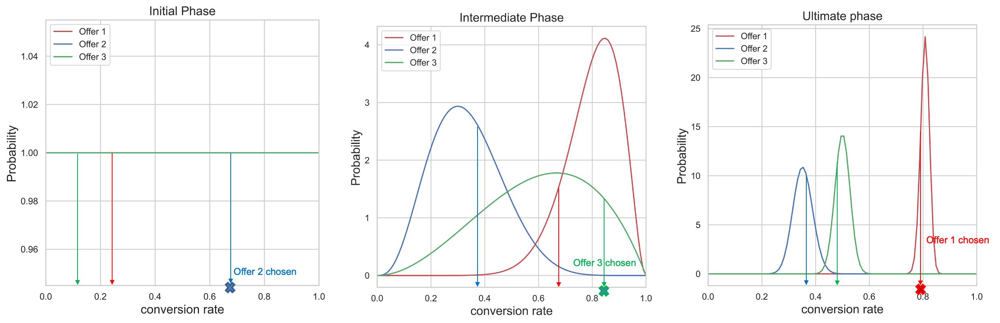
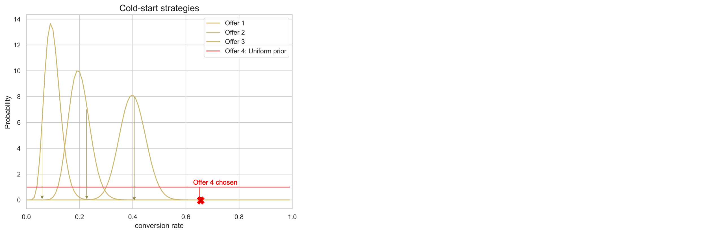

# Modelle für die automatische Optimierung {#auto-optimization-model}

>[!TIP]
>
>Die neue Entscheidungsfindungsfunktion in [!DNL Adobe Journey Optimizer] ist jetzt über den Code-basierten Erlebniskanal und den E-Mail-Kanal verfügbar. [Weitere Informationen](../../experience-decisioning/gs-experience-decisioning.md)

Mit einem Modell mit automatischer Optimierung werden Angebote geschaltet, die den von den Geschäftskunden festgelegten Gewinn (KPIs) maximieren. Diese KPIs können in Form von Konversionsraten, Umsatz usw. vorliegen. Im Moment bezieht sich die automatische Optimierung auf die Optimierung von Angebotsklicks mit dem Ziel der Angebotskonvertierung. Die automatische Optimierung ist nicht personalisiert und erfolgt auf der Grundlage der „globalen“ Performance der Angebote.

## Datensatzanforderungen

Um ein Modell für automatische Optimierung zu trainieren, muss der Datensatz die folgenden Mindestanforderungen erfüllen:

* Mindestens 2 Angebote im Datensatz müssen innerhalb der letzten 14 Tage mindestens 100 Anzeigeereignisse und 5 Klickereignisse aufweisen.
* Angebote mit weniger als 100 Anzeigen und/oder 5 Klickereignissen innerhalb der letzten 14 Tage werden vom Modell als neue Angebote behandelt und sind nur für die Bereitstellung durch den Exploration-Bandit geeignet.
* Angebote mit mehr als 100 Anzeigen und 5 Klickereignissen in den letzten 14 Tagen werden vom Modell als vorhandene Angebote behandelt und können sowohl von Exploration- als auch von Exploitation-Bandits bedient werden.

Bis zum ersten Mal ein Modell für automatische Optimierung trainiert wurde, werden Angebote im Rahmen einer Auswahlstrategie, die ein Modell für automatische Optimierung verwendet, nach dem Zufallsprinzip bereitgestellt.

## Einschränkungen {#limitations}

Die Verwendung von Modellen für die automatische Optimierung beim Entscheidungs-Management unterliegt den unten stehenden Einschränkungen:

* Modelle für die automatische Optimierung funktionieren nicht mit der Batch Decisioning-API.
* Das zum Erstellen des Modells benötigte Feedback muss als Erlebnisereignis gesendet werden. Es sollte bei [!DNL Journey Optimizer]-Kanälen nicht automatisch gesendet werden.

## Terminologie {#terminology}

Bei der automatisierten Optimierung sind die folgenden Begriffe hilfreich:

* **Mehrarmiger Bandit**: Der Ansatz [Mehrarmiger Bandit](https://de.wikipedia.org/wiki/Mehrarmiger_Bandit){target="_blank"} für die Optimierung bringt forschendes Lernen und die Nutzung des Erlernten miteinander in Einklang.

* **Thompson-Stichprobenverfahren**: Das Thompson-Stichprobenverfahren ist ein Algorithmus für Online-Entscheidungsprobleme, bei dem sequenziell Maßnahmen getroffen werden, die einen Ausgleich herstellen müssen zwischen der Nutzung dessen, was bekannt ist, um die sofortige Performance zu maximieren, und Investitionen zur Sammlung neuer Informationen, die die zukünftige Performance verbessern können. [Weitere Informationen](#thompson-sampling)

* [**Beta-Verteilung**](https://de.wikipedia.org/wiki/Beta-Verteilung){target="_blank"}: Satz von kontinuierlichen [Wahrscheinlichkeitsverteilungen](https://de.wikipedia.org/wiki/Wahrscheinlichkeitsma%C3%9F){target="_blank"}, die im Intervall [0, 1] definiert und durch zwei positive [Formparameter](https://en.wikipedia.org/wiki/Shape_parameter){target="_blank"} [parametrisiert](https://de.wikipedia.org/wiki/Parameter_(Statistik)){target="_blank"} sind.

## Thompson-Stichprobenverfahren {#thompson-sampling}

Der Algorithmus, der der automatischen Optimierung zugrunde liegt, ist das **Thompson-Stichprobenverfahren**. In diesem Abschnitt besprechen wir die Idee hinter dem Thompson-Stichprobenverfahren.

Beim [Thompson-Stichprobenverfahren](https://en.wikipedia.org/wiki/Thompson_sampling){target="_blank"}, oder bayessche Banditen, handelt es sich um einen bayesschen Ansatz für das Problem des mehrarmigen Banditen.  Die Grundidee besteht darin, die durchschnittliche Belohnung 𝛍 von jedem Angebot als **Zufallsvariable** zu behandeln und die bisher gesammelten Daten zu verwenden, um unsere „Überzeugung“ über die durchschnittliche Belohnung anzupassen. Diese „Überzeugung“ wird mathematisch durch eine **A-posteriori-Wahrscheinlichkeitsverteilung“ dargestellt** im Wesentlichen eine Reihe von Werten für die durchschnittliche Belohnung zusammen mit der Plausibilität (oder Wahrscheinlichkeit), dass die Belohnung diesen Wert für jedes Angebot hat. Dann werden wir für jede Entscheidung **einen Punkt aus jeder dieser A-posteriori-Belohnungsverteilungen entnehmen** und das Angebot auswählen, dessen abgetastete Belohnung den höchsten Wert hatte.

Dieser Vorgang wird in der folgenden Abbildung veranschaulicht, in der wir drei verschiedene Angebote haben. Anfänglich haben wir keine Erkenntnisse aus den Daten und nehmen an, dass alle Angebote eine einheitliche A-posteriori-Belohnungsverteilung haben. Wir ziehen eine Stichprobe aus der A-posteriori-Belohnungsverteilung eines jeden Angebots. Die aus der Verteilung von Angebot 2 ausgewählte Stichprobe hat den höchsten Wert. Dies ist ein Beispiel für eine **Exploration**. Nach der Anzeige von Angebot 2 erfassen wir jede potenzielle Belohnung (z. B. Konversion/Keine Konversion) und aktualisieren die A-posteriori-Verteilung von Angebot 2 mithilfe des Satzes von Bayes, wie unten beschrieben.  Wir setzen diesen Prozess fort und aktualisieren die A-posteriori-Verteilungen jedes Mal, wenn ein Angebot angezeigt und die Belohnung erfasst wird. In der zweiten Abbildung wird Angebot 3 ausgewählt. Obwohl Angebot 1 die höchste durchschnittliche Belohnung hat (die A-posteriori-Belohnungsverteilung ist am weitesten rechts), hat der Prozess der Stichprobenziehung aus jeder Verteilung dazu geführt, dass wir das scheinbar suboptimale Angebot 3 ausgewählt haben. Damit geben wir uns die Möglichkeit, mehr über die wahre Belohnungsverteilung von Angebot 3 zu erfahren.

Je mehr Stichproben gesammelt werden, desto größer wird das Konfidenzniveau und desto genauer kann man die mögliche Belohnung abschätzen (was der engeren Belohnungsverteilung entspricht). Dieser Prozess der Aktualisierung unserer Annahmen durch die Verfügbarkeit neuer Erkenntnisse wird als **Bayes&#39;sche Inferenz“**.

Wenn ein Angebot (z. B. Angebot 1) ein eindeutiger Gewinner ist, wird seine A-posteriori-Belohnungsverteilung von anderen getrennt. Zu diesem Zeitpunkt ist die von Angebot 1 in die Stichprobe einbezogene Belohnung für jede Entscheidung wahrscheinlich die höchste, und wir wählen sie mit einer höheren Wahrscheinlichkeit aus. Wir sprechen von **Exploitation** (Ausbeutung): Wir sind der festen Überzeugung, dass Angebot 1 das beste ist, und daher wird es ausgewählt, um die Belohnungen zu maximieren.

**Abbildung 1**: *Für jede Entscheidung wird ein Punkt aus den A-posteriori-Belohnungsverteilungen entnommen. Das Angebot mit dem höchsten Stichprobenwert (Konversionsrate) wird ausgewählt. In der Anfangsphase haben alle Angebote eine einheitliche Verteilung, da wir aus den Daten keine Erkenntnisse zu den Konversionsraten der Angebote erhalten. Je mehr Stichproben wir sammeln, desto enger und genauer werden die A-posteriori-Verteilungen. Am Schluss wird jedes Mal das Angebot mit der höchsten Konversionsrate ausgewählt.*

<!--

-->

+++**Technische Details**

Zur Berechnung/Aktualisierung der Verteilungen verwenden wir den **Satz von Bayes**. Für jedes Angebot ***i*** möchten wir sein ***P(𝛍i | Daten)*** berechnen, d. h. für jedes Angebot ***i*** möchten wir feststellen, wie wahrscheinlich der Belohnungswert**𝛍 i** auf Basis der bisher für dieses Angebot gesammelten Daten ist.

Nach dem Satz von Bayes:

***A-posteriori = Wahrscheinlichkeit * A-priori***

Die **A-priori-Wahrscheinlichkeit** ist die anfängliche Einschätzung der Wahrscheinlichkeit, ein Ergebnis zu erzeugen. Die Wahrscheinlichkeit, nachdem einige Erkenntnisse gesammelt wurden, wird als **A-posteriori-Wahrscheinlichkeit** bezeichnet. 

Die automatische Optimierung ist so konzipiert, dass binäre Belohnungen (Klick/kein Klick) berücksichtigt werden. In diesem Fall stellt die Wahrscheinlichkeit die Anzahl der Erfolge aus n Versuchen dar und wird durch eine **Binomialverteilung** modelliert. Bei einigen Wahrscheinlichkeitsfunktionen befindet sich der Posterior, wenn Sie einen bestimmten Prior wählen, in derselben Verteilung wie der Prior. Ein solcher Prior wird dann **konjugierter Priori** genannt. Diese Art von Prior macht die Berechnung der A-posteriori-Verteilung sehr einfach. Die **Beta** Verteilung ist ein Konjugat vor der binomialen Wahrscheinlichkeit (binäre Belohnungen) und daher eine praktische und sinnvolle Wahl für die A-priori- und A-posteriori-Wahrscheinlichkeitsverteilungen.Die Beta-Verteilung nutzt zwei Parameter, ***α*** und ***β***. Diese Parameter können als Anzahl der Erfolge und Misserfolge betrachtet werden und als Mittelwert gegeben durch:

Die Wahrscheinlichkeitsfunktion wird, wie oben erläutert, durch eine Binomialverteilung modelliert, mit s Erfolgen (Konversionen) und f Misserfolgen (keine Konversionen), und q ist eine [Zufallsvariable](https://de.wikipedia.org/wiki/Zufallsvariable){target="_blank"} mit einer [Beta-Verteilung](https://de.wikipedia.org/wiki/Beta-Verteilung){target="_blank"}.

Der Prior wird von der Beta-Verteilung modelliert und die A-posteriori-Verteilung hat die folgende Form:

Die Berechnung des Posteriors erfolgt einfach durch Addieren der Erfolge und Fehler zu den vorhandenen Parametern ***α***, ***β***.

Für die automatische Optimierung beginnen wir, wie im Beispiel oben gezeigt, mit der A-priori-Verteilung ***Beta(1, 1)*** (einheitliche Verteilung) für alle Angebote, und nach dem Erzielen von s Erfolgen und f Fehlschlägen für ein bestimmtes Angebot wird der Posterior zu einer Beta-Verteilung mit den Parametern ***(s+α, f+β)*** für dieses Angebot.
+++

**Verwandte Themen**:

Um einen tieferen Einblick in das Thompson-Stichprobenverfahren zu erhalten, lesen Sie die folgenden Forschungsarbeiten:

* [Eine empirische Bewertung des Thompson-Stichprobenverfahrens](https://proceedings.neurips.cc/paper/2011/file/e53a0a2978c28872a4505bdb51db06dc-Paper.pdf){target="_blank"}
* [Analyse des Thompson-Stichprobenverfahrens für das Multi-Armed-Bandit-Problem](https://proceedings.mlr.press/v23/agrawal12/agrawal12.pdf){target="_blank"}

## „Kaltstart“-Problem {#cold-start}

Das „Kaltstart“-Problem tritt auf, wenn ein neues Angebot zu einer Kampagne hinzugefügt wird und keine Daten zur Konversionsrate des neuen Angebots verfügbar sind. Während dieses Zeitraums müssen wir eine Strategie dafür entwickeln, wie oft dieses neue Angebot ausgewählt wird, damit der Performance-Abfall minimiert wird, während wir Informationen über die Konversionsrate dieses neuen Angebots sammeln. Es gibt mehrere Lösungen, um dieses Problem zu beheben. Wichtig dabei ist, ein Gleichgewicht zu finden, sodass die Nutzung dieses neuen Angebots nicht zu stark auf Kosten der Nutzung geht. Derzeit verwenden wir als anfängliche Schätzung der Konversionsrate des neuen Angebots (A-priori-Verteilung) eine „einheitliche Verteilung“. Das bedeutet, dass wir allen Konversionsratenwerten die gleiche Wahrscheinlichkeit zuweisen aufzutreten.

**Abbildung 2**: *Nehmen wir eine Kampagne mit drei Angeboten an. Während der Kampagne wird Angebot 4 zur Kampagne hinzugefügt. Zunächst liegen keine Daten über die Konversionsrate von Angebot 4 vor, und wir sind mit dem Kaltstart-Problem konfrontiert. Wir verwenden eine gleichmäßige Verteilung als ersten Schätzwert zur Konversionsrate von Angebot 4, während wir Daten für dieses neue Angebot sammeln. Wie im Abschnitt [Thompson-Stichprobenverfahren](#thompson-sampling) erläutert, wählen wir Stichproben aus den A-posteriori-Belohnungsverteilungen der Angebote und das Angebot mit dem höchsten Stichprobenwert aus, um zu entscheiden, welches Angebot einem Nutzer angezeigt wird. Im obigen Beispiel wird Angebot 4 gewählt und später wird die A-posteriori-Verteilung dieses Angebots auf der Grundlage der erfassten Belohnungen aktualisiert, wie im Abschnitt [Thompson-Stichprobenverfahren](#thompson-sampling) erläutert.*

## Steigerungsmessung {#lift}

Mit der Metrik „Steigerung“ wird die Performance einer Strategie im Rangfolgen-Service gegenüber einer Basisstrategie (d. h. nur zufällig bereitgestellte Angebote) gemessen.

Wenn wir z. B. die Performance einer TS-Strategie (Thompson-Stichprobenverfahren) im Rangfolgen-Service messen möchten und der KPI die Konversionsrate (CVR) ist, wird die „Steigerung“ der TS-Strategie gegenüber der Basisstrategie folgendermaßen definiert:

