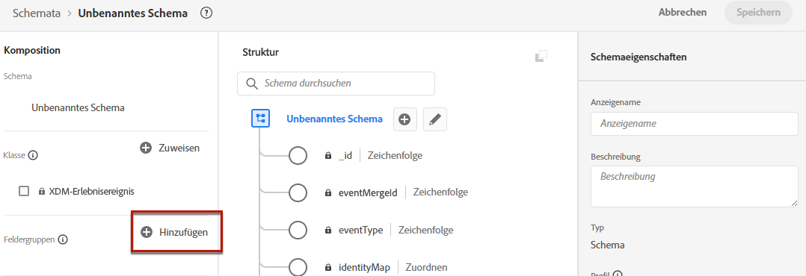
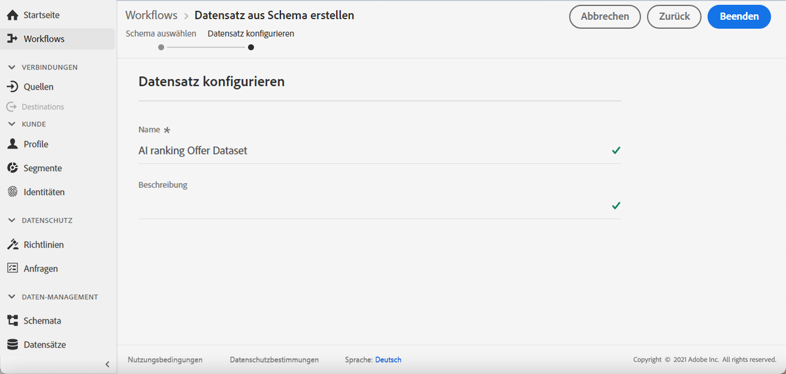

# Datensatz zum Erfassen von Ereignissen erstellen {#create-dataset}

Bevor Sie ein KI-Modell erstellen, müssen Sie einen Datensatz erstellen, in dem Konversionsereignisse erfasst werden. Erstellen Sie zunächst das Schema, das in Ihrem Datensatz verwendet werden soll:

1. Aus dem **[!UICONTROL Data Management]** Menü auswählen **[!UICONTROL Schema]**, navigieren Sie zu **[!UICONTROL Browse]** Registerkarte und klicken Sie auf **[!UICONTROL Create schema]**.

   

1. Auswählen **[!UICONTROL XDM ExperienceEvent]**.

   

   >[!NOTE]
   >
   >Weitere Informationen zu XDM-Schemata und Feldergruppen finden Sie im Abschnitt [Dokumentation zur XDM-Systemübersicht](https://experienceleague.adobe.com/docs/experience-platform/xdm/home.html?lang=en){target=&quot;_blank&quot;}.

1. Aus dem **[!UICONTROL Field groups]** auf der linken Seite, wählen Sie **[!UICONTROL Add]**.

   

1. Im **[!UICONTROL Search]** Geben Sie &quot;Interaktion mit Vorschlägen&quot;ein und wählen Sie die **[!UICONTROL Experience Event - Proposition Interactions]** Feldergruppe.

   

   >[!CAUTION]
   >
   >Das Schema, das in Ihrem Datensatz verwendet wird, muss die Variable **[!UICONTROL Experience Event - Proposition Interactions]** mit ihr verknüpfte Feldergruppe. Andernfalls können Sie sie nicht in Ihrer Rangliste verwenden.

1. Klicken **[!UICONTROL Add field groups]**.

   

   >[!NOTE]
   >Feldergruppe wurde früher als Mixin bezeichnet.

1. Geben Sie einen Namen ein und speichern Sie das Schema.

>[!NOTE]
>
>Erfahren Sie mehr über das Erstellen von Schemas in [Grundlagen der Schemakomposition](https://experienceleague.adobe.com/docs/experience-platform/xdm/schema/composition.html?lang=en#understanding-schemas){target=&quot;_blank&quot;}.

Sie können jetzt einen Datensatz mit diesem Schema erstellen. Gehen Sie dazu wie folgt vor:

1. Aus dem **[!UICONTROL Data Management]** Menü auswählen **[!UICONTROL Datasets]**, navigieren Sie zu **[!UICONTROL Browse]** Registerkarte und klicken Sie auf **[!UICONTROL Create dataset]**.

   

1. Auswählen **[!UICONTROL Create dataset from schema]**.

   

1. Wählen Sie das soeben erstellte Schema aus der Liste aus.

   

1. Klicken **[!UICONTROL Next]**.

1. Geben Sie einen eindeutigen Namen für den Datensatz im **[!UICONTROL Name]** Feld und klicken Sie auf **[!UICONTROL Finish]**.

   

Der Datensatz kann jetzt ausgewählt werden, um Ereignisdaten zu erfassen, wenn [Erstellen einer Rangstrategie](#create-ranking-strategy).
