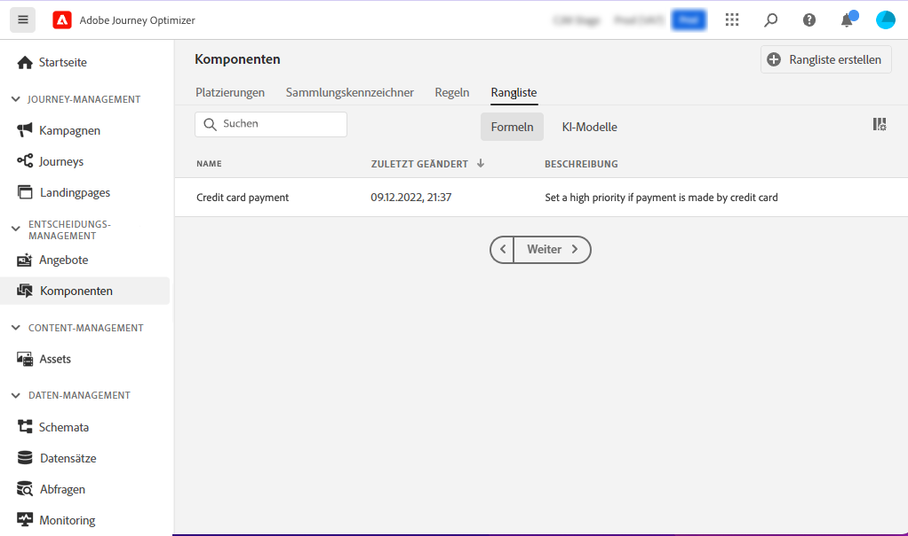

# Ranking-Formeln {#create-ranking-formulas}

## Über Ranking-Formeln {#about-ranking-formulas}

**Ranking-Formeln** ermöglichen es Ihnen, Regeln zu definieren, die bestimmen, welches Angebot zuerst für eine bestimmte Platzierung unterbreitet werden soll, anstatt die Prioritätswerte der Angebote zu berücksichtigen.

Ranking-Formeln werden in **PQL-Syntax** und kann Profilattribute, Kontextdaten und Angebotsattribute nutzen. Weiterführende Informationen zur Verwendung der PQL-Syntax finden Sie im Abschnitt [dedizierte Dokumentation](https://experienceleague.adobe.com/docs/experience-platform/segmentation/pql/overview.html).

Nachdem eine Rangformel erstellt wurde, können Sie sie einer Platzierung in einer Entscheidung zuweisen. Weitere Informationen hierzu finden Sie unter [Angebotsauswahl in Entscheidungen konfigurieren](../offer-activities/configure-offer-selection.md).

## Erstellen einer Rangformel {#create-ranking-formula}

Gehen Sie wie folgt vor, um eine Rangformel zu erstellen:

1. Zugriff auf **[!UICONTROL Components]** und wählen Sie anschließend die **[!UICONTROL Rankings]** Registerkarte. Die Liste der zuvor erstellten Ranglisten wird angezeigt.

   

1. Klicken **[!UICONTROL Create ranking]** , um eine neue Ranglistenformel zu erstellen.

   

1. Geben Sie den Namen, die Beschreibung und die Formel der Rangformel an.

   In diesem Beispiel möchten wir die Priorität aller Angebote mit dem Attribut &quot;heiß&quot;erhöhen, wenn das aktuelle Wetter heiß ist. Dazu muss die Variable **contextData.weather=hot** wurde im Entscheidungsaufruf übergeben.

   

1. Klicken **[!UICONTROL Save]**. Ihre Rangformel wird erstellt. Sie können sie aus der Liste auswählen, um Details abzurufen und sie zu bearbeiten oder zu löschen.

   Sie kann jetzt in einer Entscheidung verwendet werden, um geeignete Angebote für eine Platzierung zu bewerten (siehe [Angebotsauswahl in Entscheidungen konfigurieren](../offer-activities/configure-offer-selection.md)).

   

## Beispiele für Ranking-Formeln {#ranking-formula-examples}

Sie können je nach Bedarf viele verschiedene Ranking-Formeln erstellen. Im Folgenden finden Sie einige Beispiele.

<!--
Boost by offer ID

Boost the priority of an offer with the offer ID *xcore:personalized-offer:13d213cd4cb328ec* by 5.

**Ranking formula:**

```
if( offer._id = "xcore:personalized-offer:13d213cd4cb328ec", offer.rank.priority + 5, offer.rank.priority)
```

Change the offer priority based on a certain profile attribute

Set the offer priority to 30 for offer *xcore:personalized-offer:13d213cd4cb328ec* if the user lives in the city of Bondi.

**Ranking formula:**

```
if( offer._id = "xcore:personalized-offer:13d213cd4cb328ec" and homeAddress.city.equals("Bondi", false), 30, offer.rank.priority)
```

Boost multiple offers by offer ID based on the presence of a profile's segment membership

Boost the priority of offers based on whether the user is a member of a priority segment, which is configured as an attribute in the offer.

**Ranking formula:**

```
if( segmentMembership.get("ups").get(offer.characteristics.prioritySegmentId).status in (["realized","existing"]), offer.rank.priority + 10, offer.rank.priority)
```
-->

### Angebote mit einem bestimmten Angebotsattribut basierend auf dem Profilattribut aufstocken

Wenn das Profil in der Stadt lebt, die dem Angebot entspricht, verdoppeln Sie die Priorität für alle Angebote in dieser Stadt.

**Ranking-Formel:**

```
if( offer.characteristics.city = homeAddress.city, offer.rank.priority * 2, offer.rank.priority)
```

### Steigern von Angeboten, deren Enddatum in weniger als 24 Stunden liegt

**Ranking-Formel:**

```
if( offer.selectionConstraint.endDate occurs <= 24 hours after now, offer.rank.priority * 3, offer.rank.priority)
```

### Angebote mit einem bestimmten Angebotsattribut basierend auf Kontextdaten aufstocken

Steigern Sie bestimmte Angebote basierend auf den Kontextdaten, die im Entscheidungsaufruf übergeben werden. Wenn beispielsweise die Variable `contextData.weather=hot` im Entscheidungsaufruf übergeben wird, wird die Priorität aller Angebote mit `attribute=hot` muss erhöht werden.

**Ranking-Formel:**

```
if (@{_xdm.context.additionalParameters;version=1}.weather.isNotNull()
and offer.characteristics.weather=@{_xdm.context.additionalParameters;version=1}.weather, offer.rank.priority + 5, offer.rank.priority)
```

Beachten Sie, dass bei Verwendung der Decisioning API die Kontextdaten zum Profilelement im Anfragetext hinzugefügt werden, wie im folgenden Beispiel.

**Snippet aus Anfrageinhalt:**

```
"xdm:profiles": [
{
    "xdm:identityMap": {
        "crmid": [
            {
            "xdm:id": "CRMID1"
            }
        ]
    },
    "xdm:contextData": [
        {
            "@type":"_xdm.context.additionalParameters;version=1",
            "xdm:data":{
                "xdm:weather":"hot"
            }
        }
    ]
 }],
```

### Angebotserhöhung, die auf der Kauftendenz der Kunden basiert

Sie können die Punktzahl für ein Angebot basierend auf einem Tendenzwert für den Kunden erhöhen.

In diesem Beispiel lautet der Instanzmandant *_salesgeschwindigkeit* und das Profilschema enthält einen Bereich von Werten, die in einem Array gespeichert sind:


In diesem Fall für ein Profil wie:

```
{"_salesvelocity": {"individualScoring": [
                    {"core": {
                            "category":"insurance",
                            "propensityScore": 96.9
                        }},
                    {"core": {
                            "category":"personalLoan",
                            "propensityScore": 45.3
                        }},
                    {"core": {
                            "category":"creditCard",
                            "propensityScore": 78.1
                        }}
                    ]}
}
```

Die Angebote enthalten ein -Attribut für *propensityType* , der der Kategorie aus den Werten entspricht:


Ihre Rangformel kann dann die Priorität jedes Angebots so einstellen, dass sie den Kunden entspricht *propensityScore* für *propensityType*. Wenn kein Ergebnis gefunden wird, verwenden Sie die statische Priorität, die auf dem Angebot festgelegt wurde:

```
let score = (select _Individual_Scoring1 from _salesvelocity.individualScoring
             where _Individual_Scoring1.core.category.equals(offer.characteristics.propensityType, false)).head().core.propensityScore
in if(score.isNotNull(), score, offer.rank.priority)
```
