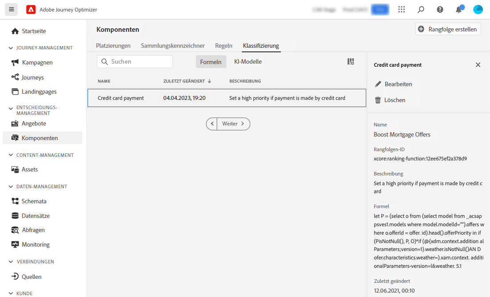

# Rangfolgenformeln {#create-ranking-formulas}

## Grundlagen zu Rangfolgeformeln {#about-ranking-formulas}

Mithilfe von **Rangfolgeformeln** können Sie festlegen, welches Angebot für eine bestimmte Platzierung zuerst angezeigt werden soll, anstatt die Prioritätswerte der Angebote zu berücksichtigen.

Rangfolgeformeln werden in der **PQL-Syntax** angegeben und können Profil-, Kontextdaten- und Angebotsattribute nutzen. Weiterführende Informationen zur Verwendung der PQL-Syntax finden Sie im [entsprechenden Handbuch](https://experienceleague.adobe.com/docs/experience-platform/segmentation/pql/overview.html?lang=de).

Nachdem Sie eine Rangfolgenformel erstellt haben, können Sie sie einer Platzierung in einer Entscheidung zuweisen. Weitere Informationen dazu finden Sie unter [Konfigurieren der Auswahl von Angeboten in Entscheidungen](../offer-activities/configure-offer-selection.md).

## Erstellen einer Rangfolgeformel {#create-ranking-formula}

Gehen Sie wie folgt vor, um eine neue Rangfolgeformel zu erstellen:

1. Rufen Sie das Menü **[!UICONTROL Komponenten]** auf und wählen Sie dann die Registerkarte **[!UICONTROL Rangfolgen]**. Die Liste der zuvor erstellten Rangfolgen wird angezeigt.

   

1. Klicken Sie auf **[!UICONTROL Rangfolge erstellen]**, um eine neue Rangfolgeformel zu erstellen.

   

1. Geben Sie Namen und die Beschreibung der Rangfolgeformel sowie die Formel selbst an.

   In diesem Beispiel möchten wir die Priorität aller Angebote durch Hinzufügen des Attributs „heiß“ erhöhen, wenn das Wetter heiß ist. Zu diesem Zweck wurde **contextData.weather=hot** im Entscheidungsaufruf übergeben.

   

1. Klicken Sie auf **[!UICONTROL Speichern]**. Ihre Rangfolgeformel wird erstellt. Sie können sie aus der Liste auswählen, um Details abzurufen und sie zu bearbeiten oder zu löschen.

   Sie kann jetzt in einer Entscheidung verwendet werden, um die geeigneten Angebote für eine Platzierung zu reihen (siehe [Auswahl der Angebote in Entscheidungen konfigurieren](../offer-activities/configure-offer-selection.md)).

   

## Beispiele für Rangfolgeformeln {#ranking-formula-examples}

Sie können je nach Bedarf viele verschiedene Rangfolgeformeln erstellen. Im Folgenden finden Sie einige Beispiele.

<!--
Boost by offer ID

Boost the priority of an offer with the offer ID *xcore:personalized-offer:13d213cd4cb328ec* by 5.

**Ranking formula:**

```
if( offer._id = "xcore:personalized-offer:13d213cd4cb328ec", offer.rank.priority + 5, offer.rank.priority)
```

Change the offer priority based on a certain profile attribute

Set the offer priority to 30 for offer *xcore:personalized-offer:13d213cd4cb328ec* if the user lives in the city of Bondi.

**Ranking formula:**

```
if( offer._id = "xcore:personalized-offer:13d213cd4cb328ec" and homeAddress.city.equals("Bondi", false), 30, offer.rank.priority)
```

Boost multiple offers by offer ID based on the presence of a profile's segment membership

Boost the priority of offers based on whether the user is a member of a priority segment, which is configured as an attribute in the offer.

**Ranking formula:**

```
if( segmentMembership.get("ups").get(offer.characteristics.prioritySegmentId).status in (["realized","existing"]), offer.rank.priority + 10, offer.rank.priority)
```
-->

### Verstärken von Angeboten mit bestimmten Angebotsattributen auf der Grundlage von Profilattributen

Wenn das Profil in der Stadt lebt, die dem Angebot entspricht, verdoppeln Sie die Priorität für alle Angebote in dieser Stadt.

**Rangfolgeformel:**

```
if( offer.characteristics.city = homeAddress.city, offer.rank.priority * 2, offer.rank.priority)
```

### Verstärken von Angeboten, deren Enddatum in weniger als 24 Stunden liegt

**Rangfolgeformel:**

```
if( offer.selectionConstraint.endDate occurs <= 24 hours after now, offer.rank.priority * 3, offer.rank.priority)
```

### Verstärken von Angeboten mit bestimmten Angebotsattributen auf der Grundlage von Kontextdaten

Verstärken Sie bestimmte Angebote auf der Grundlage der Kontextdaten, die beim Entscheidungsaufruf übergeben werden. Wenn beispielsweise `contextData.weather=hot` im Entscheidungsaufruf übergeben wird, muss die Priorität aller Angebote mit `attribute=hot` erhöht werden.

**Rangfolgeformel:**

```
if (@{_xdm.context.additionalParameters;version=1}.weather.isNotNull()
and offer.characteristics.weather=@{_xdm.context.additionalParameters;version=1}.weather, offer.rank.priority + 5, offer.rank.priority)
```

Beachten Sie, dass bei Verwendung der Decisioning-API die Kontextdaten im Anfragehauptteil zum Profilelement hinzugefügt werden (siehe folgendes Beispiel).

**Snippet im Anfragehauptteil:**

```
"xdm:profiles": [
{
    "xdm:identityMap": {
        "crmid": [
            {
            "xdm:id": "CRMID1"
            }
        ]
    },
    "xdm:contextData": [
        {
            "@type":"_xdm.context.additionalParameters;version=1",
            "xdm:data":{
                "xdm:weather":"hot"
            }
        }
    ]
 }],
```

### Verstärken von Angeboten entsprechend der Neigung der Kunden, das angebotene Produkt zu kaufen

Wenn wir zwei Instanzen von *CustomerAI* haben, die die Neigung zum Kauf von *Reiseversicherung* und *Übergepäck* für eine Fluggesellschaft berechnen, erhöht die folgende Rangfolgeformel die Priorität des Angebots (um 50 Punkte) für entweder Versicherungen oder Gepäck, wenn die Kundenneigung für den Kauf dieses Produkts höher als 90 ist.

Da jedoch jede *CustomerAI*-Instanz innerhalb des einheitlichen Profilschemas ihr eigenes Objekt erstellt, ist es nicht möglich, die Punktzahl basierend auf dem Typ der Angebotsneigung dynamisch auszuwählen. Daher müssen Sie die `if`-Anweisungen verketten, um zunächst den Typ der Angebotsneigung zu überprüfen und dann die Punktzahl aus dem entsprechenden Profilfeld zu extrahieren.

**Rangfolgeformel:**

```
if ( offer.characteristics.propensityType = "extraBaggagePropensity" and _salesvelocity.CustomerAI.extraBaggagePropensity.score > 90, offer.rank.priority + 50,
    (
        if ( offer.characteristics.propensityType = "travelInsurancePropensity" and _salesvelocity.CustomerAI.insurancePropensity.score > 90, offer.rank.priority + 50, offer.rank.priority )
    )
)
```

Eine bessere Lösung besteht darin, die Punktzahlen in einem Array des Profils zu speichern. Das folgende Beispiel zeigt, wie eine einfache Rangfolgeformel für viele verschiedene Neigungspunktwerte verwendet werden kann. Dabei wird vorausgesetzt, dass Sie über ein Profilschema mit einem Array von Werten verfügen. In diesem Beispiel ist der Instanzmandant *_salesvelocity* und das Profilschema enthält Folgendes:


In diesem Fall für ein Profil wie:

```
{"_salesvelocity": {"individualScoring": [
                    {"core": {
                            "category":"insurance",
                            "propensityScore": 96.9
                        }},
                    {"core": {
                            "category":"personalLoan",
                            "propensityScore": 45.3
                        }},
                    {"core": {
                            "category":"creditCard",
                            "propensityScore": 78.1
                        }}
                    ]}
}
```

Die Angebote enthalten ein Attribut für *propensityType*, das mit der Kategorie der Punktwerte übereinstimmt:


Ihre Rangfolgeformel kann dann die Priorität jedes Angebots so festlegen, dass sie dem *propensityScore* des Kunden für diesen *propensityType* entspricht. Wenn kein Punktwert gefunden wird, verwenden Sie die statische Priorität für das Angebot:

```
let score = (select _Individual_Scoring1 from _salesvelocity.individualScoring
             where _Individual_Scoring1.core.category.equals(offer.characteristics.propensityType, false)).head().core.propensityScore
in if(score.isNotNull(), score, offer.rank.priority)
```
