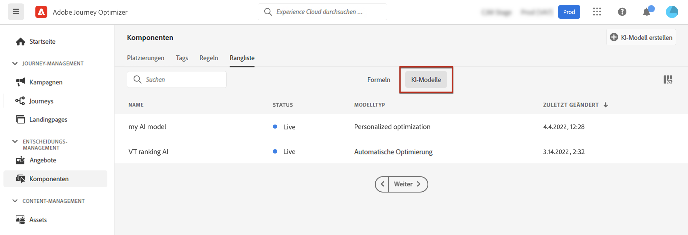
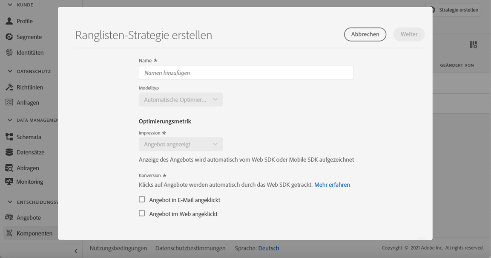
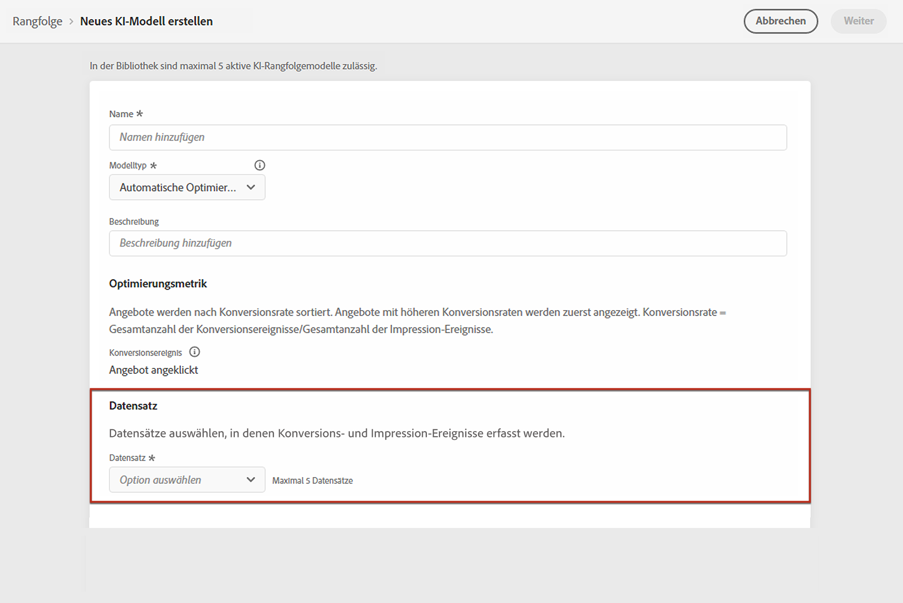
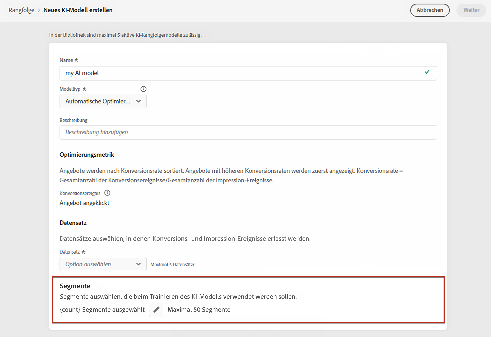
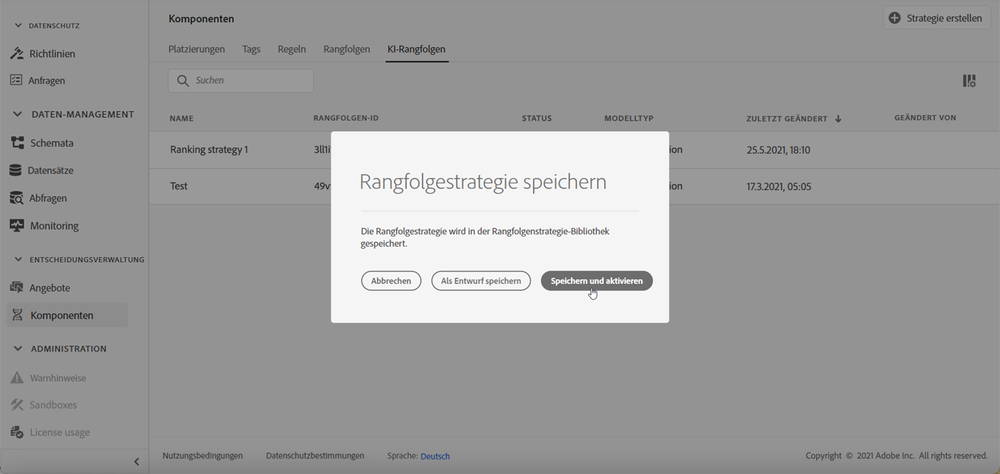

# Erstellen von KI-Modellen {#ai-rankings}

>[!TIP]
>
>Die neue Entscheidungsfindungsfunktion in [!DNL Adobe Journey Optimizer] ist jetzt über den Code-basierten Erlebniskanal und den E-Mail-Kanal verfügbar. [Weitere Informationen](../../experience-decisioning/gs-experience-decisioning.md)

[!DNL Journey Optimizer] ermöglicht Ihnen die Erstellung von **KI-Modellen**, um Angebote nach Ihren Geschäftszielen zu ordnen.

>[!CAUTION]
>
>Zum Erstellen, Bearbeiten oder Löschen von KI-Modellen benötigen Sie die Berechtigung zur **Verwaltung von Rangfolgestrategien**. [Weitere Informationen](../../administration/high-low-permissions.md#manage-ranking-strategies)

## Erstellen eines KI-Modells {#create-ranking-strategy}

>[!CONTEXTUALHELP]
>id="ajo_decisioning_ai_model_metric"
>title="Optimierungsmetrik"
>abstract="[!DNL Journey Optimizer] erstellt die Rangfolge von Angeboten anhand der **Konversionsrate** (Konversionsrate = Gesamtanzahl der Konversionsereignisse / Gesamtzahl der Impression-Ereignisse). Die Konversionsrate wird anhand von zwei Metriktypen berechnet: **Impression-Ereignisse** (angezeigte Angebote) und **Konversionsereignisse** (Angebote, die zu Klicks über E-Mail oder Web führen). Diese Ereignisse werden automatisch mit dem Web SDK oder dem bereitgestellten Mobile SDK erfasst."

Gehen Sie wie folgt vor, um ein neues KI-Modell zu erstellen:

1. Erstellen Sie einen Datensatz, in dem Konversionsereignisse erfasst werden. [Weitere Informationen](../data-collection/create-dataset.md)

1. Gehen Sie im Menü **[!UICONTROL Komponenten]** zur Registerkarte **[!UICONTROL Rangfolge]** und wählen Sie **[!UICONTROL KI-Modelle]**.

   

   Alle bisher erstellten KI-Modelle werden aufgelistet.

1. Klicken Sie auf die Schaltfläche **[!UICONTROL KI-Modell erstellen]**.

1. Geben Sie einen eindeutigen Namen und eine Beschreibung für das KI-Modell an und wählen Sie dann die Art des KI-Modells, das Sie erstellen möchten:

   * **[!UICONTROL Automatische Optimierung]** optimiert Angebote basierend auf der bisherigen Angebots-Performance. [Weitere Informationen](auto-optimization-model.md)
   * Die **[!UICONTROL personalisierte Optimierung]** optimiert und personalisiert Angebote auf Grundlage von Zielgruppen und Angebots-Performance. [Weitere Informationen](personalized-optimization-model.md)

   

   >[!NOTE]
   >
   >Der Abschnitt **[!UICONTROL Optimierungsmetrik]** enthält Informationen zum Konversionsereignis, das vom KI-Modell zur Berechnung des Angebotsrangs verwendet wird.
   >
   >[!DNL Journey Optimizer] erstellt die Rangfolge von Angeboten anhand der **Konversionsrate** (Konversionsrate = Gesamtanzahl der Konversionsereignisse / Gesamtzahl der Impression-Ereignisse). Die Konversionsrate wird anhand von zwei Metriktypen berechnet:
   >* **Impression-Ereignisse** (angezeigte Angebote)
   >* **Konversionsereignisse** (Angebote per E-Mail oder im Web, die zu Klicks führen).
   >
   >Diese Ereignisse werden automatisch mit dem Web SDK oder dem bereitgestellten Mobile SDK erfasst. Weitere Informationen dazu finden Sie in der [Übersicht über das Adobe Experience Platform Web SDK](https://experienceleague.adobe.com/docs/experience-platform/edge/home.html?lang=de).

1. Wählen Sie die Datensätze aus, in denen die Konversions- und Impression-Ereignisse erfasst werden. In [diesem Abschnitt](../data-collection/create-dataset.md) erfahren Sie, wie Sie einen solchen Datensatz erstellen.<!--This dataset needs to be associated with a schema that must have the **[!UICONTROL Proposition Interactions]** field group (previously known as mixin) associated with it.-->

   

   >[!CAUTION]
   >
   >In der Dropdown-Liste werden nur Datensätze angezeigt, die aus Schemata erstellt wurden, die mit der Feldergruppe (früher als Mixin bezeichnet) **[!UICONTROL Erlebnisereignis – Vorschlagsinteraktionen]** verknüpft sind.

1. Wenn Sie ein KI-Modell für die **[!UICONTROL personalisierte Optimierung]** erstellen, wählen Sie ein oder mehrere Segmente aus, die für das Training des KI-Modells verwendet werden sollen.

   ➡️ [Funktion im Video kennenlernen](#video)

   

   >[!NOTE]
   >
   >Sie können bis zu 5 Zielgruppen auswählen.

1. Speichern und aktivieren Sie das KI-Modell.

   

<!--
At this point, you must have:

* created the AI model,
* defined which type of event you want to capture - offer displayed (impression) and/or offer clicked (conversion),
* and in which dataset you want to collect the event data.
-->

Jedes Mal, wenn ein Angebot angezeigt und/oder angeklickt wird, soll nun das entsprechende Ereignis automatisch von der Feldergruppe **[!UICONTROL Erlebnisereignis – Vorschlagsinteraktionen]** mithilfe des [Adobe Experience Platform Web SDK](https://experienceleague.adobe.com/docs/experience-platform/edge/web-sdk-faq.html?lang=de#what-is-adobe-experience-platform-web-sdk%3F){target="_blank"} oder Mobile SDK erfasst werden.

Um Ereignistypen (angezeigtes Angebot oder angeklicktes Angebot) senden zu können, müssen Sie für jeden Ereignistyp in einem Erlebnisereignis, das an Adobe Experience Platform gesendet wird, den richtigen Wert festlegen. [Weitere Informationen](../data-collection/schema-requirement.md)

## Anleitungsvideo {#video}

Erfahren Sie, wie Sie ein personalisiertes Optimierungsmodell erstellen und es auf eine Entscheidung anwenden.

>[!VIDEO](https://video.tv.adobe.com/v/3419954?quality=12)
