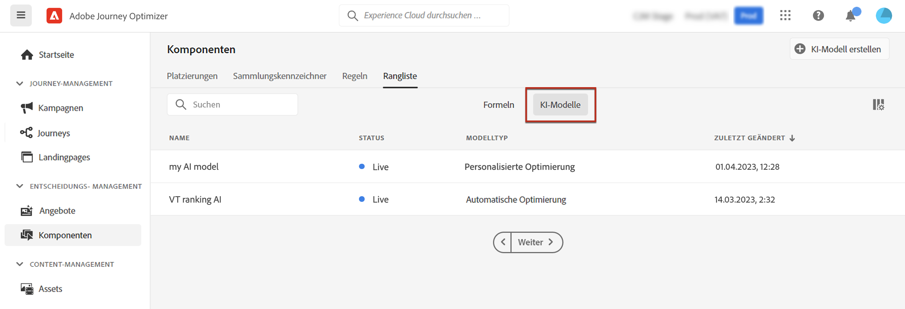
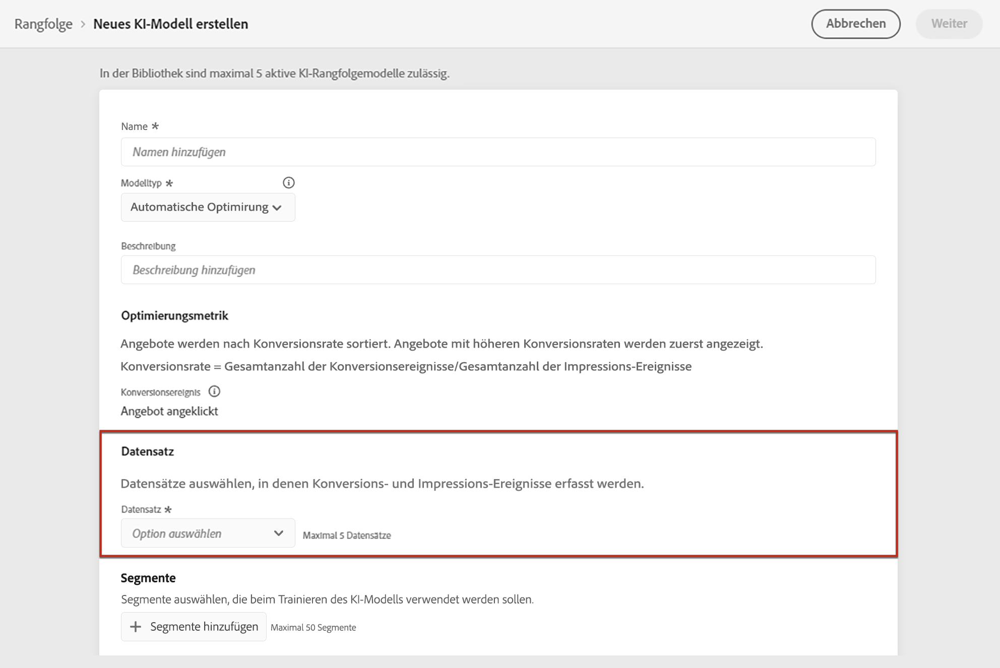

# Erstellen von KI-Modellen {#ai-rankings}

[!DNL Journey Optimizer] ermöglicht Ihnen die Erstellung von **KI-Modellen**, um Angebote nach Ihren Geschäftszielen zu ordnen.

>[!CAUTION]
>
>Zum Erstellen, Bearbeiten oder Löschen von KI-Modellen benötigen Sie die Berechtigung zur **Verwaltung von Rangfolgestrategien**. [Weitere Informationen](../../administration/high-low-permissions.md#manage-ranking-strategies)

## Erstellen eines KI-Modells {#create-ranking-strategy}

Gehen Sie wie folgt vor, um ein neues KI-Modell zu erstellen:

1. Gehen Sie im Menü **[!UICONTROL Komponenten]** zur Registerkarte **[!UICONTROL Rangfolge]** und wählen Sie **[!UICONTROL KI-Modelle]**.

   

   Alle bisher erstellten KI-Modelle werden aufgelistet.

1. Klicken Sie auf die Schaltfläche **[!UICONTROL KI-Modell erstellen]**.

1. Geben Sie einen eindeutigen Namen und eine Beschreibung für das KI-Modell an und wählen Sie dann die Art des KI-Modells, das Sie erstellen möchten:

   * **[!UICONTROL Automatische Optimierung]** optimiert Angebote basierend auf der bisherigen Angebotsleistung. [Weitere Informationen](auto-optimization-model.md)
   * **[!UICONTROL Personalisiert]** optimiert und personalisiert Angebote auf der Grundlage von Segmenten und der Angebotsleistung. [Weitere Informationen](personalized-optimization-model.md)

   

   >[!NOTE]
   >
   >Der Abschnitt **[!UICONTROL Optimierungsmetrik]** enthält Informationen zum Konversionsereignis, das vom KI-Modell zur Berechnung des Angebotsrangs verwendet wird.
   >
   >[!DNL Journey Optimizer] erstellt die Rangfolge von Angeboten anhand der **Konversionsrate** (Konversionsrate = Gesamtanzahl der Konversionsereignisse / Gesamtzahl der Impression-Ereignisse). Die Konversionsrate wird anhand von zwei Metriktypen berechnet:
   >* **Impression-Ereignisse** (angezeigte Angebote)
   >* **Konversionsereignisse** (Angebote per E-Mail oder im Web, die zu Klicks führen).

   >
   >Diese Ereignisse werden automatisch mit dem Web SDK oder dem bereitgestellten Mobile SDK erfasst. Weiterführende Informationen dazu finden Sie in der [Übersicht über das Adobe Experience Platform Web SDK](https://experienceleague.adobe.com/docs/experience-platform/edge/home.html?lang=de).

1. Wählen Sie die Datensätze aus, in denen die Konversions- und Impression-Ereignisse erfasst werden. In [diesem Abschnitt](#create-dataset) erfahren Sie, wie Sie einen solchen Datensatz erstellen.<!--This dataset needs to be associated with a schema that must have the **[!UICONTROL Proposition Interactions]** field group (previously known as mixin) associated with it.-->

   

   >[!CAUTION]
   >
   >In der Dropdown-Liste werden nur Datensätze angezeigt, die aus Schemas erstellt wurden, die mit der Feldergruppe (früher als Mixin bezeichnet) **[!UICONTROL Erlebnisereignis – Vorschlagsinteraktionen]** verknüpft sind.

1. Wenn Sie ein KI-Modell für die **[!UICONTROL Personalisierung]** erstellen, wählen Sie ein oder mehrere Segmente aus, die für das Training des KI-Modells verwendet werden sollen.

   

   >[!NOTE]
   >
   >Sie können bis zu 5 Segmente auswählen.

1. Speichern und aktivieren Sie das KI-Modell.

   
