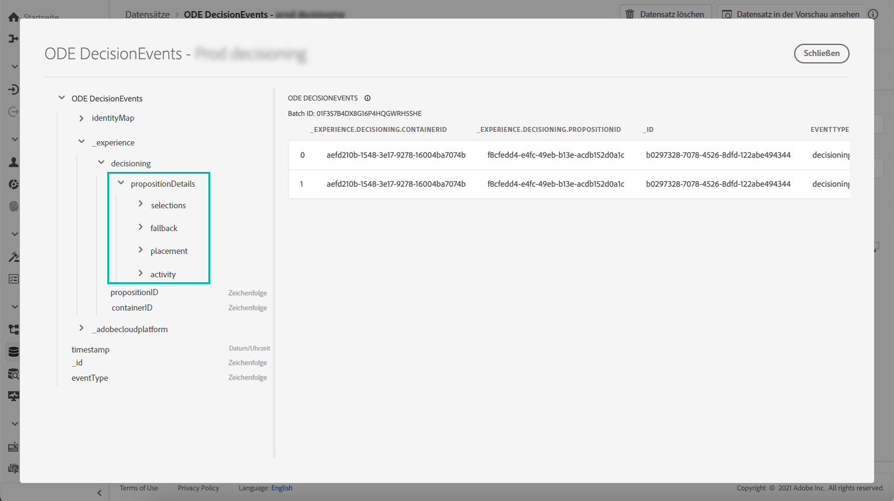
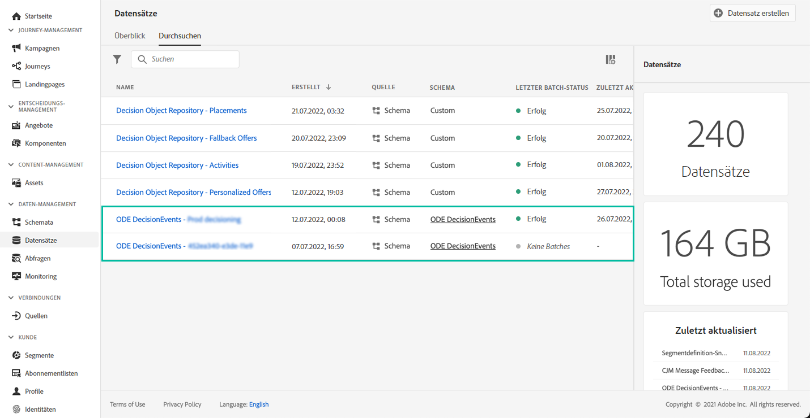

# Erste Schritte mit Entscheidungs-Management-Ereignissen {#monitor-offer-events}

Jedes Mal, wenn das Entscheidungs-Management eine Entscheidung für ein bestimmtes Profil trifft, werden Informationen zu diesen Ereignissen automatisch an Adobe Experience Platform gesendet.

Auf diese Weise erhalten Sie Einblicke in Ihre Entscheidungen, z. B. in das Angebot, das einem bestimmten Profil unterbreitet wurde. Sie können diese Daten exportieren, um sie in Ihrem eigenen Berichtssystem zu analysieren, oder nutzen Sie Adobe Experience Platform [Abfrage-Service](https://experienceleague.adobe.com/docs/experience-platform/query/home.html?lang=de) in Kombination mit anderen Tools für erweiterte Analyse- und Berichtszwecke.

## Wichtige Informationen in Datensätzen {#key-information}

Jedes Ereignis, das gesendet wird, wenn eine Entscheidung getroffen wird, enthält vier wichtige Datenpunkte, die Sie für Analyse- und Reporting-Zwecke nutzen können:

* **[!UICONTROL Fallback]**: Name und ID des Fallback-Angebots, wenn kein personalisiertes Angebot ausgewählt wurde,
* **[!UICONTROL Placement]**: Name, ID und Kanal der Platzierung, über die das Angebot gesendet wird,
* **[!UICONTROL Selections]**: Name und ID des für das Profil ausgewählten Angebots,
* **[!UICONTROL Aktivität]**: Name und ID der Entscheidung.

Zusätzlich können Sie auch die Felder **[!UICONTROL identityMap]** und **[!UICONTROL Timestamp]** nutzen, um Informationen über das Profil und den Zeitpunkt, zu dem das Angebot zugestellt wurde, abzurufen.

Weitere Informationen zu allen XDM-Feldern, die mit jeder Entscheidung gesendet werden, finden Sie in [diesem Abschnitt](xdm-fields.md).

## Zugriff auf Datensätze {#access-datasets}

Die Datensätze, die Entscheidungs-Management-Ereignisse enthalten, sind über das Menü **[!UICONTROL Datensätze]** in Adobe Experience Platform zugänglich. Für jede Ihrer Instanzen wird bei der Bereitstellung automatisch ein Datensatz erstellt.

Diese Datensätze basieren auf dem **[!UICONTROL ODE DecisionEvents]**-Schema, das alle XDM-Felder enthält, die erforderlich sind, um Informationen des Entscheidungs-Managements an Adobe Experience Platform zu senden.

>[!NOTE]
>
>Beachten Sie, dass es sich bei ODE DecisionEvents-Datensätzen um **Nicht-Profil-Datensätze** handelt, d. h. sie können nicht in Experience Platform aufgenommen werden, um vom Echtzeit-Kundenprofil verwendet zu werden.
