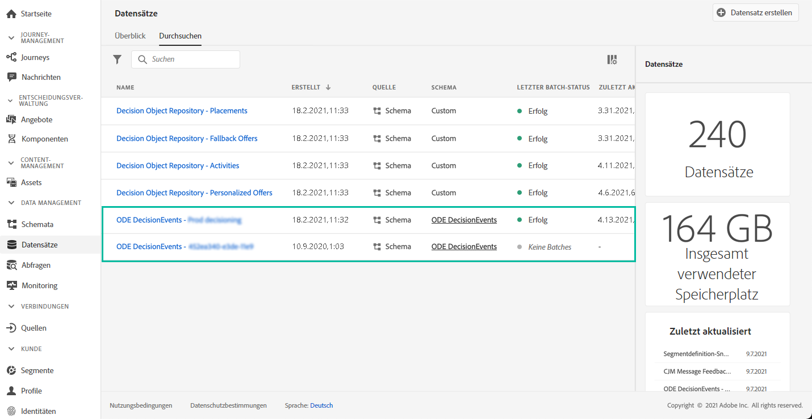

# Erste Schritte mit Entscheidungs-Management-Ereignissen {#monitor-offer-events}

Jedes Mal, wenn das Entscheidungs-Management eine Entscheidung für ein bestimmtes Profil trifft, werden Informationen zu diesen Ereignissen automatisch an Adobe Experience Platform gesendet.

Dies ermöglicht Ihnen, diese Daten zu exportieren, um sie in Ihrem eigenen Berichtssystem zu analysieren. Sie können den Adobe Experience Platform [Query Service](https://experienceleague.adobe.com/docs/experience-platform/query/home.html?lang=de) auch in Kombination mit anderen Tools für erweiterte Analyse- und Berichtszwecke nutzen.

Die Datensätze, die Entscheidungs-Management-Ereignisse enthalten, sind über das Menü **[!UICONTROL Datensätze]** in Adobe Experience Platform zugänglich. Für jede Ihrer Instanzen wird bei der Bereitstellung automatisch ein Datensatz erstellt.

Diese Datensätze basieren auf dem **[!UICONTROL ODE DecisionEvents]**-Schema, das alle XDM-Felder enthält, die erforderlich sind, um Informationen des Entscheidungs-Managements an Adobe Experience Platform zu senden.

>[!NOTE]
>
>Beachten Sie, dass es sich bei ODE DecisionEvents-Datensätzen um **Nicht-Profil-Datensätze** handelt, d. h. sie können nicht in Experience Platform aufgenommen werden, um vom Echtzeit-Kundenprofil verwendet zu werden.

**Verwandte Themen:**

* [Wichtige Informationen zu Entscheidungs-Management-Ereignissen](../reports/key-information.md)
* [Zugriff auf XDM-Felder von Ereignissen](../reports/xdm-fields.md)
