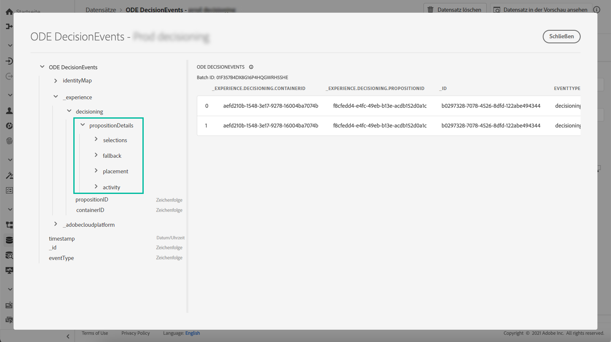

# Wichtige Informationen zu Entscheidungsverwaltungsereignissen {#events-key-information}

Jedes Ereignis, das bei einer Entscheidung gesendet wird, enthält vier wichtige Datenpunkte, die Sie für Analyse- und Berichtszwecke nutzen können.

* **[!UICONTROL Fallback]**: Name und ID des Fallback-Angebots, wenn kein personalisiertes Angebot ausgewählt wurde,
* **[!UICONTROL Placement]**: Name, ID und Kanal der Platzierung, die zur Bereitstellung des Angebots verwendet wird,
* **[!UICONTROL Selections]**: Name und Kennung des für das Profil ausgewählten Angebots,
* **[!UICONTROL Activity]**: Name und ID der Entscheidung.

Darüber hinaus können Sie auch die **[!UICONTROL identityMap]** und **[!UICONTROL Timestamp]** -Felder, um Informationen zum Profil und zum Zeitpunkt der Bereitstellung des Angebots abzurufen.

Weitere Informationen zu allen XDM-Feldern, die mit jeder Entscheidung gesendet werden, finden Sie unter [diesem Abschnitt](xdm-fields.md).
