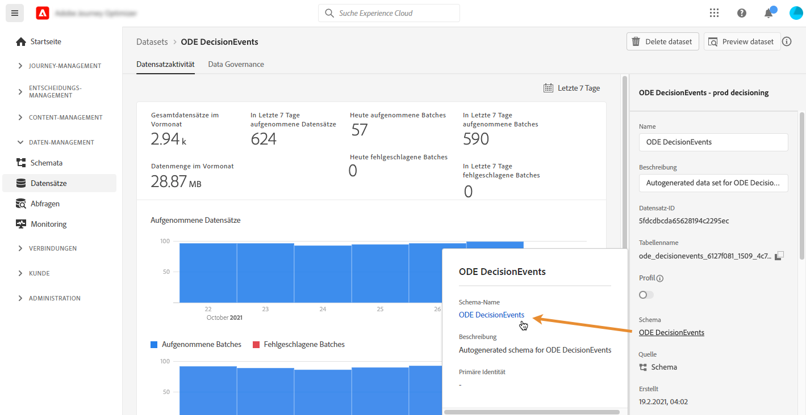
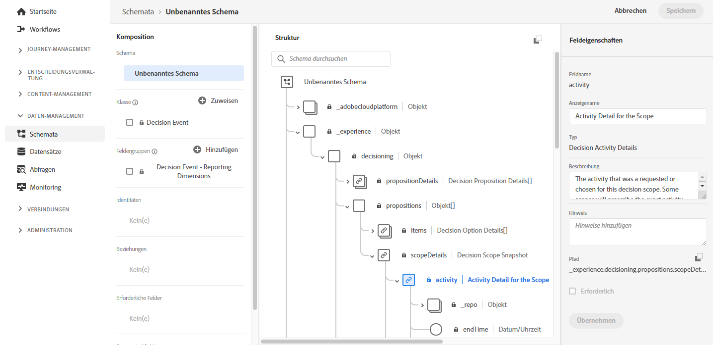

# Zugriff auf XDM-Felder von Ereignissen {#decisioningevents-xdm-schema}

Sie können direkt von einem Datensatz aus auf das XDM-Schema DecisioningEvents zugreifen, das Entscheidungs-Management-Ereignisse enthält.

Das Schema enthält alle Felder, die erforderlich sind, um Informationen vom Entscheidungs-Management an Adobe Experience Platform zu senden.

Um weitere Informationen zu einem bestimmten Feld zu erhalten, wählen Sie es aus, um ein Informationsfenster mit den Eigenschaften des Feldes anzuzeigen.

Detaillierte Informationen zur Arbeit mit XDM-Schemas und -Feldern finden Sie in der Dokumentation zum Experience-Datenmodell:

* [XDM-System – Übersicht](https://experienceleague.adobe.com/docs/experience-platform/xdm/home.html?lang=de)
* [XDM-Ressourcen](https://experienceleague.adobe.com/docs/experience-platform/xdm/ui/explore.html?lang=de)
