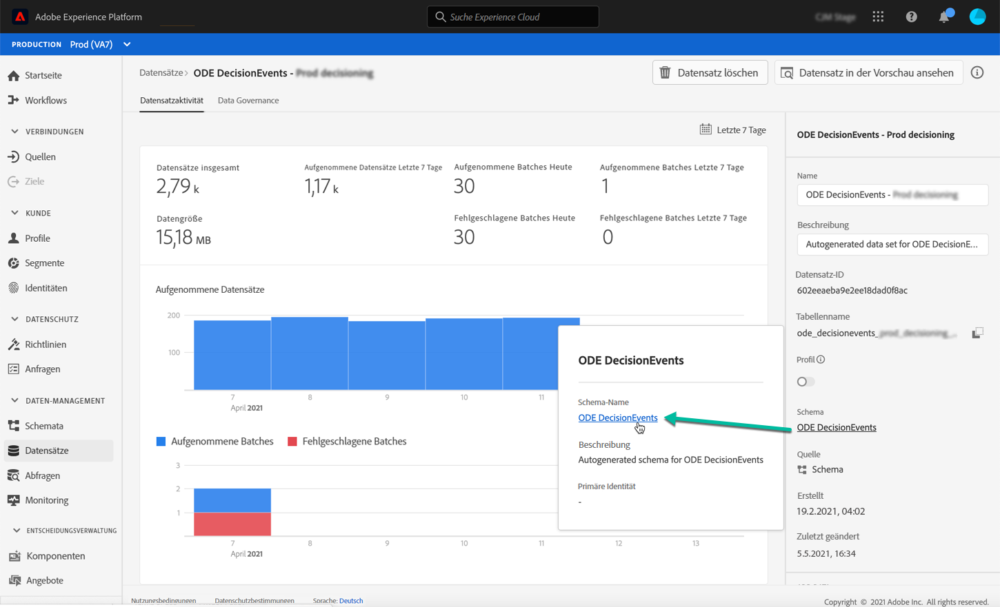
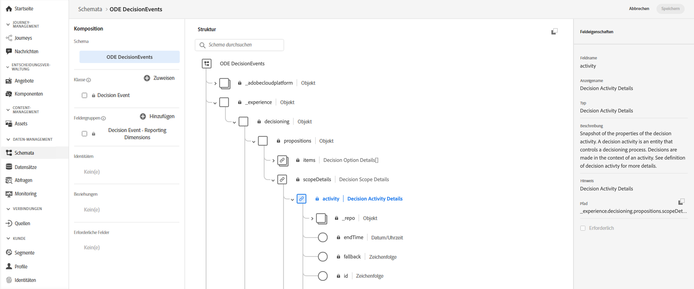

# Zugriff auf XDM-Felder von Ereignissen {#decisioningevents-xdm-schema}

Sie können das XDM-Schema von DecisionEvents direkt aus einem Datensatz mit Ereignissen zur Entscheidungsverwaltung aufrufen.

Das Schema enthält alle Felder, die zum Senden von Informationen aus der Entscheidungsverwaltung an Adobe Experience Platform erforderlich sind.

Um weitere Informationen zu einem bestimmten Feld zu erhalten, wählen Sie es aus, um ein Informationsfenster mit den Eigenschaften des Feldes anzuzeigen.

Detaillierte Informationen zur Arbeit mit XDM-Schemas und -Feldern finden Sie in der Dokumentation zum Experience-Datenmodell:

* [XDM-System – Übersicht](https://experienceleague.adobe.com/docs/experience-platform/xdm/home.html?lang=de)
* [XDM-Ressourcen](https://experienceleague.adobe.com/docs/experience-platform/xdm/ui/explore.html?lang=de)
