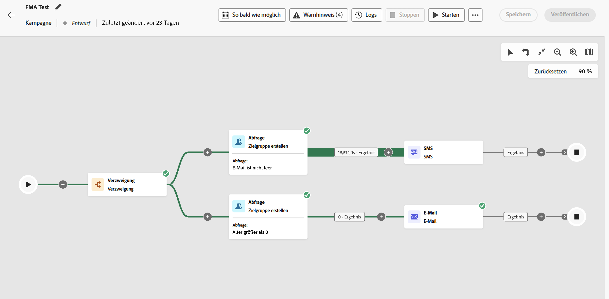

# Zugreifen auf orchestrierte Kampagnen und Verwalten dieser Kampagnen {#orchestrated-campaign-creation}

>[!CONTEXTUALHELP]
>id="ajo_targeting_workflow_list"
>title="Orchestrierte Kampagne"
>abstract="Auf diesem Bildschirm können Sie auf die vollständige Liste der orchestrierten Kampagnen zugreifen, ihren aktuellen Status sowie das Datum der letzten/nächsten Ausführung überprüfen und eine neue orchestrierte Kampagne erstellen."

>[!CONTEXTUALHELP]
>id="ajo_orchestration_campaign_action"
>title="Aktion"
>abstract="In diesem Abschnitt werden alle in der orchestrierten Kampagne verwendeten Aktionen aufgelistet."

+++ Inhaltsverzeichnis

| Willkommen bei orchestrierten Kampagnen | Starten Ihrer ersten orchestrierten Kampagne | Abfragen der Datenbank | Aktivitäten für orchestrierte Kampagnen |
|---|---|---|---|
| [Erste Schritte mit orchestrierten Kampagnen](gs-orchestrated-campaigns.md)  Erstellen und Verwalten von relationalen Schemata und Datensätzen:  <ul><li>[Erste Schritte mit Schemata und Datensätzen](gs-schemas.md)</li><li>[Manuelles Schema](manual-schema.md)</li><li>[Datei-Upload-Schema](file-upload-schema.md)</li><li>[Daten aufnehmen](ingest-data.md)</li></ul>  <b>[Zugriff und Verwaltung orchestrierter Kampagnen](access-manage-orchestrated-campaigns.md)</b>  [Die wichtigsten Schritte zum Erstellen einer orchestrierten Kampagne](gs-campaign-creation.md) | [Erstellen und Planen der Kampagne](create-orchestrated-campaign.md)  [Orchestrieren von Aktivitäten](orchestrate-activities.md)  [Starten und Überwachen der Kampagne](start-monitor-campaigns.md)  [Reporting](reporting-campaigns.md) | [Arbeiten mit dem Regel-Builder](orchestrated-rule-builder.md)  [Erstellen der ersten Abfrage](build-query.md)  [Bearbeiten von Ausdrücken](edit-expressions.md)  [Retargeting](retarget.md) | [Erste Schritte mit Aktivitäten](activities/about-activities.md)  Aktivitäten: [Und-Verknüpfung](activities/and-join.md) – [Zielgruppe erstellen](activities/build-audience.md) – [Dimensionsänderung](activities/change-dimension.md) – [Kanalaktivitäten](activities/channels.md) – [Kombinieren](activities/combine.md) – [Deduplizierung](activities/deduplication.md) – [Anreicherung](activities/enrichment.md) – [Verzweigung](activities/fork.md) – [Abstimmung](activities/reconciliation.md) – [Zielgruppe speichern](activities/save-audience.md) – [Aufspaltung](activities/split.md) – [Warten](activities/wait.md) |

{style="table-layout:fixed"}

+++

 

>[!BEGINSHADEBOX]

 

Der Inhalt dieser Seite ist nicht endgültig und kann geändert werden.

>[!ENDSHADEBOX]

## Zugreifen auf orchestrierte Kampagnen

Navigieren Sie zum Menü **[!UICONTROL Kampagnen]** und wählen Sie die Registerkarte **[!UICONTROL Orchestrierung]** aus, um auf die vollständige Liste der orchestrierten Kampagnen zuzugreifen.

{zoomable="yes"}{zoomable="yes"}

Zu jeder orchestrierten Kampagne in der Liste werden Informationen angezeigt, beispielsweise der aktuelle [Status](#status) der Kampagne, der zugehörige Kanal und zugehörige Tags oder der Zeitpunkt der letzten Änderung. Sie können die angezeigten Spalten anpassen, indem Sie auf die Schaltfläche  klicken.

Darüber hinaus stehen eine Suchleiste und Filter zur Verfügung, um die Suche innerhalb der Liste zu erleichtern. Sie können die orchestrierten Kampagnen beispielsweise so filtern, dass nur die einem Kanal oder Tag angehörenden oder die während eines bestimmten Datumsbereichs erstellten Kampagnen angezeigt werden.

Die Schaltfläche  im Kampagneninventar ermöglicht die Durchführung der folgenden Vorgänge.

* **[!UICONTROL Bericht für gesamte Zeit anzeigen]**/**[!UICONTROL Bericht für letzte 24 Stunden anzeigen]**: Greifen Sie auf Berichte zu, um die Wirkung und Leistung Ihrer orchestrierten Kampagnen zu messen und zu visualisieren. [Weitere Informationen über das Reporting zu orchestrierten Kampagnen](../orchestrated/reporting-campaigns.md)
* **[!UICONTROL Tags bearbeiten]**: Bearbeiten Sie die mit der Kampagne verknüpften Tags.
* **[!UICONTROL Duplizieren]**: In einigen Fällen kann es erforderlich sein, eine orchestrierte Kampagne zu duplizieren, beispielsweise um eine gestoppte Kampagne auszuführen oder um die Ausführungshäufigkeit einer geplanten Kampagne zu ändern.
* **[!UICONTROL Löschen]**: Löscht die Kampagne. Diese Aktion ist nur für Kampagnen im Status **[!UICONTROL Entwurf]** verfügbar.
* **[!UICONTROL Archivieren]**: Archiviert die Kampagne. Alle archivierten Kampagnen werden rollierend 30 Tage nach dem Datum ihrer letzten Änderung gelöscht. Diese Aktion ist für alle Kampagnen mit Ausnahme von Kampagnen im Status **[!UICONTROL Entwurf]** verfügbar.

## Inhalt einer orchestrierten Kampagne {#gs-ms-campaign-inside}

Die Arbeitsfläche für orchestrierte Kampagnen zeigt, was passieren soll. Sie beschreibt die verschiedenen Aufgaben, die ausgeführt und miteinander verknüpft werden sollen.

Jede orchestrierte Kampagne enthält:

* **Aktivitäten**: Eine Aktivität ist eine Aufgabe, die ausgeführt werden soll. Die verschiedenen verfügbaren Aktivitäten werden im Diagramm durch Symbole dargestellt. Jede Aktivität verfügt über bestimmte Eigenschaften sowie andere Eigenschaften, die für alle Aktivitäten gelten.

  In einem Diagramm mit orchestrierten Kampagnen kann eine bestimmte Aktivität verschiedene Aufgaben auslösen, insbesondere wenn Schleifen oder wiederkehrende Aktionen vorhanden sind.

* **Transitionen**: Transitionen verknüpfen eine Quellaktivität mit einer Zielaktivität und definieren deren Sequenz.

* **Arbeitstabellen**: Die Arbeitstabelle enthält alle von der Transition übermittelten Informationen. Jede orchestrierte Kampagne verwendet mehrere Arbeitstabellen. Die in diesen Tabellen enthaltenen Daten können während des gesamten Lebenszyklus der orchestrierten Kampagne verwendet werden.

## Kampagnenstatus {#status}

Orchestrierte Kampagnen können mehrere Status aufweisen:

* **[!UICONTROL Entwurf]**: Die orchestrierte Kampagne wurde erstellt. Sie wurde noch nicht veröffentlicht.
* **[!UICONTROL Wird veröffentlicht]**: Die orchestrierte Kampagne wird gerade veröffentlicht.
* **[!UICONTROL Live]**: Die orchestrierte Kampagne wurde veröffentlicht und wird ausgeführt.
* **[!UICONTROL Geplant]**: Die Ausführung der orchestrierten Kampagne wurde geplant.
* **[!UICONTROL Abgeschlossen]**: Die Ausführung der orchestrierten Kampagne ist abgeschlossen. Der Status „Abgeschlossen“ wird einer Kampagne automatisch bis zu 3 Tage nach dem fehlerfreien Versand von Nachrichten zugewiesen.
* **[!UICONTROL Geschlossen]**: Dieser Status wird angezeigt, wenn eine wiederkehrende Kampagne geschlossen wurde. Die Kampagne wird ausgeführt, bis alle Aktivitäten abgeschlossen sind, aber es können keine weiteren Profile in die Kampagne eintreten.
* **[!UICONTROL Archiviert]**: Die orchestrierte Kampagne wurde archiviert. Alle archivierten Kampagnen werden rollierend 30 Tage nach dem Datum ihrer letzten Änderung gelöscht. Sie können eine archivierte Kampagne bei Bedarf duplizieren, um sie weiter zu bearbeiten.
* **[!UICONTROL Gestoppt]**: Die Ausführung der orchestrierten Kampagne wurde gestoppt. Um die Kampagne erneut zu starten, müssen Sie sie duplizieren.
