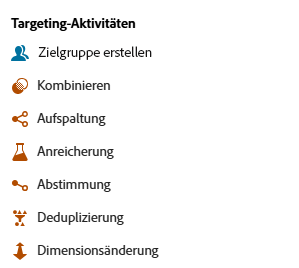

# Über orchestrierte Kampagnenaktivitäten {#orchestrated-campaign-activities}

Orchestrierte Kampagnenaktivitäten werden in drei Kategorien unterteilt. Je nach Kontext können die verfügbaren Aktivitäten unterschiedlich sein.

Alle Aktivitäten werden in den folgenden Abschnitten beschrieben:

* [Aktivitäten zur Zielgruppenbestimmung](#targeting)
* [Kanalaktivitäten](#channel)
* [Aktivitäten zur Flusssteuerung](#flow-control)

{width="80%" align="left"}

## Aktivitäten zur Zielgruppenbestimmung {#targeting}

Diese Aktivitäten sind spezifisch für die Zielgruppenbestimmung. Sie ermöglichen es Ihnen, ein oder mehrere Ziele zu erstellen, indem Sie eine Zielgruppe definieren und diese Zielgruppen mithilfe von Schnittmenge, Vereinigung oder Ausschluss aufteilen oder kombinieren.

{width="40%" align="left"}

* [Zielgruppe erstellen](build-audience.md): Mit dieser Aktivität definieren Sie Ihre Zielpopulation. Sie können entweder eine bestehende Zielgruppe auswählen oder den Abfrage-Modeler verwenden, um Ihre eigene Abfrage zu definieren.
* [Dimensionsänderung](change-dimension.md): Ändern Sie die Zielgruppendimension beim Erstellen Ihrer orchestrierten Kampagne.
* [Kombinieren](combine.md): Mit dieser Aktivität segmentieren Sie Ihre eingehende Population. Sie können eine Vereinigung, eine Schnittmenge oder einen Ausschluss verwenden.
* [Deduplizierung](deduplication.md): Mit dieser Aktivität löschen Sie Dubletten in Ergebnissen aus eingehenden Aktivitäten.
* [Anreicherung](enrichment.md): Definieren Sie zusätzliche Daten, die in Ihrer orchestrierten Kampagne verarbeitet werden sollen. Mit dieser Aktivität können Sie die eingehende Transition nutzen und die Aktivität so konfigurieren, dass sie die ausgehende Transition mit zusätzlichen Daten ergänzt.
* [Abstimmung](reconciliation.md) Definieren Sie die Relation zwischen den Daten in Journey Optimizer und den Daten in einer Arbeitstabelle, z. B. Daten aus einer externen Datei.
* [Aufspaltung](split.md): Segmentieren Sie die eingehende Population in mehrere Teilmengen.

## Kanalaktivitäten {#channel}

Mit Adobe Journey Optimizer können Sie Marketing-Kampagnen über mehrere Kanäle hinweg automatisieren und ausführen. Sie können Kanalaktivitäten in der Arbeitsfläche kombinieren, um eine kanalübergreifende orchestrierte Kampagne zu erstellen, mit der Trigger-Aktionen basierend auf dem Kundenverhalten erstellt werden können. Es sind folgende **Kanalaktivitäten** verfügbar: E-Mail-, SMS-, Android- und iOS-Push-Benachrichtigungen. [Erfahren Sie, wie Sie im Kontext einer orchestrierten Kampagne eine Kanalaktion erstellen](channels.md).

## Aktivitäten zur Flusssteuerung {#flow-control}

>[!CONTEXTUALHELP]
>id="ajo_orchestration_end"
>title="Endaktivität"
>abstract="Mit der Aktivität **Ende** können Sie das Ende einer orchestrierten Kampagne grafisch markieren. Diese Aktivität hat keine funktionalen Auswirkungen und ist daher optional."

{width="30%" align="left"}

Die folgenden Aktivitäten sind spezifisch für die Organisation und Ausführung orchestrierter Kampagnen. Ihre Hauptaufgabe ist es, die anderen Aktivitäten zu koordinieren:

* [Und-Verknüpfung](and-join.md): Synchronisieren Sie mehrere Ausführungszweige einer orchestrierten Kampagne.
* [Verzweigung](fork.md): Erstellen Sie ausgehende Transitionen, um mehrere Aktivitäten gleichzeitig zu starten.
  <!--* [Test](test.md): Enable transitions based on specified conditions.-->
* [Warten](wait.md): Hält die Ausführung eines Teils einer orchestrierten Kampagne vorübergehend an.

>[!NOTE]
>Die **Ende**-Aktivität markiert grafisch das Ende einer orchestrierten Kampagne. Diese Aktivität hat keine funktionalen Auswirkungen und ist daher optional.
