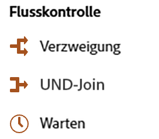

# Über Aktivitäten orchestrierter Kampagnen {#orchestrated-campaign-activities}

Aktivitäten orchestrierter Kampagnen sind in drei Kategorien unterteilt. Je nach Kontext können die verfügbaren Aktivitäten unterschiedlich sein.

Alle Aktivitäten werden in den folgenden Abschnitten beschrieben:

* [Targeting-Aktivitäten](#targeting)
* [Kanalaktivitäten](#channel)
* [Aktivitäten zur Flusssteuerung](#flow-control)

{width="80%" align="left"}

>[!NOTE]
>
>* Je nach Ihrem Lizenzmodell, Ihren Berechtigungen und Ihrer Implementierung können die verfügbaren Aktivitäten unterschiedlich sein.
>
>* Die Anzahl der Aktivitäten in einer orchestrierten Kampagne ist auf maximal 500 begrenzt. 

## Targeting-Aktivitäten {#targeting}

Diese Aktivitäten sind spezifisch für die Zielgruppenbestimmung. Sie ermöglichen es Ihnen, ein oder mehrere Ziele zu erstellen, indem Sie eine Zielgruppe definieren und diese Zielgruppen mithilfe von Schnittmenge, Vereinigung oder Ausschluss aufteilen oder kombinieren.

{width="40%" align="left"}

Die verfügbaren Aktivitäten zur Zielgruppenbestimmung sind:

* [Zielgruppe erstellen](build-audience.md): Mit dieser Aktivität definieren Sie Ihre Zielpopulation. Sie können entweder eine vorhandene Zielgruppe auswählen oder den Regel-Builder verwenden, um Ihre eigene Abfrage zu definieren.
* [Dimensionsänderung](change-dimension.md): Mit dieser Aktivität ändern Sie die Zielgruppendimension, während Sie Ihre orchestrierte Kampagne erstellen.
* [Kombinieren](combine.md): Mit dieser Aktivität segmentieren Sie Ihre eingehende Population. Sie können eine Vereinigung, eine Schnittmenge oder einen Ausschluss verwenden.
* [Deduplizierung](deduplication.md): Mit dieser Aktivität löschen Sie Duplikate in Ergebnissen aus eingehenden Aktivitäten.
* [Anreicherung](enrichment.md): Mit dieser Aktivität definieren Sie zusätzliche Daten, die in Ihrer orchestrierten Kampagne verarbeitet werden sollen. Mit dieser Aktivität können Sie die eingehende Transition nutzen und die Aktivität so konfigurieren, dass sie die ausgehende Transition mit zusätzlichen Daten ergänzt.
* [Abstimmung](reconciliation.md): Mit dieser Aktivität definieren Sie die Verknüpfung zwischen den Journey Optimizer-Daten und den Daten in einer Arbeitstabelle, z. B. Daten, die aus einer externen Datei geladen wurden.
* [Aufspaltung](split.md): Segmentieren Sie die eingehende Population in mehrere Teilmengen.

## Kanalaktivitäten {#channel}

In Adobe Journey Optimizer können Sie Marketing-Kampagnen automatisieren und über mehrere Kanäle hinweg ausführen. Sie können [Kanalaktivitäten](channels.md) auf der Arbeitsfläche kombinieren, um orchestrierte Cross-Channel-Kampagnen zu erstellen, bei denen je nach Kundenverhalten Aktionen ausgelöst werden können. 

Erfahren Sie, wie Sie [in einer orchestrierten Kampagne eine Kanalaktion erstellen](channels.md).

## Aktivitäten zur Flusssteuerung {#flow-control}

>[!CONTEXTUALHELP]
>id="ajo_orchestration_end"
>title="Endaktivität"
>abstract="Mit der Aktivität **Ende** können Sie das Ende einer orchestrierten Kampagne grafisch markieren. Diese Aktivität hat keine funktionalen Auswirkungen und ist daher optional."

>[!CONTEXTUALHELP]
>id="ajo_orchestration_signal"
>title="Externes Signal"
>abstract="Externes Signal"

Die folgenden Aktivitäten dienen der Organisation und Ausführung von orchestrierten Kampagnen. Ihre Hauptaufgabe besteht darin, die anderen Aktivitäten zu koordinieren.

{width="20%" align="left"}

Verfügbare Flusssteuerungsaktivitäten sind:

* [Und-Verknüpfung](and-join.md): Mit dieser Aktivität synchronisieren Sie mehrere Ausführungsverzweigungen einer orchestrierten Kampagne.
* [Verzweigung](fork.md): Erstellen Sie ausgehende Transitionen, um mehrere Aktivitäten gleichzeitig zu starten.
* [Warten](wait.md): Mit dieser Aktivität pausieren Sie die Ausführung eines Teils einer orchestrierten Kampagne vorübergehend.
  <!--* [Test](test.md): Enable transitions based on specified conditions.-->

>[!NOTE]
>Mit der Aktivität **Ende** können Sie das Ende einer orchestrierten Kampagne grafisch markieren. Diese Aktivität hat keine funktionalen Auswirkungen und ist daher optional.
