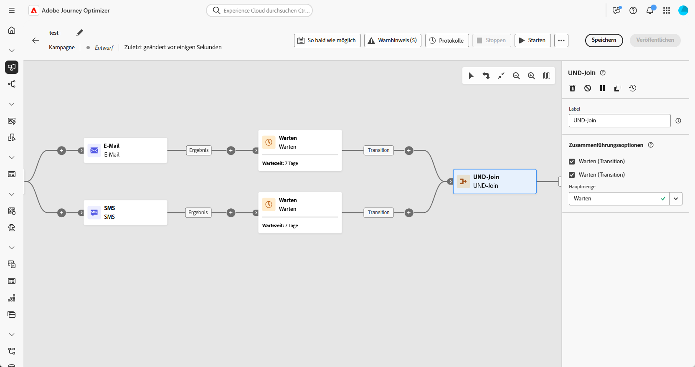
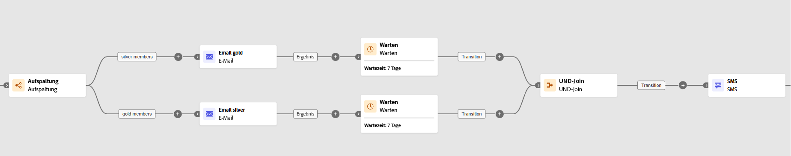

# Und-Verknüpfung {#join}

>[!CONTEXTUALHELP]
>id="ajo_orchestration_and-join"
>title="Aktivität „UND-Verknüpfung“"
>abstract="Mit der Aktivität **Und-Verknüpfung** können Sie die Ausführung verschiedener Verzweigungen einer orchestrierten Kampagne synchronisieren. Sie wird ausgelöst, sobald alle vorangehenden Aktivitäten beendet sind. Auf diese Weise können Sie sicherstellen, dass bestimmte Aktivitäten abgeschlossen sind, bevor Sie mit der Ausführung der orchestrierten Kampagne fortfahren."

Die Aktivität **[!UICONTROL Und-Verknüpfung]** ist eine Aktivität zur **[!UICONTROL Flusskontrolle]**. Mit ihr können Sie die Ausführung verschiedener Verzweigungen einer orchestrierten Kampagne synchronisieren. 

Diese Aktivität löst ihre ausgehende Transition erst aus, wenn alle eingehenden Transitionen aktiviert sind, d. h. wenn alle vorangegangenen Aktivitäten beendet sind. So können Sie sicherstellen, dass bestimmte Aktivitäten abgeschlossen wurden, bevor Sie mit der Ausführung der orchestrierten Kampagne fortfahren.

## Konfigurieren der Aktivität „Und-Verknüpfung“{#and-join-configuration}

>[!CONTEXTUALHELP]
>id="ajo_orchestration_and-join_merging"
>title="Zusammenführungssoptionen"
>abstract="Wählen Sie die Aktivitäten aus, die Sie verknüpfen möchten. Wählen Sie in der Dropdown-Liste **Hauptmenge** die Population der eingehenden Transition aus, die Sie beibehalten möchten."

Führen Sie die folgenden Schritte aus, um die Aktivität **[!UICONTROL Und-Verknüpfung]** zu konfigurieren:

1. Fügen Sie mehrere Aktivitäten wie z. B. Kanalaktivitäten hinzu, um mindestens zwei verschiedene Ausführungsverzweigungen zu erstellen.

1. Fügen Sie eine Aktivität des Typs **[!UICONTROL Und-Verknüpfung]** zu einer der Verzweigungen hinzu.

1. Wählen Sie im Abschnitt **[!UICONTROL Zusammenführungsoptionen]** alle vorherigen Aktivitäten aus, die Sie verknüpfen möchten.

1. Wählen Sie in der Dropdown-Liste **[!UICONTROL Hauptmenge]** die Population der eingehenden Transition aus, die Sie beibehalten möchten. 

## Beispiel{#and-join-example}

Dieses Beispiel zeigt zwei koordinierte Kampagnenverzweigungen, von denen jede einen E-Mail-Versand enthält, wobei sich der eine an Gold-Mitglieder und der andere an Silber-Mitglieder richtet. Die **[!UICONTROL UND-Verknüpfung]** wird aktiviert, sobald beide eingehenden Transitionen ausgelöst werden, und die SMS wird erst nach Abschluss beider E-Mail-Sendungen und einer Verzögerung von 7 Tagen gesendet.

{zoomable="yes"}
