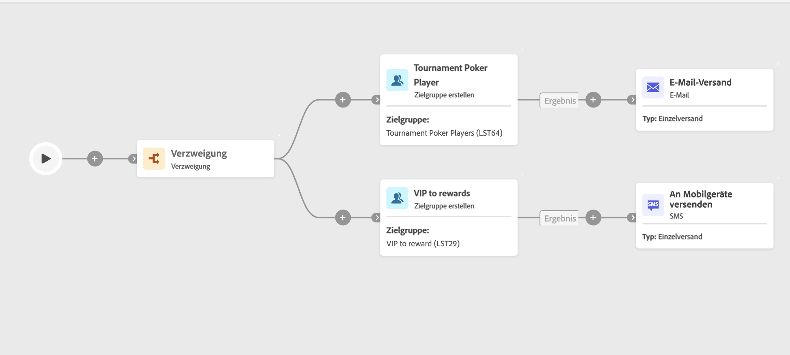

# Zielgruppe erstellen {#build-audience}

>[!CONTEXTUALHELP]
>id="ajo_orchestration_build_audience"
>title="Aktivität „Zielgruppe erstellen“"
>abstract="Mit der Aktivität **Zielgruppe erstellen** können Sie die Zielgruppe definieren, die in die orchestrierte Kampagne aufgenommen wird. Beim Senden von Nachrichten im Rahmen einer orchestrierten Kampagne wird die Nachrichtenzielgruppe nicht in der Kanalaktivität, sondern in der Aktivität **Zielgruppe erstellen** definiert."

+++ Inhaltsverzeichnis

| Willkommen bei koordinierten Kampagnen | Starten der ersten orchestrierten Kampagne | Abfragen der Datenbank | Orchestrierte Kampagnenaktivitäten |
|---|---|---|---|
| [Erste Schritte mit orchestrierten Kampagnen](../gs-orchestrated-campaigns.md)  [Konfigurationsschritte](../configuration-steps.md)  [Schlüsselschritte für die orchestrierte Kampagnenerstellung](../gs-campaign-creation.md) | [Orchestrierte Kampagne erstellen](../create-orchestrated-campaign.md)  [Aktivitäten orchestrieren](../orchestrate-activities.md)  [ Nachrichten mit orchestrierten Kampagnen senden](../send-messages.md)  [Kampagne starten und überwachen](../start-monitor-campaigns.md)  [Reporting](../reporting-campaigns.md) | [Arbeiten mit der Abfrage Modeler](../orchestrated-query-modeler.md)  [Erstellen Sie Ihre ersten ](../build-query.md)  [-Bearbeitungsausdrücke](../edit-expressions.md) | [Erste Schritte mit Aktivitäten](about-activities.md)  Aktivitäten: [Und-Verknüpfung](and-join.md) - [Zielgruppe aufbauen](build-audience.md) - [Dimensionsänderung](change-dimension.md) - [Kombinieren](combine.md) - [Deduplizierung](enrichment.md) - [Verzweigung](fork.md) - [Abstimmung](reconciliation.md) - [Aufspaltung](split.md) Warten](deduplication.md) [ |

{style="table-layout:fixed"}

+++

  

Als Marketing-Experte können Sie mithilfe einer benutzerfreundlichen Oberfläche mühelos komplexe Abfragen erstellen, sodass ich Ihre Audience anhand einer Vielzahl von Kriterien und Verhaltensweisen segmentieren kann, um Ihre Kampagnen effektiver anzupassen.

Verwenden Sie dazu die Zielgruppenbestimmungsaktivität **Zielgruppe aufbauen**. Mit dieser Aktivität können Sie die Audience definieren, die in die orchestrierte Kampagne eintritt. Beim Senden von Nachrichten im Rahmen einer orchestrierten Kampagne wird die Nachrichtenzielgruppe nicht in der Kanalaktivität, sondern in der Aktivität **Zielgruppe erstellen** definiert.

Zur Definition der Zielgruppenpopulation haben Sie folgende Möglichkeiten:

* Eine vorhandene Audience auswählen.
* Einen vordefinierten Filter auswählen.
* Erstellen Sie mit dem Abfrage-Modeler eine neue Zielgruppe, indem Sie Filterkriterien definieren und kombinieren.

>[!NOTE]
>
>Zielgruppen, die aus einer Datei geladen wurden, können nicht mit der Aktivität „Zielgruppe erstellen“ angesprochen werden. Dazu müssen Sie eine Aktivität „Datei laden **und** eine Aktivität **Abstimmung“**.

## Konfigurieren der Aktivität „Zielgruppe erstellen“ {#build-audience-configuration}

>[!CONTEXTUALHELP]
>id="ajo_orchestration_build_audience_audienceselector"
>title="Zielgruppe"
>abstract="Wählen Sie Ihre Zielgruppe auf die gleiche Weise aus wie beim Entwerfen eines neuen Versands."

Führen Sie die folgenden Schritte aus, um die Aktivität **Zielgruppe erstellen** zu konfigurieren:

1. Fügen Sie die Aktivität **Zielgruppe erstellen** hinzu.
1. Definieren Sie einen Titel.
1. Definieren Sie die Art der Zielgruppe: **Eigene erstellen** oder **Zielgruppe lesen**.
1. Konfigurieren Sie Ihre Zielgruppe anhand der Schritte in den unten stehenden Registerkarten.

Gehen Sie wie folgt vor, um Ihre eigene Abfrage zu erstellen:

1. Wählen Sie **Eigene erstellen (Abfrage)** aus.
1. Wählen Sie die **Zielgruppendimension**. Die Zielgruppendimension ermöglicht die Bestimmung der vom Vorgang betroffenen Population: Empfängerinnen und Empfänger, Vertragsbegünstigte, Benutzerinnen und Benutzer, Abonnentinnen und Abonnenten usw. Standardmäßig wird die Zielgruppe aus den Empfängerinnen und Empfängern ausgewählt.
1. Klicken Sie auf **Fortfahren**.
1. Verwenden Sie den Abfrage-Modellierer, um Ihre Abfrage zu definieren. [Weitere Informationen zum Abfrage-Modellierer finden Sie in diesem Abschnitt](../orchestrated-query-modeler.md)

## Beispiele{#build-audience-examples}

Im Folgenden finden Sie ein Beispiel für eine orchestrierte Kampagne mit zwei Aktivitäten **Zielgruppe aufbauen**. Die erste Version richtet sich an die Zielgruppe derjenigen, die Poker spielen, gefolgt von einem E-Mail-Versand. Die zweite Version ist die Zielgruppe der VIP-Kundinnen und -Kunden, gefolgt von einem SMS-Versand.

