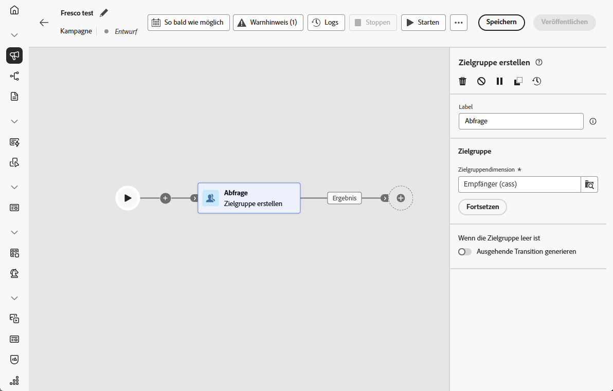
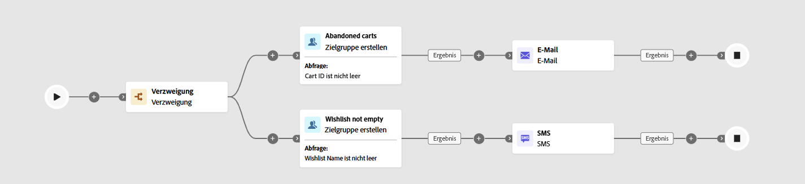

# Zielgruppe erstellen {#build-audience}

>[!CONTEXTUALHELP]
>id="ajo_orchestration_build_audience"
>title="Aktivität „Zielgruppe erstellen“"
>abstract="Mit der Aktivität **Zielgruppe erstellen** können Sie die Zielgruppe definieren, die in die orchestrierte Kampagne aufgenommen wird. Beim Senden von Nachrichten im Rahmen einer orchestrierten Kampagne wird die Nachrichtenzielgruppe nicht in der Kanalaktivität, sondern in der Aktivität **Zielgruppe erstellen** definiert."

+++ Inhaltsverzeichnis

| Willkommen bei koordinierten Kampagnen | Starten der ersten orchestrierten Kampagne | Abfragen der Datenbank | Orchestrierte Kampagnenaktivitäten |
|---|---|---|---|
| [Erste Schritte mit orchestrierten Kampagnen](../gs-orchestrated-campaigns.md)  [Konfigurationsschritte](../configuration-steps.md)  [Schlüsselschritte für die orchestrierte Kampagnenerstellung](../gs-campaign-creation.md) | [Orchestrierte Kampagne erstellen](../create-orchestrated-campaign.md)  [Aktivitäten orchestrieren](../orchestrate-activities.md)  [ Nachrichten mit orchestrierten Kampagnen senden](../send-messages.md)  [Kampagne starten und überwachen](../start-monitor-campaigns.md)  [Reporting](../reporting-campaigns.md) | [Arbeiten mit der Abfrage Modeler](../orchestrated-query-modeler.md)  [Erstellen Sie Ihre ersten ](../build-query.md)  [-Bearbeitungsausdrücke](../edit-expressions.md) | [Erste Schritte mit Aktivitäten](about-activities.md)  Aktivitäten: [Und-Verknüpfung](and-join.md) - [Zielgruppe aufbauen](build-audience.md) - [Dimensionsänderung](change-dimension.md) - [Kombinieren](combine.md) - [Deduplizierung](enrichment.md) - [Verzweigung](fork.md) - [Abstimmung](reconciliation.md) - [Aufspaltung](split.md) [&#128279;](wait.md) Warten[&#128279;](deduplication.md)  |

{style="table-layout:fixed"}

+++

 

Als Marketing-Experte können Sie komplexe Zielgruppensegmente über eine intuitive Benutzeroberfläche erstellen, mit der Sie Benutzende anhand einer Vielzahl von Kriterien und Verhaltensweisen ansprechen können, um Ihre Kampagnen effektiver anzupassen.

Verwenden Sie dazu die Zielgruppenbestimmungsaktivität **Zielgruppe aufbauen**. Diese Aktivität definiert die Audience, die in die orchestrierte Kampagne eintritt. Beim Versand von Nachrichten im Rahmen einer orchestrierten Kampagne wird die Zielgruppe in der Aktivität **Zielgruppe aufbauen** definiert, nicht innerhalb der orchestrierten Kampagne.

## Konfigurieren der Aktivität „Zielgruppe erstellen“ {#build-audience-configuration}

>[!CONTEXTUALHELP]
>id="ajo_orchestration_build_audience_audienceselector"
>title="Zielgruppe"
>abstract="Wählen Sie Ihre Zielgruppe auf die gleiche Weise aus wie beim Entwerfen eines neuen Versands."

Führen Sie die folgenden Schritte aus, um die Aktivität **Zielgruppe erstellen** zu konfigurieren:

1. Fügen Sie die Aktivität **Zielgruppe erstellen** hinzu.

   

1. Definieren Sie einen Titel.

1. Konfigurieren Sie Ihre Zielgruppe anhand der Schritte in den unten stehenden Registerkarten.

1. Wählen Sie die **Zielgruppendimension**. Die Zielgruppendimension ermöglicht die Bestimmung der vom Vorgang betroffenen Population: Empfängerinnen und Empfänger, Vertragsbegünstigte, Benutzerinnen und Benutzer, Abonnentinnen und Abonnenten usw. Standardmäßig wird die Zielgruppe aus den Empfängerinnen und Empfängern ausgewählt.

1. Klicken Sie auf **Fortfahren**.

1. Verwenden Sie den Abfrage-Modellierer, um Ihre Abfrage zu definieren. [Weitere Informationen zum Abfrage-Modellierer finden Sie in diesem Abschnitt](../orchestrated-query-modeler.md)

1. Geben Sie an, ob eine ausgehende Transition erzeugt werden soll, wenn die Audience leer ist.

## Beispiele{#build-audience-examples}

Im Folgenden finden Sie ein Beispiel für eine orchestrierte Kampagne mit zwei Aktivitäten **Zielgruppe aufbauen**. Die erste richtet sich an Profile, die Artikel in ihrem Warenkorb haben, gefolgt von einem E-Mail-Versand. Die zweite betrifft Profile mit einer Wunschliste, gefolgt von einem SMS-Versand.

