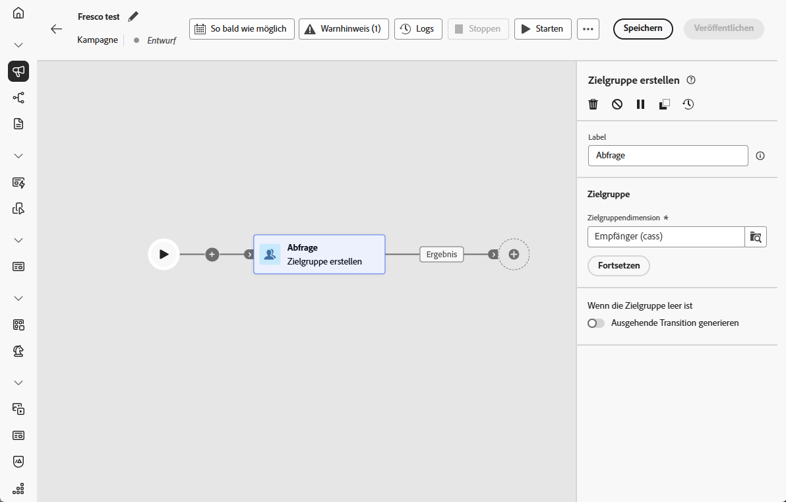
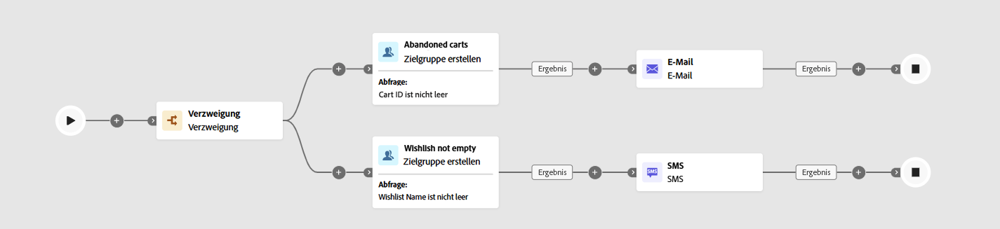
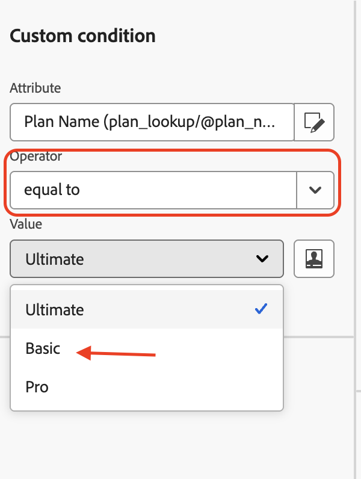

# Erstellen einer Zielgruppe {#build-audience}

>[!CONTEXTUALHELP]
>id="ajo_orchestration_build_audience"
>title="Aktivität „Zielgruppe erstellen“"
>abstract="Mit der Aktivität **Zielgruppe erstellen** können Sie die Zielgruppe definieren, die in die orchestrierte Kampagne eintritt. Beim Senden von Nachrichten im Rahmen einer orchestrierten Kampagne wird die Nachrichtenzielgruppe nicht in der Kanalaktivität, sondern in der Aktivität **Zielgruppe erstellen** definiert."

Als Marketing-Fachkraft können Sie komplexe Zielgruppensegmente über eine intuitive Benutzeroberfläche erstellen, mit der Sie Benutzende anhand einer Vielzahl von Kriterien und Verhaltensweisen ansprechen können, um Ihre Kampagnen effektiver anzupassen.

Verwenden Sie dazu die Targeting-Aktivität **[!UICONTROL Zielgruppe erstellen]**. Mit dieser Aktivität wird die Zielgruppe definiert, die in die orchestrierte Kampagne eintritt. Beim Versand von Nachrichten im Rahmen einer orchestrierten Kampagne wird die Zielgruppe in der Aktivität **[!UICONTROL Zielgruppe erstellen]** definiert, nicht innerhalb der orchestrierten Kampagne.

## Konfigurieren der Aktivität „Zielgruppe erstellen“ {#build-audience-configuration}

>[!CONTEXTUALHELP]
>id="ajo_orchestration_build_audience_audienceselector"
>title="Zielgruppe"
>abstract="Wählen Sie Ihre Zielgruppe auf die gleiche Weise aus wie beim Entwerfen eines neuen Versands."

Führen Sie die folgenden Schritte aus, um die Aktivität **[!UICONTROL Zielgruppe erstellen]** zu konfigurieren:

1. Fügen Sie die Aktivität **[!UICONTROL Zielgruppe erstellen]** hinzu.

   

1. Definieren Sie ein **[!UICONTROL Label]**.

1. Konfigurieren Sie Ihre Zielgruppe anhand der Schritte in den unten stehenden Registerkarten.

1. Wählen Sie die **[!UICONTROL Zielgruppendimension]**. Mit der Zielgruppendimension können Sie die Population definieren, auf die sich der Vorgang bezieht: Empfängerinnen und Empfänger, Vertragsbegünstigte, Benutzerinnen und Benutzer, Abonnentinnen und Abonnenten usw. Standardmäßig wird die Zielgruppe aus den Empfängerinnen und Empfängern ausgewählt.

1. Klicken Sie auf **[!UICONTROL Fortfahren]**.

1. Definieren Sie mithilfe des Regel-Builders Ihre Abfrage. [Weitere Informationen zum Regel-Builder finden Sie in diesem Abschnitt](../orchestrated-rule-builder.md).

1. Geben Sie an, ob eine ausgehende Transition erzeugt werden soll, wenn die Zielgruppe leer ist.

## Beispiele{#build-audience-examples}

Im Folgenden finden Sie ein Beispiel für eine orchestrierte Kampagne mit zwei Aktivitäten vom Typ **[!UICONTROL Zielgruppe erstellen]**. Die erste richtet sich an Profile, in deren Warenkorb sich Artikel befinden. Hier folgt ein E-Mail-Versand. Die zweite richtet sich an Profile mit einer Wunschliste. Hier folgt ein SMS-Versand.

Im folgenden Beispiel verwendet die Aktivität **[!UICONTROL Zielgruppe aufbauen]** den Regel-Builder, um Profile nach ihrem Abonnementplan zu filtern. Für das `plan`-Attribut wird eine Bedingung festgelegt, die so festgelegt ist, dass nur Profile einbezogen werden, bei denen `plan = "basic"`, wodurch die Zielgruppe auf Abonnenten der untersten Ebene eingeschränkt wird, bevor sie an die nächste Aktivität übergeben wird.

{width="50%"}
