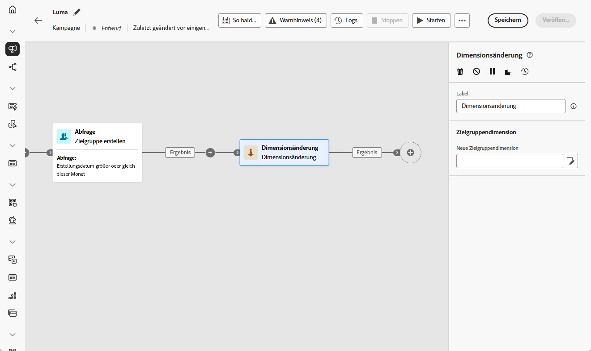
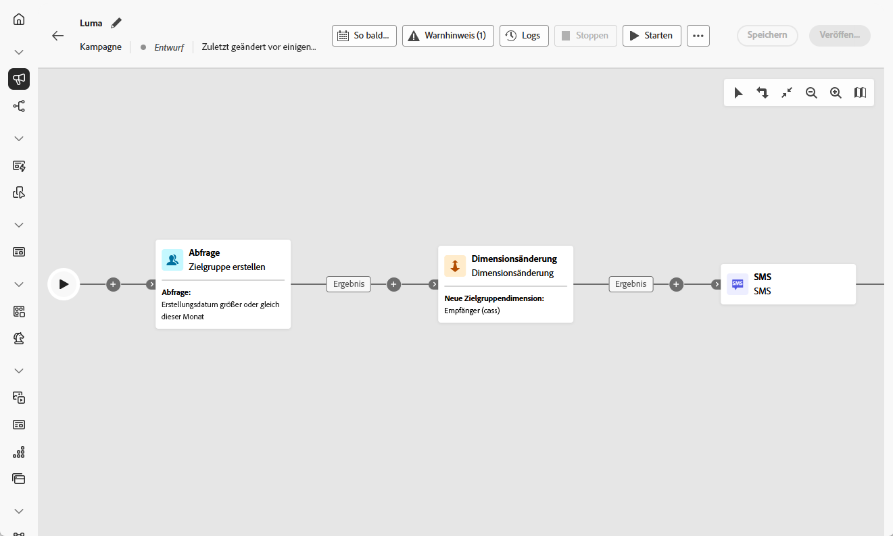

# Ändern der Dimension {#change-dimension}

>[!CONTEXTUALHELP]
>id="ajo_orchestration_dimension_complement"
>title="Erzeugen eines Komplements"
>abstract="Sie können eine zusätzliche ausgehende Transition mit der verbleibenden Population generieren, die als Duplikat ausgeschlossen wurde. Schalten Sie dazu die Option **Komplement erzeugen** ein"

>[!CONTEXTUALHELP]
>id="ajo_orchestration_change_dimension"
>title="Aktivität „Dimensionsänderung“"
>abstract="Mithilfe dieser Aktivität können Sie die Zielgruppendimension beim Erstellen einer Zielgruppe ändern. Diese Aktivität verschiebt die Achse je nach Datenvorlage und der Eingabedimension. Beispielsweise können Sie von der Dimension „Verträge“ zur Dimension „Kundinnen und Kunden“ wechseln."

+++ Inhaltsverzeichnis

| Willkommen bei koordinierten Kampagnen | Starten der ersten orchestrierten Kampagne | Abfragen der Datenbank | Orchestrierte Kampagnenaktivitäten |
|---|---|---|---|
| [Erste Schritte mit orchestrierten Kampagnen](../gs-orchestrated-campaigns.md)  [Konfigurationsschritte](../configuration-steps.md)  [Schlüsselschritte für die orchestrierte Kampagnenerstellung](../gs-campaign-creation.md) | [Orchestrierte Kampagne erstellen](../create-orchestrated-campaign.md)  [Aktivitäten orchestrieren](../orchestrate-activities.md)  [ Nachrichten mit orchestrierten Kampagnen senden](../send-messages.md)  [Kampagne starten und überwachen](../start-monitor-campaigns.md)  [Reporting](../reporting-campaigns.md) | [Arbeiten mit der Abfrage Modeler](../orchestrated-query-modeler.md)  [Erstellen Sie Ihre ersten ](../build-query.md)  [-Bearbeitungsausdrücke](../edit-expressions.md) | [Erste Schritte mit Aktivitäten](about-activities.md)  Aktivitäten: [Und-Verknüpfung](and-join.md) - [Zielgruppe aufbauen](build-audience.md) - [Dimensionsänderung](change-dimension.md) - [Kombinieren](combine.md) - [Deduplizierung](enrichment.md) - [Verzweigung](fork.md) - [Abstimmung](reconciliation.md) - [Aufspaltung](split.md) [&#128279;](wait.md) Warten[&#128279;](deduplication.md)  |

{style="table-layout:fixed"}

+++

 

Als Marketing-Experte können Sie innerhalb einer orchestrierten Kampagne die Zielgruppendimension von einer Entität zu einer anderen verknüpften Entität wechseln und Ihre Zielgruppenbestimmung basierend auf verschiedenen Datensätzen einschränken, z. B. beim Wechsel von Profilbenutzern zur Zielgruppenbestimmung anhand ihrer spezifischen Aktionen oder Buchungen.

Verwenden Sie dazu die Zielgruppenbestimmungsaktivität **Dimension ändern**. Mit dieser Aktivität können Sie die Zielgruppendimension ändern, während Sie Ihre orchestrierte Kampagne erstellen. Die Achse wird je nach Datenvorlage und der Eingabedimension verschoben.

Sie können beispielsweise die Zielgruppendimension einer orchestrierten Kampagne von „Profil“ in „Verträge“ ändern, um Nachrichten an den ausgewählten Vertragsinhaber zu senden.

<!--
>[!IMPORTANT]
>
>Please note that the **[!UICONTROL Change Dimension]** and **[!UICONTROL Change Data source]** activities should not be added in one row. If you need to use both activities consecutively, make sure you include an **[!UICONTROL Enrichement]** activity in between them. This ensures proper execution and prevents potential conflicts or errors.-->

## Konfigurieren der Aktivität „Dimensionsänderung“ {#configure}

Gehen Sie folgendermaßen vor, um die Aktivität **Dimensionsänderung** zu konfigurieren:

1. Fügen Sie **orchestrierten Kampagne eine** Dimensionsänderung“ hinzu.

   

1. Definieren Sie die **neue Zielgruppendimension**. Während der Dimensionsänderung werden alle Datensätze beibehalten.

1. Führen Sie die orchestrierte Kampagne aus, um das Ergebnis anzuzeigen. Vergleichen Sie die Daten in den Tabellen vor und nach der Aktivität Dimensionsänderung und vergleichen Sie die Struktur der orchestrierten Kampagnentabellen.

## Beispiel {#example}

In diesem Beispiel möchten wir einen SMS-Versand an alle Profile senden, die einen Kauf getätigt haben. Dazu verwenden wir zunächst die Aktivität **[!UICONTROL Zielgruppe erstellen]**, die mit einer benutzerdefinierten Zielgruppendimension „Kauf“ verknüpft ist, um alle erfolgten Käufe auszuwählen.

Anschließend verwenden wir die Aktivität **[!UICONTROL Dimensionsänderung]**, um die Zielgruppendimension der orchestrierten Kampagne in „Empfänger“ zu ändern. Auf diese Weise können wir die Empfängerinnen und Empfänger ansprechen, die der Abfrage entsprechen.

