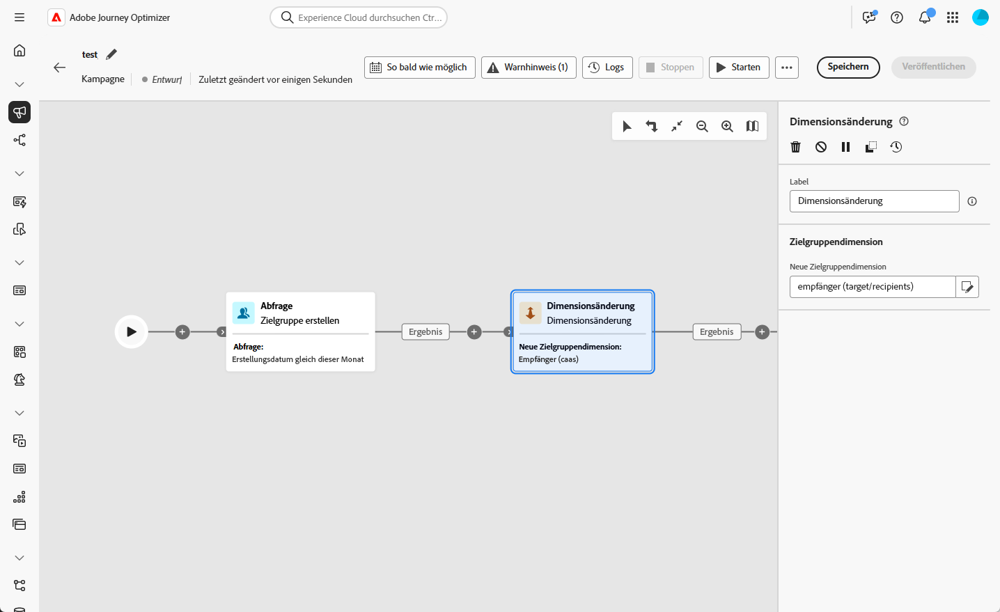
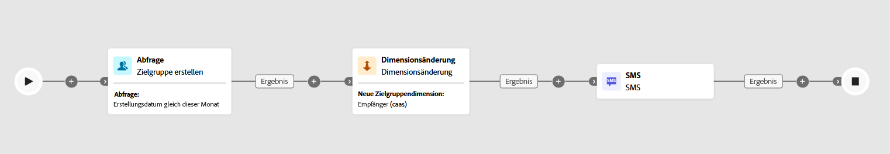

# Dimensionsänderung {#change-dimension}

>[!CONTEXTUALHELP]
>id="ajo_orchestration_dimension_complement"
>title="Erzeugen eines Komplements"
>abstract="Sie können eine zusätzliche ausgehende Transition mit der verbleibenden Population generieren, die als Duplikat ausgeschlossen wurde. Schalten Sie dazu die Option **Komplement erzeugen** ein"

>[!CONTEXTUALHELP]
>id="ajo_orchestration_change_dimension"
>title="Aktivität „Dimensionsänderung“"
>abstract="Mithilfe dieser Aktivität können Sie die Zielgruppendimension beim Erstellen einer Zielgruppe ändern. Diese Aktivität verschiebt die Achse je nach Datenvorlage und der Eingabedimension. Beispielsweise können Sie von der Dimension „Verträge“ zur Dimension „Kundinnen und Kunden“ wechseln."

Als Marketing-Fachkraft können Sie das Zielgruppen-Targeting verbessern, indem Sie innerhalb einer orchestrierten Kampagne von einer Datenentität zu einer zugehörigen wechseln. Auf diese Weise können Sie über Benutzerprofile hinausgehen und sich auf bestimmte Verhaltensweisen wie Käufe, Buchungen oder andere Interaktionen konzentrieren.

Verwenden Sie dazu die Aktivität **[!UICONTROL Dimensionsänderung]**. So können Sie die Zielgruppendimension während der orchestrierten Kampagne anpassen.

<!--
>[!IMPORTANT]
>
>Please note that the **[!UICONTROL Change Dimension]** and **[!UICONTROL Change Data source]** activities should not be added in one row. If you need to use both activities consecutively, make sure you include an **[!UICONTROL Enrichement]** activity in between them. This ensures proper execution and prevents potential conflicts or errors.-->

## Konfigurieren der Aktivität „Dimensionsänderung“ {#configure}

Gehen Sie folgendermaßen vor, um die Aktivität **[!UICONTROL Dimensionsänderung]** zu konfigurieren:

1. Fügen Sie Ihrer orchestrierten Kampagne eine Aktivität des Typs **[!UICONTROL Dimensionsänderung]** hinzu.

   

1. Definieren Sie die **[!UICONTROL neue Zielgruppendimension]**. Bei einer Dimensionsänderung werden alle Einträge beibehalten.

## Beispiel {#example}

Dieser Anwendungsfall konzentriert sich auf den Versand einer SMS an Profile, die innerhalb des letzten Monats eine Wunschliste erstellt haben.

Beginnen Sie mit einer Aktivität des Typs **[!UICONTROL Zielgruppe erstellen]** und verwenden Sie die Zielgruppendimension **[!UICONTROL Wunschliste]**, um alle relevanten Wunschlisten zu ermitteln.

Fügen Sie dann eine Aktivität des Typs **[!UICONTROL Dimensionsänderung]** hinzu, um die Zielgruppendimension von **[!UICONTROL Wunschliste]** auf **[!UICONTROL Empfängerin oder Empfänger] umzustellen.** Dieser Schritt stellt sicher, dass die orchestrierte Kampagne die richtigen Profile anspricht, die mit diesen Wunschlisten verknüpft sind, sodass die SMS an die gewünschten Profile gesendet werden kann.

