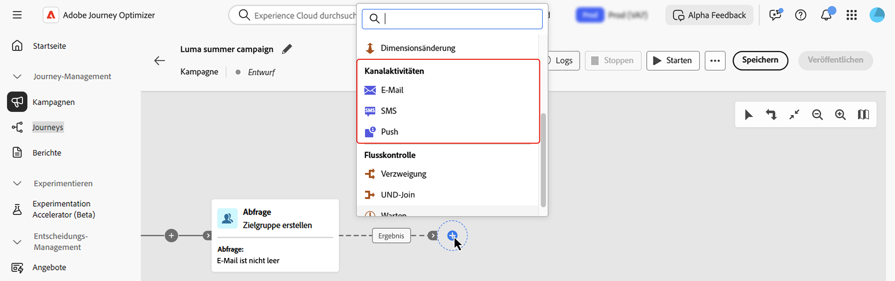
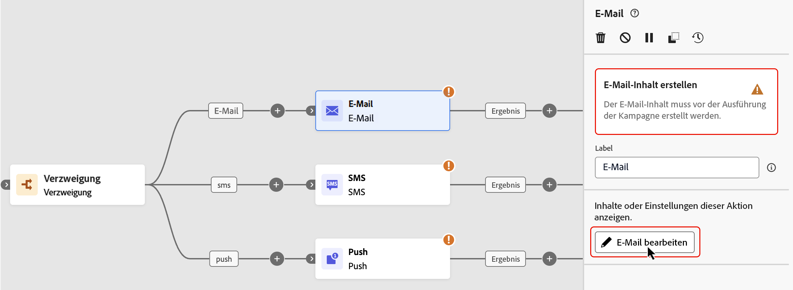
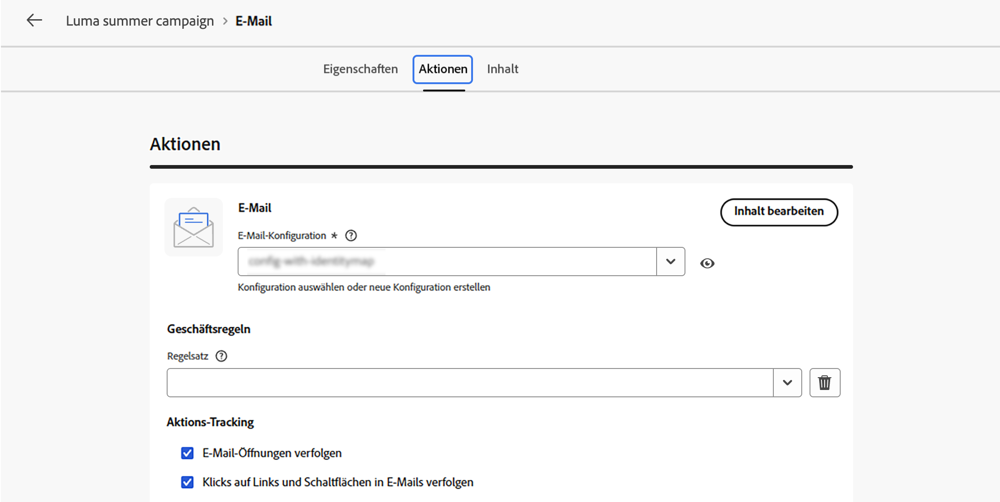
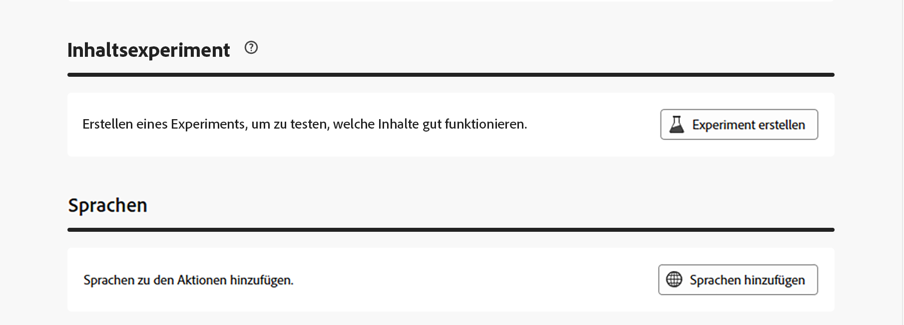
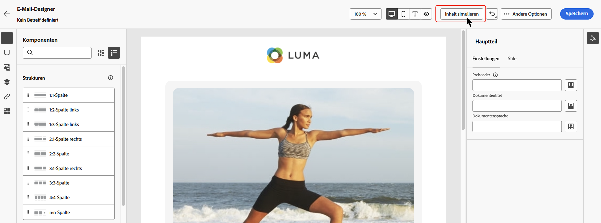
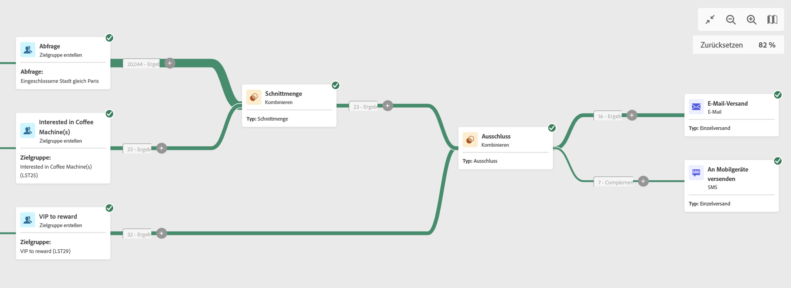
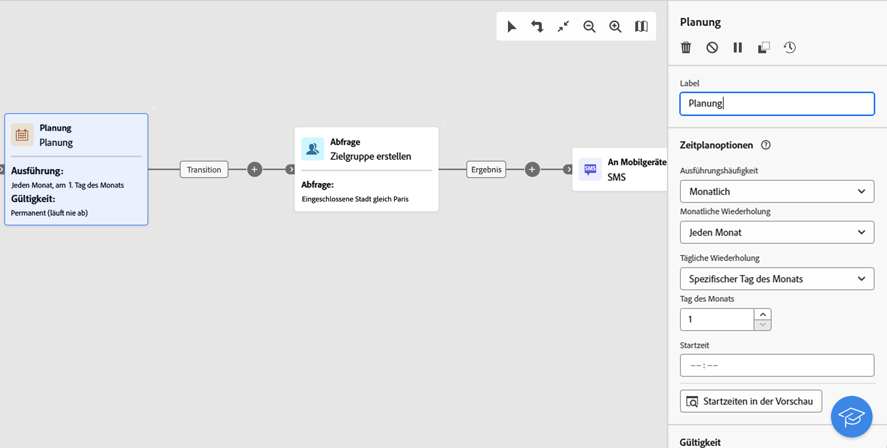

# Kanalaktivitäten {#channel}

>[!CONTEXTUALHELP]
>id="ajo_orchestration_email"
>title="E-Mail-Aktivität"
>abstract="Die Aktivität E-Mail ermöglicht den Versand von E-Mails innerhalb einer orchestrierten Kampagne, sowohl für einmalige als auch für wiederkehrende Nachrichten. Sie dient dazu, den Versand von E-Mails an eine innerhalb derselben orchestrierten Kampagne berechnete Zielgruppe zu automatisieren. Kanalaktivitäten können in einer mehrstufigen Kampagnenarbeitsfläche kombiniert werden, um kanalübergreifende Kampagnen zu erstellen, mit denen basierend auf Kundenverhalten und Daten Aktionen ausgelöst werden können."

>[!CONTEXTUALHELP]
>id="ajo_orchestration_sms"
>title="SMS-Aktivität"
>abstract="Mit der SMS-Aktivität können Sie innerhalb Ihrer orchestrierten Kampagne SMS sowohl für einmalige als auch für wiederkehrende Nachrichten senden. Sie dient dazu, den Versand von SMS an eine innerhalb derselben orchestrierten Kampagne berechnete Zielgruppe zu automatisieren. Kanalaktivitäten können in der mehrstufigen Kampagnenarbeitsfläche kombiniert werden, um kanalübergreifende Kampagnen zu erstellen, mit denen basierend auf Kundenverhalten und Daten Aktionen ausgelöst werden können."

>[!CONTEXTUALHELP]
>id="ajo_orchestration_push"
>title="Push-Aktivität"
>abstract="Die Aktivität Push ermöglicht den Versand von Push-Benachrichtigungen im Rahmen einer orchestrierten Kampagne. Sie ermöglicht den Versand sowohl einmaliger als auch wiederkehrender orchestrierter Kampagnen und automatisiert so den Versand von Push-Benachrichtigungen an eine vordefinierte Zielgruppe innerhalb derselben orchestrierten Kampagne. Kanalaktivitäten können in der Kampagnenarbeitsfläche kombiniert werden, um kanalübergreifende Kampagnen zu erstellen, mit denen sich basierend auf Kundenverhalten und Daten Aktionen auslösen lassen."

<!--
UNUSED IDs in BJ

>[!CONTEXTUALHELP]
>id="ajo_orchestration_push_ios"
>title="Push iOS activity"
>abstract="The Push iOS activity lets you send iOS Push notifications as part of your Orchestrated campaign. It enables the delivery of both one-time and recurring Orchestrated campaigns, automating the sending of iOS Push notifications to a predefined target within the same workflow. You can combine channel activities into the campaign canvas to create cross-channel campaigns that can trigger actions based on customer behavior and data."

>[!CONTEXTUALHELP]
>id="ajo_orchestration_push_android"
>title="Push Android activity"
>abstract="The Push Android activity lets you send Android Push notifications as part of your Orchestrated campaign. It enables the delivery of both one-time and recurring messages, automating the sending of Android Push notifications to a predefined target within the same Orchestrated campaign. You can combine channel activities into the Orchestrated campaign canvas to create cross-channel campaigns that can trigger actions based on customer behavior and data."

-->

>[!CONTEXTUALHELP]
>id="ajo_orchestration_directmail"
>title="Briefpost-Aktivität"
>abstract="Die Briefpost-Aktivität erleichtert den Briefpost-Versand innerhalb der orchestrierten Kampagne und ermöglicht sowohl einmalige als auch wiederkehrende Nachrichten. Sie dient dazu, das Generieren der von Briefpost-Dienstleistern benötigten Extraktionsdatei zu automatisieren. Kanalaktivitäten können in der Arbeitsoberfläche für orchestrierte Kampagnen kombiniert werden, um kanalübergreifende Kampagnen zu erstellen, mit denen basierend auf Kundenverhalten und Daten Aktionen ausgelöst werden können."

[!DNL Adobe Journey Optimizer] ermöglicht die Automatisierung und Ausführung von Marketing-Kampagnen über verschiedene Kanäle hinweg - E-Mail, SMS, Push-Benachrichtigungen und Briefpost. Sie können diese Kanalaktivitäten in der Kampagnen-Arbeitsfläche kombinieren, um kanalübergreifende orchestrierte Kampagnen zu erstellen. Diese Kampagnen können Trigger-Aktionen auf der Grundlage des Kundenverhaltens und der Kundendaten durchführen.

Beispiel:

* Senden Sie eine Begrüßungsserie per E-Mail, SMS, Push und Briefpost.
* Senden Sie nach einem Kauf eine Folge-E-Mail.
* Senden Sie personalisierte Geburtstagsgrüße per SMS.

Mithilfe von Kanalaktivitäten können Sie umfassende und personalisierte Kampagnen erstellen, die Kundinnen und Kunden über mehrere Touchpoints hinweg ansprechen, und Konversionen fördern.

>[!CAUTION]
>
>In orchestrierten Kampagnen werden nur die Kanäle SMS, Push, E-Mail und Briefpost unterstützt.

## Hinzufügen einer Kanalaktivität und Definieren ihrer Eigenschaften {#add}

>[!PREREQUISITES]
>
>Bevor Sie eine Kanalaktivität hinzufügen, definieren Sie die Zielgruppe mithilfe einer Aktivität des Typs [Zielgruppe erstellen](build-audience.md) oder [Zielgruppe lesen](read-audience.md).

1. Fügen Sie der Arbeitsfläche eine Kanalaktivität hinzu. Verfügbare Kanalaktivitäten sind **[!UICONTROL E-Mail]**, **[!UICONTROL SMS]**, **[!UICONTROL Push]** und **[!UICONTROL Briefpost]**.

   

1. Wählen Sie die Aktivität aus und klicken Sie je **[!UICONTROL Kanal auf E-Mail]**, **[!UICONTROL SMS]**, **[!UICONTROL Push bearbeiten]** oder **[!UICONTROL Briefpost bearbeiten]**.

   

1. Geben Sie auf der Registerkarte **[!UICONTROL Eigenschaften]** eine Beschreibung ein und wechseln Sie dann zur Registerkarte **[!UICONTROL Aktionen]**, um die Aktivität zu konfigurieren.

## Einrichten der Kanalkonfiguration und -einstellungen {#configuration}

Verwenden Sie die Registerkarte **[!UICONTROL Aktionen]**, um eine Kanalkonfiguration für Ihre Nachricht auszuwählen und um zusätzliche Einstellungen wie Tracking, Inhaltsexperiment oder mehrsprachige Inhalte zu konfigurieren.

1. **Auswählen einer Kanalkonfiguration**

   Eine Konfiguration wird durch [Systemadmins](../../start/path/administrator.md) definiert. Sie enthält alle technischen Parameter zum Senden der Nachricht, wie z. B. Kopfzeilenparameter, Subdomain, Mobile Apps usw. [Informationen zum Einrichten von Kanalkonfigurationen](../../configuration/channel-surfaces.md)

   

1. **Anwenden von Begrenzungsregeln**

   Wählen Sie in der Dropdown-Liste **[!UICONTROL Regelsatz]** einen Satz von Kanalregeln aus, um Begrenzungsregeln auf Ihre Kampagne anzuwenden. Mithilfe von Kanalregelsätzen können Sie die Frequenzbegrenzung nach Kommunikationstyp festlegen, um zu verhindern, dass Kundinnen und Kunden zu viele ähnliche Nachrichten erhalten. [Erfahren Sie, wie Sie mit Regelsätzen &#x200B;](../../conflict-prioritization/rule-sets.md).

1. **Erstellen eines Inhaltsexperiments**

   Verwenden Sie den Abschnitt **[!UICONTROL Inhaltsexperiment]** zum Definieren mehrerer Versandabwandlungen, um zu messen, welche für Ihre Zielgruppe am besten geeignet ist. Klicken Sie auf **[!UICONTROL Experiment erstellen]** und führen Sie dann die in diesem Abschnitt beschriebenen Schritte aus: [Erstellen eines Inhaltsexperiments](../../content-management/content-experiment.md).

1. **Hinzufügen mehrsprachiger Inhalte**

   Verwenden Sie den Abschnitt **[!UICONTROL Sprachen]**, um in Ihrer Kampagne Inhalte in mehreren Sprachen zu erstellen. Klicken Sie dazu auf die Schaltfläche **[!UICONTROL Sprachen hinzufügen]** und wählen Sie die gewünschten **[!UICONTROL Spracheinstellungen]** aus. Detaillierte Informationen zur Einrichtung und Verwendung mehrsprachiger Funktionen finden Sie im Abschnitt [Erste Schritte mit mehrsprachigen Inhalten](../../content-management/multilingual-gs.md)

   

Je nach ausgewähltem Kommunikationskanal stehen zusätzliche Einstellungen zur Verfügung. Erweitern Sie die folgenden Abschnitte, um weitere Informationen zu erhalten.

+++**Interaktion verfolgen** (E-Mail und SMS).

Verwenden Sie den Abschnitt **[!UICONTROL Aktions-Tracking]**, um zu verfolgen, wie Ihre Empfängerinnen und Empfänger auf Ihre E-Mail- oder SMS-Sendungen reagieren. Die Tracking-Ergebnisse sind nach Ausführung der Kampagne im Kampagnenbericht verfügbar. [Weitere Informationen zu Kampagnenberichten](../../reports/campaign-global-report-cja.md)

+++

+++**Aktivieren des Schnellversandmodus** (Push).

Der Schnellversandmodus ist ein Add-on für [!DNL Journey Optimizer], das den sehr schnellen Versand von Push-Nachrichten in großen Mengen im Rahmen von Kampagnen ermöglicht. Der Schnellversand wird verwendet, wenn eine Verzögerung beim Nachrichtenversand geschäftskritisch ist. Sie möchten beispielsweise einen dringenden Push-Warnhinweis auf Mobiltelefone senden, z. B. aktuelle Nachrichten an Benutzer, die Ihre Nachrichtenkanal-App installiert haben. [Auf dieser Seite](../../push/create-push.md#rapid-delivery) erfahren Sie, wie Sie den Schnellversandmodus für Push-Benachrichtigungen aktivieren.

Weitere Informationen zur Leistung bei Verwendung des Schnellversandmodus finden Sie unter [Adobe Journey Optimizer-Produktbeschreibung](https://helpx.adobe.com/de/legal/product-descriptions/adobe-journey-optimizer.html){target="_blank"}.

+++

Nachdem Ihre Kanalaktivität konfiguriert wurde, wählen Sie die Registerkarte **[!UICONTROL Inhalt]** aus, um deren Inhalt zu definieren.

## Definieren des Inhalts {#content}

### Nachrichteninhalt erstellen

Wechseln Sie zur Registerkarte **[!UICONTROL Inhalt]**, um Ihre Nachricht zu erstellen. Die Prozessschritte variieren je nach ausgewähltem Kanal. Auf den folgenden Seiten erfahren Sie, wie Sie Ihren Nachrichteninhalt erstellen.

<table style="table-layout:fixed"><tr style="border: 0; text-align: center;" >
<td> <a href="../../email/create-email.md"><strong>Erstellen einer E-Mail</strong></a></td>
<td> <a href="../../sms/create-sms.md"><strong>SMS erstellen</strong></a></td>
<td><a href="../../push/create-push.md"><strong>Erstellen einer Push-Benachrichtigung</strong></a></td><td><a href="../../direct-mail/create-direct-mail.md"><strong>Erstellen von Direkt-Mail</strong></a></td>
</tr></table>

### Hinzufügen von Personalisierung

Personalization in orchestrierten Kampagnen funktioniert ähnlich wie andere [!DNL Journey Optimizer] Kampagnen oder Journeys, mit einigen wichtigen Unterschieden, die speziell für die orchestrierte Arbeitsfläche gelten.

Wenn Sie über eine orchestrierte Kampagne auf den Personalisierungseditor zugreifen, enthalten zwei Hauptordner die für Personalisierung verfügbaren Attribute, wie unten beschrieben.

* **[!UICONTROL Profilattribute]**

  Dieser Ordner enthält alle profilbezogenen Daten aus [!DNL Adobe Experience Platform]. Dabei handelt es sich um Standardattribute wie Name, E-Mail-Adresse, Standort oder andere im Benutzerprofil erfasste Eigenschaften.

* **[!UICONTROL Zielattribute]** (spezifisch für orchestrierte Kampagnen)

  Dieser Ordner ist nur bei orchestrierten Kampagnen verfügbar. Er enthält Attribute, die direkt auf der Kampagnen-Arbeitsfläche berechnet werden. Er enthält zwei Unterordner:

   * **`<Targeting dimension>`** (z. B. „Empfänger“, „Käufe“): Enthält alle Attribute im Zusammenhang mit der Dimension, auf die sich Ihre Kampagne bezieht.

   * **`Enrichment`**: Enthält Daten, die über Aktivitäten vom Typ **[!UICONTROL Anreicherung]** auf der Arbeitsfläche hinzugefügt werden. So können Sie Nachrichten basierend auf externen Datensätzen oder einer zusätzlichen Logik, die während der Orchestrierung integriert wurde, personalisieren. [Wie Sie die Aktivität „Anreicherung“ verwenden](../activities/enrichment.md)

Einen detaillierten Überblick über die Verwendung des Personalisierungseditors finden Sie unter [Erste Schritte mit der Personalisierung](../../personalization/personalize.md).

### Überprüfen und Testen der Inhalte

Sobald der Inhalt erstellt ist, verwenden Sie die Schaltfläche **[!UICONTROL Inhalte simulieren]**, um eine Vorschau anzuzeigen und den Inhalt mit Testprofilen oder Beispieleingabedaten zu testen, die aus einer CSV- oder JSON-Datei hochgeladen oder manuell hinzugefügt wurden. [Weitere Informationen](../../content-management/preview-test.md)

## Nachrichtenversand bestätigen

Standardmäßig wird der Nachrichtenversand bei nicht wiederkehrenden orchestrierten Kampagnen angehalten, bis Sie den Versand ausdrücklich genehmigen. Nachdem Sie die Kampagne veröffentlicht haben, bestätigen Sie die Sendeanfrage über den Bereich Eigenschaften der Kanalaktivität.

Das Senden von Bestätigungen kann vor der Veröffentlichung der orchestrierten Kampagne deaktiviert werden. Wählen Sie dazu die Kanalaktivität auf der Arbeitsfläche aus, um ihre Eigenschaften anzuzeigen, und aktivieren Sie &quot;**[!UICONTROL senden ohne Bestätigung]**.

## Festlegen der Ratensteuerung {#rate-control}

[!DNL Journey Optimizer] ermöglicht es Ihnen, die Ratenkontrolle für ausgehende Aktionen in orchestrierten Kampagnen zu aktivieren.

Diese Funktion ist besonders nützlich, um eine Überlastung nachgelagerter Systeme zu verhindern, beispielsweise Landingpages oder Plattformen für die Kundenunterstützung. Beispielsweise können Sie eine Ratenbeschränkung von 165 Nachrichten pro Sekunde festlegen, um einen stabilen Versand sicherzustellen, ohne die nachgelagerten Systeme zu überfordern.

Gehen Sie wie folgt vor, um die Ratensteuerung festzulegen:

1. Wählen Sie eine Aktivität für einen ausgehenden Kanal auf der Arbeitsfläche aus und klicken Sie je nach **[!UICONTROL Kanal auf E-Mail]**&#x200B;**[!UICONTROL SMS bearbeiten]** oder **[!UICONTROL Push bearbeiten]**.

   

1. Navigieren Sie zur **[!UICONTROL Zeitplan]** und aktivieren Sie die Option **[!UICONTROL Versand]** Drosselung) im Abschnitt **[!UICONTROL Versandeinstellungen]**.

   

1. Geben Sie die gewünschte **[!UICONTROL Versandrate]** pro Sekunde an.

   * Unterstützte Mindestversandrate: 1 pro Sekunde.
   * Maximal unterstützte Versandrate: 2.000 pro Sekunde, wenn die Option „Versand drosseln“ aktiviert ist.

>[!IMPORTANT]
>
>Bei der Festlegung einer Versandrate beträgt der maximale Zeitrahmen, für den eine Campaign-Audience ausgeführt werden kann, 12 Stunden. Wenn die Versandrate auf einen Wert eingestellt ist, der es nicht ermöglicht, dass die Nachricht innerhalb des 12-Stunden-Zeitraums an alle Zielgruppen gesendet wird, werden die verbleibenden Profile aus der Kampagne ausgeschlossen. Die Anzahl dieser ausgeschlossenen Profile wird im Kampagnenbericht angezeigt.

## Nächste Schritte {#next}

Wenn der Nachrichteninhalt fertig ist, navigieren Sie mit dem Pfeil **[!UICONTROL Zurück]** zurück zu Ihrer orchestrierten Kampagne. Sie können dann die Orchestrierung der Aktivitäten auf der Arbeitsfläche abschließen und die Kampagne veröffentlichen, um mit dem Senden von Nachrichten zu beginnen. [Weitere Informationen zum Start und zur Überwachung orchestrierter Kampagnen](../start-monitor-campaigns.md)

<!--
## Examples {#cross-channel-workflow-sample}

Here is a cross-channel Orchestrated campaign example with a segmentation and two deliveries. The Orchestrated campaign targets all customers who live in Paris and who are interested in coffee machines. Among this population, an email is sent to the regular customers and an SMS is sent to the VIP clients.

<!--
description, which use case you can perform (common other activities that you can link before of after the activity)

how to add and configure the activity

example of a configured activity within a workflow
The Email delivery activity allows you to configure the sending an email in a workflow. 

-->

<!--You can also create a recurring Orchestrated campaign to send a personalized SMS every first day of the month at 8 PM to all customers living in Paris.

-->

<!-- Scheduled emails available?

This can be a single send email and sent just once, or it can be a recurring email.
* Single send emails are standard emails, sent once.
* Recurring emails allow you to send the same email multiple times to different targets over a defined period. You can aggregate the deliveries per period in order to get reports that correspond to your needs.

When linked to a scheduler, you can define recurring emails.
Email recipients are defined upstream of the activity in the same workflow, via an Audience targeting activity.

-->

<!--The message preparation is triggered according to the workflow execution parameters. From the message dashboard, you can select whether to request or not a manual confirmation to send the message (required by default). You can start the workflow manually or place a scheduler activity in the workflow to automate execution.-->

