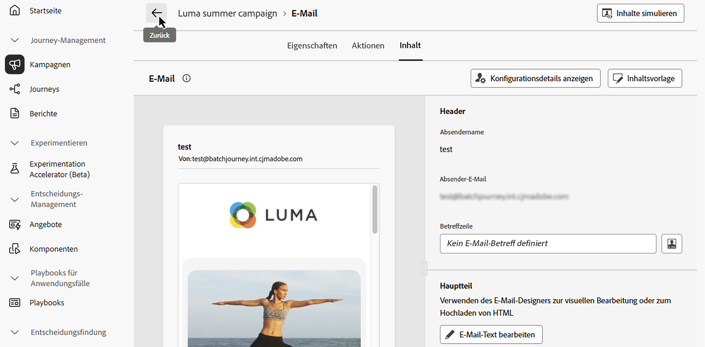

# Kanalaktivitäten {#channel}

>[!CONTEXTUALHELP]
>id="ajo_orchestration_email"
>title="E-Mail-Aktivität"
>abstract="Die Aktivität E-Mail ermöglicht den Versand von E-Mails innerhalb einer orchestrierten Kampagne, sowohl für einmalige als auch für wiederkehrende Nachrichten. Dies dient zur Automatisierung des E-Mail-Versands an eine Zielgruppe, die innerhalb derselben orchestrierten Kampagne berechnet wird. Kanalaktivitäten können in einer mehrstufigen Kampagnenarbeitsfläche kombiniert werden, um kanalübergreifende Kampagnen zu erstellen, mit denen basierend auf Kundenverhalten und Daten Aktionen ausgelöst werden können."

>[!CONTEXTUALHELP]
>id="ajo_orchestration_sms"
>title="SMS-Aktivität"
>abstract="Die SMS-Aktivität ermöglicht den Versand von SMS innerhalb einer orchestrierten Kampagne, sowohl für einmalige als auch für wiederkehrende Nachrichten. Dies dient zur Automatisierung des SMS-Versands an eine Zielgruppe, die innerhalb derselben orchestrierten Kampagne berechnet wird. Kanalaktivitäten können in der mehrstufigen Kampagnenarbeitsfläche kombiniert werden, um kanalübergreifende Kampagnen zu erstellen, mit denen basierend auf Kundenverhalten und Daten Aktionen ausgelöst werden können."

>[!CONTEXTUALHELP]
>id="ajo_orchestration_push"
>title="Push-Aktivität"
>abstract="Mit der Aktivität Push können Sie Push-Benachrichtigungen als Teil Ihrer orchestrierten Kampagne senden. Sie ermöglicht den Versand sowohl einmaliger als auch wiederkehrender orchestrierter Kampagnen und automatisiert so den Versand von Push-Benachrichtigungen an eine vordefinierte Zielgruppe innerhalb derselben orchestrierten Kampagne. Kanalaktivitäten können in der Kampagnenarbeitsfläche kombiniert werden, um kanalübergreifende Kampagnen zu erstellen, mit denen basierend auf Kundenverhalten und Daten Aktionen ausgelöst werden können."

<!--
UNUSED IDs in BJ

>[!CONTEXTUALHELP]
>id="ajo_orchestration_push_ios"
>title="Push iOS activity"
>abstract="The Push iOS activity let you send iOS Push notifications as part of your Orchestrated campaign. It enables the delivery of both one-time and recurring Orchestrated campaigns, automating the sending iOS Push notifications to a predefined target within the same workflow. You can combine channel activities into the campaign canvas to create cross-channel campaigns that can trigger actions based on customer behavior and data."

>[!CONTEXTUALHELP]
>id="ajo_orchestration_push_android"
>title="Push Android activity"
>abstract="The Push Android activity ket you send Android Push notifications as part of your Orchestrated campaign. It enables the delivery of both one-time and recurring messages, automating the sending Android Push notifications to a predefined target within the same Orchestrated campaign. You can combine channel activities into the Orchestrated campaign canvas to create cross-channel campaigns that can trigger actions based on customer behavior and data."

-->

>[!CONTEXTUALHELP]
>id="ajo_orchestration_directmail"
>title="Direkt-Mail-Aktivität"
>abstract="Die Aktivität Briefpost erleichtert den Briefpostversand innerhalb Ihrer orchestrierten Kampagne, sowohl für einmalige als auch für wiederkehrende Nachrichten. Sie dient dazu, das Generieren der von Direkt-Mail-Dienstleistern benötigten Extraktionsdatei zu automatisieren. Sie können Kanalaktivitäten in der Arbeitsfläche für orchestrierte Kampagnen kombinieren, um kanalübergreifende Kampagnen zu erstellen, mit denen anhand des Kundenverhaltens und der Daten Trigger erstellt werden können."

+++ Inhaltsverzeichnis

| Willkommen bei orchestrierten Kampagnen | Starten der ersten orchestrierten Kampagne | Abfragen der Datenbank | Aktivitäten für orchestrierte Kampagnen |
|---|---|---|---|
| [Erste Schritte mit orchestrierten Kampagnen](../gs-orchestrated-campaigns.md)  Erstellen und Verwalten von relationalen Schemata und Datensätzen:  <ul><li>[Erste Schritte mit Schemata und Datensätzen](../gs-schemas.md)</li><li>[Manuelles Schema](../manual-schema.md)</li><li>[Datei-Upload-Schema](../file-upload-schema.md)</li><li>[Daten aufnehmen](../ingest-data.md)</li></ul>[Zugreifen auf und Verwalten von orchestrierten Kampagnen](../access-manage-orchestrated-campaigns.md) | [Wichtige Schritte zum Erstellen einer orchestrierten Kampagne](../gs-campaign-creation.md)  [Erstellen und Planen der Kampagne](../create-orchestrated-campaign.md)  [Orchestrieren von Aktivitäten](../orchestrate-activities.md)  [Starten und Überwachen der Kampagne](../start-monitor-campaigns.md)  [Reporting](../reporting-campaigns.md) | [Arbeiten mit dem Regel-Builder](../orchestrated-rule-builder.md)  [Erstellen der ersten Abfrage](../build-query.md)  [Bearbeiten von Ausdrücken](../edit-expressions.md)  [Retargeting](../retarget.md) | [Erste Schritte mit Aktivitäten](about-activities.md)  Aktivitäten: [Und-Verknüpfung](and-join.md) – [Zielgruppe erstellen](build-audience.md) – [Dimensionsänderung](change-dimension.md) – <b>[Kanalaktivitäten](channels.md)</b> – [Kombinieren](combine.md) – [Deduplizierung](deduplication.md) – [Anreicherung](enrichment.md) – [Verzweigung](fork.md) – [Abstimmung](reconciliation.md) – [Zielgruppe speichern](save-audience.md) – [Aufspaltung](split.md) – [Warten](wait.md) |

{style="table-layout:fixed"}

+++

 

>[!BEGINSHADEBOX]

 

Der Inhalt dieser Seite ist nicht endgültig und kann geändert werden.

>[!ENDSHADEBOX]

Mit [!DNL Adobe Journey Optimizer] können Sie Marketing-Kampagnen kanalübergreifend (E-Mail, SMS und Push-Benachrichtigungen) automatisieren und ausführen. Sie können diese Kanalaktivitäten in der Kampagnen-Arbeitsfläche kombinieren, um kanalübergreifend orchestrierte Kampagnen zu erstellen, mit denen basierend auf dem Kundenverhalten und den Kundendaten Trigger erstellt werden können.

Beispiel:
* Senden Sie eine Begrüßungsserie per E-Mail, SMS und Push.
* Senden Sie nach einem Kauf eine Folge-E-Mail.
* Senden Sie personalisierte Geburtstagsgrüße per SMS.

Mithilfe von Kanalaktivitäten können Sie umfassende und personalisierte Kampagnen erstellen, die Kundinnen und Kunden über mehrere Touchpoints hinweg ansprechen, und Konversionen fördern.

>[!PREREQUISITES]
>
>Bevor Sie eine Kanalaktivität hinzufügen, definieren Sie die Zielgruppe mithilfe einer [Aktivität vom Typ „Zielgruppe erstellen“](build-audience.md).

## Hinzufügen einer Kanalaktivität und Definieren ihrer Eigenschaften {#add}

1. Fügen Sie der Arbeitsfläche eine Kanalaktivität hinzu. Verfügbare Kanalaktivitäten sind **[!UICONTROL E-Mail]**, **[!UICONTROL SMS]** und **[!UICONTROL Push]**.

   

1. Wählen Sie die Aktivität aus und klicken Sie je nach ausgewähltem Kanal auf **[!UICONTROL E-Mail bearbeiten]**, **[!UICONTROL SMS bearbeiten]** oder **[!UICONTROL Push-Benachrichtigung bearbeiten]**.

   

1. Geben Sie auf der Registerkarte **[!UICONTROL Eigenschaften]** eine Beschreibung ein und wechseln Sie dann zur Registerkarte **[!UICONTROL Aktionen]**, um die Aktivität zu konfigurieren.

## Einrichten von Kanalkonfiguration und Einstellungen {#configuration}

Verwenden Sie die Registerkarte **[!UICONTROL Aktionen]**, um eine Kanalkonfiguration für Ihre Nachricht auszuwählen und um zusätzliche Einstellungen wie Tracking, Inhaltsexperiment oder mehrsprachige Inhalte zu konfigurieren.

1. **Auswählen einer Kanalkonfiguration**

   Eine Konfiguration wird durch [Systemadmins](../../start/path/administrator.md) definiert. Sie enthält alle technischen Parameter zum Senden der Nachricht, wie z. B. Kopfzeilenparameter, Subdomain, Mobile Apps usw. [Erfahren Sie, wie Sie die Kanalkonfiguration einrichten](../../configuration/channel-surfaces.md).

   

1. **Begrenzungsregeln anwenden**

   Wählen **[!UICONTROL in der Dropdown]** Liste „Regelsatz“ einen Kanalregelsatz aus, um Begrenzungsregeln auf Ihre Kampagne anzuwenden. Mithilfe von Kanalregelsätzen können Sie die Frequenzbegrenzung nach Kommunikationstyp festlegen, um zu verhindern, dass Kundinnen und Kunden mit ähnlichen Nachrichten überlastet werden. [Erfahren Sie, wie Sie mit Regelsätzen arbeiten](../../conflict-prioritization/rule-sets.md)

1. **Interaktion verfolgen** (E-Mail und SMS)

   Verwenden Sie den Abschnitt **[!UICONTROL Aktions-Tracking]**, um zu verfolgen, wie Ihre Empfängerinnen und Empfänger auf Ihre E-Mail- oder SMS-Sendungen reagieren. Die Tracking-Ergebnisse sind nach Ausführung der Kampagne im Kampagnenbericht verfügbar. [Weitere Informationen zu Kampagnenberichten](../../reports/campaign-global-report-cja.md)

1. **Schnellversand-Modus aktivieren** (Push)

   Der Schnellversandmodus ist ein Add-on für [!DNL Journey Optimizer], das den sehr schnellen Versand von Push-Nachrichten in großen Mengen im Rahmen von Kampagnen ermöglicht. Der Schnellversand wird verwendet, wenn eine Verzögerung beim Nachrichtenversand geschäftskritisch wäre oder wenn Sie eine dringende Push-Benachrichtigung an Mobiltelefone senden möchten, z. B. eine Eilmeldung an Benutzende, die Ihre Nachrichten-App installiert haben. Weitere Informationen zur Performance bei Verwendung des Schnellversand-Modus finden Sie unter [Produktbeschreibung für Adobe Journey Optimizer](https://helpx.adobe.com/de/legal/product-descriptions/adobe-journey-optimizer.html).

1. **Erstellen eines Inhaltsexperiments**

   Verwenden Sie den Abschnitt **[!UICONTROL Inhaltsexperiment]** zum Definieren mehrerer Versandabwandlungen, um zu messen, welche für Ihre Zielgruppe am besten geeignet ist. Klicken Sie auf **[!UICONTROL Experiment erstellen]** und führen Sie dann die in diesem Abschnitt beschriebenen Schritte aus: [Erstellen eines Inhaltsexperiments](../../content-management/content-experiment.md).

1. **Hinzufügen mehrsprachiger Inhalte**

   Verwenden Sie den Abschnitt **[!UICONTROL Sprachen]**, um in Ihrer Kampagne Inhalte in mehreren Sprachen zu erstellen. Klicken Sie dazu auf die Schaltfläche **[!UICONTROL Sprachen hinzufügen]** und wählen Sie die gewünschten **[!UICONTROL Spracheinstellungen]** aus. Detaillierte Informationen zur Einrichtung und Verwendung mehrsprachiger Funktionen finden Sie in diesem Abschnitt: [Erste Schritte mit mehrsprachigen Inhalten](../../content-management/multilingual-gs.md)

   

Nachdem Ihre Kanalaktivität konfiguriert wurde, wählen Sie die Registerkarte **[!UICONTROL Inhalt]** aus, um deren Inhalt zu definieren.

## Definieren des Inhalts {#content}

Wechseln Sie zur Registerkarte **[!UICONTROL Inhalt]**, um Ihre Nachricht zu erstellen. Die Prozessschritte variieren je nach ausgewähltem Kanal. Auf den folgenden Seiten erfahren Sie, wie Sie Ihren Nachrichteninhalt erstellen.

<table style="table-layout:fixed"><tr style="border: 0; text-align: center;" >
<td> <a href="../../email/create-email.md"><strong>Erstellen einer E-Mail</strong></a></td>
<td> <a href="../../sms/create-sms.md"><strong>Erstellen einer SMS</strong></a></td>
<td><a href="../../push/create-push.md"><strong>Erstellen einer Push-Benachrichtigung</strong></a></td>
</tr></table>

## Hinzufügen von Personalisierung

Personalization in orchestrierten Kampagnen funktioniert ähnlich wie andere **[!UICONTROL Journey Optimizer]**-Kampagnen oder Journey-Kampagnen, hat aber einige wichtige Unterschiede speziell in Bezug auf die orchestrierte Arbeitsfläche.

Wenn Sie über eine orchestrierte Kampagne auf den Personalisierungseditor zugreifen, enthalten zwei Hauptordner die unten beschriebenen für die Personalisierung verfügbaren Attribute.

* **[!UICONTROL Profilattribute]**

  Dieser Ordner enthält alle profilbezogenen Daten aus [!DNL Adobe Experience Platform]. Dabei handelt es sich um Standardattribute wie Name, E-Mail-Adresse, Standort oder andere im Benutzerprofil erfasste Eigenschaften.

* **[!UICONTROL Zielattribute]** (spezifisch für orchestrierte Kampagnen)

  Dieser Ordner ist nur für orchestrierte Kampagnen verfügbar. Es enthält Attribute, die direkt auf der Kampagnen-Arbeitsfläche berechnet werden. Es enthält zwei Unterordner:

   * **`<Targeting dimension>`** (z. B. „Empfänger“, „Käufe„): Enthält alle Attribute im Zusammenhang mit der Dimension, auf die sich Ihre Kampagne bezieht.

   * **`Enrichment`**: Enthält Daten, die über Aktivitäten **[!UICONTROL Anreicherung]** auf der Arbeitsfläche hinzugefügt werden. Auf diese Weise können Sie Nachrichten basierend auf externen Datensätzen oder einer zusätzlichen Logik, die während der Orchestrierung integriert wurde, personalisieren. [Erfahren Sie, wie Sie eine Anreicherungsaktivität verwenden](../activities/enrichment.md)

Einen detaillierten Überblick über die Verwendung des Personalisierungseditors finden Sie unter [Erste Schritte mit der Personalisierung](../../personalization/personalize.md)

## Überprüfen und Testen von Inhalten

Sobald der Inhalt erstellt ist, verwenden Sie die Schaltfläche **[!UICONTROL Inhalte simulieren]**, um eine Vorschau anzuzeigen und den Inhalt mit Testprofilen oder Beispieleingabedaten zu testen, die aus einer CSV- oder JSON-Datei hochgeladen oder manuell hinzugefügt wurden. [Weitere Informationen](../../content-management/preview-test.md)

## Nächste Schritte {#next}

Wenn der Nachrichteninhalt fertig ist, navigieren Sie mit dem Pfeil „Zurück **[!UICONTROL zurück zu Ihrer]**. Sie können dann die Orchestrierung der Aktivitäten auf der Arbeitsfläche abschließen und die Kampagne veröffentlichen, um den Nachrichtenversand zu starten. [Erfahren Sie, wie Sie orchestrierte Kampagnen starten und überwachen](../start-monitor-campaigns.md)

<!--
## Examples {#cross-channel-workflow-sample}

Here is a cross-channel Orchestrated campaign example with a segmentation and two deliveries. The Orchestrated campaign targets all customers who live in Paris and who are interested in coffee machines. Among this population, an email is sent to the regular customers and an SMS is sent to the VIP clients.

<!--
description, which use case you can perform (common other activities that you can link before of after the activity)

how to add and configure the activity

example of a configured activity within a workflow
The Email delivery activity allows you to configure the sending an email in a workflow. 

-->

<!--You can also create a recurring Orchestrated campaign to send a personalized SMS every first day of the month at 8 PM to all customers living in Paris.

-->

<!-- Scheduled emails available?

This can be a single send email and sent just once, or it can be a recurring email.
* Single send emails are standard emails, sent once.
* Recurring emails allow you to send the same email multiple times to different targets over a defined period. You can aggregate the deliveries per period in order to get reports that correspond to your needs.

When linked to a scheduler, you can define recurring emails.
Email recipients are defined upstream of the activity in the same workflow, via an Audience targeting activity.

-->

<!--The message preparation is triggered according to the workflow execution parameters. From the message dashboard, you can select whether to request or not a manual confirmation to send the message (required by default). You can start the workflow manually or place a scheduler activity in the workflow to automate execution.-->
