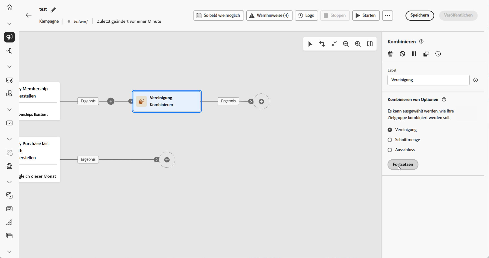
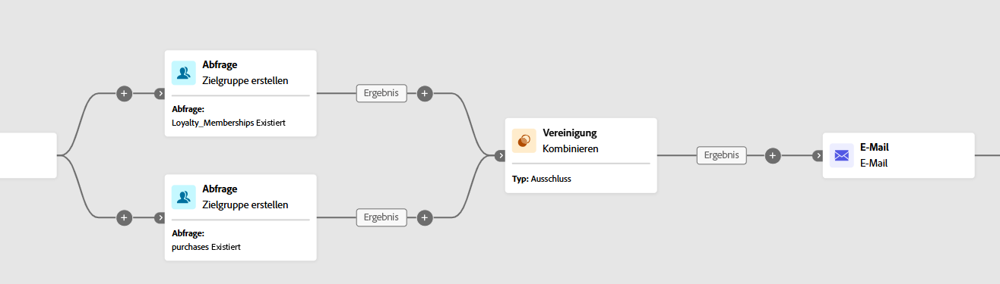
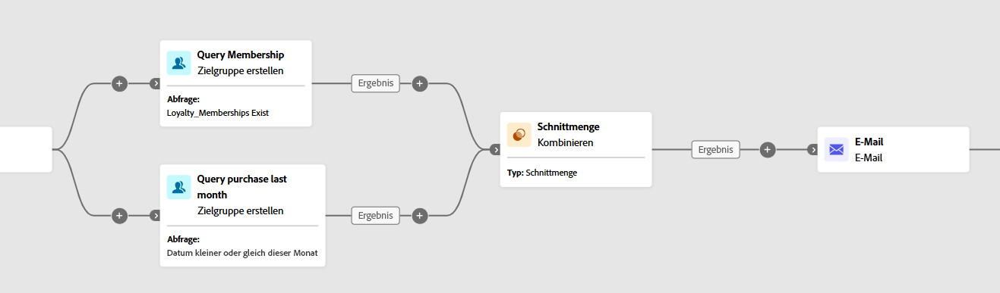
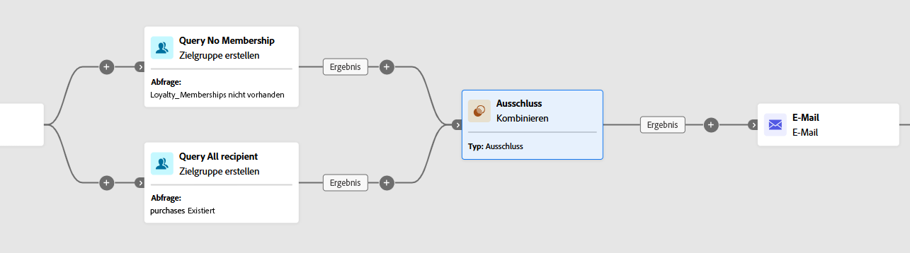

# Kombinieren {#combine}

>[!CONTEXTUALHELP]
>id="ajo_orchestration_combine"
>title="Die Aktivität „Kombinieren“"
>abstract="Die Aktivität **Kombinieren** ermöglicht die Segmentierung der eingehenden Population. Sie können also verschiedene Populationen vereinen, einen Teil daraus ausschließen oder nur die in mehreren Zielgruppen enthaltenen Datensätze verwenden."

+++ Inhaltsverzeichnis

| Willkommen bei orchestrierten Kampagnen | Starten der ersten orchestrierten Kampagne | Abfragen der Datenbank | Aktivitäten für orchestrierte Kampagnen |
|---|---|---|---|
| [Erste Schritte mit orchestrierten Kampagnen](../gs-orchestrated-campaigns.md)  Erstellen und Verwalten von relationalen Schemata und Datensätzen:  <ul><li>[Erste Schritte mit Schemata und Datensätzen](../gs-schemas.md)</li><li>[Manuelles Schema](../manual-schema.md)</li><li>[Datei-Upload-Schema](../file-upload-schema.md)</li><li>[Daten aufnehmen](../ingest-data.md)</li></ul>[Zugreifen auf und Verwalten von orchestrierten Kampagnen](../access-manage-orchestrated-campaigns.md) | [Wichtige Schritte zum Erstellen einer orchestrierten Kampagne](../gs-campaign-creation.md)  [Erstellen und Planen der Kampagne](../create-orchestrated-campaign.md)  [Orchestrieren von Aktivitäten](../orchestrate-activities.md)  [Starten und Überwachen der Kampagne](../start-monitor-campaigns.md)  [Reporting](../reporting-campaigns.md) | [Arbeiten mit dem Regel-Builder](../orchestrated-rule-builder.md)  [Erstellen der ersten Abfrage](../build-query.md)  [Bearbeiten von Ausdrücken](../edit-expressions.md)  [Retargeting](../retarget.md) | [Erste Schritte mit Aktivitäten](about-activities.md)  Aktivitäten: [Und-Verknüpfung](and-join.md) – [Zielgruppe erstellen](build-audience.md) – [Dimensionsänderung](change-dimension.md) – [Kanalaktivitäten](channels.md) – <b>[Kombinieren](combine.md)</b> – [Deduplizierung](deduplication.md) – [Anreicherung](enrichment.md) – [Verzweigung](fork.md) – [Abstimmung](reconciliation.md) – [Zielgruppe speichern](save-audience.md) – [Aufspaltung](split.md) – [Warten](wait.md) |

{style="table-layout:fixed"}

+++

 

>[!BEGINSHADEBOX]

 

Der Inhalt dieser Seite ist nicht endgültig und kann geändert werden.

>[!ENDSHADEBOX]

Die Aktivität **[!UICONTROL Kombinieren]** ist ein **[!UICONTROL Targeting]**-Aktivitätstyp, mit dem Sie Ihre eingehende Population effektiv segmentieren können. Mit ihr können Sie mehrere Populationen fusionieren, bestimmte Segmente ausschließen oder nur die Daten beibehalten, die für mehrere Ziele freigegeben sind.

Die folgenden Segmentierungsoptionen sind verfügbar:

* **[!UICONTROL Vereinigung]**: Fügt die Ergebnisse mehrerer Aktivitäten zu einer einheitlichen Zielgruppe zusammen.

* **[!UICONTROL Schnittmenge]**: Behält nur die Elemente bei, die in allen eingehenden Populationen gleich sind.

* **[!UICONTROL Ausschluss]**: Entfernt Elemente anhand festgelegter Kriterien aus einer Population.

## Konfigurieren der Aktivität „Kombinieren“ {#combine-configuration}

>[!CONTEXTUALHELP]
>id="ajo_orchestration_intersection_merging_options"
>title="Optionen für das Zusammenführen von Schnittmengen"
>abstract="Die Schnittmenge dient dazu, nur die Elemente zu behalten, die den verschiedenen eingehenden Populationen in der Aktivität gemeinsam sind. Aktivieren Sie im Abschnitt „Zusammenzuführende Mengen“ alle vorherigen Aktivitäten, die Sie zusammenfügen möchten."

>[!CONTEXTUALHELP]
>id="ajo_orchestration_exclusion_merging_options"
>title="Optionen für die Zusammenführung von Ausschlüssen"
>abstract="Der Ausschluss dient dazu, gemäß bestimmten Kriterien entsprechende Elemente aus einer Population auszuschließen. Aktivieren Sie im Abschnitt „Zusammenzuführende Mengen“ alle vorherigen Aktivitäten, die Sie zusammenfügen möchten."

>[!CONTEXTUALHELP]
>id="ajo_orchestration_combine_options"
>title="Auswählen des Segmentierungstyps"
>abstract="Wählen Sie aus, wie Zielgruppen kombiniert werden. Eine **Vereinigung** dient dazu, das Ergebnis mehrerer Aktivitäten zu einer einzigen Zielgruppe zusammenzufassen. Eine **Schnittmenge** dient dazu, nur die Elemente beizubehalten, die den verschiedenen eingehenden Populationen in der Aktivität gemeinsam sind. Ein **Ausschluss** dient dazu, gemäß bestimmten Kriterien entsprechende Elemente aus einer Population auszuschließen. "

Führen Sie die folgenden Schritte aus, um mit der Konfiguration der Aktivität **[!UICONTROL Kombinieren]** zu beginnen:

1. Fügen Sie mehrerer Aktivitäten wie **[!UICONTROL Zielgruppe erstellen]** hinzu, um mindestens zwei verschiedene Ausführungsverzweigungen zu bilden.
1. Fügen Sie die Aktivität **[!UICONTROL Kombinieren]** zu einer der vorherigen Verzweigungen hinzu.
1. Wählen Sie einen der Segmentierungstypen aus: [Vereinigung](#union), [Schnittmenge](#intersection) oder [Ausschluss](#exclusion).
1. Klicken Sie auf **[!UICONTROL Fortfahren]**.
1. Aktivieren Sie im Abschnitt **[!UICONTROL Zusammenzuführende Mengen]** alle vorherigen Aktivitäten, die Sie zusammenfügen möchten.

## Union {#combine-union}

>[!CONTEXTUALHELP]
>id="ajo_orchestration_combine_reconciliation"
>title="Abstimmoptionen"
>abstract="Wählen Sie den **Abstimmtyp** aus, um festzulegen, wie Duplikate behandelt werden. Die Option **Schlüssel** ist standardmäßig aktiviert. Das heißt, die Aktivität behält ein Element nur dann bei, wenn die Elemente der verschiedenen eingehenden Transitionen denselben Schlüssel aufweisen. Verwenden Sie die Option **Auswahl an Spalten**, um die Liste der Spalten zu definieren, auf die die Datenabstimmung angewendet werden soll. "

Innerhalb der Aktivität **[!UICONTROL Kombinieren]** können Sie eine **[!UICONTROL Vereinigung]** konfigurieren, indem Sie einen **[!UICONTROL Abstimmtyp]** auswählen, um die Verwaltung doppelter Einträge zu bestimmen:

* **[!UICONTROL Nur die Schlüssel]** (Standard): Behält einen einzelnen Eintrag bei, wenn mehrere eingehende Transitionen denselben Schlüssel verwenden. Diese Option kann nur angewendet werden, wenn die eingehenden Populationen homogen sind.

* **[!UICONTROL Auswahl an Spalten]**: Ermöglicht die Angabe der Spalten, die für die Datenabstimmung verwendet werden sollen. Wählen Sie **[!UICONTROL Attribut hinzufügen]** aus.

Im folgenden Beispiel wird eine Aktivität des Typs **[!UICONTROL Kombinieren]** mit einer **[!UICONTROL Vereinigung]** verwendet, um die Ergebnisse zweier Abfragen, **Mitglieder des Treueprogramms** und **Käuferinnen und Käufer**, zu einer einzigen, größeren Zielgruppe zu fusionieren, die alle Profile aus beiden Segmenten enthält.

## Schnittmenge {#combine-intersection}

>[!CONTEXTUALHELP]
>id="ajo_orchestration_intersection_reconciliation_options"
>title="Abstimmoptionen für Schnittmengen"
>abstract="Wählen Sie den **Abstimmtyp** aus, um festzulegen, wie Duplikate behandelt werden. Die Option **Schlüssel** ist standardmäßig aktiviert. Das heißt, die Aktivität behält ein Element nur dann bei, wenn die Elemente der verschiedenen eingehenden Transitionen denselben Schlüssel aufweisen. Verwenden Sie die Option **Auswahl an Spalten**, um die Liste der Spalten zu definieren, auf die die Datenabstimmung angewendet werden soll. "

In der Aktivität **[!UICONTROL Kombinieren]** können Sie eine **[!UICONTROL Schnittmenge]** konfigurieren. Dafür müssen Sie die folgenden zusätzlichen Schritte ausführen:

1. Wählen Sie den **[!UICONTROL Abstimmtyp]** aus, um zu definieren, wie Duplikate behandelt werden:

   * **[!UICONTROL Nur die Schlüssel]** (Standard): Behält einen einzelnen Eintrag bei, wenn mehrere eingehende Transitionen denselben Schlüssel verwenden. Diese Option kann nur angewendet werden, wenn die eingehenden Populationen homogen sind.

   * **[!UICONTROL Auswahl an Spalten]**: Ermöglicht die Angabe der Spalten, die für die Datenabstimmung verwendet werden sollen. Wählen Sie **[!UICONTROL Attribut hinzufügen]** aus.

1. Aktivieren Sie **[!UICONTROL Komplement erzeugen]**, wenn Sie die restliche Population verwenden möchten. Das Komplement enthält die Vereinigung aller eingehenden Aktivitätsergebnisse, mit Ausnahme der Schnittmenge. Der Aktivität wird eine zusätzliche ausgehende Transition hinzugefügt.

Das folgende Beispiel zeigt die Verwendung der **[!UICONTROL Schnittmenge]** der zwei Abfrageaktivitäten. Sie wird verwendet, um Profile zu identifizieren, die **Mitglieder des Treueprogramms** sind und innerhalb des letzten Monats einen Kauf getätigt haben.

## Ausschluss {#combine-exclusion}

>[!CONTEXTUALHELP]
>id="ajo_orchestration_exclusion_options"
>title="Ausschlussregeln"
>abstract="Bei Bedarf können Sie die eingehenden Tabellen anpassen. Um eine Zielgruppe aus einer anderen Dimension auszuschließen, muss diese Zielgruppe tatsächlich auf dieselbe Zielgruppendimension wie die Hauptzielgruppe zurückgesetzt werden. Klicken Sie dazu im Abschnitt „Ausschlussregeln“ auf „Regel hinzufügen“ und geben Sie die Bedingungen für die Dimensionsänderung an. Die Datenabstimmung wird entweder über ein Attribut oder über einen Join durchgeführt."

>[!CONTEXTUALHELP]
>id="ajo_orchestration_combine_sets"
>title="Auswählen von Sets, die kombiniert werden sollen"
>abstract="Wählen Sie im Abschnitt **Zusammenzuführende Mengen** die **Hauptmenge** aus den eingehenden Transitionen. Dies ist die Menge, aus der Elemente ausgeschlossen werden. Die anderen Mengen stimmen mit Elementen überein, bevor sie aus der Primärmenge ausgeschlossen werden."

>[!CONTEXTUALHELP]
>id="ajo_orchestration_combine_exclusion"
>title="Ausschlussregeln"
>abstract="Bei Bedarf können Sie die eingehenden Tabellen anpassen. Um eine Zielgruppe aus einer anderen Dimension auszuschließen, muss diese Zielgruppe tatsächlich auf dieselbe Zielgruppendimension wie die Hauptzielgruppe zurückgesetzt werden. Klicken Sie dazu im Abschnitt „Ausschlussregeln“ auf „Regel hinzufügen“ und geben Sie die Bedingungen für die Dimensionsänderung an. Die Datenabstimmung wird entweder über ein Attribut oder über einen Join durchgeführt."

>[!CONTEXTUALHELP]
>id="ajo_orchestration_combine_complement"
>title="Kombinieren von „Komplement erzeugen“"
>abstract="Aktivieren Sie die Option „Komplement erzeugen“, um die verbleibende Population in einer zusätzlichen Transition zu verarbeiten."

In der Aktivität **[!UICONTROL Kombinieren]** können Sie einen **[!UICONTROL Ausschluss]** konfigurieren. Dafür müssen Sie die folgenden zusätzlichen Schritte ausführen:

1. Wählen Sie im Abschnitt **[!UICONTROL Zusammenzuführende Mengen]** die **[!UICONTROL Hauptmenge]**, die die Hauptpopulation darstellt. Die in den anderen Mengen gefundenen Einträge werden aus dieser Hauptmenge ausgeschlossen.

1. Bei Bedarf können Sie eingehende Tabellen anpassen, um Ziele aus verschiedenen Dimensionen anzugleichen. Um eine Zielgruppe aus einer anderen Dimension auszuschließen, muss diese zunächst in dieselbe Zielgruppendimension wie die Hauptpopulation aufgenommen werden. Klicken Sie dazu auf **[!UICONTROL Regel hinzufügen]** und definieren Sie die Bedingungen zum Ändern der Dimension. Die Abstimmung erfolgt dann entweder mit einem Attribut oder einem Join.

1. Aktivieren Sie **[!UICONTROL Komplement erzeugen]**, wenn Sie die restliche Population verwenden möchten. Das Komplement enthält die Vereinigung aller eingehenden Aktivitätsergebnisse, mit Ausnahme der Schnittmenge. Der Aktivität wird eine zusätzliche ausgehende Transition hinzugefügt.

Das folgende Beispiel eines **[!UICONTROL Ausschlusses]** zeigt zwei Abfragen, die zum Filtern von Profilen konfiguriert wurden, die ein Produkt gekauft haben. Die Profile, die über keine Mitgliedschaft im Treueprogramm verfügen, werden dann aus der ersten Menge ausgeschlossen.

