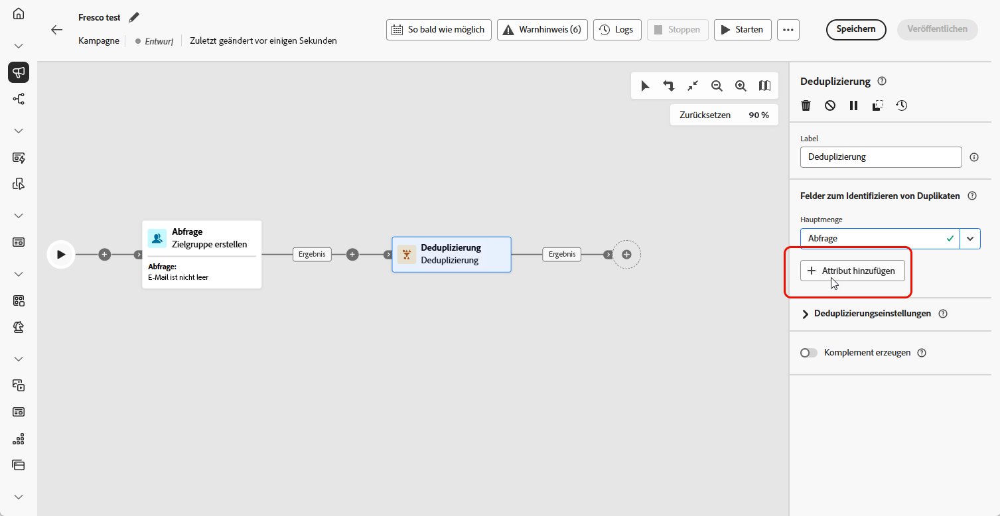
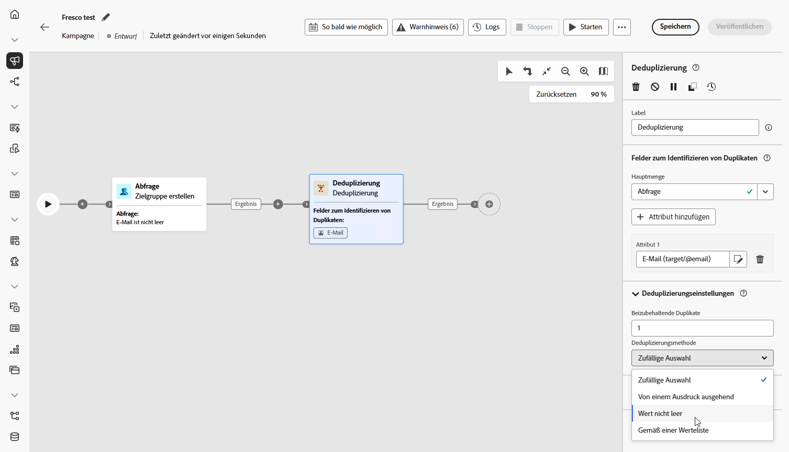
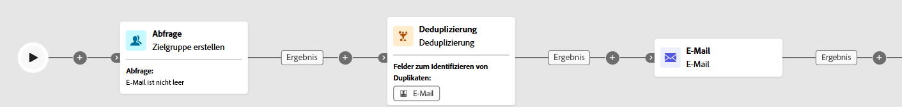

# Deduplizierung {#deduplication}

>[!CONTEXTUALHELP]
>id="ajo_orchestration_deduplication_fields"
>title="Felder zum Identifizieren von Dubletten"
>abstract="Klicken Sie im Abschnitt **Felder zum Identifizieren von Dubletten** auf die Schaltfläche **Attribut hinzufügen**, um die Felder anzugeben, für die die Identifizierung von Dubletten aufgrund identischer Werte möglich ist, wie z. B. E-Mail-Adresse, Vorname, Nachname usw. Durch die Reihenfolge der Felder können Sie angeben, welche Felder zuerst verarbeitet werden sollen."

>[!CONTEXTUALHELP]
>id="ajo_orchestration_deduplication"
>title="Aktivität „Deduplizierung“"
>abstract="Mithilfe der Aktivität **Deduplizierung** lassen sich Dubletten in Ergebnissen aus eingehenden Aktivitäten löschen. Sie wird hauptsächlich im Anschluss an Zielgruppenbestimmungsaktivitäten und vor Aktivitäten verwendet, die die Verwendung von Zielgruppendaten zulassen."

>[!CONTEXTUALHELP]
>id="ajo_orchestration_deduplication_complement"
>title="Erzeugen eines Komplements"
>abstract="Sie können eine zusätzliche ausgehende Transition mit der verbleibenden Population generieren, die als Duplikat ausgeschlossen wurde. Schalten Sie dazu die Option **Komplement erzeugen** ein"

>[!CONTEXTUALHELP]
>id="ajo_orchestration_deduplication_settings"
>title="Deduplizierungseinstellungen"
>abstract="Um Dubletten in den eingehenden Daten zu löschen, definieren Sie die Deduplizierungsmethode in den folgenden Feldern. Standardmäßig wird nur ein Eintrag beibehalten. Sie sollten außerdem die Deduplizierungsmethode anhand eines Ausdrucks oder Attributs auswählen. Standardmäßig wird der Eintrag, der von den Duplikaten ausgenommen sein soll, zufällig ausgewählt."

+++ Inhaltsverzeichnis

| Willkommen bei koordinierten Kampagnen | Starten Ihrer ersten orchestrierten Kampagne | Abfragen der Datenbank | Aktivitäten für orchestrierte Kampagnen |
|---|---|---|---|
| [Erste Schritte mit orchestrierten Kampagnen](../gs-orchestrated-campaigns.md)  Erstellen und Verwalten von relationalen Schemata und Datensätzen:  <ul><li>[Erste Schritte mit Schemata und Datensätzen](../gs-schemas.md)</li><li>[Manuelles Schema](../manual-schema.md)</li><li>[Datei-Upload-Schema](../file-upload-schema.md)</li><li>[Daten aufnehmen](../ingest-data.md)</li></ul>[Zugreifen auf und Verwalten von orchestrierten Kampagnen](../access-manage-orchestrated-campaigns.md) | [Wichtige Schritte zum Erstellen einer orchestrierten Kampagne](../gs-campaign-creation.md)  [Erstellen und Planen der Kampagne](../create-orchestrated-campaign.md)  [Orchestrieren von Aktivitäten](../orchestrate-activities.md)  [Starten und Überwachen der Kampagne](../start-monitor-campaigns.md)  [Reporting](../reporting-campaigns.md) | [Arbeiten mit dem Regel-Builder](../orchestrated-rule-builder.md)  [Erstellen der ersten Abfrage](../build-query.md)  [Ausdrücke bearbeiten](../edit-expressions.md)  [Retargeting](../retarget.md) | [Erste Schritte mit Aktivitäten](about-activities.md)  Aktivitäten: [Und-Verknüpfung](and-join.md) - [Zielgruppe aufbauen](build-audience.md) - [Dimension ändern](change-dimension.md) - [Kanalaktivitäten](channels.md) - [Kombinieren](combine.md) - <b>[Anreicherung](deduplication.md)</b> - [Formulare](enrichment.md) - [Abstimmung](fork.md) [&#128279;](reconciliation.md) [&#128279;](save-audience.md) [&#128279;](split.md) ->Zielgruppe speichern[ -AufspaltungWarten](wait.md) |

{style="table-layout:fixed"}

+++

 

>[!BEGINSHADEBOX]

 

Der Inhalt dieser Seite ist nicht endgültig und kann geändert werden.

>[!ENDSHADEBOX]

Die **[!UICONTROL Deduplizierungsaktivität]** ist eine **[!UICONTROL Zielgruppenbestimmungsaktivität]**. Mithilfe dieser Aktivität lassen sich Dubletten in Ergebnissen aus eingehenden Aktivitäten löschen, z. B. duplizierte Profile aus der Empfängerliste. Die **[!UICONTROL Deduplizierungsaktivität]** wird im Allgemeinen im Anschluss an Zielgruppenbestimmungsaktivitäten und vor Aktivitäten verwendet, die die Verwendung von Zielgruppendatum zulassen.

## Konfigurieren der Deduplizierungsaktivität{#deduplication-configuration}

Gehen Sie folgendermaßen vor, um die **[!UICONTROL Deduplizierungsaktivität]** zu konfigurieren:

1. Fügen Sie **[!UICONTROL orchestrierten Kampagne]** Aktivität „Deduplizierung“ hinzu.

1. Klicken Sie im Abschnitt **[!UICONTROL Felder zum Identifizieren von Dubletten]** auf die Schaltfläche **[!UICONTROL Attribut hinzufügen]**, um die Felder anzugeben, für die die Identifizierung von Dubletten aufgrund identischer Werte möglich ist, wie z. B. E-Mail-Adresse, Vorname, Nachname usw. Durch die Reihenfolge der Felder können Sie angeben, welche Felder zuerst verarbeitet werden sollen.

   

1. Wählen Sie **[!UICONTROL Abschnitt]** Deduplizierungseinstellungen“ aus, wie viele eindeutige Datensätze beibehalten werden sollen, indem Sie das Feld Beizubehaltende Duplikate verwenden. Der Standardwert ist 1, wobei ein Datensatz pro doppelter Gruppe beibehalten wird. Legen Sie ihn auf 0 fest, um alle Duplikate zu behalten.

   Wenn beispielsweise Datensatz A und B Duplikate von Y sind und Datensatz C ein Duplikat von Z ist:

   * **Wenn der Wert des Felds 1 ist** werden nur die Y- und Z-Datensätze beibehalten.
   * **Wenn der Wert des Felds 0 ist**: Alle Datensätze (A, B, C, Y, Z) werden beibehalten.
   * **Wenn der Wert des Felds 2 ist**: C und Z werden beibehalten, plus zwei Werte von A, B und Y, zufällig oder basierend auf Ihrer Deduplizierungsmethode.

1. Wählen Sie eine **[!UICONTROL Deduplizierungsmethode]**, die definiert, wie das System entscheidet, welche Datensätze aus jeder Gruppe von Duplikaten beibehalten werden sollen:

   * **[!UICONTROL Zufällige Auswahl]**: Wählt nach dem Zufallsprinzip unter den Dubletten den Eintrag aus, der beibehalten werden soll.
   * **[!UICONTROL Ausdruck verwenden]**: Behält Datensätze mit dem höchsten oder niedrigsten Wert basierend auf einem von Ihnen definierten Ausdruck bei.
   * **[!UICONTROL Nicht leere Werte]**: Speichert Datensätze, bei denen das ausgewählte Feld nicht leer ist, z. B. nur Profile mit einer Telefonnummer.
   * **[!UICONTROL Nach einer Werteliste]**: Ermöglicht die Priorisierung bestimmter Werte für ein oder mehrere Felder, z. B. kann Datensätzen mit „Land“ Priorität eingeräumt werden, für die Frankreich festgelegt ist. Klicken Sie auf **[!UICONTROL Attribut]**, um ein Feld auszuwählen oder einen benutzerdefinierten Ausdruck zu erstellen. Verwenden Sie die **[!UICONTROL Hinzufügen]**, um bevorzugte Werte in der Prioritätsreihenfolge einzugeben.

   

1. Aktivieren Sie die Option **[!UICONTROL Komplement erzeugen]**, wenn Sie die verbleibende Population verwenden möchten. Das Komplement besteht aus allen Duplikaten. Der Aktivität wird dann eine zusätzliche Transition hinzugefügt.

## Beispiel{#deduplication-example}

Im folgenden Beispiel wird eine Aktivität **[!UICONTROL Deduplizierung]** verwendet, um doppelte Datensätze aus der Zielgruppe zu entfernen, bevor ein Versand durchgeführt wird. Die Zielgruppe wird zunächst so gefiltert, dass nur Profile mit einem nicht leeren E-Mail-Feld einbezogen werden. Anschließend verwendet die Aktivität **[!UICONTROL Deduplizierung]** die E-Mail-Adresse, um Duplikate zu identifizieren und auszuschließen.

