# Anreicherung {#enrichment}

>[!CONTEXTUALHELP]
>id="ajo_orchestration_enrichment"
>title="Aktivität „Anreicherung“"
>abstract="Die Aktivität **Anreicherung** ermöglicht es Ihnen, die Zielgruppendaten um zusätzliche Informationen aus der Datenbank zu erweitern. Sie wird in einem Workflow häufig nach den Segmentierungsaktivitäten verwendet."

+++ Inhaltsverzeichnis

| Willkommen bei koordinierten Kampagnen | Starten Ihrer ersten orchestrierten Kampagne | Abfragen der Datenbank | Aktivitäten für orchestrierte Kampagnen |
|---|---|---|---|
| [Erste Schritte mit orchestrierten Kampagnen](../gs-orchestrated-campaigns.md)  [Konfigurationsschritte](../configuration-steps.md)  [Zugreifen auf und Verwalten von orchestrierten Kampagnen](../access-manage-orchestrated-campaigns.md) | [Wichtige Schritte zum Erstellen einer orchestrierten Kampagne](../gs-campaign-creation.md)  [Erstellen und Planen der Kampagne](../create-orchestrated-campaign.md)  [Orchestrieren von Aktivitäten](../orchestrate-activities.md)  [Starten und Überwachen der Kampagne](../start-monitor-campaigns.md)  [Reporting](../reporting-campaigns.md) | [Arbeiten mit dem Regel-Builder](../orchestrated-rule-builder.md)  [Erstellen der ersten Abfrage](../build-query.md)  [Ausdrücke bearbeiten](../edit-expressions.md)  [Retargeting](../retarget.md) | [Erste Schritte mit Aktivitäten](about-activities.md)  Aktivitäten: [Und-Verknüpfung](and-join.md) - [Zielgruppe aufbauen](build-audience.md) - [Dimension ändern](change-dimension.md) - [Kanalaktivitäten](channels.md) - [Kombinieren](combine.md) - [Anreicherung](deduplication.md) - <b>[Formulare](enrichment.md)</b> - [Abstimmung](fork.md)    ->Zielgruppe speichern[ -AufspaltungWarten](wait.md) |

{style="table-layout:fixed"}

+++

 

>[!BEGINSHADEBOX]

Dokumentation in Bearbeitung

>[!ENDSHADEBOX]

Die Aktivität **[!UICONTROL Anreicherung]** ist eine **[!UICONTROL Targeting]**-Aktivität, mit der Sie Ihre Zielgruppendaten um zusätzliche Attribute erweitern können.

Sie können diese Informationen nutzen, um Ihre Audience präziser zu segmentieren, basierend auf Verhaltensweisen, Vorlieben oder Anforderungen, und um personalisierte Nachrichten zu erstellen, die besser mit jedem Profil verbunden sind.

## Hinzufügen einer Anreicherungsaktivität {#enrichment-configuration}

>[!CONTEXTUALHELP]
>id="ajo_targetdata_personalization_enrichmentdata"
>title="Anreicherungsdaten"
>abstract="Wählen Sie die zur Anreicherung Ihrer orchestrierten Kampagne zu verwendenden Daten aus. Sie können zwei Arten von Anreicherungsdaten auswählen: ein einzelnes Anreicherungsattribut aus der Zieldimension oder eine Sammlungsrelation, bei der es sich um eine Verknüpfung mit einer 1:n-Kardinalität zwischen Tabellen handelt."

>[!CONTEXTUALHELP]
>id="ajo_orchestration_enrichment_data"
>title="Aktivität „Anreicherung“"
>abstract="Nachdem Anreicherungsdaten zur orchestrierten Kampagne hinzugefügt wurden, können sie in den Aktivitäten verwendet werden, die nach der Aktivität „Anreicherung“ hinzugefügt wurden, um Kundinnen und Kunden basierend auf ihren Verhaltensweisen, Voreinstellungen und Anforderungen in verschiedene Gruppen zu segmentieren oder um personalisierte Marketing-Nachrichten und -Kampagnen zu erstellen, die Ihre Zielgruppe ansprechen."

Führen Sie die folgenden Schritte aus, um die Aktivität **Anreicherung** zu konfigurieren:

1. Fügen Sie eine Aktivität vom Typ **Anreicherung** hinzu.

1. Klicken Sie auf **Anreicherungsdaten hinzufügen** und wählen Sie das Attribut zur Datenanreicherung aus.

   Sie können zwei Arten von Anreicherungsdaten auswählen: ein einzelnes Anreicherungsattribut aus der Zielgruppendimension oder eine Sammlungsrelation. Jeder dieser Typen wird in den Beispielen unten detailliert beschrieben:

   * [Einzelnes Anreicherungsattribut](#single-attribute)
   * [Sammlungsrelation](#collection-link)

   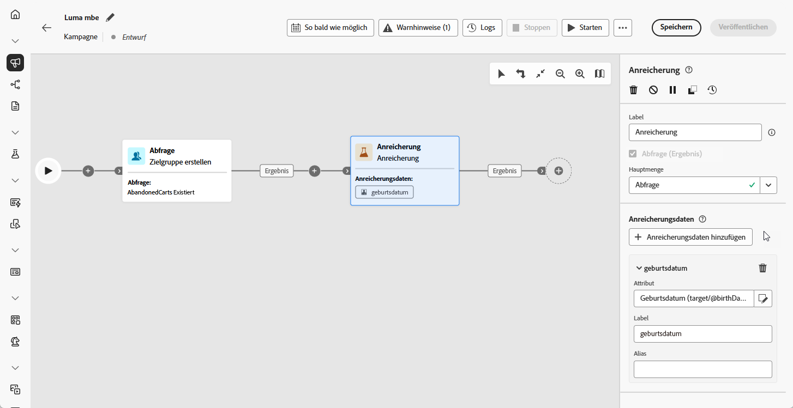

## Beispiele {#example}

### Einzelnes Anreicherungsattribut {#single-attribute}

In diesem Beispiel wird die Audience anhand einer einzigen Eigenschaft der aktuellen Zielgruppendimension angereichert, z. B. anhand des Geburtsdatums.

Gehen Sie dazu folgendermaßen vor:

1. Klicken Sie auf **[!UICONTROL Anreicherungsdaten hinzufügen]**.

1. Wählen Sie ein einfaches Feld aus **[!UICONTROL aktuellen Dimension aus, z]** B. „Geburtsdatum“.

   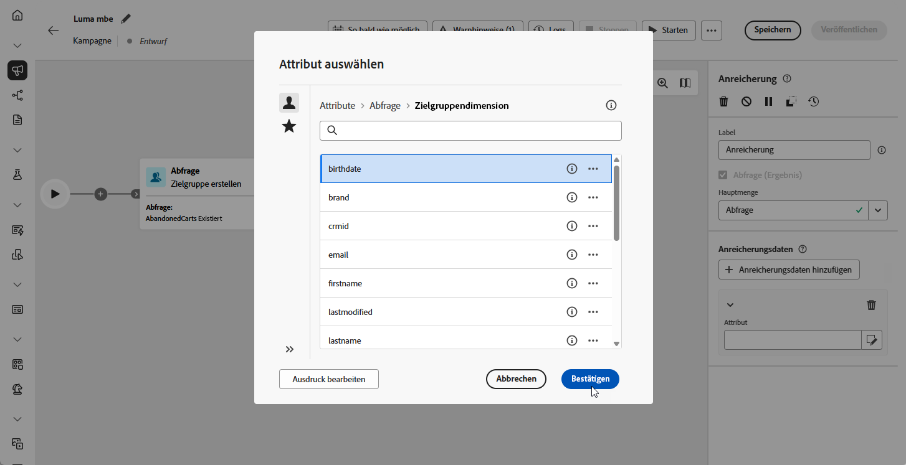

1. Klicken Sie auf **[!UICONTROL Bestätigen]**.

### Sammlungsrelation {#collection-link}

Dieser Anwendungsfall reichert Ihre Audience mit Daten aus einer verknüpften Tabelle an. Beispiel: Sie möchten die drei letzten Bestellungen unter 100 USD abrufen.

Konfigurieren Sie dazu die Anreicherung wie folgt:

* **Anreicherungsattribut**: **[!UICONTROL Preis]**

* **Anzahl der abzurufenden Datensätze**: 3

* **Filter**: Nur Käufe einbeziehen, bei denen **[!UICONTROL Preis]** weniger als 100 USD beträgt

#### Fügen Sie das Attribut hinzu. {#add-attribute}

Wählen Sie zunächst die Sammlungsrelation aus, die die Daten enthält, mit denen Sie anreichern möchten.

1. Klicken Sie auf **[!UICONTROL Anreicherungsdaten hinzufügen]**.

1. Wählen Sie in **[!UICONTROL Tabelle]** Bestellungen“ das Feld **[!UICONTROL Preis]** aus.

   

#### Definieren Sie die Sammlungseinstellungen.{#collection-settings}

Konfigurieren Sie anschließend, wie die Daten erfasst werden sollen und wie viele Einträge einbezogen werden sollen.

1. Wählen Sie in **[!UICONTROL Dropdown-Liste Art der Datenerhebung]** die Option **[!UICONTROL Daten sammeln]**.

   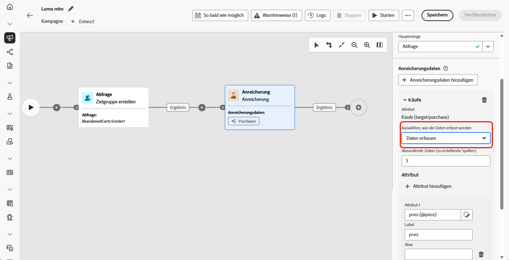

1. Geben Sie im **[!UICONTROL Abzurufende Zeilen (Zu erstellende Spalten]** die `3` ein.

1. Um eine Aggregation durchzuführen (z. B. durchschnittlicher Kaufbetrag), wählen Sie **[!UICONTROL Aggregierte Daten]** und dann **[!UICONTROL Durchschnitt]** aus der Dropdown-Liste **[!UICONTROL Aggregatfunktion]** aus.

   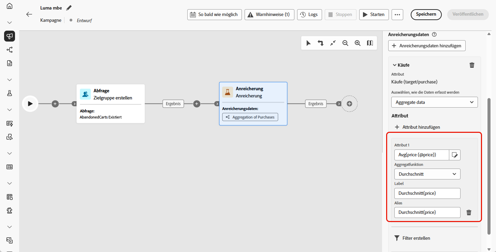

1. Verwenden Sie die Felder **[!UICONTROL label]** und **[!UICONTROL alias]**, damit die angereicherten Attribute in nachfolgenden Aktivitäten leichter identifiziert werden können.

#### Definieren von Filtern{#collection-filters}

Wenden Sie schließlich Filter an, um sicherzustellen, dass nur relevante Datensätze enthalten sind:

1. Klicken Sie auf **[!UICONTROL Filter erstellen]**.

1. Fügen Sie diese beiden Bedingungen hinzu:

   * **[!UICONTROL Preis]** existiert (um NULL auszuschließen)

   * **[!UICONTROL Preis]** ist kleiner als 100

   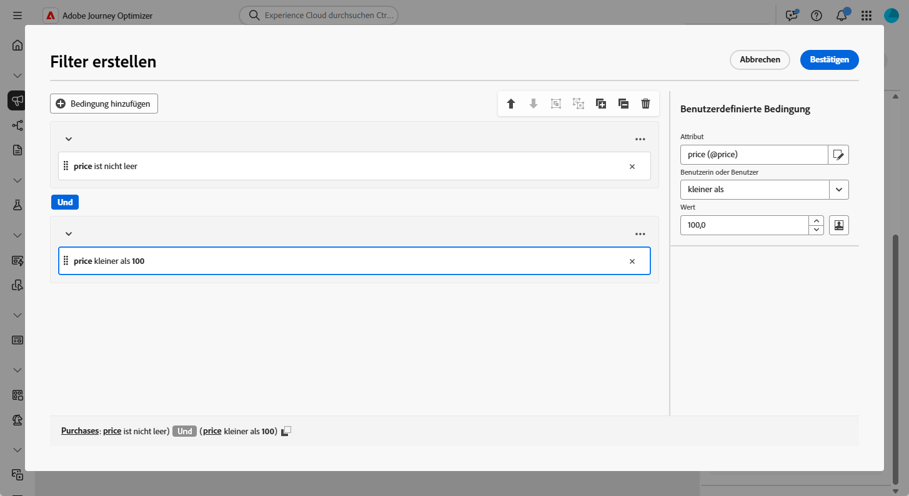

1. Klicken Sie auf **[!UICONTROL Bestätigen]**.

<!--
#### Define the sorting{#collection-sorting}

We now need to apply sorting in order to retrieve the three **latest** purchases.

1. Activate the **Enable sorting** option.
1. Click inside the **Attribute** field.
1. Select the **Order date** field.
1. Click **Confirm**. 
1. Select **Descending** from the **Sort** drop-down.

## Data reconciliation {#reconciliation}

>[!CONTEXTUALHELP]
>id="ajo_orchestration_enrichment_reconciliation"
>title="Reconciliation"
>abstract="The **Enrichment** activity can be used to reconcile data from the Journey Optimizer schema with data from another schema, or with data coming from a temporary schema such as data uploaded using a Load file activity. This type of link defines a reconciliation towards a unique record. Journey Optimizer creates a link to a target table by adding a foreign key in it for storing a reference to the unique record."

The **Enrichment** activity can be used to reconcile data from the the Campaign database schema with data from another schema, or with data coming from a temporary schema such as data uploaded using a Load file activity. This type of link defines a reconciliation towards a unique record. Journey Optimizer creates a link to a target table by adding a foreign key in it for storing a reference to the unique record.

For example, you can use this option to reconcile a profile's country, specified in an uploaded file, with one of the countries available in the dedicated table of the Campaign database. 

Follow the steps to configure an **Enrichment** activity with a reconciliation link: 

1. Click the **Add link** button in the **Reconciliation** section.
1. Identify the data you want to create a reconciliation link with.

    * To create a reconciliation link with data from the Campaign database, select **Database schema** and choose the schema where the target is stored. 
    * To create a reconciliation link with data coming from the input transition, select **Temporary schema** and choose the orchestrated campaign transition where the target data is stored. 

1. The **Label** and **Name** fields are automatically populated based on the selected target schema. You can change their values if necessary.

1. In the **Reconciliation criteria** section, specify how you want to reconcile data from the source and destination tables:

    * **Simple join**: Reconcile a specific field from the source table with another field in the destination table. To do this, click the **Add join** button and specify the **Source** and **Destination** fields to use for the reconciliation.

        >[!NOTE]
        >
        >You can use one or more **Simple join** criteria, in which case they must all be verified so that the data can be linked together.

    * **Advanced join**: Use the query modeler to configure the reconciliation criteria. To do this, click the **Create condition** button then define your reconciliation criteria by building your own rule using AND and OR operations.

The example below shows an orchestrated campaign configured to create a link between Journey Optimizer profiles table and a temporary table generated a **Load file** activity. In this example, the **Enrichment** activity reconciliates both tables using the email address as reconciliation criteria.

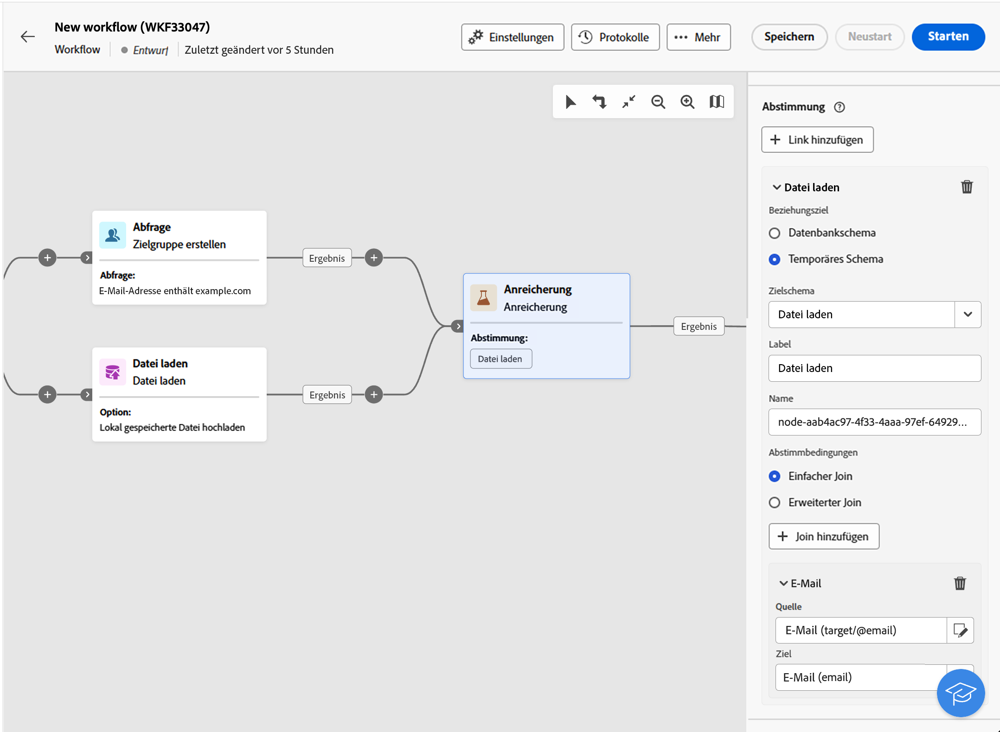

### Enrichment with linked data {#link-example}

The example below shows an orchestrated campaign configured to create a link between two transitions. The first transitions targets profile data using a **Query** activity, while the second transition includes purchase data stored into a file loaded through a Load file activity.

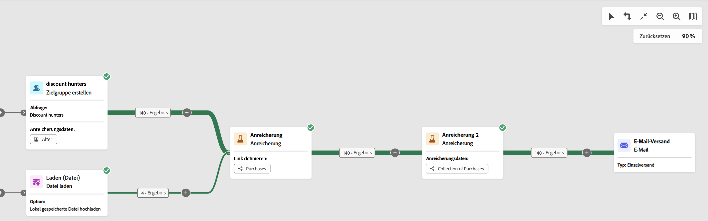

* The first **Enrichment** activity links the primary set (data from the **Query** activity) with the schema from the **Load file** activity. This allows us to match each profile targeted by the query with the corresponding purchase data.

    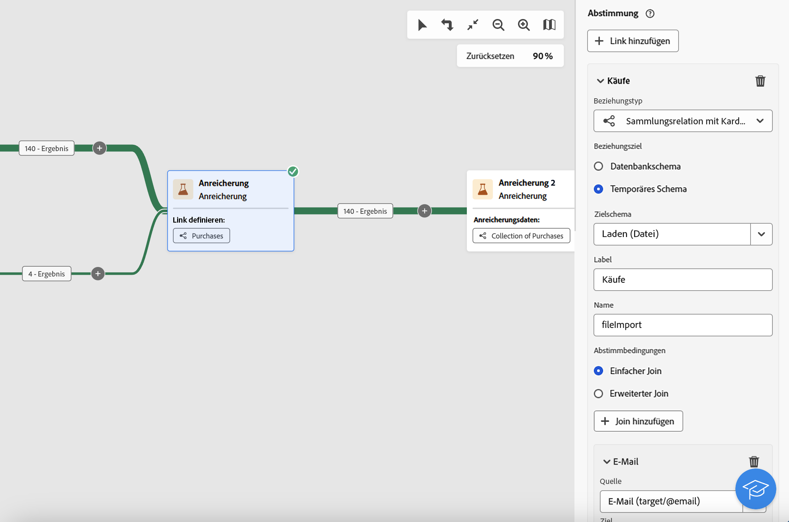

* A second **Enrichment** activity is added in order to enrich data from the orchestrated campaign table with the purchase data coming from the **Load file** activity. This allows us to use those data in further activities, for example, to personalize messages sent to the customers with information on their purchase.

    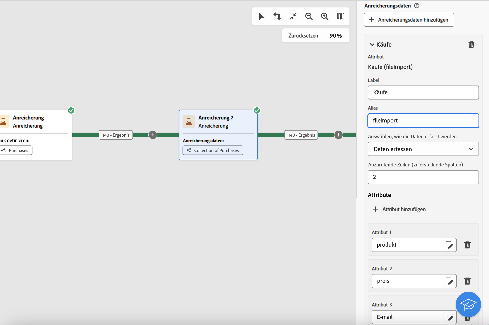

## Create links between tables {#create-links}

>[!CONTEXTUALHELP]
>id="ajo_orchestration_enrichment_simplejoin"
>title="Link definition"
>abstract="Create a link between the working table data and Adobe Journey Optimizer. For example, if you load data from a file which contains the account number, country and email of recipients, you have to create a link towards the country table in order to update this information in their profiles."

The **[!UICONTROL Link definition]** section allows you to create a link between the working table data and Adobe Journey Optimizer. For example, if you load data from a file which contains the account number, country and email of recipients, you have to create a link towards the country table in order to update this information in their profiles.

There are several types of links available:

* **[!UICONTROL 1 cardinality simple link]**: Each record from the primary set can be associated with one and only one record from the linked data.
* **[!UICONTROL 0 or 1 cardinality simple link]**: Each record from the primary set can be associated with 0 or 1 record from the linked data, but not more than one.
* **[!UICONTROL N cardinality collection link]**: Each record from the primary set can be associated with 0, 1 or more (N) records from the linked data.

To create a link, follow these steps:

1. In the **[!UICONTROL Link definition]** section, click the **[!UICONTROL Add link]** button.

    

1. In the **Relation type** drop-down list, choose the type of link you want to create.

1. Identify the target you want to link the primary set to:

    * To link an existing table in the database, choose **[!UICONTROL Database schema]** and select the desired table from the **[!UICONTROL Target schema]** field.
    * To link with data from the input transition, choose **Temporary schema** and select the transition whose data you want to use.

1. Define the reconciliation criteria to match data from the primary set with the linked schema. There are two types of joins available:

    * **Simple join**: Select a specific attribute to match data from the two schemas. Click **Add join** and select the **Source** and **Destination** attributes to use as reconciliation criteria. 
    * **Advanced join**: Create a join using advanced conditions. Click **Add join** and click the **Create condition** button to open the query modeler.

A workflow example using links is available in the [Examples](#link-example) section.

## Add offers {#add-offers}

>[!CONTEXTUALHELP]
>id="ajo_orchestration_enrichment_offer_proposition"
>title="Offer proposition"
>abstract="The Enrichment activity allows you to add offers for each profile."

The **[!UICONTROL Enrichment]** activity allows you to add offers for each profile.

To do so, follow the steps to configure an **[!UICONTROL Enrichment]** activity with an offer: 

1. In the **[!UICONTROL Enrichment]** activity, at the **[!UICONTROL Offer proposition]** section, click on the **[!UICONTROL Add offer]** button

    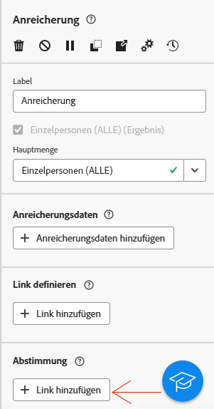

1. You have two choices for the offer selection :

    * **[!UICONTROL Search for the best offer in category]** : check this option and specify the offer engine call parameters (offer space, category or theme(s), contact date, number of offers to keep). The engine will calculate the best offer(s) to add according to these parameters. We recommend completing either the Category or the Theme field, rather than both at the same time.

        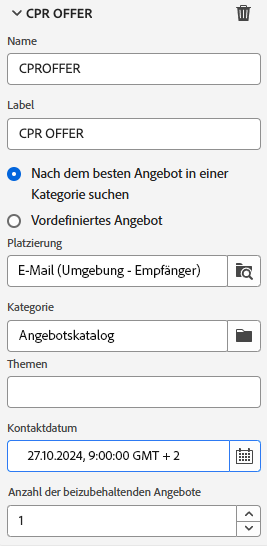

    * **[!UICONTROL A predefined offer]** : check this option and specify an offer space, a specific offer, and a contact date to directly configure the offer that you would like to add, without calling the offer engine.

        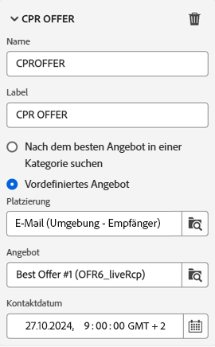

1. After selecting your offer, click on **[!UICONTROL Confirm]** button.

You can now use the offer in the delivery activity.

### Using the offers from Enrichment activity

Within an orchestrated campaign, if you want to use the offers you get from an enrichment activity in your delivery, follow the steps below:

1. Open the delivery activity and go in the content edition. Click on **[!UICONTROL Offers settings]** button and select in the drop-down list the **[!UICONTROL Offers space]** corresponding to your offer. 
If you want to to view only offers from the enrichment activity, set the number of **[!UICONTROL Propositions]** to 0, and save the modifications.

    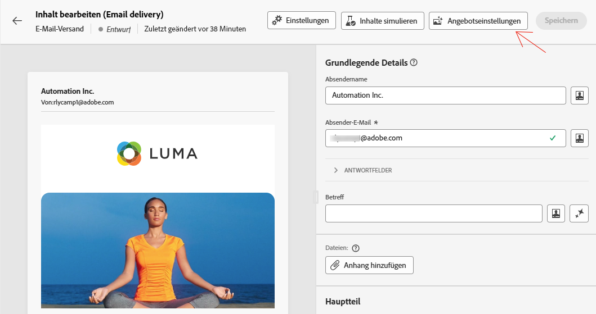 

1. In the Email Designer, when adding a personalization with offers, click on the **[!UICONTROL Propositions]** icon, it will display the offer(s) you get from the **[!UICONTROL Enrichment]** activity. Open the offer you want to choose by clicking on it.

    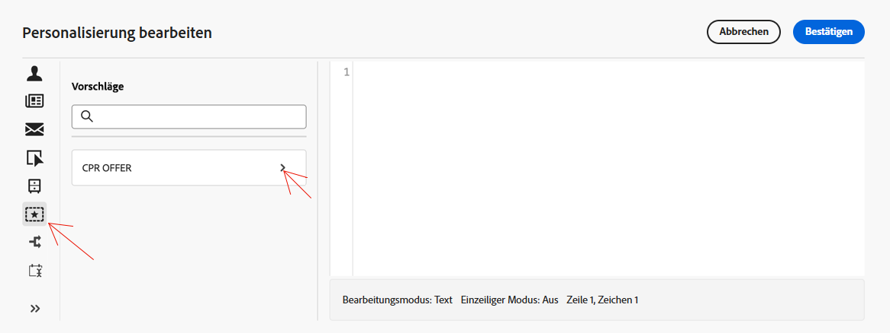 

    Go in **[!UICONTROL Rendering functions]** and choose **[!UICONTROL HTML rendering]** or **[!UICONTROL Text rendering]** according to your needs.

    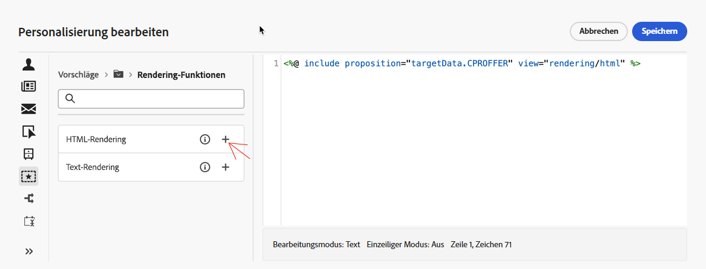 

>[!NOTE]
>
>If you choose to have more than one offer in the **[!UICONTROL Enrichment]** activity at the **[!UICONTROL Number of offers to keep]** option, all the offers are displayed when clicking on the **[!UICONTROL Propositions]** icon.

-->