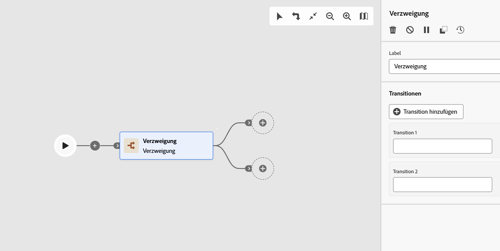

# Verzweigung {#fork}

>[!CONTEXTUALHELP]
>id="ajo_orchestration_fork"
>title="Aktivität „Verzweigung“"
>abstract="Die Aktivität **Verzweigung** ermöglicht es Ihnen, ausgehende Transitionen zu erstellen, um mehrere Aktivitäten parallel zu starten."

>[!CONTEXTUALHELP]
>id="ajo_orchestration_fork_transitions"
>title="Transitionen von Verzweigungsaktivitäten"
>abstract="Standardmäßig werden zwei Transitionen mit einer **Verzweigungsaktivität** erstellt. Klicken Sie auf die Schaltfläche **Transition hinzufügen**, um eine zusätzliche ausgehende Transition zu definieren, und geben Sie deren Titel ein."

+++ Inhaltsverzeichnis

| Willkommen bei koordinierten Kampagnen | Starten Ihrer ersten orchestrierten Kampagne | Abfragen der Datenbank | Aktivitäten für orchestrierte Kampagnen |
|---|---|---|---|
| [Erste Schritte mit orchestrierten Kampagnen](../gs-orchestrated-campaigns.md)  [Konfigurationsschritte](../configuration-steps.md)  [Zugreifen auf und Verwalten von orchestrierten Kampagnen](../access-manage-orchestrated-campaigns.md) | [Wichtige Schritte zum Erstellen einer orchestrierten Kampagne](../gs-campaign-creation.md)  [Erstellen und Planen der Kampagne](../create-orchestrated-campaign.md)  [Orchestrieren von Aktivitäten](../orchestrate-activities.md)  [Starten und Überwachen der Kampagne](../start-monitor-campaigns.md)  [Reporting](../reporting-campaigns.md) | [Arbeiten mit dem Regel-Builder](../orchestrated-rule-builder.md)  [Erstellen der ersten Abfrage](../build-query.md)  [Ausdrücke bearbeiten](../edit-expressions.md)  [Retargeting](../retarget.md) | [Erste Schritte mit Aktivitäten](about-activities.md)  Aktivitäten: [Und-Verknüpfung](and-join.md) - [Zielgruppe aufbauen](build-audience.md) - [Dimension ändern](change-dimension.md) - [Kanalaktivitäten](channels.md) - [Kombinieren](combine.md) - [Anreicherung](deduplication.md) - [Formulare](enrichment.md) - <b>[Abstimmung](fork.md)</b>    ->Zielgruppe speichern[ -AufspaltungWarten](wait.md) |

{style="table-layout:fixed"}

+++

 

Die Aktivität **[!UICONTROL Verzweigung]** ist eine Komponente **[!UICONTROL Fluss-Steuerung]** mit der Sie mehrere ausgehende Transitionen erstellen können, sodass mehrere Aktivitäten parallel ausgeführt werden können.

## Konfigurieren der Verzweigungsaktivität{#fork-configuration}

Führen Sie die folgenden Schritte aus, um die Aktivität **[!UICONTROL Verzweigung]** zu konfigurieren:

1. Fügen Sie **[!UICONTROL orchestrierten Kampagne]** Aktivität Verzweigung hinzu.

1. Definieren Sie ein **[!UICONTROL label]**.

1. Weisen Sie jeder ausgehenden Transition einen Titel zu. Standardmäßig werden zwei Transitionen bereitgestellt.

1. Um eine Transition zu entfernen, klicken Sie auf das Symbol  .

1. Klicken Sie bei Bedarf auf **[!UICONTROL Transition hinzufügen]**, um eine zusätzliche ausgehende Transition hinzuzufügen.
