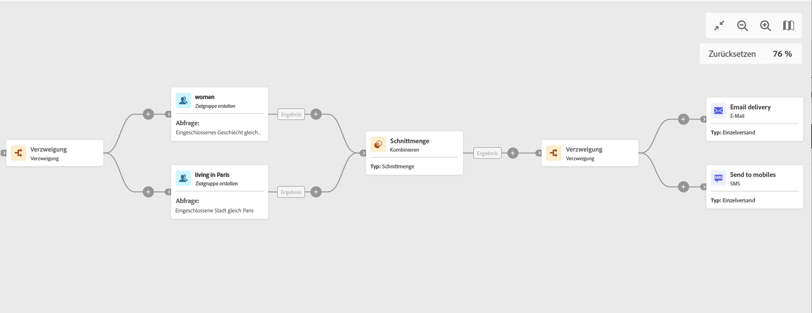

# Verzweigung {#fork}

>[!CONTEXTUALHELP]
>id="ajo_orchestration_fork"
>title="Aktivität „Verzweigung“"
>abstract="Die Aktivität **Verzweigung** ermöglicht es Ihnen, ausgehende Transitionen zu erstellen, um mehrere Aktivitäten parallel zu starten."

>[!CONTEXTUALHELP]
>id="ajo_orchestration_fork_transitions"
>title="Transitionen von Verzweigungsaktivitäten"
>abstract="Standardmäßig werden zwei Transitionen mit einer **Verzweigungsaktivität** erstellt. Klicken Sie auf die Schaltfläche **Transition hinzufügen**, um eine zusätzliche ausgehende Transition zu definieren, und geben Sie deren Titel ein."

+++ Inhaltsverzeichnis

| Willkommen bei koordinierten Kampagnen | Starten der ersten orchestrierten Kampagne | Abfragen der Datenbank | Orchestrierte Kampagnenaktivitäten |
|---|---|---|---|
| [Erste Schritte mit orchestrierten Kampagnen](gs-orchestrated-campaigns.md)  [Konfigurationsschritte](configuration-steps.md)  [Schlüsselschritte für die orchestrierte Kampagnenerstellung](gs-campaign-creation.md) | [Orchestrierte Kampagne erstellen](create-orchestrated-campaign.md)  [Aktivitäten orchestrieren](orchestrate-activities.md)  [ Nachrichten mit orchestrierten Kampagnen senden](send-messages.md)  [Kampagne starten und überwachen](start-monitor-campaigns.md)  [Reporting](reporting-campaigns.md) | [Arbeiten mit der Abfrage Modeler](orchestrated-query-modeler.md)  [Erstellen Sie Ihre ersten ](build-query.md)  [-Bearbeitungsausdrücke](edit-expressions.md) | [Erste Schritte mit Aktivitäten](activities/about-activities.md)  Aktivitäten: [Und-Verknüpfung](activities/and-join.md) - [Zielgruppe aufbauen](activities/build-audience.md) - [Dimensionsänderung](activities/change-dimension.md) - [Kombinieren](activities/combine.md) - [Deduplizierung](activities/enrichment.md) - [Verzweigung](activities/fork.md) - [Abstimmung](activities/reconciliation.md) - [Aufspaltung](activities/split.md) [&#128279;](activities/wait.md) Warten[&#128279;](activities/deduplication.md)  |

{style="table-layout:fixed"}

+++

  

Die Aktivität **Verzweigung** ist eine Aktivität zur **Flusssteuerung**. Sie erstellt ausgehende Transitionen, um mehrere Aktivitäten parallel zu starten.

## Konfigurieren der Verzweigungsaktivität{#fork-configuration}

Führen Sie die folgenden Schritte aus, um die Aktivität **Verzweigung** zu konfigurieren:

1. Fügen Sie **orchestrierten Kampagne** Aktivität Verzweigung hinzu.
1. Klicken Sie auf **Transition hinzufügen**, um eine neue ausgehende Transition hinzuzufügen. Standardmäßig sind zwei Transitionen definiert.
1. Fügen Sie jeder Ihrer Transitionen einen Titel hinzu.

## Beispiel{#fork-example}

Im folgenden Beispiel verwenden wir zwei Aktivitäten vom Typ **Verzweigung**:

* Eine vor den beiden Abfragen, damit sie gleichzeitig ausgeführt werden.
* Eine nach dem Schnittpunkt, um eine E-Mail und eine SMS gleichzeitig an die Zielpopulation zu senden.

