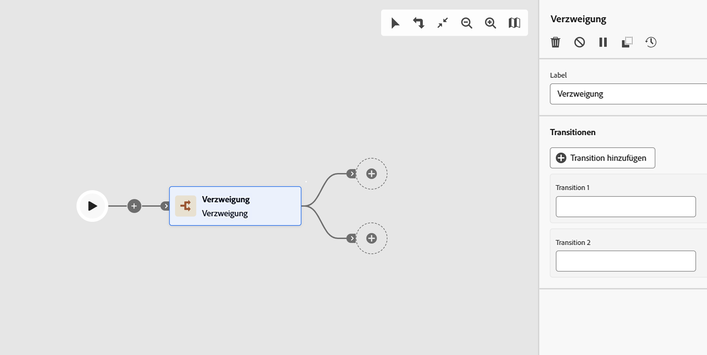

# Verzweigung {#fork}

>[!CONTEXTUALHELP]
>id="ajo_orchestration_fork"
>title="Aktivität „Verzweigung“"
>abstract="Die Aktivität **Verzweigung** ermöglicht es Ihnen, ausgehende Transitionen zu erstellen, um mehrere Aktivitäten parallel zu starten."

>[!CONTEXTUALHELP]
>id="ajo_orchestration_fork_transitions"
>title="Transitionen von Verzweigungsaktivitäten"
>abstract="Standardmäßig werden zwei Transitionen mit einer **Verzweigungsaktivität** erstellt. Klicken Sie auf die Schaltfläche **Transition hinzufügen**, um eine zusätzliche ausgehende Transition zu definieren, und geben Sie deren Titel ein."

Die Aktivität **[!UICONTROL Verzweigung]** ist eine Komponente des Typs **[!UICONTROL Flusskontrolle]**, mit der Sie mehrere ausgehende Transitionen erstellen können, um mehrere Aktivitäten parallel auszuführen.

## Konfigurieren der Verzweigungsaktivität{#fork-configuration}

Führen Sie die folgenden Schritte aus, um die Aktivität **[!UICONTROL Verzweigung]** zu konfigurieren:

1. Fügen Sie Ihrer orchestrierten Kampagne eine Aktivität des Typs **[!UICONTROL Verzweigung]** hinzu.

1. Definieren Sie ein **[!UICONTROL Label]**.

1. Weisen Sie jeder ausgehenden Transition ein Label zu. Standardmäßig werden zwei Transitionen bereitgestellt.

1. Um eine Transition zu entfernen, klicken Sie auf das Symbol .

1. Klicken Sie bei Bedarf auf **[!UICONTROL Transition hinzufügen]**, um eine zusätzliche ausgehende Transition hinzuzufügen.

## Beispiele {#fork-examples}

Eine typische Verwendung der Aktivität **[!UICONTROL Verzweigung]** besteht darin, dieselbe Zielgruppe mit zwei verschiedenen E-Mail-Kanälen anzusprechen - einem Marketing- und einem Transaktionskanal -, um das Versandverhalten zu vergleichen.

Nachdem eine Aktivität **[!UICONTROL Zielgruppe aufbauen]** die Zielpopulation ausgewählt hat, erstellt **[!UICONTROL Verzweigung]** zwei parallele Verzweigungen:

* **Zweig 1** stellt eine Verbindung zu einer Marketing-E-Mail-Kanalaktivität her. Nachrichten befolgen standardmäßige Geschäftsregeln und werden nur an Opt-in-Profile gesendet.
* **Zweig 2** stellt eine Verbindung zu einer Transaktions-E-Mail-Kanalaktivität her. Nachrichten werden unter Umgehung der Geschäftsregeln an alle Profile gesendet, unabhängig vom Opt-in-Status.

Dieses Muster ist nützlich, um zu verstehen, wie Kanalkategorieeinstellungen das Versandverhalten beeinflussen, und um verschiedene Nachrichtentypen in einer einzigen Kampagnenausführung an dieselbe Zielgruppe zu senden.
