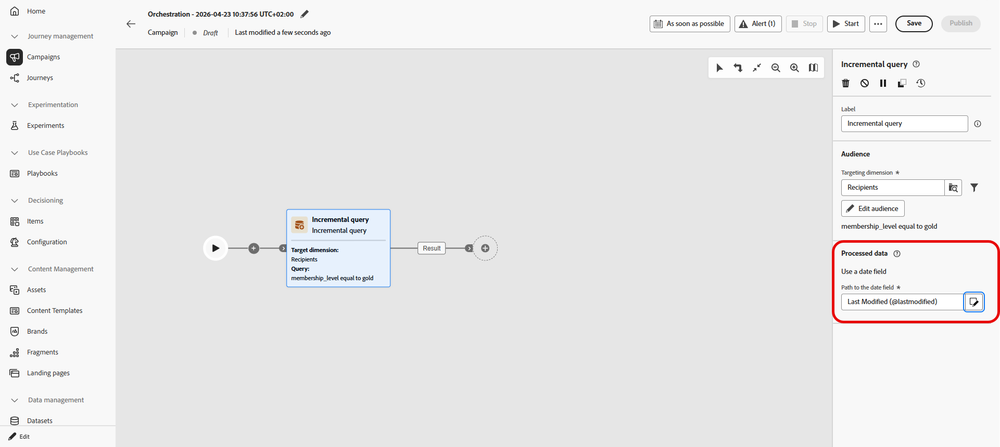

# Inkrementelle Abfrage {#incremental-query}

>[!CONTEXTUALHELP]
>id="ajo_orchestration_incrementalquery"
>title="Inkrementelle Abfrage"
>abstract="Die inkrementelle Abfrage ist eine Zielgruppenbestimmungsaktivität, die bei jeder Ausführung der orchestrierten Kampagne eine Datenbankabfrage ausführt. Es werden nur neue Datensätze zurückgegeben und alle bereits in einer vorherigen Ausführung enthaltenen ausgeschlossen, sodass Sie nicht dieselben Personen erneut ansprechen oder dieselben Zeilen erneut exportieren müssen."

>[!CONTEXTUALHELP]
>id="ajo_orchestration_incrementalquery_processeddata"
>title="Verarbeitete Daten"
>abstract="Wählen Sie unter Verarbeitete Daten aus, wie Datensätze aus früheren Ausführungen ausgeschlossen werden sollen. Bei Verwendung der Option Datumsfeld verwenden verwendet die Aktivität ein ausgewähltes Datumsfeld, anstatt einzelne IDs zu verfolgen, und jede Ausführung gibt nur Zeilen zurück, deren Datum nach der letzten Ausführung liegt."

>[!CONTEXTUALHELP]
>id="ajo_orchestration_incrementalquery_history"
>title="Verlauf in Tagen"
>abstract="Mit dieser Einstellung wird festgelegt, wie lange diese Liste beibehalten wird. Der Wert 0 bedeutet eine unbegrenzte Beibehaltung; es werden keine Einträge entfernt."

Die Aktivität **[!UICONTROL Inkrementelle Abfrage]** ist eine **[!UICONTROL Targeting]**-Aktivität, die bei jeder Ausführung der orchestrierten Kampagne eine Datenbankabfrage ausführt. Wichtig ist, dass es immer nur **neue** Datensätze ausgibt. Alle Personen, die bereits in einer früheren Ausführung aufgenommen wurden, werden ausgeschlossen, sodass Sie nicht dieselben Personen erneut ansprechen oder dieselben Zeilen erneut exportieren müssen.

Verwenden Sie diese Option, wenn die Kampagne mehrmals ausgeführt werden kann, z. B. beim Planen der Kampagne, z. B. wöchentlich oder wenn sie durch ein externes Signal oder eine API ausgelöst wird. Bei jeder Ausführung werden nur Datensätze berücksichtigt, die in einer vorherigen Ausführung nicht zurückgegeben wurden, sodass Duplikate vermieden werden.

Typische Verwendungszwecke:

* **Nachrichten und Zielgruppen**: Ziehen Sie im nächsten Schritt nur neue Anmeldungen, neue Käufer oder andere Segmente vom Typ „Neu seit der letzten Ausführung“ (z. B. E-Mail, SMS) in den nächsten Schritt.
* **Laufende Exporte**: Senden Sie nur neue oder aktualisierte Zeilen an Dateien für Berichte oder BI-Tools, ohne zu duplizieren, was Sie bereits exportiert haben.

Wenn ein Durchlauf keine Zeilen zurückgibt, stoppt die orchestrierte Kampagne bei der **Inkrementellen Abfrage**. Aktivitäten nach der inkrementellen Abfrage werden erst ausgeführt, wenn Daten vorhanden sind und die Kampagne erneut ausgeführt wird.

## Konfigurieren der Aktivität „Inkrementelle Abfrage“ {#incremental-query-configuration}

Legen Sie die Zielgruppendimension fest, erstellen Sie Ihre Abfrage und wählen Sie aus, wie die Aktivität entscheidet, welche Datensätze aus zukünftigen Ausführungen ausgeschlossen werden sollen.

1. Ziehen Sie die Aktivität **[!UICONTROL Inkrementelle Abfrage]** in Ihre orchestrierte Kampagne.

1. Wählen Sie **[!UICONTROL Zielgruppe]** die Dimension **[!UICONTROL Zielgruppenbestimmung]** aus, z. B. Empfänger und Abonnenten, und klicken Sie auf **[!UICONTROL Weiter]**. Weitere Informationen finden Sie unter [Zielgruppendimensionen](../target-dimension.md).

   

1. Klicken Sie **[!UICONTROL Bedingung hinzufügen]**, um die Abfrage zu definieren. [Erfahren Sie, wie Sie den Regel-Builder &#x200B;](../orchestrated-rule-builder.md).

   

1. Wählen **[!UICONTROL unter]** Verarbeitete Daten“ Ihren **[!UICONTROL Pfad zum Datumsfeld]** aus. Das Attribut muss das Format **Datum/Uhrzeit** verwenden. Jeder Durchgang gibt nur Zeilen zurück, deren Datum nach der letzten Ausführung liegt.

   

<!--
   * **[!UICONTROL Exclude results of previous execution]**: The activity maintains a list of records returned in prior runs. Each run excludes those records and returns only new ones. **[!UICONTROL History in days]** controls the retention period for that list. 0 indicates indefinite retention, no records are removed.

   >[!IMPORTANT]
   >
   >This mode stores the primary key of each processed record. Personally identifiable information (PII) must not be used as the primary key.

-->

## Beispiel {#incremental-query-example}

Im folgenden Beispiel wird eine Begrüßungs-E-Mail an Profile gesendet, die gerade Gold-Mitglieder geworden sind. Die Kampagne kann wöchentlich, jeden Montag, ausgeführt werden. Bei jedem Durchgang werden nur Profile berücksichtigt, die sich seit dem vorherigen Durchgang für eine Gold-Mitgliedschaft qualifiziert haben. Daher erhält jeder Empfänger die Begrüßungs-E-Mail nur einmal.

* **[!UICONTROL Inkrementelle Abfrage]**: Wählt Gold-Mitglieder aus. First Run: alle aktuellen Gold-Mitglieder. Spätere Ausführungen: Nur Profile, die seit der vorherigen Ausführung Gold-Mitglieder wurden.
* **[!UICONTROL E-Mail-Versand]**: Sendet die Begrüßungs-E-Mail an die von der Abfrage ausgegebenen Profile.

